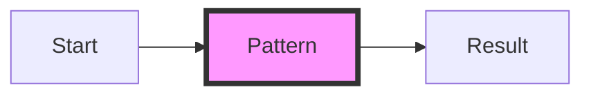
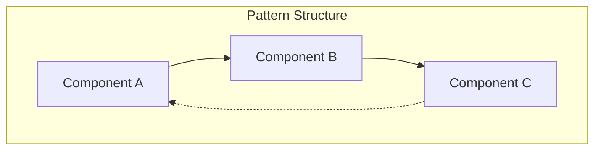
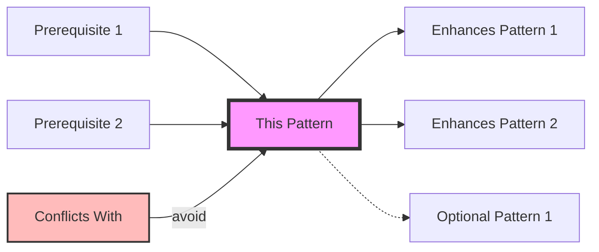

# Pattern Template Enforcement Guide
**Date**: 2025-08-03  
**Purpose**: Ensure all patterns follow the standardized template for consistency and quality  
**Scope**: Template definition, validation rules, and automation tools
**Status**: Active - Template v2 Implemented

## Overview

This guide establishes the mandatory pattern template and provides tools for enforcement. Every pattern in the DStudio Pattern Library must conform to this template to ensure consistency, quality, and optimal user experience.

### Implementation Status (August 2025)
- ✅ **Template v2 Created**: 5-level progressive disclosure structure
- ✅ **Validation Tools Built**: `pattern_validator.py` enforces 7 criteria
- ✅ **Automated Transformation**: `template_v2_transformer.py` adds structure
- ✅ **Progress**: 98.9% have Essential Questions, 100% have 5-level structure
- ❌ **Major Gap**: 96.8% exceed 20% code limit (primary compliance blocker)

## The Mandatory Pattern Template

### Complete Template Structure

```markdown
---
# Required Frontmatter
title: [Pattern Name]
description: [One-line description for SEO - max 160 characters]
excellence_tier: gold|silver|bronze
pattern_status: recommended|use-with-expertise|use-with-caution|legacy
category: communication|resilience|data|scaling|architecture|coordination
tags:
  - [tag1]
  - [tag2]
  - [tag3]
problem: [One-line problem statement - max 100 characters]
solution: [One-line solution summary - max 100 characters]

# Optional but Recommended
introduced: YYYY-MM
current_relevance: mainstream|growing|declining|niche
adoption_rate: 0.0-1.0
companies: [Company1, Company2, Company3]
alternatives: [Alternative Pattern 1, Alternative Pattern 2]

# Gold Patterns Additional Fields
modern_examples:
  - company: Netflix
    usage: Circuit breaker for microservices
  - company: Amazon
    usage: Service-to-service resilience
production_checklist: true

# Silver Patterns Additional Fields
trade_offs:
  pros:
    - [Pro 1]
    - [Pro 2]
  cons:
    - [Con 1]
    - [Con 2]
best_for: [Use case 1, Use case 2]

# Bronze Patterns Additional Fields
modern_alternatives: [Pattern1, Pattern2]
deprecation_reason: [Why this pattern is now legacy]
migration_path: [Guide to migrate away]
---

# [Pattern Name]

## 🎯 Essential Question
> **[Single question that captures the core problem this pattern solves - should provoke thought and clearly indicate the pattern's purpose]**

## ⚡ Quick Decision

### When to Use
| Scenario | Why It Fits | Alternative If Not |
|----------|-------------|-------------------|
| [Specific scenario 1] | [Clear reason why pattern fits] | [Alternative pattern/approach] |
| [Specific scenario 2] | [Clear reason why pattern fits] | [Alternative pattern/approach] |
| [Specific scenario 3] | [Clear reason why pattern fits] | [Alternative pattern/approach] |

### When NOT to Use
| Scenario | Why to Avoid | Better Alternative |
|----------|--------------|-------------------|
| [Anti-scenario 1] | [Clear reason to avoid] | [Specific alternative pattern] |
| [Anti-scenario 2] | [Clear reason to avoid] | [Specific alternative pattern] |

## 📚 Learning Path

### Level 1: Intuition (5 minutes)
> 💡 **The [Metaphor] Analogy**
> 
> [2-3 sentence explanation using everyday metaphor that captures the essence of the pattern]

[Simple visual diagram - maximum 10 nodes]



[2-3 paragraphs explaining the core concept in simple terms, building on the metaphor]

**Key Insight**: [One sentence capturing the fundamental principle]

### Level 2: Foundation (10 minutes)
> 🏗️ **Core Components**

[Visual diagram showing main components and their relationships]



#### Basic Implementation Pattern
```[language]
// Simplified example showing core concept (max 30 lines)
class BasicPattern {
    constructor() {
        // Essential initialization
    }
    
    execute() {
        // Core pattern logic
    }
}
```

#### Common Pitfalls to Avoid
- ❌ **[Pitfall 1]**: [Brief explanation]
- ❌ **[Pitfall 2]**: [Brief explanation]
- ❌ **[Pitfall 3]**: [Brief explanation]

### Level 3: Deep Dive (20 minutes)
> 🔍 **Under the Hood**

#### Detailed Architecture
[Comprehensive diagram showing all components, data flows, and interactions]

```mermaid
graph TB
    subgraph "Detailed Architecture"
        [Complex diagram with 15-20 nodes showing full pattern]
    end
```

#### Configuration Options
| Parameter | Default | Range | Impact |
|-----------|---------|-------|---------|
| [param1] | [default] | [min-max] | [What it affects] |
| [param2] | [default] | [options] | [What it affects] |
| [param3] | [default] | [range] | [What it affects] |

#### Performance Characteristics
- **Latency**: [Impact on latency]
- **Throughput**: [Impact on throughput]
- **Resource Usage**: [CPU/Memory/Network impact]
- **Scalability**: [How it scales]

### Level 4: Expert (30 minutes)
> 🚀 **Production-Ready Implementation**

#### Advanced Implementation
```[language]
// Production-ready example with error handling, monitoring (max 50 lines)
class ProductionPattern {
    constructor(config) {
        this.validateConfig(config);
        this.setupMonitoring();
        this.initializeComponents();
    }
    
    async execute(request) {
        const span = this.tracer.startSpan('pattern.execute');
        try {
            // Sophisticated implementation
            return await this.processWithRetry(request);
        } catch (error) {
            this.handleError(error);
            throw error;
        } finally {
            span.finish();
        }
    }
}
```

#### Production Optimizations
1. **[Optimization 1]**: [How and why]
2. **[Optimization 2]**: [How and why]
3. **[Optimization 3]**: [How and why]

#### Integration Patterns
- **With [Pattern A]**: [How they work together]
- **With [Pattern B]**: [Integration approach]
- **With [Pattern C]**: [Best practices]

### Level 5: Mastery (Self-paced)
> 🎓 **Real-World Mastery**

#### Case Study: [Company] Implementation
[Detailed explanation of how a major company uses this pattern in production]

#### Custom Variations
- **[Variation 1]**: [When and why to use]
- **[Variation 2]**: [When and why to use]

#### Contributing Back
- [Link to pattern improvements]
- [How to submit case studies]
- [Community forum/discussion]

## 🔗 Relationships

### Pattern Dependencies


- **Requires**: [Pattern prerequisites that must be in place]
- **Works Well With**: [Patterns that complement this one]
- **Conflicts With**: [Patterns that shouldn't be used together]
- **Evolves To**: [Natural progression to more advanced patterns]

## ✅ Production Checklist
*[Only for Gold tier patterns]*

### Pre-Production
- [ ] Load testing completed
- [ ] Failure scenarios tested
- [ ] Monitoring in place
- [ ] Runbooks created
- [ ] Team trained

### Configuration
- [ ] Timeouts configured
- [ ] Retry policies set
- [ ] Circuit breaker thresholds
- [ ] Resource limits defined
- [ ] Backpressure handling

### Observability
- [ ] Metrics dashboard
- [ ] Log aggregation
- [ ] Distributed tracing
- [ ] Alerting rules
- [ ] SLOs defined

## 📊 Decision Matrix
| Factor | Score (1-5) | Notes |
|--------|-------------|-------|
| **Complexity** | [1-5] | [Brief explanation of complexity level] |
| **Performance Impact** | [1-5] | [Expected performance impact] |
| **Operational Overhead** | [1-5] | [Maintenance and operation needs] |
| **Team Expertise Required** | [1-5] | [Skill level needed] |
| **Cost** | [1-5] | [Infrastructure and operational cost] |

## 🏢 Real-World Examples

### [Company A]: [Use Case]
- **Scale**: [Users/requests per second]
- **Implementation**: [Brief description]
- **Results**: [Outcomes achieved]

### [Company B]: [Use Case]
- **Scale**: [Users/requests per second]
- **Implementation**: [Brief description]
- **Results**: [Outcomes achieved]

### [Company C]: [Use Case]
- **Scale**: [Users/requests per second]
- **Implementation**: [Brief description]
- **Results**: [Outcomes achieved]

## 📚 References
- [Link to seminal paper/blog post]
- [Link to official documentation]
- [Link to community resources]

---

*Last updated: [Date] | [Edit this page](link) | [Report an issue](link)*
```

## Template Section Guidelines

### 1. Frontmatter Requirements

#### Required Fields
- **title**: Clear, concise pattern name (e.g., "Circuit Breaker")
- **description**: SEO-friendly description (max 160 chars)
- **excellence_tier**: Must be `gold`, `silver`, or `bronze`
- **pattern_status**: Current recommendation level
- **category**: Primary category (only one)
- **tags**: 3-5 relevant tags for searchability
- **problem**: Core problem solved (max 100 chars)
- **solution**: Solution approach (max 100 chars)

#### Tier-Specific Requirements
- **Gold**: Must include production_checklist section
- **Silver**: Must include trade_offs (pros/cons)
- **Bronze**: Must include modern_alternatives and migration_path

### 2. Content Section Guidelines

#### Essential Question (Required)
- Single, thought-provoking question
- Immediately conveys pattern's purpose
- Uses blockquote formatting with emoji

#### Quick Decision Tables (Required)
- Minimum 3 scenarios for "When to Use"
- Minimum 2 scenarios for "When NOT to Use"
- Each row must have all three columns filled
- Specific, not generic scenarios

#### Learning Path Structure (Required)
1. **Level 1: Intuition** (5 mins)
   - Must include metaphor/analogy in callout box
   - Simple diagram (max 10 nodes)
   - 2-3 paragraphs max
   - One key insight

2. **Level 2: Foundation** (10 mins)
   - Architecture diagram required
   - Code example max 30 lines
   - 3 common pitfalls minimum

3. **Level 3: Deep Dive** (20 mins)
   - Detailed architecture diagram
   - Configuration options table
   - Performance characteristics

4. **Level 4: Expert** (30 mins)
   - Production code example (max 50 lines)
   - 3 optimizations minimum
   - Integration patterns

5. **Level 5: Mastery** (Self-paced)
   - At least one real case study
   - Custom variations
   - Community contribution links

#### Relationships Section (Required)
- Visual diagram showing relationships
- Clear categorization (requires/works with/conflicts/evolves to)
- Links to related patterns

#### Decision Matrix (Required)
- 5 factors minimum
- 1-5 scoring with explanations
- Helps readers assess fit

#### Real-World Examples (Required)
- Minimum 3 companies
- Include scale metrics
- Brief but specific implementations

## Validation Rules

### Automated Validation

```python
# pattern_validator.py
import yaml
import re
from typing import Dict, List, Tuple

class PatternTemplateValidator:
    def __init__(self):
        self.errors: List[str] = []
        self.warnings: List[str] = []
        self.info: List[str] = []
        
    def validate_pattern(self, file_path: str) -> Dict[str, any]:
        """Validate a pattern file against the template"""
        
        with open(file_path, 'r', encoding='utf-8') as f:
            content = f.read()
        
        # Split frontmatter and content
        parts = content.split('---', 2)
        if len(parts) < 3:
            self.errors.append("Invalid markdown structure: missing frontmatter")
            return self.get_results()
        
        frontmatter_text = parts[1]
        markdown_content = parts[2]
        
        # Validate frontmatter
        self.validate_frontmatter(frontmatter_text)
        
        # Validate content structure
        self.validate_content_structure(markdown_content)
        
        # Validate content quality
        self.validate_content_quality(markdown_content)
        
        # Validate length constraints
        self.validate_length_constraints(markdown_content)
        
        return self.get_results()
    
    def validate_frontmatter(self, frontmatter_text: str):
        """Validate frontmatter fields"""
        try:
            frontmatter = yaml.safe_load(frontmatter_text)
        except yaml.YAMLError as e:
            self.errors.append(f"Invalid YAML in frontmatter: {e}")
            return
        
        # Required fields for all patterns
        required_fields = [
            'title', 'description', 'excellence_tier', 'pattern_status',
            'category', 'tags', 'problem', 'solution'
        ]
        
        for field in required_fields:
            if field not in frontmatter:
                self.errors.append(f"Missing required field: {field}")
        
        # Validate field values
        if 'excellence_tier' in frontmatter:
            if frontmatter['excellence_tier'] not in ['gold', 'silver', 'bronze']:
                self.errors.append(f"Invalid excellence_tier: {frontmatter['excellence_tier']}")
        
        if 'pattern_status' in frontmatter:
            valid_statuses = ['recommended', 'use-with-expertise', 'use-with-caution', 'legacy']
            if frontmatter['pattern_status'] not in valid_statuses:
                self.errors.append(f"Invalid pattern_status: {frontmatter['pattern_status']}")
        
        if 'category' in frontmatter:
            valid_categories = ['communication', 'resilience', 'data', 'scaling', 'architecture', 'coordination']
            if frontmatter['category'] not in valid_categories:
                self.errors.append(f"Invalid category: {frontmatter['category']}")
        
        # Tier-specific validation
        if 'excellence_tier' in frontmatter:
            self.validate_tier_specific_fields(frontmatter)
        
        # Length validation
        if 'description' in frontmatter and len(frontmatter['description']) > 160:
            self.warnings.append(f"Description too long: {len(frontmatter['description'])} chars (max: 160)")
        
        if 'problem' in frontmatter and len(frontmatter['problem']) > 100:
            self.warnings.append(f"Problem statement too long: {len(frontmatter['problem'])} chars (max: 100)")
    
    def validate_tier_specific_fields(self, frontmatter: dict):
        """Validate tier-specific required fields"""
        tier = frontmatter['excellence_tier']
        
        if tier == 'gold':
            if 'modern_examples' not in frontmatter:
                self.warnings.append("Gold patterns should include modern_examples")
            if 'production_checklist' not in frontmatter:
                self.errors.append("Gold patterns must include production_checklist: true")
        
        elif tier == 'silver':
            if 'trade_offs' not in frontmatter:
                self.errors.append("Silver patterns must include trade_offs")
            elif isinstance(frontmatter['trade_offs'], dict):
                if 'pros' not in frontmatter['trade_offs'] or 'cons' not in frontmatter['trade_offs']:
                    self.errors.append("trade_offs must include both pros and cons")
            
            if 'best_for' not in frontmatter:
                self.warnings.append("Silver patterns should include best_for field")
        
        elif tier == 'bronze':
            if 'modern_alternatives' not in frontmatter:
                self.errors.append("Bronze patterns must include modern_alternatives")
            if 'deprecation_reason' not in frontmatter:
                self.errors.append("Bronze patterns must include deprecation_reason")
            if 'migration_path' not in frontmatter:
                self.warnings.append("Bronze patterns should include migration_path")
    
    def validate_content_structure(self, content: str):
        """Validate required content sections"""
        required_sections = [
            (r'^## 🎯 Essential Question', 'Essential Question section'),
            (r'^## ⚡ Quick Decision', 'Quick Decision section'),
            (r'^### When to Use', 'When to Use subsection'),
            (r'^### When NOT to Use', 'When NOT to Use subsection'),
            (r'^## 📚 Learning Path', 'Learning Path section'),
            (r'^### Level 1: Intuition', 'Level 1: Intuition subsection'),
            (r'^### Level 2: Foundation', 'Level 2: Foundation subsection'),
            (r'^### Level 3: Deep Dive', 'Level 3: Deep Dive subsection'),
            (r'^### Level 4: Expert', 'Level 4: Expert subsection'),
            (r'^### Level 5: Mastery', 'Level 5: Mastery subsection'),
            (r'^## 🔗 Relationships', 'Relationships section'),
            (r'^## 📊 Decision Matrix', 'Decision Matrix section'),
            (r'^## 🏢 Real-World Examples', 'Real-World Examples section')
        ]
        
        for pattern, section_name in required_sections:
            if not re.search(pattern, content, re.MULTILINE):
                self.errors.append(f"Missing required section: {section_name}")
        
        # Check for production checklist in gold patterns
        if 'gold' in content and not re.search(r'^## ✅ Production Checklist', content, re.MULTILINE):
            self.errors.append("Gold patterns must include Production Checklist section")
    
    def validate_content_quality(self, content: str):
        """Validate content quality metrics"""
        
        # Check for tables in decision sections
        if '### When to Use' in content:
            section = self.extract_section(content, '### When to Use', '### When NOT to Use')
            if '|' not in section:
                self.errors.append("When to Use section must use table format")
            else:
                # Count table rows
                rows = len([line for line in section.split('\n') if line.strip().startswith('|') and '---' not in line])
                if rows < 4:  # Header + separator + 3 scenarios
                    self.warnings.append(f"When to Use table should have at least 3 scenarios (found {rows-2})")
        
        # Check for diagrams
        mermaid_count = len(re.findall(r'```mermaid', content))
        if mermaid_count < 3:
            self.warnings.append(f"Pattern should include at least 3 diagrams (found {mermaid_count})")
        
        # Check for code examples
        code_blocks = re.findall(r'```[^`]+```', content, re.DOTALL)
        non_mermaid_blocks = [b for b in code_blocks if not b.startswith('```mermaid')]
        if len(non_mermaid_blocks) < 2:
            self.warnings.append("Pattern should include at least 2 code examples")
        
        # Check code block length
        for block in non_mermaid_blocks:
            lines = block.split('\n')
            if len(lines) > 52:  # 50 + opening/closing ```
                self.warnings.append(f"Code example too long: {len(lines)-2} lines (max: 50)")
        
        # Check for real-world examples
        if '## 🏢 Real-World Examples' in content:
            section = self.extract_section(content, '## 🏢 Real-World Examples', '## 📚 References')
            examples = len(re.findall(r'^### ', section, re.MULTILINE))
            if examples < 3:
                self.warnings.append(f"Should include at least 3 real-world examples (found {examples})")
    
    def validate_length_constraints(self, content: str):
        """Validate overall length constraints"""
        lines = content.split('\n')
        total_lines = len(lines)
        
        if total_lines > 1000:
            self.errors.append(f"Pattern too long: {total_lines} lines (max: 1000)")
        elif total_lines > 800:
            self.warnings.append(f"Pattern approaching length limit: {total_lines} lines (max: 1000)")
        
        # Check section lengths
        sections = {
            'Level 1: Intuition': (50, 100),
            'Level 2: Foundation': (100, 150),
            'Level 3: Deep Dive': (150, 200),
            'Level 4: Expert': (150, 200),
            'Level 5: Mastery': (100, 150)
        }
        
        for section_name, (min_lines, max_lines) in sections.items():
            if f'### {section_name}' in content:
                section_content = self.extract_section(content, f'### {section_name}', '###')
                section_lines = len(section_content.split('\n'))
                if section_lines > max_lines:
                    self.warnings.append(f"{section_name} section too long: {section_lines} lines (max: {max_lines})")
                elif section_lines < min_lines:
                    self.info.append(f"{section_name} section might be too short: {section_lines} lines (suggested: {min_lines}+)")
    
    def extract_section(self, content: str, start: str, end: str) -> str:
        """Extract content between two markers"""
        start_idx = content.find(start)
        if start_idx == -1:
            return ""
        
        end_idx = content.find(end, start_idx + len(start))
        if end_idx == -1:
            return content[start_idx:]
        
        return content[start_idx:end_idx]
    
    def get_results(self) -> Dict[str, any]:
        """Get validation results"""
        return {
            'valid': len(self.errors) == 0,
            'errors': self.errors,
            'warnings': self.warnings,
            'info': self.info,
            'summary': {
                'error_count': len(self.errors),
                'warning_count': len(self.warnings),
                'info_count': len(self.info)
            }
        }

# CLI Usage
if __name__ == "__main__":
    import sys
    import json
    
    if len(sys.argv) < 2:
        print("Usage: python pattern_validator.py <pattern_file>")
        sys.exit(1)
    
    validator = PatternTemplateValidator()
    results = validator.validate_pattern(sys.argv[1])
    
    # Pretty print results
    if results['valid']:
        print(f"✅ Pattern is valid!")
    else:
        print(f"❌ Pattern has {results['summary']['error_count']} errors")
    
    if results['errors']:
        print("\n🚨 Errors:")
        for error in results['errors']:
            print(f"  - {error}")
    
    if results['warnings']:
        print(f"\n⚠️  Warnings ({results['summary']['warning_count']}):")
        for warning in results['warnings']:
            print(f"  - {warning}")
    
    if results['info']:
        print(f"\nℹ️  Info ({results['summary']['info_count']}):")
        for info in results['info']:
            print(f"  - {info}")
    
    # Exit with error code if invalid
    sys.exit(0 if results['valid'] else 1)
```

### Pre-Commit Hook

```bash
#!/bin/bash
# .git/hooks/pre-commit

# Pattern validation pre-commit hook
echo "🔍 Validating pattern files..."

# Find all modified pattern files
patterns=$(git diff --cached --name-only --diff-filter=ACM | grep -E "pattern-library/.*\.md$")

if [ -z "$patterns" ]; then
    echo "✅ No pattern files to validate"
    exit 0
fi

# Validate each pattern
failed=0
for pattern in $patterns; do
    echo "Checking $pattern..."
    
    # Run validation
    if ! python scripts/pattern_validator.py "$pattern"; then
        echo "❌ Validation failed for $pattern"
        failed=1
    fi
done

if [ $failed -eq 1 ]; then
    echo ""
    echo "❌ Pattern validation failed. Please fix errors before committing."
    echo "Run 'python scripts/pattern_validator.py <pattern_file>' for details."
    exit 1
fi

echo "✅ All patterns validated successfully!"
exit 0
```

### CI/CD Integration

```yaml
# .github/workflows/validate-patterns.yml
name: Validate Patterns

on:
  pull_request:
    paths:
      - 'docs/pattern-library/**/*.md'
  push:
    branches:
      - main
    paths:
      - 'docs/pattern-library/**/*.md'

jobs:
  validate:
    runs-on: ubuntu-latest
    
    steps:
    - uses: actions/checkout@v3
    
    - name: Set up Python
      uses: actions/setup-python@v4
      with:
        python-version: '3.9'
    
    - name: Install dependencies
      run: |
        pip install pyyaml
        pip install markdown
    
    - name: Validate all patterns
      run: |
        find docs/pattern-library -name "*.md" -type f | while read pattern; do
          echo "Validating $pattern"
          python scripts/pattern_validator.py "$pattern"
        done
    
    - name: Check pattern count
      run: |
        count=$(find docs/pattern-library -name "*.md" -type f | wc -l)
        echo "Total patterns: $count"
        if [ $count -ne 91 ]; then
          echo "Warning: Expected 91 patterns, found $count"
        fi
```

## Template Enforcement Tools

### 1. Pattern Generator

```python
#!/usr/bin/env python3
# scripts/generate_pattern.py

import os
import sys
from datetime import datetime

def generate_pattern(name: str, category: str, tier: str = 'silver'):
    """Generate a new pattern file from template"""
    
    # Sanitize name for filename
    filename = name.lower().replace(' ', '-') + '.md'
    filepath = f"docs/pattern-library/{category}/{filename}"
    
    # Check if already exists
    if os.path.exists(filepath):
        print(f"❌ Pattern already exists: {filepath}")
        return False
    
    # Generate content
    content = f"""---
title: {name}
description: TODO: Add one-line description
excellence_tier: {tier}
pattern_status: use-with-expertise
category: {category}
tags:
  - TODO
  - add-tags
problem: TODO: One-line problem statement
solution: TODO: One-line solution summary
introduced: {datetime.now().strftime('%Y-%m')}
current_relevance: mainstream
---

# {name}

## 🎯 Essential Question
> **TODO: Add essential question**

## ⚡ Quick Decision

### When to Use
| Scenario | Why It Fits | Alternative If Not |
|----------|-------------|-------------------|
| TODO | TODO | TODO |
| TODO | TODO | TODO |
| TODO | TODO | TODO |

### When NOT to Use
| Scenario | Why to Avoid | Better Alternative |
|----------|--------------|-------------------|
| TODO | TODO | TODO |
| TODO | TODO | TODO |

[... rest of template ...]
"""
    
    # Create directory if needed
    os.makedirs(os.path.dirname(filepath), exist_ok=True)
    
    # Write file
    with open(filepath, 'w') as f:
        f.write(content)
    
    print(f"✅ Created pattern: {filepath}")
    print(f"Next steps:")
    print(f"  1. Fill in TODO sections")
    print(f"  2. Run validator: python scripts/pattern_validator.py {filepath}")
    print(f"  3. Add to navigation in mkdocs.yml")
    
    return True

if __name__ == "__main__":
    if len(sys.argv) < 3:
        print("Usage: python generate_pattern.py '<Pattern Name>' <category> [tier]")
        print("Example: python generate_pattern.py 'Circuit Breaker' resilience gold")
        sys.exit(1)
    
    name = sys.argv[1]
    category = sys.argv[2]
    tier = sys.argv[3] if len(sys.argv) > 3 else 'silver'
    
    generate_pattern(name, category, tier)
```

### 2. Bulk Validator

```bash
#!/bin/bash
# scripts/validate_all_patterns.sh

echo "🔍 Validating all patterns in the library..."
echo "========================================="

total=0
passed=0
failed=0
warnings=0

# Find all pattern files
find docs/pattern-library -name "*.md" -type f | sort | while read pattern; do
    # Skip index and template files
    if [[ "$pattern" =~ (index\.md|template\.md|README\.md) ]]; then
        continue
    fi
    
    echo -n "Validating $(basename $pattern)... "
    
    # Run validation and capture output
    output=$(python scripts/pattern_validator.py "$pattern" 2>&1)
    exit_code=$?
    
    total=$((total + 1))
    
    if [ $exit_code -eq 0 ]; then
        # Check for warnings
        if echo "$output" | grep -q "⚠️  Warnings"; then
            echo "⚠️  PASSED with warnings"
            warnings=$((warnings + 1))
        else
            echo "✅ PASSED"
        fi
        passed=$((passed + 1))
    else
        echo "❌ FAILED"
        failed=$((failed + 1))
        echo "$output" | grep "  -" | head -5  # Show first 5 errors
    fi
done

echo "========================================="
echo "📊 Validation Summary:"
echo "  Total patterns: $total"
echo "  ✅ Passed: $passed"
echo "  ⚠️  With warnings: $warnings"
echo "  ❌ Failed: $failed"
echo "========================================="

if [ $failed -gt 0 ]; then
    echo "❌ Validation failed for $failed patterns"
    exit 1
else
    echo "✅ All patterns validated successfully!"
    exit 0
fi
```

### 3. Template Updater

```python
#!/usr/bin/env python3
# scripts/update_pattern_template.py

import os
import re
from typing import Dict, List

class PatternTemplateUpdater:
    """Update existing patterns to match new template structure"""
    
    def __init__(self):
        self.updates_made = []
        
    def update_pattern(self, filepath: str) -> bool:
        """Update a single pattern to match template"""
        
        with open(filepath, 'r') as f:
            content = f.read()
        
        original_content = content
        
        # Update emoji headers
        content = self.update_section_headers(content)
        
        # Add missing sections
        content = self.add_missing_sections(content)
        
        # Fix table formatting
        content = self.fix_table_formatting(content)
        
        # Update frontmatter
        content = self.update_frontmatter(content)
        
        if content != original_content:
            with open(filepath, 'w') as f:
                f.write(content)
            self.updates_made.append(filepath)
            return True
        
        return False
    
    def update_section_headers(self, content: str) -> str:
        """Standardize section headers with emojis"""
        
        replacements = {
            r'^## Essential Question$': '## 🎯 Essential Question',
            r'^## Quick Decision$': '## ⚡ Quick Decision',
            r'^## Learning Path$': '## 📚 Learning Path',
            r'^## Relationships$': '## 🔗 Relationships',
            r'^## Production Checklist$': '## ✅ Production Checklist',
            r'^## Decision Matrix$': '## 📊 Decision Matrix',
            r'^## Real-World Examples$': '## 🏢 Real-World Examples',
        }
        
        for pattern, replacement in replacements.items():
            content = re.sub(pattern, replacement, content, flags=re.MULTILINE)
        
        return content
    
    def add_missing_sections(self, content: str) -> str:
        """Add any missing required sections"""
        
        # Check for essential question
        if not re.search(r'^## 🎯 Essential Question', content, re.MULTILINE):
            # Try to extract from content
            question = self.extract_essential_question(content)
            content = content.replace('# ', f'# \n\n## 🎯 Essential Question\n> **{question}**\n\n', 1)
        
        # Add other missing sections as needed
        # ...
        
        return content
    
    def fix_table_formatting(self, content: str) -> str:
        """Ensure tables are properly formatted"""
        
        # Fix When to Use / When NOT to Use sections
        # Convert lists to tables if needed
        # ...
        
        return content
    
    def update_frontmatter(self, content: str) -> str:
        """Update frontmatter to include all required fields"""
        
        # Parse and update frontmatter
        # Add missing fields with TODO values
        # ...
        
        return content
```

## Enforcement Best Practices

### 1. Education First
- Provide clear examples of well-formatted patterns
- Create video walkthrough of template
- Maintain FAQ for common questions

### 2. Tooling Support
- IDE snippets for pattern sections
- Live preview with validation
- Auto-formatting on save

### 3. Progressive Enhancement
- Start with errors only
- Add warnings gradually
- Info messages for best practices

### 4. Regular Audits
- Weekly validation reports
- Monthly quality reviews
- Quarterly template updates

### 5. Community Involvement
- Template improvement proposals
- Validation rule discussions
- Best pattern awards

## Template Evolution Process

### Proposing Changes
1. Create issue with rationale
2. Provide examples of improvement
3. Consider backward compatibility
4. Get community feedback

### Testing Changes
1. Update validator first
2. Test on sample patterns
3. Run full validation suite
4. Check rendering

### Rolling Out Changes
1. Announce in advance
2. Provide migration tools
3. Set grace period
4. Assist with updates

## Troubleshooting

### Common Validation Errors

1. **Missing Essential Question**
   - Must be in blockquote format
   - Should be thought-provoking
   - One sentence preferred

2. **Invalid Table Format**
   - Ensure proper markdown table syntax
   - All cells must be filled
   - Use pipes correctly

3. **Section Not Found**
   - Check exact header format
   - Include required emoji
   - Verify header level (##, ###)

4. **Code Block Too Long**
   - Split into multiple examples
   - Extract to external file
   - Focus on key concepts

5. **Missing Frontmatter Fields**
   - Check spelling exactly
   - Verify YAML syntax
   - Include all required fields

## Conclusion

This template enforcement guide ensures consistency and quality across all patterns in the DStudio Pattern Library. By following the template and using the provided tools, contributors can create patterns that are:

- **Consistent**: Same structure and sections
- **Complete**: All required information included
- **Quality**: Validated and verified
- **Accessible**: Progressive learning path
- **Maintainable**: Easy to update and improve

The automated validation tools catch issues early, while the template structure guides authors to create comprehensive, useful pattern documentation.

---

*Remember: The template is a guide, not a straightjacket. If you need to deviate for a good reason, document why in the pattern.*