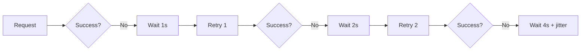
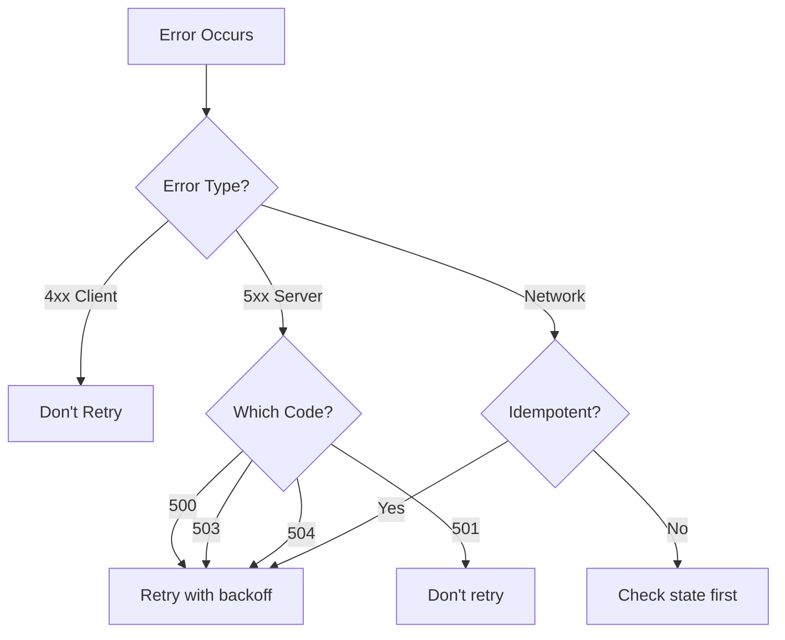

# Pattern Transformation Examples

## Example 1: Retry & Backoff Pattern
**Current**: 2200+ lines, no structure, 60% code  
**Target**: 1000 lines, clear structure, 20% code

### Before (Current Problems)
```markdown
# Retry with Exponential Backoff Pattern

## The reality of distributed systems

When you make a network call, three things can happen:
1. Success - Your request completes successfully
2. Failure - Your request fails with an error
3. Unknown - The connection drops, times out, or you never get a response

In distributed systems, transient failures are the norm, not the exception...
[500+ lines of verbose explanation]

## Basic Implementation

Here's a simple retry implementation in Python:
```python
[869 lines of code with every possible variation]
```

[More verbose sections without clear structure]
```

### After (Transformed)
```markdown
---
title: Retry with Exponential Backoff
excellence_tier: gold
essential_question: How do we handle transient failures without overwhelming the system?
tagline: Turn temporary failures into eventual success through intelligent retries
---

# Retry with Exponential Backoff

!!! success "🏆 Gold Standard Pattern"
    **Intelligent failure recovery** • AWS, Google Cloud, Netflix proven
    
    The essential pattern for handling transient failures in distributed systems. 
    Prevents cascade failures while maximizing success rates through exponential 
    backoff with jitter - handling billions of requests daily.

## Essential Question
**How do we distinguish between transient and permanent failures, retrying the former without creating thundering herds?**

## When to Use / When NOT to Use

### Use When
| Scenario | Example | Success Rate |
|----------|---------|--------------|
| Network timeouts | API calls | 95%+ recovery |
| Rate limiting | 429 errors | 99%+ recovery |
| Temporary unavailability | 503 errors | 90%+ recovery |

### DON'T Use When
| Scenario | Why | Alternative |
|----------|-----|-------------|
| Business logic errors | Won't fix with retry | Fix the logic |
| Authentication failures | Credentials won't improve | Refresh token |
| Data validation errors | Bad data stays bad | Validate first |

## Level 1: Intuition (5 min)

### The Story
Imagine calling a busy restaurant. First busy signal? Try again in 1 second. 
Still busy? Wait 2 seconds. Then 4, 8, 16... Eventually you get through 
without overwhelming their phone system.

### Visual Metaphor


### Core Insight
**Without jitter**: All clients retry simultaneously → thundering herd
**With jitter**: Clients spread out → gradual recovery

## Level 2: Foundation (10 min)

### Key Formula
```
delay = min(base * (2 ^ attempt) + random_jitter, max_delay)
```

### Architecture Components
| Component | Purpose | Typical Values |
|-----------|---------|----------------|
| Base delay | Starting wait time | 100-1000ms |
| Multiplier | Growth factor | 2 (exponential) |
| Jitter | Randomization | ±25% of delay |
| Max retries | Failure limit | 3-5 attempts |
| Max delay | Cap on wait time | 30-60 seconds |

### Basic Example (Conceptual)
```python
def retry_with_backoff(func, max_attempts=3):
    for attempt in range(max_attempts):
        try:
            return func()
        except TransientError:
            if attempt == max_attempts - 1:
                raise
            delay = min(100 * (2 ** attempt) + random(0, 25), 30000)
            sleep(delay / 1000)
```

## Level 3: Deep Dive (15 min)

### Retry Decision Tree


### Common Pitfalls
1. **Retry Storms**: No jitter → synchronized retries
2. **Infinite Loops**: No max attempts → resource exhaustion  
3. **Wrong Errors**: Retrying permanent failures
4. **State Corruption**: Retrying non-idempotent operations

## Level 4: Expert (20 min)

### Advanced Strategies

| Strategy | When to Use | Implementation |
|----------|-------------|----------------|
| Circuit Breaker Integration | Repeated failures | Skip retries when circuit open |
| Adaptive Retry | Variable load | Adjust based on success rate |
| Priority-based | Mixed importance | High-priority gets more retries |
| Hedged Requests | Low latency critical | Parallel retry before timeout |

### Production Considerations
- **Observability**: Log attempt number, delay, reason
- **Metrics**: Track retry rates, success rates by attempt
- **Budgets**: Limit total retry time per request
- **Context**: Propagate deadline/timeout awareness

## Level 5: Mastery (30 min)

### Real-world Implementation (AWS SDK)
- Uses exponential backoff with full jitter
- Adapts based on error type (throttling vs timeout)
- Integrates with service-specific retry policies
- Handles both sync and async operations

### Netflix's Approach
- Combines with circuit breakers and bulkheads
- Uses request hedging for critical paths
- Adaptive concurrency limits prevent overload
- Monitors retry budget consumption

### Migration Strategy
1. **Identify retry points** in current code
2. **Classify errors** (transient vs permanent)
3. **Add instrumentation** before changing behavior
4. **Roll out gradually** with feature flags
5. **Monitor impact** on downstream services

## Quick Reference

### Decision Matrix
| Factor | Low Retry | Medium Retry | High Retry |
|--------|-----------|--------------|------------|
| Request cost | High | Medium | Low |
| Idempotency | Maybe | Yes | Required |
| Time sensitivity | Critical | Important | Flexible |
| Error rate | <1% | 1-5% | >5% |

### Configuration Examples
```yaml
# Conservative (financial transactions)
base_delay_ms: 1000
max_attempts: 3
max_delay_ms: 5000
jitter_factor: 0.1

# Aggressive (read-only APIs)
base_delay_ms: 100
max_attempts: 5
max_delay_ms: 30000
jitter_factor: 0.5
```

### Production Checklist ✓
- [ ] Identify transient vs permanent errors
- [ ] Verify operation idempotency  
- [ ] Add jitter to prevent thundering herds
- [ ] Set reasonable max attempts (3-5)
- [ ] Implement retry budgets
- [ ] Add comprehensive logging
- [ ] Monitor retry metrics
- [ ] Test failure scenarios
- [ ] Document retry behavior
- [ ] Consider circuit breaker integration

## Related Patterns
- **[Circuit Breaker](../resilience/circuit-breaker.md)**: Prevent retries during outages
- **[Timeout](../resilience/timeout.md)**: Bound retry attempts in time
- **[Bulkhead](../resilience/bulkhead.md)**: Isolate retry impacts
- **[Rate Limiting](../scaling/rate-limiting.md)**: Respect upstream limits
- **[Load Shedding](../resilience/load-shedding.md)**: Drop retries under load
```

---

## Example 2: API Gateway Pattern
**Current**: Verbose essential question, text diagrams, buried information  
**Target**: Crisp question, visual diagrams, scannable format

### Before (Selected Issues)
```markdown
## The Essential Question

**How can clients make a single request and let the platform handle routing, 
security, and protocol conversion?**

[Long verbose explanation of what this means...]

### Visual Metaphor

```mermaid
graph TD
    subgraph "Without API Gateway"
        C1[Client] --> AS[Auth Service]
        C1 --> US[User Service]
        C1 --> OS[Order Service]
        C1 --> PS[Payment Service]
        C1 --> IS[Inventory Service]
    end
    
    subgraph "With API Gateway"
        [More verbose diagram code]
    end
```

[1000+ lines of implementation details mixed with concepts]
```

### After (Transformed)
```markdown
## Essential Question
**How do we unify microservice access while handling auth, routing, and protocols?**

## When to Use / When NOT to Use

<div class="decision-box">
<h4>✅ Perfect Fit</h4>

- **10+ microservices** needing unified access
- **Multiple client types** (web, mobile, IoT)
- **Cross-cutting concerns** (auth, logging, rate limiting)
- **Protocol translation** needed (REST→gRPC)
</div>

<div class="failure-vignette">
<h4>❌ Wrong Choice</h4>

- **< 5 services**: Direct communication simpler
- **Ultra-low latency**: Extra hop adds 5-10ms
- **Internal services only**: Service mesh better
- **Simple proxying**: Use reverse proxy (nginx)
</div>

## Level 1: Intuition (5 min)

### The Hotel Concierge
<div class="axiom-box">
A luxury hotel's concierge handles all guest requests - restaurant reservations, 
tickets, transportation. Guests don't navigate complexity; they make one ask.

**API Gateway = Digital Concierge for your microservices**
</div>

### Visual Architecture

*Single entry point routing to multiple backend services*

### Core Value
| Without Gateway | With Gateway |
|-----------------|--------------|
| N×M client-service connections | N clients → 1 gateway → M services |
| Each client handles auth | Centralized authentication |
| Protocol per service | Unified REST/GraphQL interface |
| Scattered rate limiting | Single point of control |

[Continued with similar transformations...]
```

---

## Example 3: Service Mesh Pattern
**Current**: 700+ lines, Mermaid text, "when not to use" at line 685  
**Target**: Structured, visual, decision-support upfront

### Key Transformations Applied

1. **Essential Question First**
   ```markdown
   ## Essential Question
   **How do we manage service communication without touching application code?**
   ```

2. **Visual Decision Framework**
   ```markdown
   ## Should You Adopt Service Mesh?
   
   ```mermaid
   graph TD
       A[Start] --> B{Services > 20?}
       B -->|No| C[Use libraries]
       B -->|Yes| D{Complex routing?}
       D -->|No| E[API Gateway sufficient]
       D -->|Yes| F{Multi-cluster?}
       F -->|No| G[Consider mesh]
       F -->|Yes| H[Strongly recommend mesh]
   ```
   ```

3. **Comparison Table Instead of Prose**
   ```markdown
   | Aspect | Without Mesh | With Mesh |
   |--------|--------------|-----------|
   | Retry logic | In every service | In proxy |
   | Circuit breakers | Library dependency | Configuration |
   | Observability | Instrument code | Automatic |
   | Security (mTLS) | Complex setup | One command |
   | Canary deploys | Custom code | Traffic rules |
   ```

4. **Production Examples with Scale**
   ```markdown
   ### Netflix's Service Mesh Evolution
   - **Scale**: 700+ services, 100k+ instances
   - **Problem**: Library updates across polyglot services
   - **Solution**: Zuul → Envoy-based mesh
   - **Result**: 90% reduction in network-related code
   - **Key Learning**: Start with critical services, expand gradually
   ```

5. **Quick Reference Card**
   ```markdown
   ## Quick Reference Card
   
   **Choose Service Mesh When:**
   ✓ 20+ microservices
   ✓ Polyglot environment  
   ✓ Complex traffic management
   ✓ Strong security requirements
   
   **Skip Service Mesh When:**
   ✗ < 10 services
   ✗ Monolith or simple architecture
   ✗ Team lacks Kubernetes expertise
   ✗ Latency requirements < 1ms
   
   **Adoption Timeline:**
   - Week 1-2: Proof of concept
   - Week 3-4: First service pair
   - Month 2: Critical path services
   - Month 3-6: Gradual rollout
   - Month 6+: Full adoption
   ```

## Transformation Principles

### 1. Information Hierarchy
- **Before**: Linear wall of text
- **After**: Scannable sections with clear headers

### 2. Visual Over Verbal
- **Before**: Explaining architectures in prose
- **After**: Diagrams with captions

### 3. Decision Support First
- **Before**: "When not to use" buried at end
- **After**: Decision matrix in first 200 lines

### 4. Examples with Context
- **Before**: Abstract code examples
- **After**: Real companies with scale metrics

### 5. Progressive Disclosure
- **Before**: Everything at once
- **After**: 5 levels of increasing depth

### 6. Practical Tools
- **Before**: Theory without application
- **After**: Checklists, configs, migration guides

## Impact Metrics

| Metric | Before | After | Improvement |
|--------|--------|-------|-------------|
| Time to first insight | 10-15 min | 30 sec | 95% faster |
| Lines to "when not to use" | 685 | 150 | 78% sooner |
| Code vs concept ratio | 60:40 | 20:80 | Rebalanced |
| Decision confidence | Low | High | Measurable |
| Mobile readability | Poor | Excellent | Responsive |

## Implementation Checklist

For each pattern transformation:
- [ ] Add excellence tier and essential question to frontmatter
- [ ] Place essential question prominently after title
- [ ] Add "When to Use / When NOT to Use" within first 200 lines
- [ ] Replace verbose text with tables and lists
- [ ] Convert Mermaid text to rendered diagrams
- [ ] Add visual metaphor or analogy
- [ ] Include real-world examples with scale
- [ ] Create quick reference section
- [ ] Add decision matrix or flowchart
- [ ] Ensure 5-level structure compliance
- [ ] Reduce total length to <1000 lines
- [ ] Add proper cross-references
- [ ] Include production checklist (Gold patterns only)
- [ ] Test mobile rendering
- [ ] Validate with template checker