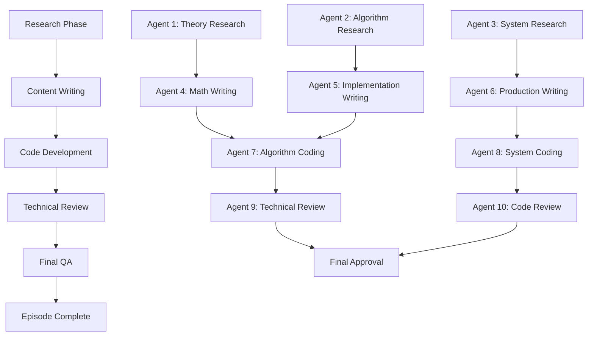

# Multi-Agent Parallel Execution Tracker System

## System Architecture

### Agent Pool Configuration
```yaml
agent_pool:
  total_agents: 10
  agent_types:
    - content_researcher: 3 agents
    - technical_writer: 3 agents
    - code_developer: 2 agents
    - quality_reviewer: 2 agents
  
  parallel_execution:
    max_concurrent: 6
    batch_size: 5 episodes
    coordination: event-driven
```

## Execution Framework

### Phase 1: Research & Content Gathering (Agents 1-3)
```yaml
research_agents:
  agent_1:
    id: "research_001"
    specialization: "theoretical_foundations"
    assigned_episodes: [1-25]
    tasks:
      - analyze_site_content
      - identify_gaps
      - collect_research_papers
      - gather_production_examples
    
  agent_2:
    id: "research_002"
    specialization: "algorithms_protocols"
    assigned_episodes: [26-50]
    tasks:
      - map_consensus_algorithms
      - analyze_implementations
      - benchmark_performance
      - document_trade_offs
    
  agent_3:
    id: "research_003"
    specialization: "system_architectures"
    assigned_episodes: [51-100]
    tasks:
      - catalog_patterns
      - analyze_case_studies
      - extract_metrics
      - identify_best_practices
```

### Phase 2: Content Development (Agents 4-6)
```yaml
writing_agents:
  agent_4:
    id: "writer_001"
    specialization: "mathematical_content"
    assigned_episodes: [1-50]
    tasks:
      - write_mathematical_proofs
      - create_formula_derivations
      - develop_complexity_analysis
      - produce_theoretical_sections
    
  agent_5:
    id: "writer_002"
    specialization: "implementation_content"
    assigned_episodes: [51-100]
    tasks:
      - write_pseudocode
      - create_architecture_diagrams
      - document_api_designs
      - develop_configuration_guides
    
  agent_6:
    id: "writer_003"
    specialization: "production_content"
    assigned_episodes: [101-150]
    tasks:
      - document_case_studies
      - write_performance_analysis
      - create_optimization_guides
      - develop_troubleshooting_content
```

### Phase 3: Code Development (Agents 7-8)
```yaml
coding_agents:
  agent_7:
    id: "coder_001"
    specialization: "algorithm_implementation"
    assigned_episodes: "all_algorithms"
    tasks:
      - implement_consensus_algorithms
      - create_data_structures
      - develop_protocol_implementations
      - write_performance_benchmarks
    
  agent_8:
    id: "coder_002"
    specialization: "system_implementation"
    assigned_episodes: "all_systems"
    tasks:
      - create_example_applications
      - implement_patterns
      - develop_integration_tests
      - create_deployment_scripts
```

### Phase 4: Quality Assurance (Agents 9-10)
```yaml
review_agents:
  agent_9:
    id: "reviewer_001"
    specialization: "technical_accuracy"
    assigned_episodes: [1-75]
    tasks:
      - verify_mathematical_proofs
      - validate_algorithms
      - check_performance_claims
      - review_citations
    
  agent_10:
    id: "reviewer_002"
    specialization: "code_quality"
    assigned_episodes: [76-150]
    tasks:
      - test_code_examples
      - verify_benchmarks
      - validate_configurations
      - check_dependencies
```

## Parallel Execution Schedule

### Week 1-2: Batch 1 (Episodes 1-10)
```yaml
batch_1:
  episodes: [1-10]
  parallel_tasks:
    - task_1:
        agents: [research_001, research_002]
        action: "gather_content"
        duration: "2 days"
    - task_2:
        agents: [writer_001]
        action: "write_mathematical_foundations"
        duration: "3 days"
        depends_on: task_1
    - task_3:
        agents: [coder_001]
        action: "implement_basic_algorithms"
        duration: "2 days"
        depends_on: task_2
    - task_4:
        agents: [reviewer_001]
        action: "technical_review"
        duration: "1 day"
        depends_on: task_3
```

### Week 3-4: Batch 2 (Episodes 11-20)
```yaml
batch_2:
  episodes: [11-20]
  parallel_tasks:
    - task_1:
        agents: [research_001, research_003]
        action: "analyze_consistency_models"
        duration: "2 days"
    - task_2:
        agents: [writer_001, writer_002]
        action: "document_time_ordering"
        duration: "3 days"
        depends_on: task_1
    - task_3:
        agents: [coder_001]
        action: "implement_clock_algorithms"
        duration: "2 days"
        depends_on: task_2
    - task_4:
        agents: [reviewer_001, reviewer_002]
        action: "comprehensive_review"
        duration: "1 day"
        depends_on: task_3
```

## Task Dependency Graph



## Progress Tracking Dashboard

### Episode Status Matrix
```yaml
status_dashboard:
  completed: []
  in_progress:
    episode_1:
      status: "writing"
      completion: 60%
      assigned_agents: [writer_001, coder_001]
      blockers: none
      estimated_completion: "2025-01-11"
    
    episode_2:
      status: "research"
      completion: 30%
      assigned_agents: [research_001]
      blockers: "waiting_for_site_content_analysis"
      estimated_completion: "2025-01-13"
  
  queued:
    - episode_3: scheduled_start: "2025-01-12"
    - episode_4: scheduled_start: "2025-01-13"
    - episode_5: scheduled_start: "2025-01-14"
```

### Agent Utilization Tracker
```yaml
agent_utilization:
  research_001:
    current_task: "episode_2_research"
    utilization: 85%
    completed_tasks: 0
    in_progress: 1
    estimated_availability: "2025-01-11"
  
  writer_001:
    current_task: "episode_1_mathematics"
    utilization: 90%
    completed_tasks: 0
    in_progress: 1
    estimated_availability: "2025-01-11"
  
  coder_001:
    current_task: "episode_1_algorithms"
    utilization: 75%
    completed_tasks: 0
    in_progress: 1
    estimated_availability: "2025-01-10"
```

## Coordination Protocol

### Inter-Agent Communication
```yaml
communication_protocol:
  message_types:
    - task_complete:
        from: any_agent
        to: coordinator
        payload: {episode_id, task_id, outputs}
    
    - task_assignment:
        from: coordinator
        to: specific_agent
        payload: {episode_id, task_details, deadline}
    
    - blocker_alert:
        from: any_agent
        to: coordinator
        payload: {episode_id, blocker_description, required_input}
    
    - quality_issue:
        from: reviewer_agent
        to: original_agent
        payload: {episode_id, issues, required_fixes}
```

### Synchronization Points
```yaml
sync_points:
  daily_standup:
    time: "09:00 UTC"
    participants: all_active_agents
    agenda:
      - progress_update
      - blocker_discussion
      - task_reallocation
  
  weekly_review:
    time: "Friday 14:00 UTC"
    participants: all_agents
    agenda:
      - completed_episodes_review
      - quality_metrics
      - process_improvements
      - next_week_planning
```

## Quality Gates

### Episode Completion Criteria
```yaml
quality_gates:
  gate_1_research:
    - site_content_mapped: true
    - gaps_identified: true
    - references_collected: minimum: 10
    - production_examples: minimum: 3
  
  gate_2_content:
    - mathematical_proofs: verified: true
    - code_examples: runnable: true
    - word_count: minimum: 15000
    - diagrams: minimum: 5
  
  gate_3_implementation:
    - code_coverage: minimum: 90%
    - performance_benchmarks: completed: true
    - integration_tests: passing: true
    - documentation: complete: true
  
  gate_4_review:
    - technical_accuracy: verified: true
    - citations_valid: true
    - no_plagiarism: true
    - style_compliance: true
```

## Automation Scripts

### Agent Task Assignment
```python
# task_assigner.py
class TaskAssigner:
    def __init__(self):
        self.agents = self.load_agents()
        self.episodes = self.load_episodes()
        self.task_queue = []
    
    def assign_next_batch(self):
        """Assign next batch of episodes to available agents"""
        available_agents = self.get_available_agents()
        next_episodes = self.get_next_episodes(batch_size=5)
        
        for episode in next_episodes:
            tasks = self.generate_tasks(episode)
            for task in tasks:
                agent = self.select_best_agent(task, available_agents)
                self.assign_task(agent, task)
    
    def monitor_progress(self):
        """Monitor agent progress and handle blockers"""
        for agent in self.agents:
            status = agent.get_status()
            if status.blocked:
                self.handle_blocker(agent, status.blocker)
            if status.completed:
                self.mark_complete(agent.current_task)
                self.assign_next_task(agent)
```

### Progress Visualization
```python
# progress_tracker.py
class ProgressTracker:
    def __init__(self):
        self.episodes = self.load_episode_status()
        
    def generate_dashboard(self):
        """Generate visual progress dashboard"""
        dashboard = {
            'overall_progress': self.calculate_overall_progress(),
            'episode_status': self.get_episode_status_chart(),
            'agent_utilization': self.get_agent_utilization_chart(),
            'velocity_trend': self.calculate_velocity_trend(),
            'estimated_completion': self.estimate_completion_date()
        }
        return dashboard
    
    def generate_gantt_chart(self):
        """Generate Gantt chart for episode timeline"""
        chart_data = []
        for episode in self.episodes:
            chart_data.append({
                'episode': episode.id,
                'start': episode.start_date,
                'end': episode.estimated_end,
                'progress': episode.completion_percentage,
                'agents': episode.assigned_agents
            })
        return chart_data
```

## Monitoring & Alerts

### Key Performance Indicators
```yaml
kpis:
  velocity:
    target: 10_episodes_per_week
    current: 0
    trend: "establishing_baseline"
  
  quality:
    target: 95%
    current: "not_yet_measured"
    measurement: "reviewer_approval_rate"
  
  agent_efficiency:
    target: 80%_utilization
    current: 75%
    bottlenecks: ["research_phase", "technical_review"]
  
  content_coverage:
    target: 100%_site_integration
    current: 70%
    gaps: ["advanced_algorithms", "emerging_topics"]
```

### Alert Conditions
```yaml
alerts:
  critical:
    - condition: "episode_delayed > 3 days"
      action: "escalate_to_coordinator"
    - condition: "agent_blocked > 24 hours"
      action: "reassign_task"
  
  warning:
    - condition: "quality_score < 80%"
      action: "additional_review"
    - condition: "velocity < 8 episodes/week"
      action: "analyze_bottlenecks"
  
  info:
    - condition: "episode_completed"
      action: "update_dashboard"
    - condition: "batch_completed"
      action: "trigger_next_batch"
```

## Resource Allocation

### Compute Resources
```yaml
compute_allocation:
  research_agents:
    cpu: 4_cores
    memory: 16GB
    storage: 100GB
    gpu: optional
  
  writing_agents:
    cpu: 2_cores
    memory: 8GB
    storage: 50GB
    gpu: not_required
  
  coding_agents:
    cpu: 8_cores
    memory: 32GB
    storage: 200GB
    gpu: required_for_ml
  
  review_agents:
    cpu: 4_cores
    memory: 16GB
    storage: 100GB
    gpu: optional
```

### Time Allocation
```yaml
time_budget:
  per_episode:
    research: 8_hours
    writing: 16_hours
    coding: 12_hours
    review: 4_hours
    total: 40_hours
  
  parallel_factor: 0.6  # Efficiency with parallel execution
  effective_time: 24_hours  # 40 * 0.6
  
  weekly_capacity:
    with_10_agents: 400_hours
    episodes_possible: 16  # 400 / 24
    target: 10  # Conservative estimate
```

## Continuous Improvement

### Feedback Loops
```yaml
improvement_process:
  weekly_retrospective:
    - analyze_completed_episodes
    - identify_process_improvements
    - update_templates
    - refine_automation
  
  monthly_optimization:
    - review_agent_performance
    - optimize_task_allocation
    - update_quality_criteria
    - enhance_parallelization
  
  quarterly_review:
    - assess_overall_progress
    - adjust_timeline
    - reallocate_resources
    - strategic_planning
```

---

*System Version*: 1.0
*Last Updated*: 2025-01-09
*Status*: Ready for Deployment