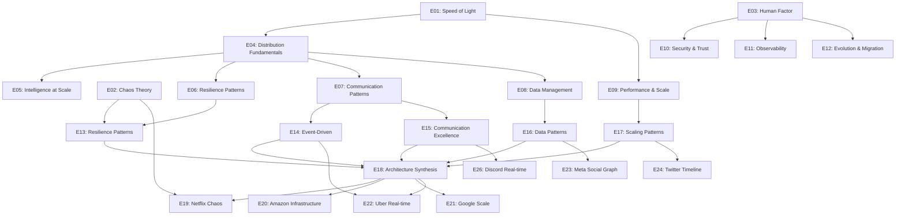

# 🗺️ Cross-Episode Dependency & Learning Path Visualization

## Overview
This system maps the intricate relationships between episodes, concepts, and patterns across the DStudio podcast series, providing optimal learning paths for different audiences and goals.

## 📊 Episode Dependency Graph

### Core Dependencies


### Concept Prerequisite Map

| Episode | Prerequisites | Unlocks | Core Concepts |
|---------|--------------|---------|---------------|
| E01 | None | E04, E09 | Physics limits, latency, failure correlation |
| E02 | None | E13, E19 | Emergent behavior, chaos, feedback loops |
| E03 | None | E10-E12 | Cognitive load, team topology, human limits |
| E04 | E01 | E05-E08 | Five pillars, CAP theorem, distribution challenges |
| E05 | E04 | ML patterns | Distributed intelligence, federated learning |
| E06 | E04 | E13 | Basic resilience patterns |
| E07 | E04 | E14, E15 | Communication patterns, protocols |
| E08 | E04 | E16 | Consistency models, transactions |
| E09 | E01 | E17 | Performance laws, queueing theory |
| E10 | E03 | Security series | Security principles, zero trust |
| E11 | E03 | Debugging skills | Observability pillars, distributed tracing |
| E12 | E03 | E21 | Migration patterns, evolution strategies |

## 🎯 Optimized Learning Paths

### Path 1: New Graduate Engineer (L5)
**Goal**: Build strong distributed systems foundation
**Duration**: 36 hours (3 hours/week for 12 weeks)

```
Week 1-3: Fundamentals
├── E01: Speed of Light (understand constraints)
├── E03: Human Factor (know your limits)
└── E04: Distribution Fundamentals (core challenges)

Week 4-6: Core Patterns  
├── E06: Resilience Patterns (prevent failures)
├── E07: Communication Patterns (service interaction)
└── E08: Data Management (consistency basics)

Week 7-9: Practical Application
├── E11: Observability (debugging skills)
├── E13: Gold Tier Resilience (production patterns)
└── E14: Event-Driven (modern architectures)

Week 10-12: Real World
├── E19: Netflix (see patterns in action)
├── E22: Uber (real-time systems)
└── E24: Twitter (scale challenges)
```

### Path 2: Senior Engineer → Staff (L6→L7)
**Goal**: Master architectural patterns and system design
**Duration**: 27 hours (intensive 2-week sprint)

```
Week 1: Advanced Patterns
├── E13: Gold Resilience (advanced techniques)
├── E14: Event-Driven Mastery (architecture patterns)
├── E15: Communication Excellence (service mesh, etc)
├── E16: Data Management Mastery (distributed transactions)
└── E17: Scaling Deep Dive (mathematical foundations)

Week 2: Synthesis & Case Studies
├── E18: Architecture Synthesis (pattern combinations)
├── E20: Amazon Philosophy (service architecture)
├── E21: Google Scale (global systems)
├── E22: Uber Real-time (event sourcing practice)
└── E29: Stripe Infrastructure (financial systems)
```

### Path 3: Engineering Manager
**Goal**: Understand trade-offs and lead architecture decisions
**Duration**: 21 hours (7 weekly sessions)

```
Week 1-2: Foundation & Human Factors
├── E03: Human Factor (team dynamics)
├── E04: Distribution Fundamentals (what your team faces)
└── E10: Security & Trust (risk management)

Week 3-4: Operational Excellence
├── E11: Observability (what to measure)
├── E12: Evolution & Migration (managing change)
└── E18: Architecture Synthesis (decision frameworks)

Week 5-7: Case Studies & Lessons
├── E19: Netflix (culture & architecture)
├── E20: Amazon (organizational structure)
└── E23: Meta (scaling organizations)
```

### Path 4: Security-Focused Engineer
**Goal**: Build secure distributed systems
**Duration**: 18 hours + security mini-series

```
Foundation:
├── E01: Speed of Light (attack surface)
├── E04: Distribution (trust boundaries)
└── E10: Security & Trust (core principles)

Applied Security:
├── E13: Resilience (security as resilience)
├── E15: Communication (mTLS, service mesh security)
└── E16: Data Management (encryption, compliance)

Case Studies:
├── E20: Amazon (IAM at scale)
├── E29: Stripe (financial security)
└── Security Mini-series (when available)
```

### Path 5: Rapid Upskill (Express Track)
**Goal**: Quickly understand distributed systems for interviews/project
**Duration**: 15 hours (5 days × 3 hours)

```
Day 1: Core Concepts
├── E01: Speed of Light (30-min summary)
├── E04: Distribution Fundamentals
└── E06: Resilience Patterns

Day 2: Patterns
├── E14: Event-Driven
├── E16: Data Management
└── E17: Scaling

Day 3: Synthesis
├── E18: Architecture Synthesis
└── E13: Gold Tier Resilience

Day 4-5: Real Examples
├── E19: Netflix
├── E22: Uber
└── E20: Amazon
```

## 📈 Concept Progression Maps

### Consistency Models Journey
```
E04: CAP Theorem basics
  ↓
E08: Consistency models (eventual, causal, linear)
  ↓
E16: Advanced patterns (CRDT, vector clocks)
  ↓
E21: Google Spanner (global consistency)
  ↓
E23: Meta TAO (graph consistency)
```

### Resilience Pattern Evolution
```
E01: Failure correlation principle
  ↓
E06: Basic patterns (timeout, retry, circuit breaker)
  ↓
E13: Gold tier patterns (bulkhead, backpressure)
  ↓
E19: Netflix implementation (Hystrix)
  ↓
E18: Pattern combinations (complete architectures)
```

### Scale Journey
```
E01: Physical limits (latency, bandwidth)
  ↓
E09: Performance laws (Little's, Amdahl's)
  ↓
E17: Scaling patterns (sharding, caching)
  ↓
E24: Twitter scale (timeline problem)
  ↓
E21: Google scale (planet-scale search)
```

## 🔀 Alternative Learning Approaches

### Problem-Focused Paths

#### "I need to build a real-time system"
```
1. E07: Communication Patterns (WebSocket, streaming)
2. E14: Event-Driven Architecture (pub/sub, event sourcing)
3. E26: Discord Real-time (production example)
4. E22: Uber (location streaming)
5. E30: TikTok (video streaming)
```

#### "I need to handle massive scale"
```
1. E09: Performance & Scale (theory)
2. E17: Scaling Patterns (techniques)
3. E21: Google Scale (search scale)
4. E24: Twitter Timeline (feed scale)
5. E19: Netflix (video scale)
```

#### "I need high reliability"
```
1. E01: Speed of Light (failure physics)
2. E06: Resilience Patterns (basics)
3. E13: Gold Tier Resilience (advanced)
4. E29: Stripe (financial reliability)
5. E20: Amazon (infrastructure reliability)
```

### Industry-Focused Paths

#### FinTech Track
- E10: Security & Trust
- E16: Data Management (transactions)
- E29: Stripe Infrastructure
- E08: Data consistency

#### Social Media Track
- E14: Event-Driven (feeds)
- E23: Meta Social Graph
- E24: Twitter Timeline
- E17: Scaling patterns

#### E-Commerce Track
- E20: Amazon Infrastructure
- E25: Airbnb Marketplace
- E16: Data Management
- E13: Resilience

## 📊 Learning Efficiency Metrics

### Concept Density by Episode
| Episode | Concepts/Hour | Difficulty | Prerequisites |
|---------|---------------|------------|---------------|
| E01 | 12 | Medium | None |
| E04 | 18 | High | E01 |
| E18 | 25 | Very High | E13-E17 |
| E19 | 15 | Medium | E13, E02 |

### Time Investment Analysis
| Path | Hours | Concepts Covered | Patterns Learned | ROI |
|------|-------|------------------|------------------|-----|
| New Grad | 36 | 150 | 40 | High |
| Senior | 27 | 200 | 60 | Very High |
| Manager | 21 | 100 | 30 | High |
| Express | 15 | 80 | 25 | Medium |

## 🎮 Interactive Learning Features

### Self-Assessment Checkpoints
After each episode, learners should be able to:

**E01 Checkpoint**:
- [ ] Calculate RTT for geo-distributed system
- [ ] Explain failure correlation
- [ ] Design for speed of light constraint

**E04 Checkpoint**:
- [ ] Identify five pillars in any system
- [ ] Explain CAP trade-offs
- [ ] Design basic distributed system

**E13 Checkpoint**:
- [ ] Implement circuit breaker
- [ ] Design bulkhead isolation
- [ ] Calculate failure probabilities

### Knowledge Verification Paths
```
Basic Certification Path:
E01 → E04 → E06 → E07 → E08 → Assessment

Advanced Certification Path:
All Basic + E13 → E14 → E16 → E17 → E18 → Assessment

Expert Certification Path:
All Advanced + 5 Architecture Deep Dives → Assessment
```

## 🔄 Dynamic Path Adjustment

### Based on Background
- **Strong CS Theory**: Skip to E04
- **Ops Experience**: Start with E11, E12
- **Security Background**: Focus on E10 thread
- **Data Engineering**: Emphasize E08, E16

### Based on Learning Speed
- **Fast Learners**: Compress paths by 30%
- **Thorough Learners**: Add exercises between episodes
- **Visual Learners**: Supplement with diagrams
- **Practical Learners**: Add hands-on labs

## 📱 Learning Path Tracking

### Progress Indicators
```yaml
learner_profile:
  episodes_completed: [1, 3, 4, 6]
  concepts_mastered: 45/287
  patterns_understood: 15/91
  quizzes_passed: 4/4
  
next_recommended: E07
alternative_path: E11 (if debugging focus)
estimated_completion: 8 weeks
```

### Personalized Recommendations
Based on:
- Previous episode completion time
- Quiz scores
- Stated goals
- Industry focus
- Available time commitment

## 🚀 Future Enhancements

### AI-Powered Path Optimization
- Analyze learning patterns
- Predict optimal next episode
- Adjust difficulty dynamically
- Suggest review sessions

### Social Learning Features
- Study groups by path
- Peer discussions per episode
- Mentor matching by experience
- Progress sharing

### Gamification Elements
- Episode completion badges
- Concept mastery achievements
- Learning streaks
- Knowledge contests

---

*"The journey of a thousand systems begins with a single episode" - Ancient SRE Proverb*