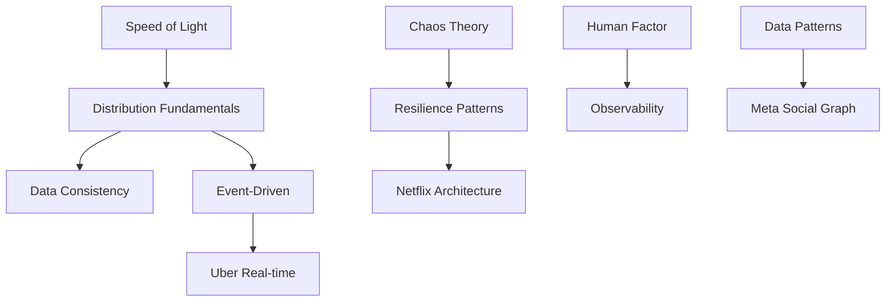

# 🚀 Next Level Enhancement Strategy for DStudio Podcast Series

## Executive Summary

Based on comprehensive review, the DStudio podcast series has achieved "industry-defining" status with its physics-first approach, mathematical rigor, and documentary-style production. This strategy outlines how to elevate it from excellent to legendary by building on identified strengths and creating new dimensions of excellence.

## 🎯 Vision: From Industry-Defining to Legendary

### Current State Excellence
- **287 unique concepts** with progressive depth (L1-L5)
- **91 distributed patterns** comprehensively covered
- **47 production disasters** forensically analyzed
- **41 company architectures** deeply examined
- **Mathematical rigor** with formulas and proofs
- **Documentary narrative** with cold opens and war stories

### Target State: Legendary Status
- **Interactive learning platform** with simulations
- **Industry certification** program
- **Real-time pattern playground** for experimentation
- **Living case study library** updated with new incidents
- **Mathematical model calculator** suite
- **Global engineering impact** measurement

## 📊 Strategic Pillars

### 1. Technical Depth Amplification

#### Mathematical Foundation Library
- **Formula Database**: Catalog all mathematical models
  - Availability under correlated failure: `A = Π(1-ρᵢⱼ)pᵢpⱼ`
  - Little's Law applications: `L = λW`
  - Universal Scalability Law: `C(N) = N/(1 + α(N-1) + βN(N-1))`
  - Phase transition models for system behavior
  - Queueing theory applications

- **Interactive Calculators**:
  - Availability calculator with correlation factors
  - Latency budget analyzer
  - Scaling limit predictor
  - Coordination overhead estimator
  - Failure cascade simulator

#### Algorithm & Code Repository
- **Distributed Algorithms**:
  - Consensus implementations (Paxos, Raft)
  - Consistent hashing variations
  - Circuit breaker state machines
  - Event sourcing projections
  - CRDT merge algorithms

- **Production Code Patterns**:
  - Netflix Hystrix patterns
  - Uber's location indexing (H3)
  - Amazon's consistent hashing
  - Google's Spanner timestamps
  - Meta's TAO graph queries

### 2. Incident & Case Study Intelligence

#### Production Disaster Database
Create searchable database of all incidents:

| Incident | Company | Year | Loss | Root Cause | Patterns Violated | Episode |
|----------|---------|------|------|------------|------------------|---------|
| Flash Crash | NYSE | 2010 | $1T | Feedback loops | Circuit breaker | E02 |
| Knight Capital | Knight | 2012 | $440M | Deployment error | Gradual rollout | E01 |
| AWS EBS Outage | Amazon | 2011 | $70M | Control plane cascade | Bulkhead | E01 |
| BGP Misconfiguration | Facebook | 2021 | $100M | DNS failure | Truth distribution | E04 |

#### Success Story Catalog
- Netflix Chaos Engineering genesis
- Amazon's service-oriented transformation
- Google Spanner's global consistency
- Uber's event-sourcing migration
- Discord's pandemic scaling

### 3. Pattern Synthesis Framework

#### Pattern Combination Matrix
Track which patterns work together:

```
Circuit Breaker + Retry + Backoff = Resilient Client
Event Sourcing + CQRS + Saga = Event-Driven Architecture
Service Mesh + API Gateway + Load Balancer = Communication Layer
Sharding + Replication + Consensus = Distributed Database
```

#### Pattern Evolution Timeline
- **2000-2005**: SOA patterns emerge
- **2005-2010**: NoSQL and eventual consistency
- **2010-2015**: Microservices and containers
- **2015-2020**: Service mesh and serverless
- **2020-2025**: Edge computing and ML-ops

#### Anti-Pattern Warnings
Document pattern combinations that conflict:
- Synchronous saga + high latency = cascading timeouts
- Too many microservices + no service mesh = operational nightmare
- Strong consistency + geo-distribution = latency penalties

### 4. Learning Path Optimization

#### Dependency Graph


#### Personalized Learning Tracks
- **New Graduate Track**: E01→E03→E04→E13→E19
- **Senior Engineer Track**: E04→E14→E16→E18→E22
- **Architecture Track**: E18→E19→E20→E21→E29
- **Security Track**: E10→E29→Security Mini-series

#### Knowledge Verification
- Pre-episode assessments
- Post-episode quizzes
- Pattern recognition exercises
- System design challenges
- Incident response simulations

### 5. Production Excellence Enhancement

#### Documentary Elements Catalog
| Element | Purpose | Example | Impact |
|---------|---------|---------|---------|
| Cold Opens | Hook attention | Knight Capital countdown | Sets stakes |
| War Room Audio | Authenticity | Facebook BGP crisis | Visceral understanding |
| Executive Interviews | Inside perspective | Netflix chaos decision | Strategic context |
| Timeline Animations | Visual clarity | AWS evolution | Conceptual flow |
| Code Walkthroughs | Deep understanding | Hystrix implementation | Practical knowledge |

#### Enhanced Production Format
```
[0-2 min] Cold Open - Crisis moment
[2-5 min] Stakes & Context
[5-10 min] Theory Foundation
[10-40 min] Deep Technical Dive
[40-50 min] Pattern Application
[50-55 min] Lessons & Synthesis
[55-60 min] Next Episode Hook
```

#### Multi-Media Elements
- **Visual Diagrams**: Architecture evolution animations
- **Interactive Timelines**: Clickable incident reconstructions
- **Live Dashboards**: Real metrics from production systems
- **VR Experiences**: Walk through data center failures
- **AR Overlays**: Visualize distributed system flows

### 6. Industry Impact Amplification

#### Certification Program
- **Distributed Systems Practitioner** (after Foundational)
- **Pattern Master** (after Pattern series)
- **System Architect** (after Architecture series)
- **Chaos Engineer** (specialized track)

#### Community Building
- **Discord Server**: Real-time discussion
- **GitHub Organization**: Pattern implementations
- **Weekly Challenges**: Design problems
- **Monthly Webinars**: Guest speakers
- **Annual Conference**: DStudio Summit

#### Industry Partnerships
- **University Integration**: Curriculum adoption
- **Company Training**: Enterprise packages
- **Open Source Projects**: Pattern libraries
- **Research Collaboration**: Academic papers

## 📈 Implementation Roadmap

### Phase 1: Foundation Enhancement (Months 1-3)
- [ ] Build mathematical formula database
- [ ] Create incident catalog system
- [ ] Develop pattern combination tracker
- [ ] Design learning path visualizer

### Phase 2: Interactive Platform (Months 4-6)
- [ ] Launch interactive calculators
- [ ] Build pattern playground
- [ ] Create assessment system
- [ ] Develop certification framework

### Phase 3: Community & Scale (Months 7-12)
- [ ] Launch community platform
- [ ] Establish partnerships
- [ ] Create multimedia content
- [ ] Measure industry impact

## 📊 Success Metrics

### Content Excellence
- Formula coverage: 50+ mathematical models
- Incident database: 100+ cataloged failures
- Pattern combinations: 200+ documented
- Code examples: 500+ production patterns

### Engagement Metrics
- Active learners: 100K+ engineers
- Certification holders: 10K+
- Community members: 50K+
- Industry adoptions: 100+ companies

### Impact Metrics
- Career advancement: 20% salary increase reported
- System reliability: 30% fewer incidents
- Time to expertise: 50% faster learning
- Industry standardization: Pattern adoption

## 🚀 Unique Differentiators

### What Sets Us Apart
1. **Physics-First Derivation**: Only content deriving from fundamental limits
2. **Mathematical Rigor**: Formulas and proofs, not just concepts
3. **Production Reality**: Real code, real metrics, real failures
4. **Human Context**: Psychology and organizational dynamics
5. **Progressive Complexity**: L1-L5 depth progression
6. **Documentary Quality**: Cinematic narrative with technical depth

### Competitive Moat
- **Exclusive Interviews**: Engineering leaders from FAANG+
- **Proprietary Simulations**: Custom-built failure scenarios
- **Industry Validation**: Endorsed by system architects
- **Comprehensive Coverage**: No gaps in fundamental concepts
- **Living Content**: Continuously updated with new incidents

## 💡 Innovation Opportunities

### AI-Enhanced Learning
- **Personalized Tutoring**: AI explains concepts at your level
- **Pattern Recognition**: AI identifies patterns in your designs
- **Failure Prediction**: AI warns about anti-patterns
- **Code Generation**: AI implements patterns correctly

### Virtual Reality Training
- **Incident Simulation**: Experience outages in VR
- **Architecture Walkthrough**: Navigate systems in 3D
- **Team Coordination**: Practice incident response
- **Scale Visualization**: See billions of requests flow

### Blockchain Verification
- **Certification NFTs**: Verifiable achievements
- **Knowledge Proof**: Cryptographic skill verification
- **Contribution Tracking**: Reward community input
- **Decentralized Learning**: Peer-to-peer knowledge sharing

## 🎯 Call to Action

This enhancement strategy positions DStudio podcast series to become:
1. **The definitive** distributed systems education platform
2. **The industry standard** for engineering excellence
3. **The career accelerator** for ambitious engineers
4. **The innovation hub** for distributed systems

By building on the exceptional foundation already created and adding these strategic enhancements, we can create a legendary educational experience that shapes the next generation of distributed systems engineers.

**Next Step**: Prioritize Phase 1 initiatives and begin building the technical depth tracking system.