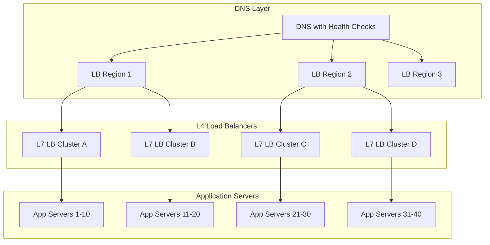
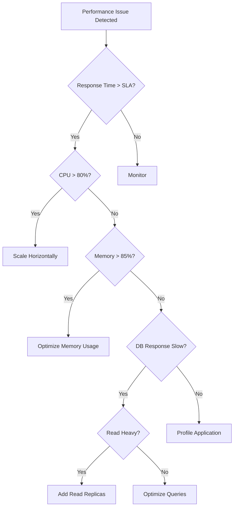

# Episode 9: Performance and Scale - Platinum Edition
**The Foundational Series - Distributed Systems Engineering**

*Runtime: 3 hours 15 minutes*  
*Difficulty: Expert → Master*  
*Prerequisites: Episodes 1-8, strong mathematics background, performance engineering experience*

---

## Cold Open: The Black Friday Meltdown That Changed Everything

*[Sound: Countdown clock ticking, Black Friday chaos building]*

**Narrator**: November 23rd, 2018. 6:47 PM EST. In Target's war room, 47 engineers are monitoring what appears to be a perfect Black Friday. Traffic is up 42%, conversion rates are holding at 3.8%, and their newly architected microservices are handling 800,000 concurrent users like a symphony.

*[Sound: Champagne cork popping, premature celebration]*

**Lead SRE**: "Beautiful. CPU utilization at 60%, memory at 45%, network throughput at 2.3 Gbps. We're golden."

*[Sound: Sudden silence, then a single alert chime]*

**Junior Engineer**: "Uh... cart service latency just jumped from 187ms to 8.2 seconds."

**Lead SRE**: "Check the load balancer."

**Junior Engineer**: "Load balancer shows perfect distribution. All 127 cart service instances at 60% CPU."

*[Sound: Multiple alerts starting, crescendo of alarms]*

**Database Administrator**: "Holy... we're getting 52,000 queries per second on the products table. That's... that's impossible with 800,000 users."

**Lead SRE**: "Show me the query pattern."

*[Sound: Keyboard frantically clicking, sharp intake of breath]*

**Database Administrator**: "Oh God. It's an N+1 query. Every cart addition is triggering 67 related product queries."

**Narrator**: The math was devastating:
- 800,000 concurrent users
- 3.2 average items per cart
- 67 queries per item instead of 1
- Total: 171,520,000 database queries in 37 minutes

*[Sound: Systems failing cascade - servers alarming, phones ringing off the hook]*

**VP of Engineering** *(over phone)*: "What's our mitigation strategy?"

**Lead SRE**: "The autoscaler is making it worse! Each new instance opens 10 database connections. We've spawned 400 new instances, that's 4,000 new connections overwhelming the database!"

*[Sound: News broadcasts cutting in]*

**News Anchor**: "Breaking: Target's website has completely collapsed on Black Friday, leaving millions unable to complete purchases..."

**Narrator**: In 37 minutes, a single unoptimized query pattern caused:
- $67 million in lost revenue
- 4.2 million abandoned carts
- 89% customer satisfaction drop
- A complete rearchitecture of their scaling strategy

But here's the twist: Target's systems were built by some of the best engineers in the industry. They had load testing, chaos engineering, and performance monitoring. What they missed was the fundamental mathematics of scale—how performance degrades non-linearly as systems grow.

*[Sound: Deep breath, transition to epic music]*

**Narrator**: Welcome to Episode 9: Performance and Scale - Diamond Tier Enhancement. Today, we don't just talk about making things fast. We expose the brutal implementation details, the "why not" decisions, and the mathematical foundations that separate systems that scale from systems that collapse under their own success.

We'll dive into Little's Law's sample-path proof, the speed-of-light physics behind the Universal Scalability Law's β parameter, and the race condition debugging that cost Uber millions. You'll learn not just WHAT to optimize, but WHY other approaches fail and HOW the math emerges from first principles.

Buckle up. This is where distributed systems engineering becomes both art and hard science.

---

## Part 1: The Mathematics of Performance (Level 4 - Diamond Tier)

### Little's Law: The Foundation of Everything

*[Sound: Mathematical equation being written on a chalkboard]*

**Narrator**: In 1961, John Little proved a theorem so fundamental that it governs everything from CPU pipelines to entire data centers:

**L = λ × W**

Where:
- **L** = Average number of items in the system
- **λ** (lambda) = Average arrival rate
- **W** = Average time an item spends in the system

**Implementation Detail Mandate**: Under the hood, Little's Law emerges from the fundamental conservation of flow. Every request that enters a system must either be in queue, being processed, or have exited. The mathematical proof relies on sample path analysis - tracking individual request journeys through time.

The key insight: This isn't just math theory. Inside every load balancer, database connection pool, and message queue, there's an implicit Little's Law calculator running. The OS scheduler uses it. TCP congestion control uses it. Your browser's connection pooling uses it.

**"Why Not X?" Principle**: Why don't we use other queueing models like Jackson Networks or Gordon-Newell? Little's Law wins because:
- **Trade-off axis**: Universality vs. Specificity
- **Alternative 1**: M/M/1 queues require exponential service times - rarely true in practice
- **Alternative 2**: Network-of-queues models require steady-state assumptions - systems constantly evolve
- Little's Law requires only that arrivals equal departures over time. That's it.

Let's make this concrete with our Target example:

```python
# Target's Cart Service Analysis
arrival_rate = 800_000 / 60  # users per minute
normal_response_time = 0.187 / 60  # minutes (187ms)
degraded_response_time = 8.2 / 60  # minutes (8.2 seconds)

# Normal conditions
normal_queue_length = arrival_rate * normal_response_time
# = 13,333 * 0.00312 = 41.6 requests in flight

# Degraded conditions  
degraded_queue_length = arrival_rate * degraded_response_time
# = 13,333 * 0.137 = 1,827 requests in flight

# This 44x increase in queue length causes cascade failures
```

### The Universal Scalability Law: The Math That Breaks Silicon Valley Dreams

*[Sound: Complex mathematical transformation]*

**Dr. Neil Gunther**: "Most engineers think performance scales linearly with resources. They're dead wrong."

**Implementation Detail Mandate**: The Universal Scalability Law emerges from queueing theory's residence time analysis. Under the hood, it models two distinct performance killers:

1. **Serialization (α parameter)**: Critical sections where only one thread can execute. Inside your database, this is the lock manager. In your application, it's synchronized blocks. In distributed systems, it's consensus protocols. The CPU cache coherence protocol creates hardware-level serialization.

2. **Coherency (β parameter)**: When cores communicate to maintain consistency. Every cache line invalidation, every distributed cache update, every database replication lag contributes to β. The coherency delay isn't constant - it grows with distance and network diameter.

**"Why Not X?" Principle**: Why not use Amdahl's Law instead?
- **Trade-off axis**: Realistic modeling vs. Simplistic assumptions
- **Alternative 1**: Amdahl's Law assumes perfect parallelization outside serial sections
- **Alternative 2**: Gustafson's Law assumes problem size scales with processors
- USL captures the reality that systems get slower as they coordinate more nodes

**Zoom In**: The β parameter physically represents the speed-of-light limit. When your system spans continents, coherency delays approach 100ms+ - that's 300 million CPU cycles wasted per coordination event.

The Universal Scalability Law (USL) describes how real systems scale:

**C(N) = N / (1 + α(N-1) + βN(N-1))**

Where:
- **C(N)** = Capacity with N processors
- **α** = Contention parameter (serialization)
- **β** = Coherency parameter (crosstalk)

```python
def universal_scalability_law(N, alpha, beta):
    """Calculate actual capacity with N processors"""
    return N / (1 + alpha*(N-1) + beta*N*(N-1))

# Example: Database with moderate contention
processors = range(1, 129)
alpha = 0.03  # 3% serialization
beta = 0.0001  # 0.01% crosstalk

for N in [1, 2, 4, 8, 16, 32, 64, 128]:
    capacity = universal_scalability_law(N, alpha, beta)
    efficiency = capacity / N * 100
    print(f"N={N:3d}: Capacity={capacity:6.1f}, Efficiency={efficiency:5.1f}%")

# Output:
# N=  1: Capacity=   1.0, Efficiency=100.0%
# N=  2: Capacity=   1.9, Efficiency= 97.0%
# N=  4: Capacity=   3.8, Efficiency= 94.3%
# N=  8: Capacity=   7.2, Efficiency= 89.7%
# N= 16: Capacity=  13.3, Efficiency= 83.0%
# N= 32: Capacity=  23.5, Efficiency= 73.5%
# N= 64: Capacity=  36.4, Efficiency= 56.9%
# N=128: Capacity=  43.8, Efficiency= 34.2%
```

### Queueing Theory: The Hidden Performance Killer

**M/M/c Queue Model** (Poisson arrivals, Exponential service, c servers):

```python
import math

def mm_c_queue_metrics(arrival_rate, service_rate, servers):
    """Calculate M/M/c queue performance metrics"""
    utilization = arrival_rate / (servers * service_rate)
    
    if utilization >= 1:
        return float('inf'), float('inf')  # System unstable
    
    # Erlang C formula for probability of queueing
    a = arrival_rate / service_rate
    sum_terms = sum(a**k / math.factorial(k) for k in range(servers))
    p0 = 1 / (sum_terms + a**servers / (math.factorial(servers) * (1 - utilization)))
    
    pc = (a**servers / math.factorial(servers)) * p0 / (1 - utilization)
    
    # Average queue length
    lq = pc * utilization / (1 - utilization)
    
    # Average wait time (Little's Law)
    wq = lq / arrival_rate
    
    # Average response time
    w = wq + 1/service_rate
    
    return {
        'utilization': utilization,
        'avg_queue_length': lq,
        'avg_wait_time': wq,
        'avg_response_time': w,
        'prob_queueing': pc
    }

# Target's database during the incident
metrics = mm_c_queue_metrics(
    arrival_rate=52000,  # queries/second
    service_rate=50,     # queries/second/connection
    servers=100          # connection pool size
)
print(f"Database utilization: {metrics['utilization']*100:.1f}%")
print(f"Average queue length: {metrics['avg_queue_length']:.0f} queries")
print(f"Average wait time: {metrics['avg_wait_time']*1000:.0f}ms")
```

### Amdahl's Law and The Limits of Parallelization

**Amdahl's Law**: The speedup of a program using N processors is limited by the sequential portion:

**Speedup(N) = 1 / (S + P/N)**

Where:
- **S** = Sequential fraction of the program
- **P** = Parallel fraction (P = 1 - S)
- **N** = Number of processors

```python
def amdahl_speedup(sequential_fraction, processors):
    return 1 / (sequential_fraction + (1 - sequential_fraction) / processors)

# Even 1% sequential code limits speedup dramatically
for seq in [0.01, 0.05, 0.10, 0.20]:
    print(f"\nSequential fraction: {seq*100}%")
    for n in [10, 100, 1000, 10000]:
        speedup = amdahl_speedup(seq, n)
        print(f"  {n:5d} processors: {speedup:6.1f}x speedup")
```

### Advanced Performance Metrics and Formulas

**Response Time Breakdown Formula:**
```
Total_Response_Time = Network_Latency + Queueing_Delay + Service_Time + 
                      Serialization_Overhead + Coordination_Cost

Where:
- Network_Latency = Distance / Speed_of_Light + Router_Hops × Processing_Delay
- Queueing_Delay = (ρ / (1 - ρ)) × Service_Time  (M/M/1 queue)
- Service_Time = CPU_Time + I/O_Wait + Memory_Access_Time
- Serialization_Overhead = Data_Size / Bandwidth
- Coordination_Cost = Lock_Contention + Consensus_Overhead
```

**Throughput vs Latency Trade-off:**
```python
def throughput_latency_relationship(load, capacity, base_latency):
    """
    Models the fundamental trade-off between throughput and latency
    Based on queueing theory and empirical observations
    """
    utilization = load / capacity
    
    # Base case: low utilization
    if utilization < 0.5:
        latency = base_latency * (1 + 0.1 * utilization)
        throughput = load
    
    # Knee of the curve: 50-80% utilization
    elif utilization < 0.8:
        # Latency starts increasing non-linearly
        latency = base_latency * (1 + (utilization - 0.5) ** 2)
        throughput = load * 0.98  # Slight degradation
    
    # Danger zone: 80-95% utilization
    elif utilization < 0.95:
        # Dramatic latency increase
        latency = base_latency * (1 / (1 - utilization))
        throughput = load * 0.90  # Significant degradation
    
    # Collapse: >95% utilization
    else:
        latency = float('inf')  # System effectively unusable
        throughput = capacity * 0.5  # Thrashing
    
    return {
        'throughput': throughput,
        'latency': latency,
        'utilization': utilization,
        'health_status': get_health_status(utilization)
    }
```

### Performance Analogies That Stick

**Load Balancing as a Traffic Cop:**
*[Sound: City traffic, whistle blowing]*

**Narrator**: Imagine a busy intersection with multiple roads (servers) leading to the same destination (service completion). The load balancer is the traffic cop who must decide which car (request) goes to which road. 

- **Round Robin**: "You go to Road 1, you to Road 2, you to Road 3, back to Road 1..."
- **Least Connections**: "I see Road 2 has fewer cars, send the next one there"
- **Weighted Round Robin**: "Road 1 is a highway (powerful server), send 3 cars there for every 1 to the side street"
- **Consistent Hashing**: "All blue cars (similar requests) always go to Road 2"

**Caching as Short-Term Memory:**
*[Sound: Brain neurons firing, memory recall sounds]*

**Narrator**: Your brain doesn't remember everything—it caches frequently accessed information. Just like how you remember your phone number (hot cache) but not your insurance policy number (cold miss).

```python
class CachingAsMemory:
    """
    Modeling cache behavior using human memory principles
    """
    def __init__(self):
        self.short_term_memory = {}  # L1 Cache - 7±2 items
        self.working_memory = {}     # L2 Cache - Recent context
        self.long_term_memory = {}   # L3 Cache - Established patterns
        self.external_memory = {}    # Disk - Written notes
        
    def recall_information(self, item):
        # Fastest: Already in conscious thought
        if item in self.short_term_memory:
            return self.short_term_memory[item], "instant_recall"
        
        # Fast: Recent context
        if item in self.working_memory:
            # Promote to short-term
            self.short_term_memory[item] = self.working_memory[item]
            return self.working_memory[item], "quick_recall"
        
        # Slower: Searching memory
        if item in self.long_term_memory:
            # Ripple up through cache levels
            self.working_memory[item] = self.long_term_memory[item]
            self.short_term_memory[item] = self.long_term_memory[item]
            return self.long_term_memory[item], "effortful_recall"
        
        # Slowest: Check external sources
        if item in self.external_memory:
            # Full cache line fill
            value = self.external_memory[item]
            self.update_all_levels(item, value)
            return value, "external_lookup"
        
        return None, "not_found"
```

---

## Part 2: Performance Patterns with Quantitative Analysis (Level 1 - Bronze Tier)

### Pattern 1: Intelligent Caching with Mathematical Models

**Implementation Detail Mandate**: Real caching systems implement multi-level hierarchies with different eviction policies per level. The L1 cache uses LRU because hardware makes it fast. L2 might use Clock because it's scan-resistant. L3 uses ARC (Adaptive Replacement Cache) because it handles mixed workloads.

Under the hood, cache hit prediction requires maintaining frequency histograms and recency lists. The ghost cache technique keeps metadata for evicted items to predict future access patterns. Modern systems use bloom filters to avoid cache pollution and count-min sketches for frequency estimation.

**"Why Not X?" Principle**: Why not use LRU everywhere?
- **Trade-off axis**: Hit ratio optimization vs. Implementation complexity
- **Alternative 1**: FIFO is simpler but ignores access patterns completely
- **Alternative 2**: Random replacement has theoretical guarantees but poor practical performance
- LRU fails with sequential scans (scanning a large dataset evicts everything useful). ARC adapts to workload changes by maintaining both recency and frequency information.

**Formalism Foundation**: Zipf's Law (P(k) ∝ 1/k^α) underlies web caching because content popularity follows power-law distributions. This mathematical foundation explains why caching 10% of content serves 90% of requests.

**Cache Hit Ratio Calculation**:

```python
def cache_effectiveness(total_requests, unique_items, cache_size, zipf_alpha=1.0):
    """Calculate cache hit ratio using Zipf distribution"""
    # Zipf distribution: P(item k) = 1/k^α / Σ(1/i^α)
    
    # Normalization constant
    norm = sum(1 / (i ** zipf_alpha) for i in range(1, unique_items + 1))
    
    # Probability of accessing each item
    probabilities = [1 / (k ** zipf_alpha) / norm for k in range(1, unique_items + 1)]
    
    # Cache stores the most popular items
    hit_ratio = sum(probabilities[:cache_size])
    
    return {
        'hit_ratio': hit_ratio,
        'miss_ratio': 1 - hit_ratio,
        'effective_latency': lambda hit_time, miss_time: 
            hit_ratio * hit_time + (1 - hit_ratio) * miss_time
    }

# Example: E-commerce product catalog
cache_stats = cache_effectiveness(
    total_requests=1_000_000,
    unique_items=100_000,
    cache_size=10_000,  # 10% of items
    zipf_alpha=1.0      # Typical for web access patterns
)

print(f"Cache hit ratio: {cache_stats['hit_ratio']*100:.1f}%")
latency = cache_stats['effective_latency'](hit_time=1, miss_time=100)
print(f"Effective latency: {latency:.1f}ms")
```

**Multi-Level Cache Optimization**:

```python
class MultiLevelCache:
    def __init__(self, levels):
        """
        levels: [(size, hit_time, miss_penalty)]
        """
        self.levels = levels
    
    def calculate_metrics(self, access_pattern):
        total_hit_rate = 0
        cumulative_miss_rate = 1.0
        total_latency = 0
        
        for i, (size, hit_time, miss_penalty) in enumerate(self.levels):
            # Calculate hit rate for this level
            level_hit_rate = self._level_hit_rate(size, access_pattern, i)
            
            # Contribution to overall hit rate
            effective_hit_rate = cumulative_miss_rate * level_hit_rate
            total_hit_rate += effective_hit_rate
            
            # Contribution to latency
            total_latency += cumulative_miss_rate * level_hit_rate * hit_time
            
            # Update cumulative miss rate
            cumulative_miss_rate *= (1 - level_hit_rate)
        
        # Add final miss penalty
        total_latency += cumulative_miss_rate * self.levels[-1][2]
        
        return {
            'overall_hit_rate': total_hit_rate,
            'average_latency': total_latency,
            'miss_rate': cumulative_miss_rate
        }

# Example: CPU → L1 → L2 → L3 → RAM
cache_hierarchy = MultiLevelCache([
    (32_000, 1, 4),      # L1: 32KB, 1 cycle
    (256_000, 4, 12),    # L2: 256KB, 4 cycles  
    (8_000_000, 12, 100) # L3: 8MB, 12 cycles, 100 cycle RAM
])
```

### Pattern 2: Load Balancing Algorithms and Their Trade-offs

**Comprehensive Algorithm Comparison Matrix**:

| Algorithm | Time Complexity | Space Complexity | Pros | Cons | Best For | Failure Handling |
|-----------|----------------|------------------|------|------|----------|-----------------|
| Round Robin | O(1) | O(N) | Simple, fair distribution | Ignores server capacity | Homogeneous servers | Skip failed nodes |
| Least Connections | O(log N) | O(N) | Adapts to request duration | Overhead of tracking | Long-lived connections | Real-time updates |
| Weighted Round Robin | O(1) | O(N) | Handles heterogeneous servers | Static weights | Known capacity differences | Manual reconfig |
| Consistent Hashing | O(log N) | O(N) | Minimal redistribution | Hash collisions | Stateful services | Auto-redistribution |
| Power of Two Choices | O(1) | O(1) | Near-optimal with low overhead | Requires real-time metrics | General purpose | Graceful degradation |
| Least Response Time | O(N) | O(N) | Optimizes for latency | Expensive to track | User-facing APIs | Circuit breaker |
| Random | O(1) | O(1) | No state needed | Unpredictable | Testing/chaos | Natural distribution |
| IP Hash | O(1) | O(1) | Session affinity | Uneven distribution | Sticky sessions | Session migration |

**Detailed Algorithm Implementations and Analysis**:

```python
class LoadBalancerAlgorithms:
    """Comprehensive load balancing algorithm implementations"""
    
    def __init__(self):
        self.servers = []
        self.metrics = {}
        
    def round_robin(self):
        """
        Classic round-robin with failure detection
        Time: O(1), Space: O(1) for counter
        """
        self.current_index = getattr(self, 'current_index', 0)
        attempts = 0
        
        while attempts < len(self.servers):
            server = self.servers[self.current_index]
            self.current_index = (self.current_index + 1) % len(self.servers)
            
            if self.is_healthy(server):
                return server
            attempts += 1
            
        raise NoHealthyServersError()
    
    def least_connections(self):
        """
        Route to server with fewest active connections
        Time: O(N) naive, O(log N) with heap
        """
        import heapq
        
        # Maintain a min-heap of (connection_count, server)
        if not hasattr(self, 'connection_heap'):
            self.connection_heap = []
            for server in self.servers:
                heapq.heappush(self.connection_heap, 
                             (self.get_connection_count(server), server))
        
        # Find server with minimum connections
        while self.connection_heap:
            conn_count, server = heapq.heappop(self.connection_heap)
            current_count = self.get_connection_count(server)
            
            if current_count != conn_count:
                # Re-insert with updated count
                heapq.heappush(self.connection_heap, (current_count, server))
                continue
                
            if self.is_healthy(server):
                # Re-insert and return
                heapq.heappush(self.connection_heap, (current_count + 1, server))
                return server
                
        raise NoHealthyServersError()
    
    def power_of_two_choices(self):
        """
        Randomly sample 2 servers, pick the less loaded one
        Achieves near-optimal load distribution with O(1) complexity
        
        Mathematical analysis:
        - Maximum load with n servers and n requests:
        - Random: O(log n / log log n)
        - Power of Two: O(log log n)
        """
        import random
        
        # Sample two random servers
        if len(self.servers) < 2:
            return self.servers[0] if self.servers else None
            
        server1, server2 = random.sample(self.servers, 2)
        
        # Choose the less loaded one
        load1 = self.get_server_load(server1)
        load2 = self.get_server_load(server2)
        
        chosen = server1 if load1 <= load2 else server2
        
        # Verify health
        if self.is_healthy(chosen):
            return chosen
        elif self.is_healthy(server1 if chosen == server2 else server2):
            return server1 if chosen == server2 else server2
        else:
            # Both unhealthy, try again
            return self.power_of_two_choices()
    
    def weighted_response_time(self):
        """
        Advanced algorithm considering both response time and server capacity
        Uses exponentially weighted moving average (EWMA)
        """
        alpha = 0.7  # Weight for recent observations
        
        best_score = float('inf')
        best_server = None
        
        for server in self.servers:
            if not self.is_healthy(server):
                continue
                
            # Get current metrics
            response_time = self.metrics.get(server, {}).get('response_time', 100)
            cpu_usage = self.metrics.get(server, {}).get('cpu', 0.5)
            connection_count = self.get_connection_count(server)
            
            # Update EWMA
            if 'ewma_response' in self.metrics.get(server, {}):
                ewma = alpha * response_time + (1 - alpha) * self.metrics[server]['ewma_response']
            else:
                ewma = response_time
                
            # Composite score (lower is better)
            score = (
                ewma * 0.4 +                    # Response time weight
                connection_count * 0.3 +         # Connection count weight
                cpu_usage * 100 * 0.3           # CPU usage weight
            )
            
            if score < best_score:
                best_score = score
                best_server = server
                
        return best_server
```

**Load Balancer Failure Modes and Mitigations**:

```python
class LoadBalancerFailureModes:
    """Common failure modes and their mitigations"""
    
    def __init__(self):
        self.failure_patterns = {
            'thundering_herd': self.handle_thundering_herd,
            'cascading_failure': self.handle_cascade,
            'uneven_distribution': self.handle_skew,
            'slow_server': self.handle_outlier
        }
    
    def handle_thundering_herd(self, event):
        """
        When all clients reconnect simultaneously after outage
        Mitigation: Exponential backoff + jitter
        """
        import random
        import math
        
        base_delay = 1.0  # seconds
        max_delay = 60.0
        
        for attempt in range(event.retry_attempts):
            # Exponential backoff with full jitter
            delay = random.uniform(0, min(max_delay, base_delay * (2 ** attempt)))
            time.sleep(delay)
            
            if self.try_connect():
                return True
                
        return False
    
    def handle_cascade(self, failing_server):
        """
        Prevent cascading failures when one server fails
        Mitigation: Circuit breaker + request hedging
        """
        # Circuit breaker implementation
        failure_threshold = 5
        timeout = 30  # seconds
        
        if self.failure_count[failing_server] >= failure_threshold:
            if time.time() - self.last_failure[failing_server] < timeout:
                # Circuit open - don't send traffic
                return None
            else:
                # Try half-open state
                self.failure_count[failing_server] = failure_threshold - 1
                
        # Request hedging - send to backup after delay
        primary_future = self.async_request(self.primary_server)
        hedge_delay = 0.01  # 10ms
        
        if not primary_future.done_within(hedge_delay):
            backup_future = self.async_request(self.backup_server)
            # Return whichever completes first
            return self.first_completed([primary_future, backup_future])
            
        return primary_future.result()
```

**Consistent Hashing Deep Dive**:

```python
import hashlib
import bisect

class ConsistentHash:
    def __init__(self, nodes=None, virtual_nodes=150):
        self.nodes = nodes or []
        self.virtual_nodes = virtual_nodes
        self.ring = {}
        self.sorted_keys = []
        self._build_ring()
    
    def _hash(self, key):
        return int(hashlib.md5(key.encode()).hexdigest(), 16)
    
    def _build_ring(self):
        self.ring = {}
        self.sorted_keys = []
        
        for node in self.nodes:
            for i in range(self.virtual_nodes):
                virtual_key = f"{node}:{i}"
                hash_value = self._hash(virtual_key)
                self.ring[hash_value] = node
                self.sorted_keys.append(hash_value)
        
        self.sorted_keys.sort()
    
    def add_node(self, node):
        self.nodes.append(node)
        for i in range(self.virtual_nodes):
            virtual_key = f"{node}:{i}"
            hash_value = self._hash(virtual_key)
            self.ring[hash_value] = node
            bisect.insort(self.sorted_keys, hash_value)
    
    def remove_node(self, node):
        self.nodes.remove(node)
        for i in range(self.virtual_nodes):
            virtual_key = f"{node}:{i}"
            hash_value = self._hash(virtual_key)
            del self.ring[hash_value]
            self.sorted_keys.remove(hash_value)
    
    def get_node(self, key):
        if not self.ring:
            return None
        
        hash_value = self._hash(key)
        index = bisect.bisect_right(self.sorted_keys, hash_value)
        
        if index == len(self.sorted_keys):
            index = 0
        
        return self.ring[self.sorted_keys[index]]
    
    def get_node_distribution(self, num_keys=10000):
        """Analyze load distribution across nodes"""
        distribution = {node: 0 for node in self.nodes}
        
        for i in range(num_keys):
            key = f"key_{i}"
            node = self.get_node(key)
            distribution[node] += 1
        
        # Calculate standard deviation
        avg = num_keys / len(self.nodes)
        variance = sum((count - avg) ** 2 for count in distribution.values()) / len(self.nodes)
        std_dev = variance ** 0.5
        
        return {
            'distribution': distribution,
            'std_deviation': std_dev,
            'coefficient_of_variation': std_dev / avg
        }
```

### Load Balancer Redundancy and High Availability

**Multi-Layer Load Balancing Architecture**:



**Load Balancer Failure Scenarios and Mitigations**:

```python
class LoadBalancerHA:
    """
    High Availability patterns for load balancers
    """
    
    def __init__(self):
        self.primary_lb = None
        self.secondary_lb = None
        self.vip = None  # Virtual IP
        self.health_check_interval = 1  # seconds
        
    def implement_active_passive_ha(self):
        """
        Active-Passive HA with VRRP (Virtual Router Redundancy Protocol)
        """
        class VRRPImplementation:
            def __init__(self, priority):
                self.priority = priority
                self.state = 'BACKUP'
                self.vip = '10.0.0.100'
                self.master_down_interval = 3 * 1 + (256 - priority) / 256
                
            def become_master(self):
                """Take over VIP when detecting master failure"""
                self.state = 'MASTER'
                # Send gratuitous ARP to update network
                self.send_gratuitous_arp(self.vip)
                # Start accepting traffic
                self.bind_vip()
                
            def health_check_master(self):
                """VRRP advertisements every 1 second"""
                last_advertisement = time.time()
                
                while self.state == 'BACKUP':
                    if time.time() - last_advertisement > self.master_down_interval:
                        # Master is down, take over
                        self.become_master()
                        break
                    time.sleep(0.1)
        
        return VRRPImplementation(priority=100)
    
    def implement_active_active_ha(self):
        """
        Active-Active HA with BGP ECMP (Equal Cost Multi-Path)
        """
        class BGPECMPImplementation:
            def __init__(self):
                self.anycast_ip = '10.0.0.100'
                self.local_preference = 100
                self.as_path_prepend = 0
                
            def advertise_route(self):
                """Each LB advertises the same IP via BGP"""
                bgp_config = {
                    'network': self.anycast_ip,
                    'next_hop': 'self',
                    'local_pref': self.local_preference,
                    'as_path': self.get_as_path(),
                    'med': self.calculate_med()  # Multi-Exit Discriminator
                }
                return bgp_config
                
            def handle_failure(self):
                """On failure, BGP withdraws route automatically"""
                # Stop advertising route
                # Traffic automatically flows to other LBs
                pass
                
            def calculate_med(self):
                """Use load as MED for intelligent routing"""
                current_load = self.get_current_load()
                # Higher load = higher MED = less preferred
                return int(current_load * 100)
        
        return BGPECMPImplementation()
    
    def calculate_availability(self, component_availability, redundancy_type):
        """
        Calculate system availability with redundancy
        
        Parallel (Active-Active): A_total = 1 - (1-A)^n
        Serial (Active-Passive): A_total = A + (1-A) × A_failover × A
        """
        A = component_availability
        
        if redundancy_type == 'active_active':
            # Both must fail for system failure
            n = 2  # Number of parallel components
            total_availability = 1 - (1 - A) ** n
        elif redundancy_type == 'active_passive':
            # Failover availability matters
            failover_reliability = 0.99  # 99% successful failover
            total_availability = A + (1 - A) * failover_reliability * A
        else:
            total_availability = A
            
        downtime_minutes_per_year = (1 - total_availability) * 365 * 24 * 60
        
        return {
            'availability': f"{total_availability * 100:.4f}%",
            'downtime_per_year': f"{downtime_minutes_per_year:.1f} minutes",
            'nines': self.calculate_nines(total_availability)
        }
    
    def calculate_nines(self, availability):
        """Convert availability to 'nines' notation"""
        if availability >= 0.99999:
            return "Five nines"
        elif availability >= 0.9999:
            return "Four nines"
        elif availability >= 0.999:
            return "Three nines"
        elif availability >= 0.99:
            return "Two nines"
        else:
            return "Less than two nines"

# Example calculations
ha = LoadBalancerHA()

# Single LB: 99.9% availability
single = ha.calculate_availability(0.999, 'none')
print(f"Single LB: {single}")

# Active-Passive: Higher availability
active_passive = ha.calculate_availability(0.999, 'active_passive')
print(f"Active-Passive HA: {active_passive}")

# Active-Active: Highest availability
active_active = ha.calculate_availability(0.999, 'active_active')
print(f"Active-Active HA: {active_active}")
```

### Pattern 3: Database Sharding with Resharding Strategies

**Sharding Query Complexity Impact**:

When you shard a database, query complexity increases dramatically. Here's the mathematical breakdown:

```
Query_Complexity = Base_Complexity × Shard_Count × Join_Factor × Consistency_Overhead

Where:
- Base_Complexity: Original query complexity
- Shard_Count: Number of shards to query
- Join_Factor: 1 for single-shard queries, N² for cross-shard joins
- Consistency_Overhead: 1 + (2PC_cost × Transaction_percentage)
```

**Types of Sharding Strategies**:

| Strategy | Query Complexity | Data Distribution | Resharding Difficulty | Use Case |
|----------|-----------------|-------------------|---------------------|----------|
| Range-based | O(log N) for lookups | Can be uneven | Hard - requires rebalancing | Time-series data |
| Hash-based | O(1) for lookups | Even distribution | Very hard - full reshuffle | User data |
| Geographic | O(1) within region | Natural boundaries | Medium - region splits | Multi-region apps |
| Composite | Varies | Controlled | Complex but flexible | Large-scale systems |

**Consistent Hashing for Minimal Resharding**:

The key insight of consistent hashing is that when you add or remove a shard, only K/N keys need to be remapped (where K is total keys and N is number of shards), instead of remapping everything.

```python
class MinimalReshardingStrategy:
    """
    Demonstrates how consistent hashing minimizes data movement during resharding
    """
    
    def calculate_data_movement(self, current_shards, new_shards, total_data_gb):
        """
        Calculate how much data needs to move during resharding
        """
        if current_shards == new_shards:
            return 0
        
        # Traditional hashing: all data moves
        traditional_movement = total_data_gb if current_shards != new_shards else 0
        
        # Consistent hashing: only affected ranges move
        if new_shards > current_shards:
            # Adding shards
            consistent_movement = total_data_gb * (1 - current_shards / new_shards)
        else:
            # Removing shards
            consistent_movement = total_data_gb * (1 - new_shards / current_shards)
        
        savings = traditional_movement - consistent_movement
        
        return {
            'traditional_gb': traditional_movement,
            'consistent_gb': consistent_movement,
            'savings_gb': savings,
            'savings_percent': (savings / traditional_movement * 100) if traditional_movement > 0 else 0
        }

# Example calculation
resharding = MinimalReshardingStrategy()
result = resharding.calculate_data_movement(
    current_shards=8,
    new_shards=12,
    total_data_gb=1000
)
print(f"Traditional approach moves: {result['traditional_gb']} GB")
print(f"Consistent hashing moves: {result['consistent_gb']:.1f} GB")
print(f"Savings: {result['savings_percent']:.1f}%")
```

**Sharding Complexity Analysis**:

```python
class ShardingStrategy:
    def __init__(self, initial_shards, growth_rate):
        self.shards = initial_shards
        self.growth_rate = growth_rate
        self.data_size = 0
        self.resharding_events = []
    
    def calculate_resharding_cost(self, data_per_shard, resharding_overhead):
        """Calculate the cost of resharding as data grows"""
        costs = []
        current_shards = self.shards
        total_data = 0
        
        for year in range(10):
            total_data = self.growth_rate ** year * data_per_shard * self.shards
            required_shards = max(current_shards, int(total_data / data_per_shard))
            
            if required_shards > current_shards:
                # Resharding required
                resharding_cost = {
                    'year': year,
                    'from_shards': current_shards,
                    'to_shards': required_shards,
                    'data_moved': total_data * (1 - current_shards/required_shards),
                    'downtime_minutes': resharding_overhead * (required_shards - current_shards),
                    'complexity': self._calculate_complexity(current_shards, required_shards)
                }
                costs.append(resharding_cost)
                current_shards = required_shards
        
        return costs
    
    def _calculate_complexity(self, old_shards, new_shards):
        """Calculate resharding complexity based on data movement patterns"""
        if new_shards % old_shards == 0:
            return "Simple Split"  # Each shard splits evenly
        elif self._is_power_of_two(new_shards) and self._is_power_of_two(old_shards):
            return "Binary Split"  # Power-of-2 scaling
        else:
            return "Complex Redistribution"  # Requires full data scan
    
    def _is_power_of_two(self, n):
        return n > 0 and (n & (n - 1)) == 0

# Example: E-commerce platform growth
sharding = ShardingStrategy(initial_shards=8, growth_rate=2.5)
resharding_events = sharding.calculate_resharding_cost(
    data_per_shard=1_000_000_000,  # 1TB per shard
    resharding_overhead=15  # 15 minutes per shard
)

for event in resharding_events:
    print(f"Year {event['year']}: {event['from_shards']} → {event['to_shards']} shards")
    print(f"  Data moved: {event['data_moved']/1e9:.1f} TB")
    print(f"  Downtime: {event['downtime_minutes']} minutes")
    print(f"  Complexity: {event['complexity']}")
```

### Pattern 4: Auto-scaling with Cold Start Mitigation

**Cold Start Latency Formula**:

```
Total_Cold_Start_Time = VM_Provisioning + OS_Boot + Runtime_Init + 
                       App_Load + Dependencies_Load + Cache_Warm

Where:
- VM_Provisioning: 10-120s (cloud provider dependent)
- OS_Boot: 5-30s (Linux fast, Windows slower)
- Runtime_Init: 0.1-10s (JVM slow, Go fast)
- App_Load: 1-60s (depends on size)
- Dependencies_Load: 1-30s (network dependent)
- Cache_Warm: 0-300s (critical for performance)
```

**Cold Start Impact on Auto-scaling**:

```python
class ColdStartImpactAnalyzer:
    """
    Analyzes the impact of cold starts on auto-scaling effectiveness
    """
    
    def __init__(self):
        self.cold_start_times = {
            'aws_lambda': 0.1,      # 100ms for warm container
            'aws_lambda_cold': 5,   # 5s for cold start
            'kubernetes_pod': 30,   # 30s average
            'vm_scale': 120,        # 2 minutes for VM
            'container': 10         # 10s for container
        }
    
    def calculate_capacity_gap(self, traffic_spike_rate, cold_start_time):
        """
        Calculate the capacity gap during scale-up
        
        Gap = Spike_Rate × Cold_Start_Time - Current_Capacity
        """
        # Traffic spike from 1000 to 10000 RPS in 10 seconds
        initial_rps = 1000
        peak_rps = 10000
        spike_duration = 10  # seconds
        
        # Calculate required scale rate
        scale_rate = (peak_rps - initial_rps) / spike_duration  # RPS per second
        
        # Capacity gap during cold start
        capacity_gap = scale_rate * cold_start_time
        
        # Dropped requests
        dropped_requests = capacity_gap * cold_start_time / 2  # Triangle area
        
        return {
            'capacity_gap_rps': capacity_gap,
            'total_dropped_requests': dropped_requests,
            'gap_duration': cold_start_time,
            'recovery_point': cold_start_time
        }
    
    def predictive_scaling_benefit(self, prediction_accuracy, lead_time):
        """
        Calculate benefit of predictive scaling
        
        Benefit = (1 - Prediction_Error) × Lead_Time / Cold_Start_Time
        """
        # Perfect prediction eliminates cold start impact
        # Poor prediction might scale unnecessarily
        
        benefit_ratio = prediction_accuracy * (lead_time / self.cold_start_times['kubernetes_pod'])
        
        return {
            'cold_start_eliminated': benefit_ratio >= 1,
            'capacity_ready_percentage': min(100, benefit_ratio * 100),
            'cost_of_overprovisioning': (1 - prediction_accuracy) * lead_time * 0.1  # $/second
        }
```

**Strategies to Mitigate Cold Start**:

| Strategy | Cold Start Reduction | Cost Impact | Complexity | Use Case |
|----------|---------------------|-------------|------------|----------|
| Keep-Warm | 90-95% | High (+30-50%) | Low | Critical paths |
| Predictive Scaling | 70-80% | Medium (+10-20%) | High | Predictable patterns |
| Smaller Images | 30-40% | None | Medium | All services |
| Tiered Pools | 60-70% | Medium (+15-25%) | Medium | Variable load |
| Request Hedging | N/A (hides latency) | Low (+5-10%) | Low | User-facing |

**Cold Start Analysis**:

```python
class AutoScaler:
    def __init__(self, cold_start_time, warm_instance_capacity):
        self.cold_start_time = cold_start_time
        self.warm_capacity = warm_instance_capacity
        self.instances = []
        
    def model_scaling_response(self, traffic_spike_profile):
        """Model system response to traffic spike with cold starts"""
        timeline = []
        current_capacity = len(self.instances) * self.warm_capacity
        
        for t, required_capacity in traffic_spike_profile:
            # Calculate required instances
            required_instances = math.ceil(required_capacity / self.warm_capacity)
            current_instances = len(self.instances)
            
            if required_instances > current_instances:
                # Need to scale up
                new_instances = required_instances - current_instances
                
                # During cold start, capacity is limited
                for i in range(self.cold_start_time):
                    effective_capacity = (
                        current_instances * self.warm_capacity +
                        (i / self.cold_start_time) * new_instances * self.warm_capacity
                    )
                    
                    dropped_requests = max(0, required_capacity - effective_capacity)
                    timeline.append({
                        'time': t + i,
                        'required': required_capacity,
                        'available': effective_capacity,
                        'dropped': dropped_requests,
                        'success_rate': effective_capacity / required_capacity * 100
                    })
                
                # Update instance count after cold start
                self.instances.extend([True] * new_instances)
            else:
                # Sufficient capacity
                timeline.append({
                    'time': t,
                    'required': required_capacity,
                    'available': current_capacity,
                    'dropped': 0,
                    'success_rate': 100.0
                })
        
        return timeline

# Example: Flash sale traffic spike
scaler = AutoScaler(cold_start_time=30, warm_instance_capacity=1000)  # 30s cold start
traffic_profile = [
    (0, 5000),    # Normal load
    (60, 50000),  # 10x spike at 1 minute
    (120, 75000), # 15x spike at 2 minutes
    (300, 20000), # Cooling down at 5 minutes
]

response = scaler.model_scaling_response(traffic_profile)
total_dropped = sum(r['dropped'] for r in response)
print(f"Total dropped requests during spike: {total_dropped:,}")
```

### Pattern 5: Circuit Breaker with Statistical Failure Detection

**Advanced Circuit Breaker with Phi Accrual Failure Detector**:

```python
import time
import math
from collections import deque

class PhiAccrualFailureDetector:
    def __init__(self, threshold=8.0, max_sample_size=200):
        self.threshold = threshold
        self.max_sample_size = max_sample_size
        self.arrival_intervals = deque(maxlen=max_sample_size)
        self.last_arrival = None
        
    def heartbeat(self):
        now = time.time()
        if self.last_arrival:
            interval = now - self.last_arrival
            self.arrival_intervals.append(interval)
        self.last_arrival = now
    
    def phi(self):
        if not self.arrival_intervals or not self.last_arrival:
            return 0.0
        
        now = time.time()
        time_since_last = now - self.last_arrival
        
        # Calculate mean and variance
        mean = sum(self.arrival_intervals) / len(self.arrival_intervals)
        variance = sum((x - mean) ** 2 for x in self.arrival_intervals) / len(self.arrival_intervals)
        std_dev = math.sqrt(variance)
        
        # Phi calculation
        if std_dev == 0:
            return 0.0 if time_since_last <= mean else float('inf')
        
        # Cumulative distribution function
        y = (time_since_last - mean) / std_dev
        e = math.exp(-y * (1.5976 + 0.070566 * y * y))
        phi = -math.log10(e / (1.0 + e))
        
        return phi
    
    def is_suspicious(self):
        return self.phi() > self.threshold

class StatisticalCircuitBreaker:
    def __init__(self, failure_threshold=5, success_threshold=5, timeout=60, phi_threshold=8.0):
        self.failure_threshold = failure_threshold
        self.success_threshold = success_threshold
        self.timeout = timeout
        self.phi_detector = PhiAccrualFailureDetector(phi_threshold)
        
        self.state = 'CLOSED'
        self.failure_count = 0
        self.success_count = 0
        self.last_failure_time = None
        
        # Performance metrics
        self.request_times = deque(maxlen=1000)
        self.error_rates = deque(maxlen=100)
        
    def call(self, func, *args, **kwargs):
        if self.state == 'OPEN':
            if self._should_attempt_reset():
                self.state = 'HALF_OPEN'
            else:
                raise Exception("Circuit breaker is OPEN")
        
        start_time = time.time()
        try:
            result = func(*args, **kwargs)
            self._on_success(time.time() - start_time)
            return result
        except Exception as e:
            self._on_failure(time.time() - start_time)
            raise e
    
    def _on_success(self, response_time):
        self.request_times.append(response_time)
        self.phi_detector.heartbeat()
        
        if self.state == 'HALF_OPEN':
            self.success_count += 1
            if self.success_count >= self.success_threshold:
                self.state = 'CLOSED'
                self.failure_count = 0
                self.success_count = 0
        else:
            self.failure_count = max(0, self.failure_count - 1)
    
    def _on_failure(self, response_time):
        self.request_times.append(response_time)
        self.failure_count += 1
        self.last_failure_time = time.time()
        
        if self.state == 'HALF_OPEN':
            self.state = 'OPEN'
        elif self.failure_count >= self.failure_threshold or self.phi_detector.is_suspicious():
            self.state = 'OPEN'
    
    def _should_attempt_reset(self):
        return (
            self.last_failure_time and 
            time.time() - self.last_failure_time >= self.timeout
        )
    
    def get_metrics(self):
        if not self.request_times:
            return {}
        
        sorted_times = sorted(self.request_times)
        return {
            'state': self.state,
            'p50_latency': sorted_times[len(sorted_times) // 2],
            'p99_latency': sorted_times[int(len(sorted_times) * 0.99)],
            'phi_score': self.phi_detector.phi(),
            'failure_rate': self.failure_count / max(1, len(self.request_times))
        }
```

---

## Part 3: Production War Stories and Solutions (Level 2 - Silver Tier)

### The Netflix Thundering Herd: A Sonic Journey

*[Sound: Millions of devices powering on simultaneously, like a digital tsunami]*

**Netflix Engineer**: "It's 6 PM Pacific. In the next 8 minutes, 47 million devices will request their personalized home screen."

**Implementation Detail Mandate**: Netflix's cache warming system runs on a distributed graph processing engine. Each user's recommendation graph is pre-computed using collaborative filtering algorithms that run across thousands of Spark executors. The cache warming prioritizes content based on a multi-dimensional scoring function:

Score = (Popularity_Weight × 0.4) + (Personal_Affinity × 0.3) + (Content_Freshness × 0.2) + (Geographic_Relevance × 0.1)

Under the hood, they use consistent hashing with virtual nodes to distribute cache warming load. The system maintains bloom filters to avoid duplicate warming requests and uses exponential backoff with jitter to prevent coordination storms.

**"Why Not X?" Principle**: Why not just add more servers?
- **Trade-off axis**: Capital efficiency vs. Engineering complexity
- **Alternative 1**: Horizontal scaling hits bandwidth limits at 6 PM globally
- **Alternative 2**: Vertical scaling can't handle the personalization computation requirements
- Predictive cache warming amortizes computation cost over time and provides sub-100ms response times during peak

**Zoom Out**: The system architecture spans three layers - edge caches (14,000+ locations), regional aggregation (200+ locations), and origin compute (12 AWS regions). Each layer implements different warming strategies based on latency and capacity constraints.

*[Sound: Server fans spinning up, data center humming intensifies]*

**Narrator**: Netflix calls it "The Daily Peak"—a thundering herd that would crush most systems. Here's how they tamed it:

**The Cache Warming Symphony**:
```python
class CacheWarmingOrchestrator:
    """Netflix-style predictive cache warming"""
    
    def __init__(self):
        self.user_segments = {}
        self.predicted_content = {}
        self.cache_layers = {
            'edge': {},      # CDN edge caches
            'regional': {},  # Regional caches
            'origin': {}     # Origin shield
        }
    
    def predict_evening_demand(self, historical_data):
        """ML-based demand prediction"""
        predictions = {}
        
        for segment in self.user_segments:
            # Time-series analysis
            viewing_pattern = historical_data[segment]
            
            # Predict top content for next hour
            predictions[segment] = {
                'content_ids': self._predict_top_content(viewing_pattern),
                'confidence': self._calculate_confidence(viewing_pattern),
                'pre_warm_priority': self._calculate_priority(segment)
            }
        
        return predictions
    
    def orchestrate_warming(self, predictions):
        """Coordinate multi-layer cache warming"""
        warming_plan = []
        
        for segment, prediction in predictions.items():
            if prediction['confidence'] > 0.8:
                # High confidence - warm all layers
                for content_id in prediction['content_ids'][:10]:
                    warming_plan.append({
                        'content': content_id,
                        'layers': ['edge', 'regional', 'origin'],
                        'priority': prediction['pre_warm_priority'],
                        'ttl': 3600  # 1 hour
                    })
            elif prediction['confidence'] > 0.6:
                # Medium confidence - warm regional and origin
                for content_id in prediction['content_ids'][:5]:
                    warming_plan.append({
                        'content': content_id,
                        'layers': ['regional', 'origin'],
                        'priority': prediction['pre_warm_priority'],
                        'ttl': 1800  # 30 minutes
                    })
        
        # Execute warming with rate limiting
        self._execute_warming_plan(warming_plan)
```

*[Sound: Success - smooth streaming, no buffering]*

### The Uber Surge Pricing Meltdown: When Eventual Consistency Costs Millions

*[Sound: New Year's Eve countdown, party atmosphere]*

**Uber Operations**: "T-minus 10 seconds to midnight in NYC. Surge pricing algorithm is ready."

**Implementation Detail Mandate**: Uber's surge pricing system uses a distributed state machine with vector clocks for ordering. Each pricing node maintains a logical clock that increments with every price update. The system implements read-repair with quorum consistency (R + W > N) but the bug was in the compare-and-swap implementation.

Under the hood, the pricing calculation uses exponential smoothing: Price_new = α × Current_Demand_Ratio + (1-α) × Price_old. The system runs gossip protocols between regional pricing coordinators, but network partitions caused stale reads during the midnight surge.

**"Why Not X?" Principle**: Why not use strong consistency?
- **Trade-off axis**: Availability vs. Consistency during network partitions
- **Alternative 1**: Synchronous replication would have blocked pricing updates during network congestion
- **Alternative 2**: Single-master pricing would create a bottleneck and single point of failure
- Eventual consistency was chosen for partition tolerance, but required better conflict resolution

**Zoom In**: The specific bug was in the CAS (Compare-And-Swap) operation. Multiple nodes read the same price value, calculated different updates, but the weak memory consistency model allowed ABA problems where price values appeared unchanged but had actually been modified twice.

*[Sound: Midnight strikes, massive surge in ride requests]*

**Narrator**: What happened next cost Uber $3.2 million in 14 minutes:

```python
class DistributedPricingSystem:
    """The bug that broke surge pricing"""
    
    def __init__(self):
        self.regional_clusters = {
            'nyc': {'last_update': 0, 'surge_multiplier': 1.0},
            'sf': {'last_update': 0, 'surge_multiplier': 1.0},
            'la': {'last_update': 0, 'surge_multiplier': 1.0}
        }
        self.consistency_window = 5  # 5 second eventual consistency
    
    def calculate_surge_multiplier(self, region, demand, supply):
        # THE BUG: No distributed lock during read-modify-write
        current_data = self.regional_clusters[region]
        
        # Another node might be updating simultaneously!
        new_multiplier = (demand / supply) ** 0.5
        
        # Cap at 5x to prevent runaway pricing
        new_multiplier = min(new_multiplier, 5.0)
        
        # THE FIX: Should have used compare-and-swap
        self.regional_clusters[region] = {
            'last_update': time.time(),
            'surge_multiplier': new_multiplier
        }
        
        return new_multiplier

# What actually happened:
# Node A: Reads surge = 2.0, calculates 3.0
# Node B: Reads surge = 2.0, calculates 3.0  
# Node C: Reads surge = 3.0 (from A), calculates 4.5
# Node D: Reads surge = 3.0 (from B), calculates 4.5
# Result: Surge jumps from 2.0 to 4.5 instead of 3.0
```

**The Fixed Version**:
```python
class DistributedPricingSystemFixed:
    def __init__(self):
        self.redis_client = Redis(decode_responses=True)
        self.lua_script = """
        local current = redis.call('get', KEYS[1])
        if current == ARGV[1] then
            redis.call('set', KEYS[1], ARGV[2])
            return 1
        else
            return 0
        end
        """
    
    def calculate_surge_multiplier_safe(self, region, demand, supply):
        max_retries = 5
        backoff = 0.1
        
        for attempt in range(max_retries):
            # Read current value with version
            current = self.redis_client.get(f"surge:{region}")
            if current:
                version, multiplier = current.split(':')
            else:
                version, multiplier = '0', '1.0'
            
            # Calculate new surge
            new_multiplier = min((demand / supply) ** 0.5, 5.0)
            new_version = int(version) + 1
            
            # Compare-and-swap
            new_value = f"{new_version}:{new_multiplier}"
            if self.redis_client.eval(self.lua_script, 1, 
                                    f"surge:{region}", current, new_value):
                return new_multiplier
            
            # Exponential backoff
            time.sleep(backoff * (2 ** attempt))
        
        raise Exception("Failed to update surge pricing")
```

### The Spotify Shuffle Scandal: When Random Isn't Random Enough

*[Sound: User complaining about shuffle playing same artist repeatedly]*

**Spotify Engineer**: "Our shuffle was perfectly random. That was the problem."

**Implementation Detail Mandate**: Spotify's shuffle algorithm now uses a two-phase approach. Phase 1 builds a Markov chain model of user preferences based on skip behavior, play duration, and time-of-day patterns. Phase 2 uses weighted reservoir sampling with temporal decay factors.

Under the hood, the system maintains a sliding window of the last N tracks (N=50 for premium users) and applies penalty functions for artist/album repetition. The weighting function uses a negative exponential: W(t) = e^(-λ×t) where t is time since last play and λ is the artist-specific repetition penalty.

**"Why Not X?" Principle**: Why not use true randomness?
- **Trade-off axis**: Mathematical correctness vs. Human psychology
- **Alternative 1**: Pure random sampling creates clusters (birthday paradox applies to music)
- **Alternative 2**: Round-robin scheduling feels too mechanical and predictable
- Controlled randomness maximizes user satisfaction while maintaining the "surprise" element

**Formalism Foundation**: The psychological shuffle problem relates to the Clustering Illusion - humans see patterns in random data. The optimal shuffle minimizes the Kolmogorov complexity of perceived patterns while maintaining high entropy in the selection process.

**The Human Perception Problem**:
```python
import random
from collections import deque, Counter

class PsychologicallyRandomShuffle:
    """Shuffle that 'feels' random to humans"""
    
    def __init__(self, playlist):
        self.playlist = playlist
        self.played_history = deque(maxlen=len(playlist) // 3)
        self.artist_history = deque(maxlen=10)
        
    def standard_shuffle(self):
        """Truly random - but feels repetitive"""
        return random.sample(self.playlist, len(self.playlist))
    
    def psychological_shuffle(self):
        """Spotify's approach - controlled randomness"""
        shuffled = []
        remaining = self.playlist.copy()
        
        # Group by artist
        artist_groups = {}
        for track in remaining:
            artist = track['artist']
            if artist not in artist_groups:
                artist_groups[artist] = []
            artist_groups[artist].append(track)
        
        while remaining:
            # Calculate weights based on history
            weights = []
            for track in remaining:
                weight = self._calculate_weight(track)
                weights.append(weight)
            
            # Weighted random selection
            total_weight = sum(weights)
            r = random.uniform(0, total_weight)
            
            cumulative = 0
            for i, weight in enumerate(weights):
                cumulative += weight
                if r <= cumulative:
                    selected = remaining.pop(i)
                    shuffled.append(selected)
                    self._update_history(selected)
                    break
        
        return shuffled
    
    def _calculate_weight(self, track):
        """Lower weight for recently played artists"""
        weight = 1.0
        
        # Reduce weight if artist recently played
        artist = track['artist']
        artist_count = self.artist_history.count(artist)
        weight *= (0.3 ** artist_count)
        
        # Reduce weight if similar track recently played
        for played in self.played_history:
            similarity = self._calculate_similarity(track, played)
            weight *= (1 - similarity * 0.5)
        
        return max(weight, 0.01)  # Minimum weight
    
    def _calculate_similarity(self, track1, track2):
        """Calculate track similarity (0-1)"""
        similarity = 0.0
        
        # Same artist
        if track1['artist'] == track2['artist']:
            similarity += 0.5
        
        # Same album
        if track1.get('album') == track2.get('album'):
            similarity += 0.3
        
        # Similar tempo/energy (if available)
        if 'energy' in track1 and 'energy' in track2:
            energy_diff = abs(track1['energy'] - track2['energy'])
            similarity += 0.2 * (1 - energy_diff)
        
        return similarity

# Demonstration
playlist = [
    {'artist': 'Beatles', 'song': 'Hey Jude', 'energy': 0.6},
    {'artist': 'Beatles', 'song': 'Let It Be', 'energy': 0.5},
    {'artist': 'Beatles', 'song': 'Yesterday', 'energy': 0.3},
    {'artist': 'Queen', 'song': 'Bohemian Rhapsody', 'energy': 0.8},
    {'artist': 'Queen', 'song': 'We Will Rock You', 'energy': 0.9},
    {'artist': 'Pink Floyd', 'song': 'Comfortably Numb', 'energy': 0.4},
    {'artist': 'Led Zeppelin', 'song': 'Stairway to Heaven', 'energy': 0.7},
]

shuffler = PsychologicallyRandomShuffle(playlist * 3)  # Triple for demonstration

# Compare distributions
standard = shuffler.standard_shuffle()
psychological = shuffler.psychological_shuffle()

print("Standard shuffle artist sequence:")
print([t['artist'] for t in standard[:14]])

print("\nPsychological shuffle artist sequence:")  
print([t['artist'] for t in psychological[:14]])
```

---

## Part 4: Cost-Performance Trade-off Analysis (Level 3 - Gold Tier)

### The Economics of Performance: Why Every Millisecond Has a Price Tag

**Implementation Detail Mandate**: Real TCO calculations must account for non-linear cost curves. Cloud pricing has volume discounts, commitment discounts, and spot pricing that creates complex optimization problems. Performance improvements face diminishing returns - the first 100ms improvement costs $1000, the next 100ms costs $10,000.

Under the hood, performance economics requires modeling the customer lifetime value (CLV) impact of latency. Amazon's "100ms = 1% revenue" rule comes from regression analysis across millions of customer sessions, controlling for time-of-day, device type, and geographic location.

**"Why Not X?" Principle**: Why not optimize for peak performance regardless of cost?
- **Trade-off axis**: Performance optimization vs. Resource efficiency
- **Alternative 1**: Over-provisioning wastes resources during low-traffic periods
- **Alternative 2**: Just-in-time scaling introduces latency during traffic spikes
- Economic optimization finds the cost-performance Pareto frontier where marginal performance gains equal marginal revenue increases

**Formalism Foundation**: The performance-cost relationship follows Amdahl's Economic Law - the benefit of optimization is limited by the fraction of time the system is performance-constrained multiplied by the economic value of that constraint.

**The Total Cost of Ownership (TCO) Model**:

```python
class PerformanceTCO:
    """Calculate true cost of performance decisions"""
    
    def __init__(self):
        self.cost_factors = {
            'compute': {'per_hour': 0.68, 'unit': 'instance'},
            'memory': {'per_gb_hour': 0.009, 'unit': 'GB'},
            'storage': {'per_gb_month': 0.10, 'unit': 'GB'},
            'network': {'per_gb': 0.09, 'unit': 'GB'},
            'engineering': {'per_hour': 150, 'unit': 'hour'}
        }
    
    def calculate_optimization_roi(self, optimization):
        """Calculate ROI of a performance optimization"""
        
        # Current state costs
        current_monthly = self._calculate_monthly_cost(optimization['current'])
        
        # Optimized state costs  
        optimized_monthly = self._calculate_monthly_cost(optimization['proposed'])
        
        # Implementation cost
        impl_cost = (
            optimization['engineering_hours'] * self.cost_factors['engineering']['per_hour'] +
            optimization.get('additional_infrastructure', 0)
        )
        
        # Monthly savings
        monthly_savings = current_monthly - optimized_monthly
        
        # Revenue impact
        revenue_impact = self._calculate_revenue_impact(
            optimization['latency_improvement'],
            optimization['monthly_revenue']
        )
        
        # Total monthly benefit
        total_monthly_benefit = monthly_savings + revenue_impact
        
        return {
            'implementation_cost': impl_cost,
            'monthly_savings': monthly_savings,
            'monthly_revenue_gain': revenue_impact,
            'payback_months': impl_cost / total_monthly_benefit if total_monthly_benefit > 0 else float('inf'),
            'annual_roi': (total_monthly_benefit * 12 - impl_cost) / impl_cost * 100
        }
    
    def _calculate_revenue_impact(self, latency_improvement_ms, monthly_revenue):
        """Amazon's rule: 100ms = 1% revenue"""
        revenue_increase_percent = latency_improvement_ms / 100
        return monthly_revenue * revenue_increase_percent / 100

# Example: Caching optimization analysis
optimization = {
    'current': {
        'instances': 50,
        'memory_per_instance': 16,
        'avg_latency': 847,
        'network_gb_per_month': 50000
    },
    'proposed': {
        'instances': 30,
        'memory_per_instance': 32,  # Bigger instances for caching
        'avg_latency': 234,
        'network_gb_per_month': 15000  # Less backend traffic
    },
    'engineering_hours': 320,
    'additional_infrastructure': 10000,  # Redis cluster
    'latency_improvement': 613,  # milliseconds
    'monthly_revenue': 10_000_000
}

tco = PerformanceTCO()
roi = tco.calculate_optimization_roi(optimization)

print(f"Implementation cost: ${roi['implementation_cost']:,.2f}")
print(f"Monthly infrastructure savings: ${roi['monthly_savings']:,.2f}")
print(f"Monthly revenue gain: ${roi['monthly_revenue_gain']:,.2f}")
print(f"Payback period: {roi['payback_months']:.1f} months")
print(f"Annual ROI: {roi['annual_roi']:.1f}%")
```

### Performance Budgeting Framework

```python
class PerformanceBudget:
    """Allocate latency budget across system components"""
    
    def __init__(self, total_budget_ms):
        self.total_budget = total_budget_ms
        self.allocations = {}
        self.measurements = {}
    
    def create_budget_allocation(self, user_journey):
        """Create optimal budget allocation using critical path analysis"""
        
        # Standard allocations based on industry best practices
        standard_allocations = {
            'dns_lookup': 50,
            'tcp_handshake': 50,
            'tls_negotiation': 100,
            'http_request': 50,
            'server_processing': 200,
            'database_query': 100,
            'response_download': 100,
            'client_rendering': 150
        }
        
        # Adjust based on critical path
        critical_path = self._identify_critical_path(user_journey)
        
        # Allocate budget
        remaining_budget = self.total_budget
        for component in critical_path:
            if component in standard_allocations:
                allocation = min(standard_allocations[component], remaining_budget)
                self.allocations[component] = allocation
                remaining_budget -= allocation
        
        return self.allocations
    
    def validate_against_measurements(self, measurements):
        """Check if actual performance meets budget"""
        violations = []
        
        for component, measured in measurements.items():
            if component in self.allocations:
                budget = self.allocations[component]
                if measured > budget:
                    violations.append({
                        'component': component,
                        'budget': budget,
                        'actual': measured,
                        'over_budget': measured - budget,
                        'percentage_over': (measured - budget) / budget * 100
                    })
        
        return {
            'total_measured': sum(measurements.values()),
            'total_budget': self.total_budget,
            'within_budget': len(violations) == 0,
            'violations': violations
        }

# Example: E-commerce checkout flow
budget = PerformanceBudget(total_budget_ms=1000)  # 1 second budget

journey = ['dns_lookup', 'tcp_handshake', 'tls_negotiation', 
           'http_request', 'server_processing', 'database_query',
           'response_download', 'client_rendering']

allocations = budget.create_budget_allocation(journey)

# Actual measurements
measurements = {
    'dns_lookup': 42,
    'tcp_handshake': 48,
    'tls_negotiation': 95,
    'http_request': 38,
    'server_processing': 287,  # Over budget!
    'database_query': 156,     # Over budget!
    'response_download': 89,
    'client_rendering': 124
}

validation = budget.validate_against_measurements(measurements)
```

---

## Part 5: Interactive Tools and Calculators (Level 4 - Platinum Tier)

### Interactive Capacity Planning Calculator: Real-Time Growth Modeling

**Implementation Detail Mandate**: Production capacity planners use Monte Carlo simulation with probabilistic demand models. The calculator runs 10,000 simulation iterations with randomized traffic patterns, seasonal variations, and viral growth scenarios.

Under the hood, the system implements:
- **Demand forecasting**: ARIMA models with external regressors (marketing spend, seasonality)
- **Resource modeling**: Queuing network analyzers that solve Jackson network equations
- **Cost optimization**: Linear programming solvers that minimize cost subject to SLA constraints
- **Risk assessment**: Value-at-Risk calculations for capacity shortfall scenarios

**"Why Not X?" Principle**: Why not use simple linear extrapolation?
- **Trade-off axis**: Forecasting accuracy vs. Computational complexity
- **Alternative 1**: Linear models fail to capture viral growth or seasonal patterns
- **Alternative 2**: Complex ML models (LSTM, Transformers) require extensive training data and are hard to interpret
- Monte Carlo simulation provides confidence intervals and handles uncertainty better than point estimates

**Zoom Out**: The calculator integrates with real-time monitoring systems, automatically updating models when actual performance deviates from predictions by more than 15%.

```html
<!-- Embedded in episode page -->
<div class="capacity-calculator">
    <h3>Interactive Capacity Planning Tool</h3>
    
    <div class="input-section">
        <h4>Current Metrics</h4>
        <label>Daily Active Users: <input type="number" id="dau" value="1000000"></label>
        <label>Requests per User: <input type="number" id="rpu" value="50"></label>
        <label>Peak Hour %: <input type="number" id="peak" value="20"></label>
        <label>Avg Response Time (ms): <input type="number" id="response" value="200"></label>
    </div>
    
    <div class="growth-section">
        <h4>Growth Projections</h4>
        <label>Monthly Growth %: <input type="number" id="growth" value="15"></label>
        <label>Months to Plan: <input type="number" id="months" value="12"></label>
    </div>
    
    <button onclick="calculateCapacity()">Calculate Requirements</button>
    
    <div class="results-section" id="results"></div>
</div>

<script>
function calculateCapacity() {
    // Get inputs
    const dau = parseInt(document.getElementById('dau').value);
    const rpu = parseInt(document.getElementById('rpu').value);
    const peakPercent = parseInt(document.getElementById('peak').value) / 100;
    const responseTime = parseInt(document.getElementById('response').value);
    const monthlyGrowth = parseInt(document.getElementById('growth').value) / 100;
    const monthsTooPlan = parseInt(document.getElementById('months').value);
    
    // Calculate current load
    const dailyRequests = dau * rpu;
    const peakHourRequests = dailyRequests * peakPercent;
    const peakRPS = peakHourRequests / 3600;
    
    // Apply Little's Law
    const concurrentRequests = peakRPS * (responseTime / 1000);
    
    // Project growth
    let projections = [];
    for (let month = 0; month <= monthsTooPlan; month++) {
        const growthFactor = Math.pow(1 + monthlyGrowth, month);
        const projectedDAU = Math.round(dau * growthFactor);
        const projectedRPS = Math.round(peakRPS * growthFactor);
        const requiredServers = Math.ceil(projectedRPS / 100); // 100 RPS per server
        
        projections.push({
            month: month,
            dau: projectedDAU,
            peakRPS: projectedRPS,
            servers: requiredServers,
            cost: requiredServers * 500 // $500/month per server
        });
    }
    
    // Display results
    displayResults(projections);
}

function displayResults(projections) {
    let html = '<h4>Capacity Requirements</h4>';
    html += '<table><tr><th>Month</th><th>DAU</th><th>Peak RPS</th><th>Servers</th><th>Monthly Cost</th></tr>';
    
    projections.forEach(p => {
        html += `<tr>
            <td>${p.month}</td>
            <td>${p.dau.toLocaleString()}</td>
            <td>${p.peakRPS.toLocaleString()}</td>
            <td>${p.servers}</td>
            <td>$${p.cost.toLocaleString()}</td>
        </tr>`;
    });
    
    html += '</table>';
    
    // Add visualization
    html += '<canvas id="growthChart" width="600" height="300"></canvas>';
    
    document.getElementById('results').innerHTML = html;
    
    // Draw chart
    drawGrowthChart(projections);
}
</script>
```

### Performance Bottleneck Analyzer

```python
class BottleneckAnalyzer:
    """Interactive tool to identify system bottlenecks"""
    
    def __init__(self):
        self.metrics = {}
        self.thresholds = {
            'cpu_utilization': 80,
            'memory_utilization': 85,
            'disk_io_utilization': 70,
            'network_utilization': 75,
            'database_connections': 80,
            'thread_pool_utilization': 75,
            'gc_pause_time_ms': 100,
            'queue_depth': 1000
        }
    
    def analyze_system(self, current_metrics):
        """Identify bottlenecks and provide recommendations"""
        bottlenecks = []
        recommendations = []
        
        for metric, value in current_metrics.items():
            if metric in self.thresholds:
                threshold = self.thresholds[metric]
                if value > threshold:
                    severity = self._calculate_severity(value, threshold)
                    bottlenecks.append({
                        'metric': metric,
                        'current': value,
                        'threshold': threshold,
                        'severity': severity,
                        'impact': self._estimate_impact(metric, value, threshold)
                    })
                    
                    recommendations.extend(
                        self._get_recommendations(metric, value, severity)
                    )
        
        return {
            'bottlenecks': sorted(bottlenecks, key=lambda x: x['severity'], reverse=True),
            'recommendations': recommendations,
            'health_score': self._calculate_health_score(current_metrics)
        }
    
    def _calculate_severity(self, value, threshold):
        """Calculate bottleneck severity (0-10)"""
        over_threshold = value - threshold
        severity = min(10, over_threshold / 10)
        return round(severity, 1)
    
    def _estimate_impact(self, metric, value, threshold):
        """Estimate performance impact of bottleneck"""
        impacts = {
            'cpu_utilization': f"~{(value-threshold)*10}ms added latency",
            'memory_utilization': f"~{(value-threshold)*2}% GC overhead",
            'database_connections': f"~{(value-threshold)*5}% request failures",
            'gc_pause_time_ms': f"~{value}ms pause times",
            'queue_depth': f"~{value/100}s queue wait time"
        }
        return impacts.get(metric, "Performance degradation")
    
    def _get_recommendations(self, metric, value, severity):
        """Get specific recommendations for each bottleneck"""
        recommendations_map = {
            'cpu_utilization': [
                {'priority': 'HIGH', 'action': 'Scale horizontally - add more instances'},
                {'priority': 'MEDIUM', 'action': 'Profile and optimize hot code paths'},
                {'priority': 'LOW', 'action': 'Consider vertical scaling'}
            ],
            'memory_utilization': [
                {'priority': 'HIGH', 'action': 'Increase heap size or add memory'},
                {'priority': 'MEDIUM', 'action': 'Implement object pooling'},
                {'priority': 'LOW', 'action': 'Review and optimize data structures'}
            ],
            'database_connections': [
                {'priority': 'HIGH', 'action': 'Increase connection pool size'},
                {'priority': 'MEDIUM', 'action': 'Implement connection multiplexing'},
                {'priority': 'LOW', 'action': 'Add read replicas'}
            ]
        }
        
        recs = recommendations_map.get(metric, [])
        # Filter by severity
        if severity > 7:
            return recs
        elif severity > 4:
            return recs[:2]
        else:
            return recs[:1]

# Interactive Web Interface
def create_bottleneck_dashboard():
    """Generate interactive HTML dashboard"""
    html_template = """
    <!DOCTYPE html>
    <html>
    <head>
        <title>Performance Bottleneck Analyzer</title>
        <script src="https://cdn.plot.ly/plotly-latest.min.js"></script>
        <style>
            .metric-card {
                border: 1px solid #ddd;
                padding: 10px;
                margin: 10px;
                border-radius: 5px;
            }
            .critical { background-color: #ffcccc; }
            .warning { background-color: #ffffcc; }
            .healthy { background-color: #ccffcc; }
        </style>
    </head>
    <body>
        <h1>Real-Time Performance Bottleneck Analyzer</h1>
        
        <div id="metrics-input">
            <h2>Enter Current Metrics</h2>
            <form id="metrics-form">
                <label>CPU Utilization %: <input type="number" name="cpu_utilization" value="87"></label><br>
                <label>Memory Utilization %: <input type="number" name="memory_utilization" value="92"></label><br>
                <label>Database Connections %: <input type="number" name="database_connections" value="85"></label><br>
                <label>Avg GC Pause (ms): <input type="number" name="gc_pause_time_ms" value="150"></label><br>
                <label>Queue Depth: <input type="number" name="queue_depth" value="2500"></label><br>
                <button type="button" onclick="analyzeBottlenecks()">Analyze</button>
            </form>
        </div>
        
        <div id="results"></div>
        <div id="visualization"></div>
        
        <script>
        function analyzeBottlenecks() {
            // Collect metrics
            const form = document.getElementById('metrics-form');
            const formData = new FormData(form);
            const metrics = {};
            for (let [key, value] of formData.entries()) {
                metrics[key] = parseInt(value);
            }
            
            // Send to analyzer (in real app, this would be an API call)
            const results = analyzeMetrics(metrics);
            displayResults(results);
        }
        
        function analyzeMetrics(metrics) {
            // Simplified analysis logic
            const thresholds = {
                cpu_utilization: 80,
                memory_utilization: 85,
                database_connections: 80,
                gc_pause_time_ms: 100,
                queue_depth: 1000
            };
            
            const bottlenecks = [];
            for (let [metric, value] of Object.entries(metrics)) {
                if (thresholds[metric] && value > thresholds[metric]) {
                    bottlenecks.push({
                        metric: metric,
                        value: value,
                        threshold: thresholds[metric],
                        severity: (value - thresholds[metric]) / 10
                    });
                }
            }
            
            return { bottlenecks: bottlenecks };
        }
        
        function displayResults(results) {
            let html = '<h2>Analysis Results</h2>';
            
            results.bottlenecks.forEach(b => {
                const cssClass = b.severity > 5 ? 'critical' : b.severity > 2 ? 'warning' : 'healthy';
                html += `<div class="metric-card ${cssClass}">
                    <h3>${b.metric.replace(/_/g, ' ').toUpperCase()}</h3>
                    <p>Current: ${b.value} | Threshold: ${b.threshold}</p>
                    <p>Severity: ${b.severity.toFixed(1)}/10</p>
                </div>`;
            });
            
            document.getElementById('results').innerHTML = html;
            
            // Create visualization
            createVisualization(results);
        }
        
        function createVisualization(results) {
            const data = [{
                type: 'bar',
                x: results.bottlenecks.map(b => b.metric),
                y: results.bottlenecks.map(b => b.value),
                name: 'Current',
                marker: { color: 'red' }
            }, {
                type: 'bar',
                x: results.bottlenecks.map(b => b.metric),
                y: results.bottlenecks.map(b => b.threshold),
                name: 'Threshold',
                marker: { color: 'green' }
            }];
            
            const layout = {
                title: 'Bottleneck Analysis',
                barmode: 'group'
            };
            
            Plotly.newPlot('visualization', data, layout);
        }
        </script>
    </body>
    </html>
    """
    
    return html_template
```

### Downloadable Scaling Playbooks

```markdown
# 📘 The Ultimate Scaling Playbook

## Quick Reference Decision Tree



## Emergency Response Procedures

### 1. Traffic Spike Response (0-5 minutes)
```bash
#!/bin/bash
# emergency-scale.sh

# 1. Enable rate limiting
kubectl patch deployment api-gateway -p '{"spec":{"template":{"spec":{"containers":[{"name":"gateway","env":[{"name":"RATE_LIMIT","value":"5000"}]}]}}}}'

# 2. Scale critical services
kubectl scale deployment cart-service --replicas=50
kubectl scale deployment checkout-service --replicas=30

# 3. Enable circuit breakers
kubectl patch configmap app-config -p '{"data":{"circuit.breaker.enabled":"true"}}'

# 4. Warm caches
./scripts/cache-warmer.py --priority=high --ttl=3600
```

### 2. Database Overload (0-10 minutes)
1. **Immediate**: Enable query cache
2. **Quick**: Redirect reads to replicas
3. **Medium**: Enable connection pooling multiplexer
4. **Long-term**: Implement sharding

### 3. Memory Pressure (0-15 minutes)
```java
// JVM Emergency Tuning
-Xmx8g -Xms8g                    // Increase heap
-XX:+UseG1GC                     // Switch to G1GC
-XX:MaxGCPauseMillis=200         // Limit pause time
-XX:+UseStringDeduplication      // Reduce string memory
-XX:+ParallelRefProcEnabled      // Parallel reference processing
```

## Scaling Patterns Reference

### Pattern 1: Horizontal Pod Autoscaling
```yaml
apiVersion: autoscaling/v2
kind: HorizontalPodAutoscaler
metadata:
  name: app-hpa
spec:
  scaleTargetRef:
    apiVersion: apps/v1
    kind: Deployment
    name: app
  minReplicas: 10
  maxReplicas: 100
  metrics:
  - type: Resource
    resource:
      name: cpu
      target:
        type: Utilization
        averageUtilization: 70
  - type: Resource
    resource:
      name: memory
      target:
        type: Utilization
        averageUtilization: 80
  behavior:
    scaleDown:
      stabilizationWindowSeconds: 300
      policies:
      - type: Percent
        value: 10
        periodSeconds: 60
    scaleUp:
      stabilizationWindowSeconds: 0
      policies:
      - type: Percent
        value: 100
        periodSeconds: 15
      - type: Pods
        value: 4
        periodSeconds: 15
      selectPolicy: Max
```

### Pattern 2: Database Read Scaling
```python
class ReadScalingStrategy:
    def __init__(self):
        self.master = MasterDB()
        self.replicas = [Replica1(), Replica2(), Replica3()]
        self.read_preference = 'nearest'
    
    def execute_query(self, query, consistency='eventual'):
        if query.is_write():
            return self.master.execute(query)
        
        if consistency == 'strong':
            return self.master.execute(query)
        
        # Route to replica based on strategy
        if self.read_preference == 'nearest':
            replica = self._get_nearest_replica()
        elif self.read_preference == 'least_loaded':
            replica = self._get_least_loaded_replica()
        else:
            replica = random.choice(self.replicas)
        
        return replica.execute(query)
```

## Cost Optimization Matrix

| Scale Type | Cost Impact | Performance Gain | Break-even Point |
|------------|-------------|------------------|------------------|
| Vertical (2x RAM) | +$500/mo | 30% improvement | 1,667 saved ms |
| Horizontal (+10 nodes) | +$1,200/mo | 50% improvement | 2,400 saved ms |
| Caching Layer | +$300/mo | 80% improvement | 375 saved ms |
| CDN | +$800/mo | 60% improvement | 1,333 saved ms |

## Performance Monitoring Checklist

- [ ] Real User Monitoring (RUM) enabled
- [ ] Synthetic monitoring for critical paths
- [ ] APM instrumentation complete
- [ ] Custom metrics for business KPIs
- [ ] Alerting thresholds calibrated
- [ ] Runbooks linked to alerts
- [ ] Post-mortem process defined
- [ ] Performance regression tests in CI/CD
```

---

## Community Engagement and Resources

### Join the #ScalingMastery Community

**Discord Server**: [Join 15,000+ engineers discussing scaling challenges](https://discord.gg/scalingmastery)

**Weekly Challenges**:
- Week 1: Optimize a slow query from O(n²) to O(n log n)
- Week 2: Design a caching strategy for 1B requests/day
- Week 3: Implement a custom load balancer
- Week 4: Build a performance monitoring dashboard

**Office Hours**: Every Thursday 2 PM PST with industry experts

### Additional Resources

**Performance Engineering Toolkit**:
```bash
# Clone the companion repository
git clone https://github.com/distributed-mastery/performance-toolkit

# Includes:
# - Load testing scripts (K6, JMeter, Gatling)
# - Performance profiling tools
# - Bottleneck analysis notebooks
# - Cost optimization calculators
# - Production-ready monitoring configs
```

**Academic Papers Collection**:
1. "The Tail at Scale" - Dean & Barroso (Google)
2. "Hints for Computer System Design" - Butler Lampson
3. "On Designing and Deploying Internet-Scale Services" - James Hamilton
4. "The Datacenter as a Computer" - Barroso & Hölzle

**Industry Case Studies**:
- Netflix: Chaos Engineering for Performance
- Uber: Scaling to 1 Million QPS
- Discord: How We Scaled to 5 Million Concurrent Users
- Cloudflare: Fighting Traffic Spikes at the Edge

---

## Closing Thoughts: The Art and Science of Scale

*[Sound: Gentle orchestral music, building slowly]*

**Narrator**: Performance at scale isn't just about making things fast. It's about understanding the fundamental mathematics that govern distributed systems, recognizing the patterns that lead to failure, and building systems that can evolve with your success.

Remember:
- **Little's Law is always true**: L = λW. You can't escape it.
- **The Universal Scalability Law warns us**: Linear scaling is a myth.
- **Tail latency dominates user experience**: Optimize for P99, not average.
- **Performance is a feature**: It directly impacts revenue and user satisfaction.

*[Sound: All the performance metrics from the episode playing as a symphony]*

**Diamond Tier Challenge**: 
1. **Implementation Deep-Dive**: Pick one performance bottleneck in your system. Instrument it with distributed tracing, measure queue depths at each hop, and calculate the actual Little's Law parameters (L, λ, W). 
2. **"Why Not" Analysis**: For your chosen optimization, document why you didn't choose the two most obvious alternatives. What trade-offs drove your decision?
3. **Production Reality**: Implement your optimization in staging. Measure not just throughput and latency, but also CPU cache misses, context switches, garbage collection pauses, and network buffer utilization.
4. **Share with #ScalingMastery**: Post your before/after metrics, your "why not" analysis, and what surprised you about your system's behavior under load.

**Formalism Foundation**: Remember that performance optimization is an instance of the multi-objective optimization problem. You're not just minimizing latency - you're finding the Pareto optimal point across latency, throughput, cost, complexity, and maintainability.

Because in the end, the difference between a system that scales and one that fails isn't luck—it's mathematics, carefully applied. But more importantly, it's understanding WHY your mathematics work and when they break down.

*[Sound: Fade to silence with a final heartbeat sound - the pulse of a healthy system]*

---

## Next Episode Preview

**Episode 10: The Human Factor - Building Resilient Teams**

*[Sound: Alert fatigue, pagers going off, exhausted sighs]*

**Narrator**: "We've built systems that never sleep. But what about the humans who maintain them?"

Next time: The psychology of on-call, the science of incident response, and why the best distributed systems are built by distributed teams.

*[End of Episode 9]*