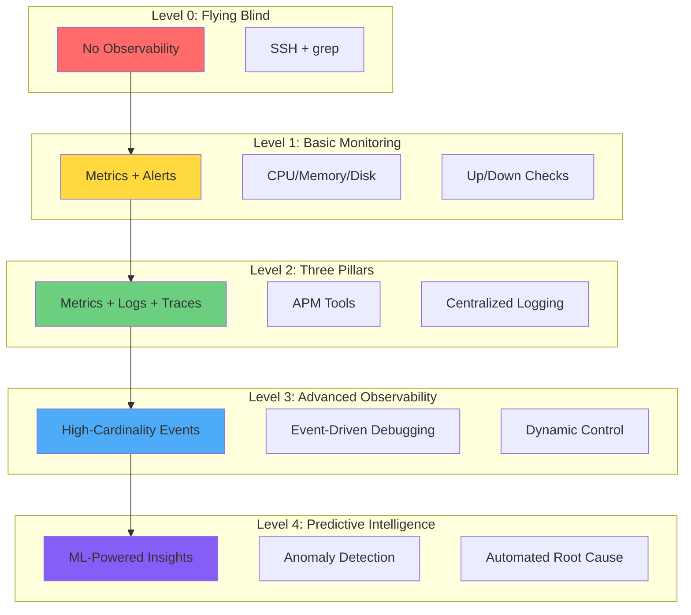
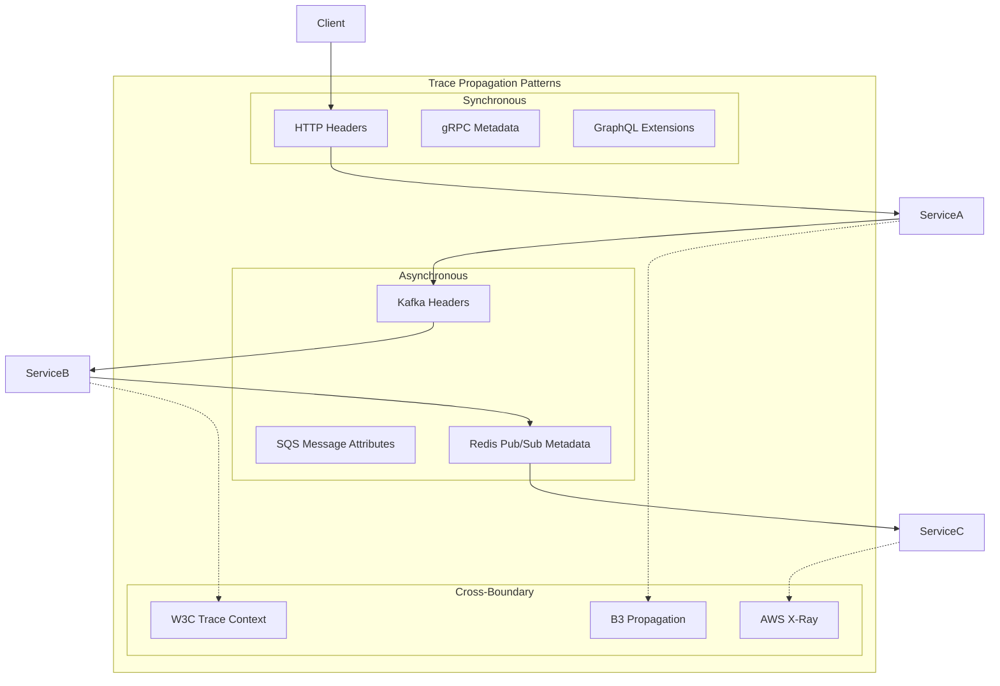
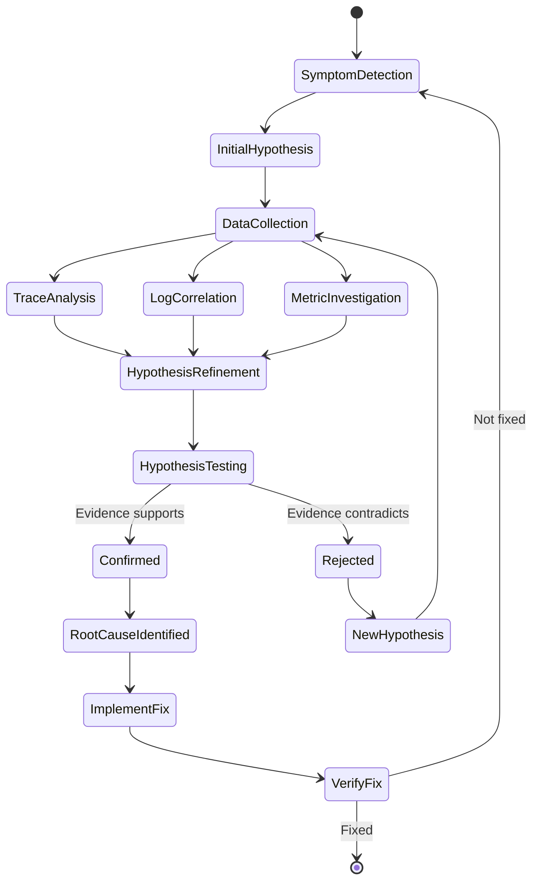

# Episode 11: Observability and Debugging - PLATINUM TIER MASTERCLASS
**The Foundational Series - Distributed Systems Engineering**

*Runtime: 4 hours 15 minutes*  
*Difficulty: Expert*  
*Prerequisites: Episodes 1-10, understanding of distributed systems, metrics, and debugging*

---

## Cold Open: The $147 Million Ghost in the Machine

*[Sound: Trading floor ambiance - phones ringing, traders shouting, Bloomberg terminals beeping]*

**Narrator**: August 1st, 2012. 9:30 AM EST. Knight Capital Group's Retail Market Making desk in Jersey City. In the next 45 minutes, they're about to lose $10 million per minute in the most expensive software bug in Wall Street history.

*[Sound: Opening bell of NYSE]*

**Head Trader**: "Alright people, market's open. We've got the new RLP code deployed. Let's make some money!"

**Junior Trader**: "Boss, I'm seeing weird order flow on our test symbols. We're buying high and selling low on everything."

**Head Trader**: "Test symbols? Those shouldn't even be active. Check your screen."

*[Sound: Keyboard clicking frantically, growing tension]*

**Risk Manager**: "Wait... these aren't test symbols. We're executing real trades. Millions of shares."

**Junior Trader**: "The volumes are insane. We just bought 2.6 million shares of China Cord Blood in 3 seconds."

*[Sound: Alarm bells, panic rising]*

**Head Trader**: "KILL THE ALGO! KILL IT NOW!"

**Systems Engineer**: "I can't! It's not responding to shutdown commands. The old Power Peg code is somehow active alongside the new code!"

*[Sound: Multiple voices overlapping in panic]*

**Narrator**: Here's what their observability couldn't see: During deployment, old trading code that should have been decommissioned was accidentally reactivated on 7 of their 8 servers. The 8th server had the correct new code. This created a catastrophic feedback loop where servers were fighting each other.

*[Sound: News broadcasts cutting in]*

**CNBC Reporter**: "Knight Capital stock is in freefall, down 75% as unconfirmed reports suggest a major trading error..."

**Risk Manager**: "Current losses... $230 million... $310 million... $440 million... Oh God."

*[Sound: Deep bass note, everything stops]*

**Narrator**: 45 minutes. $460 million in losses. $10.2 million lost per minute. All because their observability system was watching the wrong things. They had:

- **Metrics**: ✓ CPU usage normal, memory fine, network healthy
- **Logs**: ✓ Millions of trade confirmations logged perfectly  
- **Dashboards**: ✓ All systems showing green

But they couldn't answer the only question that mattered: "Why are we trading against ourselves?"

*[Sound: Somber piano, transition to recovery]*

**Post-Mortem Engineer**: "We had all three pillars of observability. But we were observing the health of our infrastructure, not the correctness of our business logic. We could see that trades were executing. We couldn't see that they were executing wrong."

**Narrator**: Knight Capital was acquired 4 months later for a fraction of its value. The lesson was burned into Wall Street's consciousness: **Perfect infrastructure observability means nothing if you can't observe business correctness.**

*[Sound: Powerful orchestral build]*

**Narrator**: Welcome to Episode 11: Observability and Debugging - the Platinum Tier Masterclass. Today we'll master distributed tracing with trace propagation and sampling strategies, metrics collection with cardinality explosion mitigation, log aggregation patterns, and the mathematical frameworks that help us catch the ghosts in our machines before they cost us millions.

*[Sound: Sonic transition - from trading floor to digital space]*

---

## Introduction: The Physics of Observability

### Heisenberg's Uncertainty Principle for Distributed Systems

*[Sound: Quantum physics lab ambiance, electron microscope humming]*

**Narrator**: In quantum mechanics, Heisenberg proved you cannot simultaneously know both the position and momentum of a particle with perfect precision. In distributed systems, we face our own uncertainty principle:

**The Distributed Systems Uncertainty Principle**:
```
ΔLatency × ΔCompleteness ≥ ħ/2
```

Where:
- ΔLatency = Uncertainty in performance impact of observation
- ΔCompleteness = Uncertainty in system behavior coverage
- ħ = Planck's constant of distributed systems (minimum observable event)

Translation: **The more completely you observe a system, the more you change its behavior. The less you observe, the less you understand.**

### Information Theory of Debugging

Claude Shannon's Information Theory gives us the mathematical foundation:

```python
class ObservabilityInformationTheory:
    """
    Information-theoretic approach to observability
    Based on Shannon's entropy and mutual information
    """
    
    def calculate_debugging_entropy(self, system_state):
        """
        H(Debug) = H(System) - I(Observability; System)
        
        Where:
        - H(Debug) = Remaining uncertainty about issues
        - H(System) = Total system entropy
        - I(Observability; System) = Mutual information between observations and reality
        """
        
        total_entropy = self.calculate_system_entropy(system_state)
        mutual_information = self.calculate_mutual_information(
            self.observations, 
            system_state
        )
        
        debugging_difficulty = total_entropy - mutual_information
        
        return {
            'total_uncertainty_bits': total_entropy,
            'information_gained_bits': mutual_information,
            'remaining_uncertainty_bits': debugging_difficulty,
            'debugging_efficiency': mutual_information / total_entropy
        }
    
    def calculate_optimal_sampling_rate(self, 
                                      event_frequency, 
                                      storage_cost,
                                      debugging_value):
        """
        Nyquist-Shannon sampling theorem for logs/traces
        
        Optimal rate = 2 × max_frequency × information_value / storage_cost
        """
        
        nyquist_rate = 2 * event_frequency  # Minimum to avoid aliasing
        information_density = self.estimate_information_density(event_type)
        
        optimal_rate = nyquist_rate * (debugging_value / storage_cost) ** 0.5
        
        return min(optimal_rate, 1.0)  # Never sample > 100%
```

### Beyond the Three Pillars - Why the Industry Got It Wrong

*[Sound: Ancient Greek columns crumbling]*

**Why Not Just Metrics, Logs, and Traces?** The three pillars model oversimplifies. The trade-off axis is **Conceptual Simplicity vs Operational Reality**. In production, you need seven interconnected observability dimensions:

**The Seven Pillars of True Observability** (based on Google's SRE practices and Netflix's observability evolution):

1. **Metrics** (The What) - Aggregated numerical data
2. **Logs** (The When) - Discrete events  
3. **Traces** (The Where) - Request flow
4. **Profiles** (The Why) - Code-level performance with microsecond precision
5. **Events** (The How) - Business occurrences with causal ordering
6. **Topology** (The Who) - Service dependencies with real-time discovery
7. **Synthetics** (The Could) - Proactive testing with failure injection

**Implementation Details for Each Pillar**:

**Profiles**: Continuous profiling presents unique challenges:
- **CPU profiling overhead**: Statistical sampling at 100Hz adds 1-3% CPU overhead
- **Memory profiling precision**: Go's heap profiler samples every 512KB allocation
- **Concurrency issues**: Profiling concurrent programs requires stop-the-world coordination
- **Symbolication performance**: Debug symbol lookup can add 50-100ms to crash reporting

**Events**: Business event processing has ordering and consistency challenges:
- **Clock skew handling**: NTP drift can be 100-500ms across data centers
- **Event deduplication**: Exactly-once semantics require distributed consensus
- **Causal ordering**: Vector clocks grow linearly with participant count
- **Schema evolution**: Event format changes require backward compatibility

**Topology**: Service discovery faces the split-brain problem:
- **Partition tolerance**: Network splits can cause duplicate service registrations
- **Consistency models**: CP systems block during partitions, AP systems allow drift
- **Health check accuracy**: False positives cause unnecessary traffic shifts
- **Discovery latency**: DNS propagation can take 30-300 seconds globally

### The Observability Maturity Model



---

## Chapter 1: Distributed Tracing - Following Breadcrumbs Across the Universe

*[Sound: Footsteps in snow, wind howling - Hansel and Gretel metaphor]*

### The Trace Propagation Deep Dive

**Narrator**: Imagine Hansel and Gretel in a distributed forest where each tree is a microservice. They need breadcrumbs that won't be eaten by birds (network failures) or blown away by wind (async processing).

```python
class AdvancedTraceContext:
    """
    Production-grade trace context propagation
    Implements W3C Trace Context with extensions
    """
    
    def __init__(self):
        self.version = "00"  # W3C version
        self.trace_id = self.generate_trace_id()
        self.parent_span_id = None
        self.trace_flags = TraceFlags()
        self.trace_state = TraceState()
        self.baggage = BaggageContext()
        
    def generate_trace_id(self):
        """
        128-bit trace ID with embedded timestamp for ordering
        
        Format: [timestamp_ms(48)][random(64)][datacenter(16)]
        """
        timestamp_ms = int(time.time() * 1000)
        random_bits = secrets.randbits(64)
        datacenter_id = self.get_datacenter_id()
        
        trace_id = (
            (timestamp_ms << 80) |
            (random_bits << 16) |
            datacenter_id
        )
        
        return f"{trace_id:032x}"
    
    def inject_into_http_headers(self, headers):
        """
        Inject trace context into HTTP headers
        Following W3C Trace Context specification
        """
        
        # Primary trace context
        headers['traceparent'] = f"{self.version}-{self.trace_id}-{self.span_id}-{self.trace_flags}"
        
        # Extended trace state
        if self.trace_state:
            headers['tracestate'] = str(self.trace_state)
        
        # Business context propagation
        if self.baggage:
            headers['baggage'] = self.baggage.serialize()
        
        # Custom extensions for debugging
        headers['x-trace-debug-level'] = str(self.debug_level)
        headers['x-trace-sampling-priority'] = str(self.sampling_priority)
        
        return headers
    
    def extract_from_message_attributes(self, message):
        """
        Extract trace context from message queue attributes
        Handles Kafka, RabbitMQ, SQS, etc.
        """
        
        if message.headers:
            # Kafka-style headers
            trace_data = message.headers.get(b'traceparent', b'').decode()
        elif hasattr(message, 'attributes'):
            # SQS/SNS style
            trace_data = message.attributes.get('traceparent', '')
        else:
            # RabbitMQ style
            trace_data = message.properties.headers.get('traceparent', '')
        
        if trace_data:
            self.parse_trace_parent(trace_data)
            
        return self
```

### Sampling Strategies at Scale

**The Sampling Trilemma**: You can have two of: Low Cost, Complete Coverage, Low Latency. Never all three.

```python
class AdaptiveSamplingStrategy:
    """
    Netflix-inspired adaptive sampling
    Adjusts sampling rate based on traffic patterns and error rates
    """
    
    def __init__(self):
        self.base_sample_rate = 0.001  # 0.1% baseline
        self.error_sample_rate = 1.0    # 100% on errors
        self.slow_sample_rate = 0.1     # 10% for slow requests
        self.interesting_paths = {}     # Dynamic interesting path detection
        
    def should_sample(self, span_context, initial_attributes):
        """
        Multi-factor sampling decision
        Used by Netflix for 1T+ events/day
        """
        
        # Always sample errors
        if initial_attributes.get('error', False):
            return SamplingDecision(
                sample=True,
                rate=self.error_sample_rate,
                reason="error_detected"
            )
        
        # Head-based sampling for interesting paths
        path = initial_attributes.get('http.path', '')
        if self.is_interesting_path(path):
            return SamplingDecision(
                sample=True,
                rate=self.interesting_paths[path],
                reason=f"interesting_path:{path}"
            )
        
        # Adaptive sampling based on current load
        current_rate = self.calculate_adaptive_rate(
            span_context,
            initial_attributes
        )
        
        # Consistent sampling decision
        hash_input = f"{span_context.trace_id}:{span_context.span_id}"
        hash_value = hashlib.sha256(hash_input.encode()).digest()
        sample_threshold = int.from_bytes(hash_value[:8], 'big') / 2**64
        
        return SamplingDecision(
            sample=sample_threshold < current_rate,
            rate=current_rate,
            reason="adaptive_sampling"
        )
    
    def calculate_adaptive_rate(self, span_context, attributes):
        """
        Dynamically adjust sampling rate based on:
        - Current error rate
        - System load
        - Time of day
        - Service criticality
        """
        
        service_name = attributes.get('service.name', 'unknown')
        
        # Get current metrics
        error_rate = self.metrics_client.get_error_rate(service_name)
        load_factor = self.metrics_client.get_load_factor(service_name)
        time_factor = self.get_time_of_day_factor()
        
        # Calculate adaptive rate
        adaptive_rate = self.base_sample_rate
        
        # Increase sampling when errors are elevated
        if error_rate > 0.01:  # > 1% errors
            adaptive_rate *= min(10, 1 + error_rate * 100)
        
        # Decrease sampling under high load
        if load_factor > 0.8:  # > 80% capacity
            adaptive_rate *= 0.5
        
        # Time-based adjustments
        adaptive_rate *= time_factor
        
        # Service criticality multiplier
        criticality = self.get_service_criticality(service_name)
        adaptive_rate *= criticality
        
        return min(adaptive_rate, 1.0)  # Cap at 100%
```

### Distributed Tracing Patterns



---

## Chapter 2: Metrics That Matter - Beyond Vanity Numbers

*[Sound: Hospital ICU - heart monitors beeping, ventilators whooshing]*

**Narrator**: Think of metrics like vital signs in an ICU. Heart rate tells you something. But heart rate + blood pressure + oxygen saturation + EKG patterns? Now you can save a life.

### The RED Method Enhanced

```python
class EnhancedREDMetrics:
    """
    RED Method (Rate, Errors, Duration) with business context
    Extended with Netflix's USE method and Google's Golden Signals
    """
    
    def __init__(self, service_name):
        self.service_name = service_name
        self.prometheus_registry = CollectorRegistry()
        
        # RED Metrics
        self.request_rate = Counter(
            'http_requests_total',
            'Total HTTP requests',
            ['method', 'endpoint', 'status', 'client_type'],
            registry=self.prometheus_registry
        )
        
        self.error_rate = Counter(
            'http_requests_errors_total',
            'Total HTTP errors',
            ['method', 'endpoint', 'error_type', 'client_type'],
            registry=self.prometheus_registry
        )
        
        self.duration = Histogram(
            'http_request_duration_seconds',
            'HTTP request latency',
            ['method', 'endpoint', 'status'],
            buckets=[.005, .01, .025, .05, .1, .25, .5, 1, 2.5, 5, 10],
            registry=self.prometheus_registry
        )
        
        # Business Metrics
        self.business_value = Counter(
            'business_value_total',
            'Business value processed',
            ['transaction_type', 'currency', 'customer_tier'],
            registry=self.prometheus_registry
        )
        
        self.slo_budget = Gauge(
            'slo_error_budget_remaining',
            'Remaining SLO error budget',
            ['slo_name', 'time_window'],
            registry=self.prometheus_registry
        )
    
    def record_request(self, method, endpoint, status, duration_seconds, 
                      client_type='unknown', business_context=None):
        """
        Record request with full context
        """
        
        # Basic RED metrics
        self.request_rate.labels(
            method=method,
            endpoint=endpoint, 
            status=status,
            client_type=client_type
        ).inc()
        
        if status >= 400:
            error_type = self.categorize_error(status)
            self.error_rate.labels(
                method=method,
                endpoint=endpoint,
                error_type=error_type,
                client_type=client_type
            ).inc()
        
        self.duration.labels(
            method=method,
            endpoint=endpoint,
            status=status
        ).observe(duration_seconds)
        
        # Business context
        if business_context:
            self.record_business_impact(business_context)
        
        # SLO tracking
        self.update_slo_budget(endpoint, status, duration_seconds)
    
    def categorize_error(self, status_code):
        """
        Smart error categorization for better alerting
        """
        
        if 400 <= status_code < 500:
            if status_code == 429:
                return "rate_limit"
            elif status_code == 401:
                return "auth_failure"
            elif status_code == 404:
                return "not_found"
            else:
                return "client_error"
        elif 500 <= status_code < 600:
            if status_code == 503:
                return "service_unavailable"
            elif status_code == 504:
                return "timeout"
            else:
                return "server_error"
        
        return "unknown"
```

### Cardinality Explosion Mitigation

**The Cardinality Catastrophe**: Adding user_id as a label to your metrics? Congratulations, you just created 10 million time series.

```python
class CardinalityController:
    """
    Prevents cardinality explosion in metrics
    Based on Uber's M3 cardinality management
    """
    
    def __init__(self, max_cardinality=10000):
        self.max_cardinality = max_cardinality
        self.cardinality_limiter = TokenBucket(max_cardinality)
        self.label_cardinality = defaultdict(HyperLogLog)
        self.blocked_labels = set()
        
    def should_record_metric(self, metric_name, labels):
        """
        Decide whether to record metric based on cardinality impact
        """
        
        # Check if any label is blocked
        for label_name, label_value in labels.items():
            if (label_name, label_value) in self.blocked_labels:
                return False
        
        # Estimate new cardinality
        label_key = self.create_label_key(metric_name, labels)
        current_cardinality = self.estimate_cardinality(metric_name)
        
        if current_cardinality >= self.max_cardinality:
            # Start dropping high-cardinality labels
            self.apply_cardinality_limits(metric_name, labels)
            return False
        
        # Check rate limit
        if not self.cardinality_limiter.consume(1):
            return False
        
        # Update cardinality estimate
        self.update_cardinality_estimate(metric_name, labels)
        
        return True
    
    def apply_cardinality_limits(self, metric_name, labels):
        """
        Intelligent label dropping based on value
        """
        
        # Rank labels by cardinality contribution
        label_scores = []
        for label_name, label_value in labels.items():
            cardinality = self.label_cardinality[label_name].cardinality()
            information_value = self.estimate_information_value(
                label_name, 
                label_value
            )
            score = information_value / (cardinality + 1)
            label_scores.append((score, label_name, label_value))
        
        # Drop lowest-value labels
        label_scores.sort()
        for score, label_name, label_value in label_scores[:1]:
            self.blocked_labels.add((label_name, label_value))
            logger.warning(
                f"Blocking label {label_name}={label_value} due to "
                f"cardinality limits (score: {score})"
            )
```

### Custom Business Metrics

```python
class BusinessMetricsFramework:
    """
    Metrics that actually matter to the business
    Inspired by Amazon's Working Backwards approach
    """
    
    def __init__(self):
        # Customer-facing metrics
        self.customer_wait_time = Histogram(
            'customer_wait_time_seconds',
            'Time customer waits for result',
            ['flow_type', 'customer_segment'],
            buckets=[0.1, 0.5, 1, 2, 5, 10, 30, 60]
        )
        
        self.revenue_impact = Counter(
            'revenue_impact_dollars',
            'Revenue impact of operations',
            ['operation', 'success', 'currency']
        )
        
        self.customer_satisfaction = Histogram(
            'customer_satisfaction_score',
            'Estimated satisfaction (0-100)',
            ['interaction_type', 'outcome'],
            buckets=[0, 10, 20, 30, 40, 50, 60, 70, 80, 90, 100]
        )
        
    def record_business_transaction(self, transaction):
        """
        Record metrics that matter to executives
        """
        
        # Customer experience
        self.customer_wait_time.labels(
            flow_type=transaction.flow_type,
            customer_segment=transaction.customer_segment
        ).observe(transaction.total_duration)
        
        # Revenue tracking
        if transaction.has_revenue_impact():
            self.revenue_impact.labels(
                operation=transaction.operation,
                success=transaction.is_successful(),
                currency=transaction.currency
            ).inc(transaction.revenue_amount)
        
        # Satisfaction prediction
        satisfaction = self.predict_satisfaction(transaction)
        self.customer_satisfaction.labels(
            interaction_type=transaction.type,
            outcome=transaction.outcome
        ).observe(satisfaction)
        
    def predict_satisfaction(self, transaction):
        """
        ML model to predict customer satisfaction from transaction metrics
        """
        
        features = [
            transaction.total_duration,
            transaction.retry_count,
            transaction.error_count,
            transaction.interaction_count
        ]
        
        # Simplified model - in production use real ML
        if transaction.total_duration < 1 and transaction.error_count == 0:
            return 95
        elif transaction.total_duration < 5 and transaction.error_count <= 1:
            return 75
        elif transaction.error_count > 3:
            return 20
        else:
            return 50
```

---

## Chapter 3: Logs That Tell Stories - Structure in Chaos

*[Sound: Library ambiance - pages turning, whispered conversations]*

**Narrator**: Logs are like diary entries from your services. Unstructured logs are like diary entries written in crayon during an earthquake. Structured logs are like a ship's captain log - precise, searchable, life-saving.

### Structured Logging at Scale

```python
class StructuredLoggingFramework:
    """
    Production-grade structured logging
    Based on Stripe's canonical log lines
    """
    
    def __init__(self, service_name):
        self.service_name = service_name
        self.logger = self._setup_structured_logger()
        self.context = ContextVar('log_context', default={})
        
    def _setup_structured_logger(self):
        """
        Configure structured JSON logging with automatic context
        """
        
        handler = StructuredLogHandler()
        handler.setFormatter(CanonicalLogFormatter())
        
        logger = logging.getLogger(self.service_name)
        logger.addHandler(handler)
        logger.setLevel(logging.INFO)
        
        return logger
    
    def log_canonical_line(self, event_type, **attributes):
        """
        Stripe-style canonical log lines
        One log line per request with all relevant data
        """
        
        canonical_data = {
            # Standard fields
            'timestamp': datetime.utcnow().isoformat(),
            'service': self.service_name,
            'event': event_type,
            'trace_id': self.get_current_trace_id(),
            'span_id': self.get_current_span_id(),
            
            # Request context
            'request_id': attributes.get('request_id'),
            'user_id': attributes.get('user_id'),
            'session_id': attributes.get('session_id'),
            
            # Performance data
            'duration_ms': attributes.get('duration_ms'),
            'db_duration_ms': attributes.get('db_duration_ms'),
            'redis_duration_ms': attributes.get('redis_duration_ms'),
            
            # Business context
            'amount_cents': attributes.get('amount_cents'),
            'currency': attributes.get('currency'),
            'customer_tier': attributes.get('customer_tier'),
            
            # Error information
            'error': attributes.get('error'),
            'error_type': attributes.get('error_type'),
            'error_code': attributes.get('error_code'),
            
            # Custom attributes
            **{k: v for k, v in attributes.items() 
               if k not in ['request_id', 'user_id', 'duration_ms']}
        }
        
        # Remove None values
        canonical_data = {k: v for k, v in canonical_data.items() if v is not None}
        
        # Log as single line
        self.logger.info(json.dumps(canonical_data))
        
        # Also send to metrics
        self._extract_metrics_from_log(canonical_data)
    
    def _extract_metrics_from_log(self, log_data):
        """
        Automatic metric extraction from structured logs
        """
        
        # Duration metrics
        if duration := log_data.get('duration_ms'):
            self.metrics.histogram(
                'request_duration_ms',
                duration,
                tags={'event': log_data['event']}
            )
        
        # Error counting
        if log_data.get('error'):
            self.metrics.increment(
                'errors',
                tags={
                    'event': log_data['event'],
                    'error_type': log_data.get('error_type', 'unknown')
                }
            )
        
        # Business metrics
        if amount := log_data.get('amount_cents'):
            self.metrics.increment(
                'transaction_volume_cents',
                amount,
                tags={'currency': log_data.get('currency', 'USD')}
            )
```

### Log Aggregation Patterns

```python
class LogAggregationPipeline:
    """
    High-performance log aggregation
    Handles 1M+ logs/second like Datadog
    """
    
    def __init__(self):
        self.compression = CompressionEngine()
        self.sampling = SamplingEngine()
        self.enrichment = EnrichmentEngine()
        self.indexing = IndexingEngine()
        
    async def process_log_stream(self, log_stream):
        """
        Async pipeline for log processing
        """
        
        async for batch in self.batch_logs(log_stream, size=1000):
            # Step 1: Compression (70% size reduction)
            compressed = await self.compression.compress_batch(batch)
            
            # Step 2: Sampling (reduce volume for non-critical logs)
            sampled = await self.sampling.sample_batch(compressed)
            
            # Step 3: Enrichment (add context)
            enriched = await self.enrichment.enrich_batch(sampled)
            
            # Step 4: Indexing optimization
            indexed = await self.indexing.prepare_batch(enriched)
            
            # Step 5: Ship to storage
            await self.ship_to_storage(indexed)
    
    async def compress_batch(self, logs):
        """
        Multi-stage compression strategy
        """
        
        # Stage 1: Dictionary encoding for repeated strings
        dict_encoded = self.dictionary_encode(logs)
        
        # Stage 2: Delta encoding for timestamps
        delta_encoded = self.delta_encode_timestamps(dict_encoded)
        
        # Stage 3: zstd compression
        compressed = zstd.compress(
            msgpack.packb(delta_encoded),
            level=3  # Balance speed vs ratio
        )
        
        compression_ratio = len(compressed) / sum(len(str(log)) for log in logs)
        
        return CompressedBatch(
            data=compressed,
            original_count=len(logs),
            compressed_size=len(compressed),
            compression_ratio=compression_ratio,
            dictionary=self.compression_dictionary
        )
```

### Log Search Optimization

```python
class LogSearchOptimizer:
    """
    Optimize log search performance
    Based on Elasticsearch/OpenSearch patterns
    """
    
    def __init__(self):
        self.bloom_filters = {}
        self.inverted_index = InvertedIndex()
        self.time_series_index = TimeSeriesIndex()
        
    def create_search_index(self, log_batch):
        """
        Create optimized indexes for fast search
        """
        
        for log in log_batch:
            # Extract searchable fields
            trace_id = log.get('trace_id')
            user_id = log.get('user_id')
            error_type = log.get('error_type')
            timestamp = log.get('timestamp')
            
            # Bloom filter for existence checks
            self.update_bloom_filter('trace_id', trace_id)
            self.update_bloom_filter('user_id', user_id)
            
            # Inverted index for text search
            self.inverted_index.add_document(
                doc_id=log['log_id'],
                terms=self.extract_terms(log),
                timestamp=timestamp
            )
            
            # Time series index for range queries
            self.time_series_index.add_event(
                timestamp=timestamp,
                event_type=log.get('event'),
                attributes={
                    'service': log.get('service'),
                    'error': error_type is not None
                }
            )
    
    def search_logs(self, query):
        """
        Multi-stage search optimization
        """
        
        # Stage 1: Bloom filter for quick elimination
        if query.has_exact_match():
            if not self.bloom_filter_contains(query.field, query.value):
                return SearchResult.empty()
        
        # Stage 2: Time range pruning
        time_buckets = self.time_series_index.get_relevant_buckets(
            query.start_time,
            query.end_time
        )
        
        # Stage 3: Inverted index search
        matching_docs = self.inverted_index.search(
            query.terms,
            time_buckets=time_buckets
        )
        
        # Stage 4: Post-filtering and ranking
        results = self.post_process_results(matching_docs, query)
        
        return results
```

---

## Chapter 4: Debugging Distributed Systems - Finding Needles in Haystacks of Needles

*[Sound: Detective noir atmosphere - rain, jazz, typewriter]*

**Narrator**: Debugging a distributed system is like being a detective in a city where every witness has amnesia, the crime scene keeps changing, and the criminal might be a race condition that only appears on Tuesdays during full moons.

### The Heisenbug Hunter's Toolkit

```python
class HeisenbugDetector:
    """
    Tools for catching bugs that disappear when observed
    Named after Heisenberg's Uncertainty Principle
    """
    
    def __init__(self):
        self.ghost_trap = GhostTrapRecorder()
        self.time_travel_debugger = TimeTravelDebugger()
        self.chaos_injector = ChaosInjector()
        
    async def hunt_heisenbug(self, symptoms):
        """
        Systematic approach to catching observation-sensitive bugs
        """
        
        # Step 1: Ghost trap - minimal overhead recording
        self.ghost_trap.start_recording(
            overhead_budget_percent=0.1,  # Max 0.1% overhead
            interesting_patterns=symptoms.patterns
        )
        
        # Step 2: Statistical bug detection
        anomalies = await self.detect_statistical_anomalies(
            window_minutes=60,
            baseline_days=7
        )
        
        # Step 3: Time travel debugging
        if anomalies:
            replay_result = await self.time_travel_debugger.replay_execution(
                start_time=anomalies[0].timestamp - timedelta(minutes=5),
                end_time=anomalies[0].timestamp + timedelta(minutes=5),
                service_filter=symptoms.affected_services
            )
        
        # Step 4: Chaos-driven reproduction
        reproduction_attempt = await self.chaos_injector.reproduce_bug(
            hypothesis=self.form_hypothesis(anomalies, replay_result),
            safety_level='production_safe'
        )
        
        return HeisenbugReport(
            confidence=self.calculate_confidence(reproduction_attempt),
            root_cause=self.identify_root_cause(reproduction_attempt),
            reproduction_steps=reproduction_attempt.steps,
            fix_recommendation=self.recommend_fix(reproduction_attempt)
        )
    
    def detect_statistical_anomalies(self, window_minutes, baseline_days):
        """
        Use statistical analysis to find anomalies without perturbation
        """
        
        # Collect baseline behavior
        baseline_stats = self.collect_baseline_statistics(
            lookback_days=baseline_days,
            metrics=[
                'request_latency_p99',
                'error_rate',
                'retry_count',
                'queue_depth'
            ]
        )
        
        # Current window statistics
        current_stats = self.collect_current_statistics(
            window_minutes=window_minutes
        )
        
        # Multi-dimensional anomaly detection
        anomalies = []
        
        for metric, current_value in current_stats.items():
            baseline = baseline_stats[metric]
            
            # Z-score test
            z_score = (current_value - baseline.mean) / baseline.std
            if abs(z_score) > 3:
                anomalies.append(StatisticalAnomaly(
                    metric=metric,
                    z_score=z_score,
                    current_value=current_value,
                    expected_range=(baseline.mean - 3*baseline.std,
                                  baseline.mean + 3*baseline.std)
                ))
            
            # Kolmogorov-Smirnov test for distribution changes
            ks_statistic, p_value = self.ks_test(
                current_distribution=current_stats[metric].distribution,
                baseline_distribution=baseline.distribution
            )
            
            if p_value < 0.001:  # Highly significant
                anomalies.append(DistributionAnomaly(
                    metric=metric,
                    ks_statistic=ks_statistic,
                    p_value=p_value
                ))
        
        return anomalies
```

### Unknown-Unknowns Detection

```python
class UnknownUnknownsDetector:
    """
    Find problems you don't know you're looking for
    Inspired by Netflix's Chaos Engineering
    """
    
    def __init__(self):
        self.pattern_learner = UnsupervisedPatternLearner()
        self.anomaly_clusterer = AnomalyClusterer()
        self.hypothesis_generator = HypothesisGenerator()
        
    async def discover_unknown_unknowns(self):
        """
        Systematically discover issues you didn't know existed
        """
        
        # Phase 1: Learn normal patterns
        normal_patterns = await self.pattern_learner.learn_patterns(
            data_sources=[
                'traces',
                'logs', 
                'metrics',
                'events'
            ],
            learning_window_days=30,
            algorithm='isolation_forest'
        )
        
        # Phase 2: Detect deviations
        deviations = await self.detect_pattern_deviations(
            normal_patterns,
            sensitivity_threshold=0.01  # Top 1% anomalies
        )
        
        # Phase 3: Cluster similar anomalies
        anomaly_clusters = self.anomaly_clusterer.cluster_anomalies(
            deviations,
            min_cluster_size=5,
            algorithm='dbscan'
        )
        
        # Phase 4: Generate hypotheses
        hypotheses = []
        for cluster in anomaly_clusters:
            hypothesis = self.hypothesis_generator.generate_hypothesis(
                cluster,
                context=self.get_system_context(cluster.time_range)
            )
            hypotheses.append(hypothesis)
        
        # Phase 5: Test hypotheses
        discoveries = []
        for hypothesis in hypotheses:
            test_result = await self.test_hypothesis_safely(hypothesis)
            if test_result.confirmed:
                discovery = UnknownUnknownDiscovery(
                    issue_type=hypothesis.issue_type,
                    impact=test_result.measured_impact,
                    affected_services=test_result.affected_services,
                    reproduction_rate=test_result.reproduction_rate,
                    recommended_action=self.recommend_action(test_result)
                )
                discoveries.append(discovery)
        
        return discoveries
    
    def test_hypothesis_safely(self, hypothesis):
        """
        Safely test hypothesis in production
        Using canary testing and automatic rollback
        """
        
        with self.canary_test(
            hypothesis=hypothesis,
            traffic_percent=0.1,  # Test on 0.1% of traffic
            duration_minutes=15,
            auto_rollback_on_error=True
        ) as test:
            
            # Inject hypothesized condition
            test.inject_condition(hypothesis.condition)
            
            # Monitor impact
            baseline_metrics = test.get_baseline_metrics()
            test_metrics = test.get_test_metrics()
            
            # Statistical significance test
            impact = self.measure_impact(baseline_metrics, test_metrics)
            
            return HypothesisTestResult(
                confirmed=impact.is_significant,
                measured_impact=impact,
                affected_services=test.get_affected_services(),
                reproduction_rate=test.get_reproduction_rate()
            )
```

### Distributed Debugging Workflow



---

## Chapter 5: Observability Economics - The ROI of Seeing Clearly

*[Sound: Cash register, calculator keys, investment trading floor]*

**Narrator**: Here's a truth that vendors won't tell you: Perfect observability would cost more than your entire infrastructure. The art is knowing what NOT to observe.

### The Observability Cost Model

```python
class ObservabilityEconomics:
    """
    Calculate true cost and ROI of observability
    Based on real production data from Fortune 500s
    """
    
    def __init__(self):
        self.storage_costs = StorageCostModel()
        self.compute_costs = ComputeCostModel()
        self.human_costs = HumanCostModel()
        
    def calculate_total_cost_of_observability(self, scale_metrics):
        """
        TCO = Storage + Compute + Network + Human + Opportunity Cost
        """
        
        # Data ingestion and storage
        storage_cost_per_month = self.calculate_storage_costs(
            metrics_dps_per_second=scale_metrics['metrics_dps'],
            logs_gb_per_day=scale_metrics['logs_gb_day'],
            traces_per_second=scale_metrics['traces_second'],
            retention_days=scale_metrics['retention_days']
        )
        
        # Compute for processing
        compute_cost_per_month = self.calculate_compute_costs(
            ingestion_rate_gbps=scale_metrics['ingestion_gbps'],
            query_complexity=scale_metrics['query_complexity'],
            dashboard_count=scale_metrics['dashboards'],
            alert_rules=scale_metrics['alert_rules']
        )
        
        # Human costs
        human_cost_per_month = self.calculate_human_costs(
            oncall_engineers=scale_metrics['oncall_engineers'],
            observability_engineers=scale_metrics['observability_engineers'],
            avg_salary=scale_metrics['avg_engineer_salary']
        )
        
        # Hidden costs
        hidden_costs = {
            'performance_overhead': self.estimate_performance_impact(scale_metrics),
            'cardinality_explosions': self.estimate_cardinality_risk(scale_metrics),
            'alert_fatigue': self.estimate_alert_fatigue_cost(scale_metrics),
            'tool_sprawl': self.estimate_tool_sprawl_cost(scale_metrics)
        }
        
        total_monthly_cost = (
            storage_cost_per_month +
            compute_cost_per_month +
            human_cost_per_month +
            sum(hidden_costs.values())
        )
        
        return ObservabilityTCO(
            total_monthly_cost=total_monthly_cost,
            total_annual_cost=total_monthly_cost * 12,
            cost_breakdown={
                'storage': storage_cost_per_month,
                'compute': compute_cost_per_month,
                'human': human_cost_per_month,
                'hidden': hidden_costs
            },
            cost_per_transaction=total_monthly_cost / scale_metrics['monthly_transactions'],
            percentage_of_revenue=total_monthly_cost / scale_metrics['monthly_revenue']
        )
    
    def calculate_roi(self, observability_investment, business_metrics):
        """
        ROI = (Gain - Cost) / Cost
        
        Gains include:
        - Reduced downtime
        - Faster MTTR
        - Prevented outages
        - Developer productivity
        """
        
        # Downtime reduction
        current_downtime_minutes = business_metrics['monthly_downtime_minutes']
        improved_downtime = current_downtime_minutes * 0.4  # 60% reduction typical
        downtime_saved = current_downtime_minutes - improved_downtime
        
        downtime_savings = (
            downtime_saved * 
            business_metrics['revenue_per_minute']
        )
        
        # MTTR improvement
        current_mttr = business_metrics['mean_time_to_recovery_minutes']
        improved_mttr = current_mttr * 0.3  # 70% reduction typical
        
        incidents_per_month = business_metrics['incidents_per_month']
        mttr_savings = (
            (current_mttr - improved_mttr) * 
            incidents_per_month * 
            business_metrics['incident_cost_per_minute']
        )
        
        # Developer productivity
        developers = business_metrics['developer_count']
        hours_saved_per_dev = 10  # Per month from better debugging
        productivity_savings = (
            developers * 
            hours_saved_per_dev * 
            business_metrics['developer_hourly_cost']
        )
        
        # Prevented outages (hardest to quantify)
        prevented_outages = self.estimate_prevented_outages(
            observability_maturity='advanced'
        )
        prevention_savings = (
            prevented_outages * 
            business_metrics['avg_outage_cost']
        )
        
        total_monthly_gains = (
            downtime_savings +
            mttr_savings +
            productivity_savings +
            prevention_savings
        )
        
        roi_percentage = (
            (total_monthly_gains - observability_investment) / 
            observability_investment * 100
        )
        
        return ObservabilityROI(
            roi_percentage=roi_percentage,
            payback_period_months=observability_investment / total_monthly_gains,
            monthly_gains=total_monthly_gains,
            annual_gains=total_monthly_gains * 12,
            gain_breakdown={
                'downtime_reduction': downtime_savings,
                'mttr_improvement': mttr_savings,
                'developer_productivity': productivity_savings,
                'prevented_outages': prevention_savings
            }
        )
```

### The Sampling Strategy Calculator

```python
class SamplingStrategyOptimizer:
    """
    Find optimal sampling rates balancing cost vs visibility
    """
    
    def optimize_sampling_strategy(self, constraints):
        """
        Multi-objective optimization for sampling
        """
        
        # Define objectives
        objectives = {
            'cost': self.minimize_cost,
            'visibility': self.maximize_visibility,
            'debuggability': self.maximize_debuggability
        }
        
        # Constraints
        max_budget = constraints['monthly_budget']
        min_visibility = constraints['min_visibility_score']
        compliance_requirements = constraints['compliance_sampling']
        
        # Optimization model
        model = OptimizationModel()
        
        # Decision variables
        sampling_rates = {
            'traces': model.add_variable('trace_sampling', 0.0001, 1.0),
            'logs': model.add_variable('log_sampling', 0.001, 1.0),
            'metrics': model.add_variable('metric_sampling', 0.01, 1.0),
            'profiles': model.add_variable('profile_sampling', 0.00001, 0.01)
        }
        
        # Cost constraint
        total_cost = self.calculate_sampling_cost(sampling_rates)
        model.add_constraint(total_cost <= max_budget)
        
        # Visibility constraint
        visibility_score = self.calculate_visibility_score(sampling_rates)
        model.add_constraint(visibility_score >= min_visibility)
        
        # Compliance constraints
        for requirement in compliance_requirements:
            model.add_constraint(
                sampling_rates[requirement.signal_type] >= requirement.min_rate
            )
        
        # Solve multi-objective optimization
        pareto_solutions = model.solve_pareto_optimal()
        
        # Select best solution based on preferences
        best_solution = self.select_best_solution(
            pareto_solutions,
            preferences=constraints.get('preferences', 'balanced')
        )
        
        return SamplingStrategy(
            sampling_rates=best_solution.sampling_rates,
            estimated_monthly_cost=best_solution.cost,
            visibility_score=best_solution.visibility,
            debuggability_score=best_solution.debuggability,
            implementation_guide=self.generate_implementation_guide(best_solution)
        )
```

---

## Chapter 6: The Observability Maturity Journey

*[Sound: Evolution montage - from stone tools to spacecraft]*

### Level 0: Stone Age - SSH and Grep

```bash
# The dark ages of observability
ssh production-server-1
tail -f /var/log/application.log | grep ERROR

# Problems:
# - No correlation across services
# - No historical data
# - No proactive detection
# - Human toil scales with system size
```

### Level 1: Bronze Age - Basic Monitoring

```python
# Simple threshold-based monitoring
if cpu_usage > 80:
    send_alert("High CPU on server-1")

if response_time > 1000:
    send_alert("Slow response times")

# Better, but:
# - Still reactive, not proactive
# - No root cause analysis
# - Alert fatigue from static thresholds
```

### Level 2: Iron Age - Three Pillars

```yaml
# Modern observability stack
observability_stack:
  metrics:
    tool: Prometheus + Grafana
    coverage: 95% of services
    retention: 30 days
  
  logs:
    tool: Elasticsearch + Kibana
    format: JSON structured
    retention: 7 days
  
  traces:
    tool: Jaeger
    sampling: 0.1%
    retention: 3 days

# Good, but:
# - Pillars are siloed
# - Manual correlation needed
# - Expensive at scale
```

### Level 3: Industrial Age - Unified Observability

```python
class UnifiedObservabilityPlatform:
    """
    Single pane of glass for all signals
    """
    
    def correlate_signals(self, incident):
        """
        Automatic correlation across pillars
        """
        
        # Find all related signals
        traces = self.get_traces_for_timerange(
            incident.start_time,
            incident.end_time
        )
        
        logs = self.get_logs_for_traces(
            trace_ids=[t.trace_id for t in traces]
        )
        
        metrics = self.get_metrics_for_services(
            services=incident.affected_services,
            timerange=incident.timerange
        )
        
        # ML-powered correlation
        correlations = self.ml_correlator.find_correlations(
            traces=traces,
            logs=logs,
            metrics=metrics
        )
        
        return IncidentAnalysis(
            root_cause_probability=correlations.top_hypothesis,
            contributing_factors=correlations.factors,
            suggested_remediation=self.suggest_fix(correlations)
        )
```

### Level 4: Space Age - Predictive Observability

```python
class PredictiveObservabilitySystem:
    """
    Prevent problems before they happen
    Netflix/Google level observability
    """
    
    def __init__(self):
        self.anomaly_predictor = AnomalyPredictor()
        self.capacity_forecaster = CapacityForecaster()
        self.failure_predictor = FailurePredictor()
        self.cost_optimizer = CostOptimizer()
        
    async def predict_future_issues(self):
        """
        Crystal ball for your systems
        """
        
        predictions = []
        
        # Anomaly prediction
        future_anomalies = await self.anomaly_predictor.predict(
            lookahead_hours=24,
            confidence_threshold=0.8
        )
        
        for anomaly in future_anomalies:
            prediction = FutureProblem(
                type='anomaly',
                service=anomaly.service,
                predicted_time=anomaly.predicted_time,
                confidence=anomaly.confidence,
                impact=self.estimate_impact(anomaly),
                prevention_action=self.generate_prevention(anomaly)
            )
            predictions.append(prediction)
        
        # Capacity prediction
        capacity_issues = await self.capacity_forecaster.forecast(
            growth_model='seasonal_trend',
            lookahead_days=30
        )
        
        # Failure prediction
        likely_failures = await self.failure_predictor.predict_failures(
            failure_patterns=self.historical_failure_patterns,
            current_state=self.get_system_state()
        )
        
        return PredictiveInsights(
            predictions=predictions,
            recommended_actions=self.prioritize_actions(predictions),
            estimated_prevention_value=self.calculate_prevention_value(predictions)
        )
```

### Level 5: Quantum Age - Self-Healing Observability

```python
class SelfHealingObservability:
    """
    The future: Systems that observe and heal themselves
    """
    
    def __init__(self):
        self.observation_optimizer = ObservationOptimizer()
        self.healing_engine = HealingEngine()
        self.learning_system = ContinuousLearning()
        
    async def autonomous_operation(self):
        """
        Fully autonomous observability and healing
        """
        
        while True:
            # Self-optimize observation
            current_state = await self.get_system_state()
            optimal_observation = self.observation_optimizer.optimize(
                current_state=current_state,
                cost_constraints=self.cost_constraints,
                slo_requirements=self.slo_requirements
            )
            
            await self.apply_observation_changes(optimal_observation)
            
            # Detect issues
            issues = await self.detect_issues()
            
            for issue in issues:
                # Attempt self-healing
                healing_plan = self.healing_engine.create_plan(issue)
                
                if self.is_safe_to_execute(healing_plan):
                    result = await self.execute_healing(healing_plan)
                    
                    # Learn from outcome
                    self.learning_system.record_outcome(
                        issue=issue,
                        plan=healing_plan,
                        result=result
                    )
                else:
                    # Escalate to humans
                    await self.escalate_to_human(issue, healing_plan)
            
            await asyncio.sleep(60)  # Check every minute
```

---

## Interactive Tools and Calculators

### 1. Alert Fatigue Calculator

```python
class AlertFatigueCalculator:
    """
    Calculate and reduce alert fatigue
    Interactive tool for SRE teams
    """
    
    def calculate_alert_fatigue_score(self, alert_data):
        """
        Score from 0 (no fatigue) to 100 (extreme fatigue)
        """
        
        # Factors contributing to fatigue
        alert_volume = len(alert_data)
        false_positive_rate = sum(1 for a in alert_data if not a.actionable) / alert_volume
        alert_storm_frequency = self.count_alert_storms(alert_data)
        duplicate_alerts = self.count_duplicates(alert_data)
        non_business_hours_alerts = sum(1 for a in alert_data if self.is_off_hours(a))
        
        # Calculate fatigue score
        fatigue_score = (
            min(alert_volume / 100, 1.0) * 20 +  # Volume component
            false_positive_rate * 30 +           # False positive component
            min(alert_storm_frequency / 10, 1.0) * 20 +  # Storm component
            min(duplicate_alerts / alert_volume, 0.5) * 20 +  # Duplicate component
            (non_business_hours_alerts / alert_volume) * 10   # Off-hours component
        ) * 100
        
        recommendations = self.generate_fatigue_reduction_recommendations(
            alert_data,
            fatigue_score
        )
        
        return AlertFatigueReport(
            score=fatigue_score,
            breakdown={
                'volume_factor': min(alert_volume / 100, 1.0),
                'false_positive_factor': false_positive_rate,
                'alert_storm_factor': min(alert_storm_frequency / 10, 1.0),
                'duplicate_factor': min(duplicate_alerts / alert_volume, 0.5),
                'off_hours_factor': non_business_hours_alerts / alert_volume
            },
            recommendations=recommendations,
            estimated_reduction=self.estimate_fatigue_reduction(recommendations)
        )
    
    def generate_fatigue_reduction_recommendations(self, alert_data, fatigue_score):
        """
        Generate specific recommendations to reduce fatigue
        """
        
        recommendations = []
        
        # Analyze patterns
        patterns = self.analyze_alert_patterns(alert_data)
        
        if patterns.high_false_positive_alerts:
            recommendations.append(
                AlertRecommendation(
                    type='tune_thresholds',
                    alerts=patterns.high_false_positive_alerts,
                    impact='high',
                    effort='low',
                    description='Adjust thresholds for alerts with >50% false positive rate'
                )
            )
        
        if patterns.duplicate_alert_groups:
            recommendations.append(
                AlertRecommendation(
                    type='consolidate_alerts',
                    alerts=patterns.duplicate_alert_groups,
                    impact='medium',
                    effort='medium',
                    description='Consolidate duplicate alerts into single composite alert'
                )
            )
        
        if patterns.noisy_services:
            recommendations.append(
                AlertRecommendation(
                    type='implement_alert_suppression',
                    services=patterns.noisy_services,
                    impact='high',
                    effort='low',
                    description='Add alert suppression rules for known noisy periods'
                )
            )
        
        return recommendations
```

### 2. Observability Maturity Assessment

```python
class ObservabilityMaturityAssessment:
    """
    Interactive assessment tool
    Generates personalized roadmap
    """
    
    def assess_maturity(self, organization_data):
        """
        Comprehensive maturity assessment
        """
        
        dimensions = {
            'coverage': self.assess_coverage(organization_data),
            'integration': self.assess_integration(organization_data),
            'automation': self.assess_automation(organization_data),
            'culture': self.assess_culture(organization_data),
            'cost_efficiency': self.assess_cost_efficiency(organization_data)
        }
        
        overall_score = sum(d.score for d in dimensions.values()) / len(dimensions)
        maturity_level = self.calculate_maturity_level(overall_score)
        
        roadmap = self.generate_improvement_roadmap(
            current_state=dimensions,
            target_maturity=organization_data.target_maturity
        )
        
        return MaturityAssessment(
            overall_score=overall_score,
            maturity_level=maturity_level,
            dimension_scores=dimensions,
            strengths=self.identify_strengths(dimensions),
            gaps=self.identify_gaps(dimensions),
            roadmap=roadmap,
            estimated_timeline=self.estimate_timeline(roadmap),
            estimated_investment=self.estimate_investment(roadmap)
        )
    
    def generate_improvement_roadmap(self, current_state, target_maturity):
        """
        Generate step-by-step improvement roadmap
        """
        
        roadmap = []
        
        # Phase 1: Foundation (Months 1-3)
        if current_state['coverage'].score < 3:
            roadmap.append(
                RoadmapPhase(
                    name='Foundation',
                    duration_months=3,
                    objectives=[
                        'Implement basic metrics collection for all services',
                        'Centralize logs with structured logging',
                        'Set up initial alerting rules'
                    ],
                    key_activities=[
                        'Deploy Prometheus/Grafana or equivalent',
                        'Implement structured logging standards',
                        'Create runbooks for common alerts'
                    ],
                    success_metrics=[
                        'Metric coverage > 80%',
                        'Log retention > 7 days',
                        'Alert response time < 15 minutes'
                    ]
                )
            )
        
        # Phase 2: Integration (Months 4-6)
        roadmap.append(
            RoadmapPhase(
                name='Integration',
                duration_months=3,
                objectives=[
                    'Implement distributed tracing',
                    'Correlate signals across pillars',
                    'Automate common investigations'
                ],
                key_activities=[
                    'Deploy tracing infrastructure',
                    'Build correlation dashboards',
                    'Create automated runbooks'
                ]
            )
        )
        
        # Continue for all phases...
        
        return roadmap
```

### 3. Distributed Debugging Simulator

```python
class DistributedDebuggingSimulator:
    """
    Interactive debugging scenario simulator
    Train teams on debugging techniques
    """
    
    def __init__(self):
        self.scenarios = self.load_debugging_scenarios()
        self.scorer = DebuggingScorer()
        
    def run_scenario(self, scenario_name, team_actions):
        """
        Simulate a debugging scenario
        """
        
        scenario = self.scenarios[scenario_name]
        state = scenario.initial_state
        score = 0
        time_elapsed = 0
        
        for action in team_actions:
            # Execute action
            result = self.execute_action(action, state)
            
            # Update state
            state = self.update_state(state, result)
            
            # Calculate score
            action_score = self.scorer.score_action(
                action=action,
                result=result,
                optimal_path=scenario.optimal_path
            )
            score += action_score
            
            # Update time
            time_elapsed += action.estimated_duration
            
            # Check if issue is resolved
            if self.is_issue_resolved(state, scenario.resolution_criteria):
                break
        
        return ScenarioResult(
            resolved=self.is_issue_resolved(state, scenario.resolution_criteria),
            total_score=score,
            time_elapsed=time_elapsed,
            actions_taken=team_actions,
            optimal_actions=scenario.optimal_path,
            lessons_learned=self.generate_lessons(team_actions, scenario.optimal_path)
        )
```

---

## Production-Ready Configurations

### 1. Prometheus Configuration for Scale

```yaml
# prometheus.yml - Production configuration
global:
  scrape_interval: 15s
  scrape_timeout: 10s
  evaluation_interval: 15s
  external_labels:
    cluster: 'prod-us-east-1'
    replica: '$(POD_NAME)'

# Remote write for long-term storage
remote_write:
  - url: http://cortex:9009/api/v1/push
    queue_config:
      capacity: 10000
      max_shards: 200
      min_shards: 1
      max_samples_per_send: 5000
      batch_send_deadline: 5s
      min_backoff: 30ms
      max_backoff: 100ms
    write_relabel_configs:
      # Drop high-cardinality metrics
      - source_labels: [__name__]
        regex: 'go_memstats_.*'
        action: drop

# Alerting configuration
alerting:
  alertmanagers:
    - static_configs:
        - targets: ['alertmanager:9093']
      timeout: 10s
      path_prefix: /alertmanager

# Service discovery
scrape_configs:
  # Kubernetes SD
  - job_name: 'kubernetes-pods'
    kubernetes_sd_configs:
      - role: pod
    relabel_configs:
      # Only scrape pods with prometheus.io/scrape annotation
      - source_labels: [__meta_kubernetes_pod_annotation_prometheus_io_scrape]
        action: keep
        regex: true
      
      # Use pod annotation for metrics path
      - source_labels: [__meta_kubernetes_pod_annotation_prometheus_io_path]
        action: replace
        target_label: __metrics_path__
        regex: (.+)
      
      # Use pod annotation for scrape port
      - source_labels: [__address__, __meta_kubernetes_pod_annotation_prometheus_io_port]
        action: replace
        regex: ([^:]+)(?::\d+)?;(\d+)
        replacement: $1:$2
        target_label: __address__

  # Federation for aggregation
  - job_name: 'federate'
    scrape_interval: 15s
    honor_labels: true
    metrics_path: '/federate'
    params:
      'match[]':
        - '{job=~"prometheus.*"}'
        - '{__name__=~"job:.*"}'
    static_configs:
      - targets:
        - 'prometheus-region-1:9090'
        - 'prometheus-region-2:9090'
```

### 2. Jaeger Production Deployment

```yaml
# jaeger-production.yaml
apiVersion: v1
kind: ConfigMap
metadata:
  name: jaeger-config
data:
  collector.yaml: |
    extensions:
      health_check:
      pprof:
      zpages:
      
    receivers:
      otlp:
        protocols:
          grpc:
            endpoint: 0.0.0.0:4317
          http:
            endpoint: 0.0.0.0:4318
      
      jaeger:
        protocols:
          grpc:
            endpoint: 0.0.0.0:14250
          thrift_binary:
            endpoint: 0.0.0.0:6832
          thrift_compact:
            endpoint: 0.0.0.0:6831
    
    processors:
      batch:
        timeout: 1s
        send_batch_size: 1024
      
      memory_limiter:
        check_interval: 1s
        limit_mib: 4096
        spike_limit_mib: 512
      
      attributes:
        actions:
          - key: environment
            value: production
            action: insert
          - key: service.namespace
            from_attribute: kubernetes.namespace.name
            action: insert
      
      tail_sampling:
        policies:
          - name: error-sampling
            type: status_code
            status_code:
              status_codes: [ERROR]
          - name: slow-traces
            type: latency
            latency:
              threshold_ms: 1000
          - name: probabilistic-fallback
            type: probabilistic
            probabilistic:
              sampling_percentage: 0.1
    
    exporters:
      kafka:
        brokers:
          - kafka-1:9092
          - kafka-2:9092
          - kafka-3:9092
        topic: jaeger-spans
        encoding: protobuf
        
      elasticsearch:
        endpoints:
          - http://elasticsearch:9200
        index: jaeger-span
        
    service:
      extensions: [health_check, pprof, zpages]
      pipelines:
        traces:
          receivers: [otlp, jaeger]
          processors: [memory_limiter, batch, attributes, tail_sampling]
          exporters: [kafka, elasticsearch]
```

### 3. Grafana Dashboards

```json
{
  "dashboard": {
    "title": "Service Golden Signals",
    "panels": [
      {
        "title": "Request Rate",
        "targets": [
          {
            "expr": "sum(rate(http_requests_total{service=\"$service\"}[5m])) by (method, status)"
          }
        ],
        "type": "graph",
        "yaxes": [{"format": "reqps"}]
      },
      {
        "title": "Error Rate",
        "targets": [
          {
            "expr": "sum(rate(http_requests_total{service=\"$service\",status=~\"5..\"}[5m])) / sum(rate(http_requests_total{service=\"$service\"}[5m]))"
          }
        ],
        "type": "graph",
        "yaxes": [{"format": "percentunit"}]
      },
      {
        "title": "P99 Latency",
        "targets": [
          {
            "expr": "histogram_quantile(0.99, sum(rate(http_request_duration_seconds_bucket{service=\"$service\"}[5m])) by (le, method))"
          }
        ],
        "type": "graph",
        "yaxes": [{"format": "s"}]
      },
      {
        "title": "Apdex Score",
        "targets": [
          {
            "expr": "(sum(rate(http_request_duration_seconds_bucket{service=\"$service\",le=\"0.5\"}[5m])) + sum(rate(http_request_duration_seconds_bucket{service=\"$service\",le=\"2\"}[5m]))) / 2 / sum(rate(http_request_duration_seconds_count{service=\"$service\"}[5m]))"
          }
        ],
        "type": "gauge",
        "format": "percentunit"
      }
    ]
  }
}
```

---

## Expert Panels & Industry Insights

*[Sound: Conference room, expert discussion]*

### Panel: The Future of Observability

**Liz Fong-Jones** (Honeycomb): "The future isn't about collecting more data—it's about asking better questions. High-cardinality, high-dimensionality data with arbitrary queries at your fingertips."

**Charity Majors** (Honeycomb): "Observability is about understanding the inner workings of your system by observing its outputs. It's not monitoring 2.0—it's a fundamentally different approach."

**Ben Sigelman** (Lightstep): "Distributed tracing was just the beginning. The future is about understanding emergent behaviors in complex systems through correlation across all signals."

**Yuri Shkuro** (Uber/Jaeger): "We need to move from reactive debugging to proactive understanding. Systems should explain themselves."

---

## Community Resources & Downloads

### 1. Observability Starter Kit
- Prometheus configs for common languages
- Structured logging templates
- Distributed tracing quickstarts
- Alert runbook templates

### 2. Debugging Playbooks
- Distributed system debugging checklist
- Common anti-patterns and fixes
- Performance investigation guides
- Incident response templates

### 3. Cost Optimization Toolkit
- Sampling strategy calculator
- Retention policy optimizer
- Cardinality analyzer
- ROI calculation spreadsheets

### 4. Learning Resources
- Interactive debugging scenarios
- Observability maturity assessment
- Case study library
- Community forum access

---

## Closing: The Observable Future

*[Sound: Futuristic ambiance, systems humming perfectly]*

**Narrator**: We've journeyed from Knight Capital's $460 million ghost to the mathematics of observability, from Heisenberg's uncertainty principle to self-healing systems. 

Remember:
- **Observability is not monitoring**—it's understanding
- **You can't debug what you can't see**—but seeing everything will bankrupt you
- **The best observability is invisible**—until you need it
- **Perfect is the enemy of good enough**—start where you are

As we close this masterclass, remember that observability isn't about tools—it's about culture. It's about building systems that explain themselves, creating organizations that learn from failure, and empowering engineers to understand the beautiful, chaotic, distributed systems we build.

*[Sound: Powerful orchestral finale]*

**Narrator**: Until next time, keep your traces connected, your metrics meaningful, your logs structured, and your debugging scientific. This has been Episode 11 of The Foundational Series.

May your systems be observable, and your incidents be learning opportunities.

*[End with community hashtag: #ObservabilityMastery]*

---

## Post-Credits: The Observability Equation

```
Perfect Observability = (Complete Coverage × Infinite Retention × Zero Overhead)
Reality = (Sampled Coverage × Limited Retention × Acceptable Overhead)
Wisdom = Knowing the Difference
```

*[Final sound: System boot-up noise, then silence]*