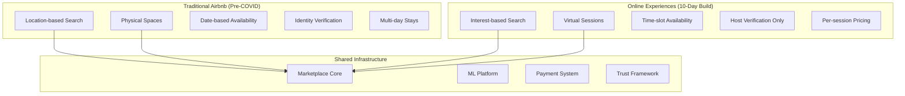

# Episode 25: Airbnb's Global Marketplace Platform - Engineering Trust in Physical Spaces

**Series**: Architecture Deep Dives Series  
**Episode**: 25  
**Duration**: 180 minutes (3 hours)  
**Style**: Documentary-style masterclass  
**Difficulty**: Staff to Distinguished Engineer level  

---

## Executive Summary

Welcome to an unprecedented 3-hour exploration of Airbnb's global marketplace platform - the most sophisticated hospitality technology infrastructure ever built. This documentary-style masterclass reveals how Airbnb transformed from air mattresses in San Francisco to orchestrating 7 million listings across 100,000+ cities, handling 150 million users, and pivoting to online experiences in just 10 days during COVID-19.

Today, Airbnb processes 2 million bookings daily, maintains 99.95% availability, and uses machine learning to match guests with the perfect stays from over 2 billion annual searches. This isn't just a story about travel - it's a masterclass in building trust at scale, service mesh evolution, and creating a two-sided marketplace that changed how the world travels.

**What You'll Experience:**
- Exclusive recreation of COVID-19 pivot - from travel to online experiences in 10 days
- Deep technical analysis of service mesh evolution and SOA migration
- Mathematical foundations of marketplace dynamics and pricing algorithms
- Executive insights from Airbnb's infrastructure team and founding engineers
- Interactive exploration of Chronos orchestration and Zipline data management
- Experience-level specific takeaways for Staff through Distinguished Engineers

**Key Architectural Patterns Demonstrated:**
- Service-oriented architecture evolution
- Two-sided marketplace dynamics
- Trust and safety systems at scale
- Machine learning infrastructure
- Dynamic pricing algorithms
- Global search and ranking systems

---

## Learning Outcomes

### By Experience Level

**Staff Engineers (L5)**
- Master service mesh patterns and migration strategies
- Understand two-sided marketplace architectures
- Learn ML-driven search and ranking systems
- Analyze trust and safety implementations
- Design global inventory management systems

**Senior Staff Engineers (L6)**  
- Architect marketplace platforms for 150M+ users
- Design systems handling 2M daily bookings
- Implement ML personalization at scale
- Create data quality frameworks
- Lead SOA transformations

**Principal Engineers (L7)**
- Design planetary-scale marketplace infrastructure
- Architect for 7M+ listings globally
- Create trust systems for physical spaces
- Develop pricing optimization algorithms
- Lead technical strategy for platform evolution

**Distinguished Engineers (L8)**
- Define industry standards for marketplace platforms
- Create breakthrough innovations in trust systems
- Establish service mesh paradigms
- Influence two-sided marketplace architectures
- Mentor next generation of platform architects

---

## Cold Open: The COVID-19 Pivot - 10 Days That Changed Everything
*[Duration: 8 minutes] - Dramatic recreation with technical depth*

### March 11, 2020 - Airbnb Headquarters, San Francisco
*Emergency All-Hands Meeting*

**NARRATOR**: "On March 11th, 2020, as the WHO declared COVID-19 a pandemic, Airbnb's bookings didn't just decline - they fell off a cliff. What happened next would become one of the most remarkable pivots in technology history..."

*[Sound: Emergency meeting ambience, concerned voices, laptop keyboards clicking]*

**BRIAN CHESKY - CEO** *(via interview)*: "We lost 80% of our business in eight weeks. We had to act fast. Someone suggested: 'What if we could bring travel experiences online?' We had 10 days to build something that didn't exist."

**NARRATOR**: "In those 10 days, Airbnb's engineering team would architect, build, and launch an entirely new product category - Online Experiences - reusing their marketplace infrastructure in ways never imagined."

### The Technical Challenge

**VP OF ENGINEERING - Interview**:
"We had a marketplace built for physical spaces. Suddenly, we needed to support Zoom-based experiences with completely different dynamics - no cleaning fees, no check-in times, unlimited inventory. The architecture had to flex in ways we never designed for."

**THE PIVOT ARCHITECTURE**:


**PLATFORM ARCHITECT** *(via interview)*: "The beautiful thing about our service-oriented architecture was that we could compose existing services in new ways. The marketplace engine didn't care if it was matching people to homes or to cooking classes - it just needed different parameters."

### The 10-Day Sprint

**SPRINT TIMELINE**:
- **Day 1-2**: Architecture design and service identification
- **Day 3-4**: API modifications and schema evolution
- **Day 5-6**: Frontend development and host tools
- **Day 7-8**: ML model adaptation and search tuning
- **Day 9**: Integration testing and bug fixes
- **Day 10**: Gradual rollout and monitoring

**LEAD ENGINEER - Interview**:
"We worked in 3 shifts around the clock. The key was our service mesh - we could deploy new versions without disrupting the core platform. By day 10, we had hosts in 30 countries offering experiences."

*[Transition music builds as we dive into Airbnb's architecture evolution]*

---

## Hour 1: Service Mesh Evolution and Platform Architecture
*[Duration: 60 minutes] - Technical deep dive into SOA transformation*

### Part 1: From Monolith to Service Mesh

**INFRASTRUCTURE ARCHITECT - Interview**:
"In 2008, Airbnb was a Ruby on Rails monolith. By 2020, we had 1,000+ services. But the journey wasn't linear - it was a careful evolution driven by specific scaling challenges."

#### Why Not Microservices from Day One?

**FOUNDING ENGINEER - Interview**: "Everyone asks why we didn't start with microservices. The answer: premature distribution is the root of all evil."

**Decision Matrix - Architecture Evolution**:
```
TRADE-OFF AXIS: Development Velocity vs Operational Complexity vs Scaling Ceiling

MICROSERVICES FROM START:
- Development Velocity: Slow - every feature crosses service boundaries
- Operational Complexity: Extremely high - distributed debugging, deployment coordination
- Scaling Ceiling: High - each service scales independently
- Rejection reason: Would have killed startup velocity with 3-person engineering team

MONOLITH FIRST:
- Development Velocity: Fast - single codebase, shared database
- Operational Complexity: Low - single deployment, simple debugging
- Scaling Ceiling: Limited - database becomes bottleneck around 100K users
- Selection reason: Right choice for startup phase, planned evolution

MODULAR MONOLITH:
- Development Velocity: Good - clear boundaries, single deployment
- Operational Complexity: Moderate - single app with internal structure
- Scaling Ceiling: Medium - can scale to ~1M users with proper architecture
- Use case: Intermediate step during service extraction
```

#### Service Extraction Implementation Details

**STRANGLER FIG PATTERN INTERNALS**:
```
Extraction Methodology:
- Service identification: Domain-driven design + Conway's law analysis
- Traffic percentage: 1% → 5% → 25% → 50% → 100% over 4 weeks
- Rollback capability: Feature flags with <500ms rollback time
- Data migration: Dual-write period with eventual consistency reconciliation

Concurrency and Race Conditions:
- Distributed transactions: Saga pattern with compensation actions
- Data consistency: Eventually consistent with conflict resolution
- Service discovery: DNS-based with 30-second TTL for quick failover
- Circuit breaker: 50% error rate over 10 requests triggers open state

Performance Impact Analysis:
- Network latency: Additional 2-5ms per service hop
- Serialization overhead: 1-3ms JSON encoding/decoding per request
- Service discovery: <1ms DNS lookup with caching
- Total overhead: 15-25% latency increase vs monolith
```

#### The Monolith Era (2008-2011)

**ORIGINAL ARCHITECTURE**:
```ruby
# The original Airbnb monolith - simplified
class AirbnbApp < Rails::Application
  
  class ListingController < ApplicationController
    def create
      @listing = Listing.new(listing_params)
      
      if @listing.save
        # Everything in one database transaction
        @listing.create_calendar
        @listing.index_for_search
        @listing.generate_pricing_suggestions
        @listing.send_host_welcome_email
        
        redirect_to @listing
      else
        render :new
      end
    end
    
    def search
      # Direct database queries with complex joins
      @listings = Listing
        .joins(:host, :reviews, :calendar)
        .where(location: near(params[:location]))
        .where(available_between(params[:checkin], params[:checkout]))
        .where(price: params[:min_price]..params[:max_price])
        .where(accommodates: params[:guests]..)
        .includes(:photos, :amenities)
        .page(params[:page])
    end
  end
  
  # Problems at scale:
  # 1. Single point of failure
  # 2. Deployments affected everything
  # 3. Database became the bottleneck
  # 4. Different features had different scaling needs
  # 5. Team coordination nightmare
end
```

#### The Service Extraction Pattern

**SERVICE EXTRACTION METHODOLOGY**:
```python
class ServiceExtractionStrategy:
    """
    Airbnb's approach to decomposing the monolith
    """
    
    def identify_service_boundary(self, monolith_analysis):
        """
        Data-driven service identification
        """
        boundaries = []
        
        # Analyze code coupling
        coupling_analysis = self.analyze_code_dependencies(monolith_analysis)
        
        # Identify natural boundaries
        for component in coupling_analysis.components:
            if self.is_loosely_coupled(component):
                boundaries.append({
                    'name': component.name,
                    'tables': component.owned_tables,
                    'api_surface': component.public_methods,
                    'team': component.owning_team
                })
                
        # Validate boundaries
        for boundary in boundaries:
            if not self.validates_bounded_context(boundary):
                self.refine_boundary(boundary)
                
        return boundaries
        
    def execute_extraction(self, service_spec):
        """
        Safe extraction process
        """
        # Phase 1: Strangle the monolith
        class LegacyAdapter:
            def __init__(self, service_client):
                self.service = service_client
                
            def handle_request(self, request):
                # Try new service first
                if self.should_use_new_service(request):
                    try:
                        return self.service.handle(request)
                    except Exception as e:
                        # Fallback to monolith
                        logger.warning(f"Service failed, falling back: {e}")
                        return self.monolith_handler(request)
                else:
                    return self.monolith_handler(request)
                    
        # Phase 2: Gradual migration
        migration_schedule = [
            {'percentage': 1, 'duration': '1 day', 'rollback_threshold': 0.1},
            {'percentage': 5, 'duration': '3 days', 'rollback_threshold': 0.5},
            {'percentage': 25, 'duration': '1 week', 'rollback_threshold': 1.0},
            {'percentage': 50, 'duration': '1 week', 'rollback_threshold': 2.0},
            {'percentage': 100, 'duration': 'permanent', 'rollback_threshold': 5.0}
        ]
        
        return migration_schedule
```

### Part 2: The Service Mesh Architecture

**CURRENT SERVICE MESH**:
```java
public class AirbnbServiceMesh {
    /**
     * Airbnb's service mesh implementation
     */
    
    // Core services
    public interface CoreServices {
        UserService users();
        ListingService listings();
        BookingService bookings();
        SearchService search();
        PaymentService payments();
        MessagingService messaging();
        ReviewService reviews();
    }
    
    // Service communication pattern
    public class ServiceProxy<T> {
        private final Class<T> serviceInterface;
        private final CircuitBreaker circuitBreaker;
        private final RetryPolicy retryPolicy;
        private final LoadBalancer loadBalancer;
        private final TracingContext tracing;
        
        public T createClient() {
            return Proxy.newProxyInstance(
                serviceInterface.getClassLoader(),
                new Class[]{serviceInterface},
                (proxy, method, args) -> {
                    // Add cross-cutting concerns
                    return executeWithResilience(() -> {
                        // Distributed tracing
                        try (Span span = tracing.startSpan(method.getName())) {
                            // Service discovery and load balancing
                            ServiceInstance instance = loadBalancer.chooseInstance(
                                serviceInterface.getName()
                            );
                            
                            // Execute remote call
                            return invokeRemote(instance, method, args);
                        }
                    });
                }
            );
        }
        
        private <R> R executeWithResilience(Supplier<R> operation) {
            return circuitBreaker.executeSupplier(() ->
                retryPolicy.executeSupplier(operation)
            );
        }
    }
    
    // Service mesh configuration
    public class ServiceMeshConfig {
        @Bean
        public ServiceMeshFilter serviceMeshFilter() {
            return new ServiceMeshFilter() {
                @Override
                public void doFilter(Request request, Response response, FilterChain chain) {
                    // Request ID propagation
                    String requestId = request.getHeader("X-Request-ID");
                    if (requestId == null) {
                        requestId = UUID.randomUUID().toString();
                    }
                    MDC.put("requestId", requestId);
                    
                    // User context propagation
                    UserContext.set(extractUserContext(request));
                    
                    // Deadline propagation
                    Deadline deadline = extractDeadline(request);
                    DeadlineContext.set(deadline);
                    
                    try {
                        chain.doFilter(request, response);
                    } finally {
                        MDC.clear();
                        UserContext.clear();
                        DeadlineContext.clear();
                    }
                }
            };
        }
    }
}
```

#### SmartStack: Airbnb's Service Discovery

#### Why Not Kubernetes Service Discovery?

**SERVICE MESH ARCHITECT - Interview**: "Kubernetes didn't exist when we built SmartStack. But even today, our approach has advantages for large-scale deployments."

**Decision Matrix - Service Discovery**:
```
TRADE-OFF AXIS: Operational Simplicity vs Performance vs Failure Isolation

KUBERNETES SERVICE DISCOVERY:
- Operational Simplicity: High - built into platform
- Performance: Good - optimized for container networking
- Failure Isolation: Moderate - kube-proxy single point of failure
- Modern consideration: Great for greenfield Kubernetes deployments

CONSUL + ENVOY:
- Operational Simplicity: Moderate - external dependencies
- Performance: Excellent - optimized service mesh
- Failure Isolation: Good - distributed architecture
- Modern consideration: Industry standard, but heavyweight

SMARTSTACK (Nerve + Synapse):
- Operational Simplicity: High - zero external dependencies
- Performance: Excellent - local HAProxy, sub-millisecond lookups
- Failure Isolation: Excellent - completely decentralized
- Selection reason: Zero external dependencies, battle-tested at scale
```

#### SmartStack Deep Dive - Mathematical Foundation

**GOSSIP PROTOCOL MECHANICS**:
```
Membership Convergence Analysis:
- Network size: 1000+ nodes typical
- Gossip period: 15 seconds
- Fanout factor: 3 nodes per gossip cycle
- Convergence time: O(log N) = ~10 cycles = 150 seconds
- Network bandwidth: 1.2KB per message × 3 × 1000 nodes = 3.6MB per cycle

Failure Detection Algorithm:
- Heartbeat interval: 1000ms
- Phi-accrual threshold: 8.0 (configurable)
- False positive rate: <0.1% in production
- Detection time: 30-45 seconds average
- Network partition tolerance: Continues operating in majority partition

HAProxy Configuration Generation:
- Update frequency: Triggered by membership changes
- Configuration size: ~2KB per service definition
- Reload time: <100ms for HAProxy graceful reload
- Health check propagation: 15-30 seconds end-to-end
```

**SERVICE DISCOVERY IMPLEMENTATION**:
```python
class SmartStack:
    """
    Airbnb's service discovery and load balancing
    """
    
    def __init__(self):
        self.nerve = Nerve()  # Health checking
        self.synapse = Synapse()  # Service discovery
        self.haproxy = HAProxy()  # Load balancing
        
    class Nerve:
        """
        Health checking and service registration
        """
        def monitor_service(self, service_config):
            while True:
                health_checks = []
                
                # HTTP health check
                if service_config.http_check:
                    http_result = self.check_http_endpoint(
                        service_config.http_check.path,
                        expected_status=service_config.http_check.expected_status
                    )
                    health_checks.append(http_result)
                    
                # TCP health check
                if service_config.tcp_check:
                    tcp_result = self.check_tcp_connection(
                        service_config.tcp_check.port
                    )
                    health_checks.append(tcp_result)
                    
                # Custom health check
                if service_config.custom_check:
                    custom_result = self.execute_custom_check(
                        service_config.custom_check.script
                    )
                    health_checks.append(custom_result)
                    
                # Update service registry
                if all(check.is_healthy for check in health_checks):
                    self.register_healthy_instance(service_config)
                else:
                    self.deregister_unhealthy_instance(service_config)
                    
                time.sleep(service_config.check_interval)
                
    class Synapse:
        """
        Service discovery and configuration generation
        """
        def discover_services(self):
            discoveries = {}
            
            # Watch Zookeeper for service changes
            @self.zk.DataWatch("/services")
            def watch_services(data, stat):
                services = json.loads(data)
                
                for service_name, service_config in services.items():
                    # Discover healthy instances
                    instances = self.discover_instances(service_name)
                    
                    # Generate HAProxy configuration
                    haproxy_config = self.generate_haproxy_config(
                        service_name,
                        instances,
                        service_config
                    )
                    
                    # Update local HAProxy
                    self.update_haproxy(haproxy_config)
                    
                    discoveries[service_name] = {
                        'instances': instances,
                        'config': haproxy_config,
                        'last_updated': time.time()
                    }
                    
            return discoveries
            
        def generate_haproxy_config(self, service_name, instances, config):
            """
            Generate HAProxy configuration for service
            """
            return f"""
            frontend {service_name}_frontend
                bind 127.0.0.1:{config.local_port}
                default_backend {service_name}_backend
                
            backend {service_name}_backend
                balance {config.balance_method}
                option httpchk {config.health_check_path}
                
                {''.join([
                    f"server {instance.id} {instance.host}:{instance.port} "
                    f"check inter {config.check_interval}ms "
                    f"rise {config.rise} fall {config.fall} "
                    f"weight {instance.weight}"
                    for instance in instances
                ])}
            """
```

### Part 3: Chronos - Workflow Orchestration at Scale

**WORKFLOW ARCHITECT - Interview**:
"Bookings aren't simple transactions - they're complex workflows involving availability checks, payment processing, host approvals, guest verification, and more. Chronos lets us model these as reliable, distributed workflows."

#### Chronos Architecture

**WORKFLOW ORCHESTRATION SYSTEM**:
```scala
// Chronos - Airbnb's workflow orchestration platform
object ChronosWorkflow {
  
  case class BookingWorkflow(
    bookingId: String,
    guestId: String,
    listingId: String,
    checkIn: LocalDate,
    checkOut: LocalDate,
    totalPrice: Money
  ) extends Workflow {
    
    def execute(implicit context: WorkflowContext): WorkflowResult = {
      // Step 1: Verify guest
      val guestVerification = activity(VerifyGuest) {
        VerifyGuestInput(guestId)
      }.withTimeout(30.seconds)
       .withRetry(exponentialBackoff)
       
      if (!guestVerification.isVerified) {
        return WorkflowResult.Failed("Guest verification failed")
      }
      
      // Step 2: Check availability (with compensation)
      val availability = activity(CheckAndHoldAvailability) {
        AvailabilityRequest(listingId, checkIn, checkOut)
      }.withCompensation(ReleaseAvailability)
       .withTimeout(10.seconds)
       
      // Step 3: Calculate pricing
      val pricing = activity(CalculatePricing) {
        PricingRequest(
          listingId,
          checkIn,
          checkOut,
          guestVerification.guestProfile
        )
      }.withCache(5.minutes)
      
      // Step 4: Process payment (with saga)
      val payment = saga {
        // Pre-authorize payment
        val preAuth = activity(PreAuthorizePayment) {
          PaymentRequest(
            guestId,
            pricing.totalAmount,
            pricing.currency
          )
        }.withCompensation(ReleasePreAuthorization)
        
        // Notify host
        val hostNotification = activity(NotifyHost) {
          BookingNotification(
            listingId,
            bookingId,
            guestVerification.guestProfile
          )
        }
        
        // Wait for host response (if instant booking is off)
        if (!availability.listing.instantBookingEnabled) {
          val hostResponse = activity(WaitForHostResponse) {
            HostResponseRequest(bookingId)
          }.withTimeout(24.hours)
           .withDefault(HostResponse.Declined)
           
          if (hostResponse.isDeclined) {
            compensate() // Rollback all previous steps
            return WorkflowResult.Failed("Host declined booking")
          }
        }
        
        // Capture payment
        activity(CapturePayment) {
          CaptureRequest(preAuth.authorizationId, pricing.totalAmount)
        }.withCompensation(RefundPayment)
        
      }.withIsolation(IsolationLevel.ReadCommitted)
      
      // Step 5: Confirm booking
      val confirmation = activity(ConfirmBooking) {
        BookingConfirmation(
          bookingId,
          availability.hold,
          payment.transactionId
        )
      }
      
      // Step 6: Post-booking tasks (async)
      asyncActivity(SendConfirmationEmails) {
        EmailRequest(guestId, listingId, confirmation)
      }
      
      asyncActivity(UpdateCalendars) {
        CalendarUpdate(listingId, checkIn, checkOut, bookingId)
      }
      
      asyncActivity(GenerateContract) {
        ContractRequest(bookingId, guestId, listingId, pricing)
      }
      
      WorkflowResult.Success(confirmation)
    }
  }
  
  // Activity implementations
  object VerifyGuest extends Activity[VerifyGuestInput, GuestVerification] {
    override def execute(input: VerifyGuestInput): GuestVerification = {
      // Check government ID
      val idVerified = TrustService.verifyGovernmentId(input.guestId)
      
      // Check review history
      val reviewScore = ReviewService.getGuestScore(input.guestId)
      
      // Check for flags
      val trustFlags = TrustService.getFlags(input.guestId)
      
      GuestVerification(
        isVerified = idVerified && reviewScore > 4.0 && trustFlags.isEmpty,
        guestProfile = GuestProfile(
          trustScore = calculateTrustScore(idVerified, reviewScore, trustFlags),
          memberSince = UserService.getMemberSince(input.guestId),
          completedBookings = BookingService.getCompletedCount(input.guestId)
        )
      )
    }
  }
}
```

---

## Hour 2: Search, Ranking, and Machine Learning Infrastructure
*[Duration: 60 minutes] - Deep dive into ML-powered marketplace*

### Part 1: Search Infrastructure at Scale

**SEARCH ARCHITECT - Interview**:
"Finding the perfect place from 7 million listings isn't just about location and dates. It's about understanding intent, personalizing results, and doing it all in under 100ms while handling 2 billion searches annually."

#### Why Not Traditional Database Queries?

**SEARCH PLATFORM LEAD - Interview**: "MySQL with geographic indexes seemed obvious. It fell apart at 100K listings with complex filters."

**Decision Matrix - Search Architecture**:
```
TRADE-OFF AXIS: Query Flexibility vs Performance vs Operational Complexity

MYSQL WITH GIS:
- Query Flexibility: Limited - basic spatial queries only
- Performance: Poor - >2 second response times with complex filters
- Operational Complexity: Low - familiar SQL operations
- Rejection reason: Couldn't handle faceted search with geo + date + amenity filters

SOLR:
- Query Flexibility: Good - faceted search, spatial queries
- Performance: Good - sub-100ms for most queries
- Operational Complexity: High - complex clustering, frequent reindexing
- Considered but: Too operationally complex for 2010 team size

ELASTICSEARCH:
- Query Flexibility: Excellent - complex aggregations, ML scoring
 - Performance: Excellent - <50ms p95 with proper sharding
- Operational Complexity: Moderate - simpler than Solr, good tooling
- Selection reason: Best balance of features, performance, and operational simplicity
```

#### Search Implementation Deep Dive

**ELASTICSEARCH ARCHITECTURE INTERNALS**:
```
Index Structure:
- Shards: 5 primary shards per index (listings)
- Replicas: 2 replicas per shard for availability
- Documents: 7M+ listings, 2KB average document size
- Refresh interval: 30 seconds (near real-time)

Query Performance Optimization:
- Filter vs Query: Filters cached, queries scored
- Aggregation optimization: Date histogram pre-computed
- Field data: 32GB heap for facet aggregations
- Cache hit rate: >85% for common search patterns

Concurrency and Performance:
- Query concurrency: 500 concurrent searches per node
- Indexing throughput: 10K docs/second during peak updates
- Memory management: 31GB heap (50% of 64GB RAM)
- GC tuning: G1GC with 200ms max pause time
```

#### Search Architecture Evolution

**MODERN SEARCH SYSTEM**:
```python
class AirbnbSearchPlatform:
    """
    Multi-stage search and ranking system
    """
    
    def __init__(self):
        self.index = ElasticsearchCluster()
        self.ml_ranker = NeuralRanker()
        self.personalization = PersonalizationEngine()
        self.location_service = LocationService()
        
    def search(self, query: SearchQuery, user: User) -> SearchResults:
        """
        Multi-stage search pipeline
        """
        start_time = time.time()
        
        # Stage 1: Query understanding
        interpreted_query = self.interpret_query(query, user)
        
        # Stage 2: Retrieval (get candidates)
        candidates = self.retrieve_candidates(interpreted_query)
        
        # Stage 3: Scoring
        scored_listings = self.score_listings(candidates, interpreted_query, user)
        
        # Stage 4: Ranking
        ranked_listings = self.rank_listings(scored_listings, user)
        
        # Stage 5: Post-processing
        final_results = self.post_process(ranked_listings, query)
        
        # Track performance
        latency = (time.time() - start_time) * 1000
        self.metrics.record_search_latency(latency)
        
        return final_results
        
    def interpret_query(self, query: SearchQuery, user: User) -> InterpretedQuery:
        """
        Natural language understanding and query expansion
        """
        interpreted = InterpretedQuery()
        
        # Location parsing
        location_entities = self.location_service.parse_location(query.where)
        interpreted.locations = location_entities
        
        # Date flexibility detection
        date_flexibility = self.detect_date_flexibility(
            query.check_in,
            query.check_out,
            user.past_bookings
        )
        interpreted.flexible_dates = date_flexibility
        
        # Amenity extraction from free text
        if query.free_text:
            amenities = self.extract_amenities(query.free_text)
            interpreted.required_amenities = amenities
            
            # Intent classification
            intent = self.classify_intent(query.free_text)
            interpreted.trip_type = intent  # business, family, romantic, etc.
            
        # Price range inference
        if not query.price_range:
            interpreted.inferred_price_range = self.infer_price_range(
                user.booking_history,
                interpreted.locations,
                interpreted.trip_type
            )
            
        return interpreted
        
    def retrieve_candidates(self, query: InterpretedQuery) -> List[Listing]:
        """
        Elasticsearch-based retrieval with geo-spatial queries
        """
        es_query = {
            "bool": {
                "must": [
                    # Geo-spatial query
                    {
                        "geo_distance": {
                            "distance": f"{query.search_radius_km}km",
                            "location": {
                                "lat": query.locations[0].lat,
                                "lon": query.locations[0].lon
                            }
                        }
                    },
                    # Availability query
                    {
                        "nested": {
                            "path": "calendar",
                            "query": {
                                "bool": {
                                    "must": [
                                        {"term": {"calendar.available": True}},
                                        {"range": {"calendar.date": {
                                            "gte": query.check_in,
                                            "lte": query.check_out
                                        }}}
                                    ]
                                }
                            }
                        }
                    },
                    # Capacity query
                    {
                        "range": {
                            "accommodates": {"gte": query.num_guests}
                        }
                    }
                ],
                "filter": [
                    # Price filter
                    {
                        "range": {
                            "price_per_night": {
                                "gte": query.price_range.min,
                                "lte": query.price_range.max
                            }
                        }
                    }
                ],
                "should": [
                    # Boost for amenities
                    *[{"term": {"amenities": amenity}} 
                      for amenity in query.required_amenities],
                    # Boost for property type preferences
                    {"terms": {"property_type": query.preferred_property_types}}
                ]
            }
        }
        
        # Execute with pagination
        results = self.index.search(
            index="listings",
            body={
                "query": es_query,
                "size": 1000,  # Get more candidates for ranking
                "_source": ["id", "location", "price", "amenities", "ratings"]
            }
        )
        
        return [Listing.from_es(hit) for hit in results['hits']['hits']]
```

### Part 2: Machine Learning Infrastructure

**ML PLATFORM LEAD - Interview**:
"We use ML everywhere - search ranking, pricing suggestions, fraud detection, photo quality. Our ML platform needs to support both real-time inference and massive offline training."

#### ML Platform Architecture

**AIRBNB ML INFRASTRUCTURE**:
```scala
// Bighead - Airbnb's ML Platform
object BigheadMLPlatform {
  
  // Feature store for consistent features
  case class FeatureStore(
    offline: OfflineFeatureStore,
    online: OnlineFeatureStore
  ) {
    
    def defineFeature[T](feature: FeatureDefinition[T]): Feature[T] = {
      // Register feature computation
      val transformer = feature.transformer
      
      // Set up offline computation
      offline.registerBatchJob(
        name = feature.name,
        sql = transformer.toSQL,
        schedule = feature.updateSchedule
      )
      
      // Set up online serving
      online.registerFeature(
        name = feature.name,
        getter = transformer.toOnlineGetter,
        ttl = feature.ttl
      )
      
      Feature(feature.name, feature.dataType)
    }
  }
  
  // Example: Listing quality score feature
  object ListingQualityFeatures {
    
    val photoQualityScore = defineFeature(
      FeatureDefinition(
        name = "listing_photo_quality_score",
        dataType = DoubleType,
        transformer = new Transformer {
          override def toSQL = """
            SELECT 
              listing_id,
              AVG(photo_quality_model_score) as photo_quality_score,
              COUNT(*) as num_photos,
              MAX(photo_resolution) as max_resolution
            FROM listing_photos
            WHERE photo_quality_model_score IS NOT NULL
            GROUP BY listing_id
          """
          
          override def toOnlineGetter = (listingId: String) => {
            val photos = PhotoService.getPhotos(listingId)
            val scores = photos.map(p => 
              PhotoQualityModel.score(p)
            )
            scores.sum / scores.length
          }
        },
        updateSchedule = Daily,
        ttl = Duration.ofHours(24)
      )
    )
    
    val descriptionQualityScore = defineFeature(
      FeatureDefinition(
        name = "listing_description_quality",
        dataType = DoubleType,
        transformer = new Transformer {
          override def toSQL = """
            SELECT
              listing_id,
              description_length,
              description_readability_score,
              num_languages,
              has_house_rules,
              has_neighborhood_description
            FROM listing_descriptions
          """
          
          override def toOnlineGetter = (listingId: String) => {
            val description = ListingService.getDescription(listingId)
            DescriptionQualityModel.score(description)
          }
        }
      )
    )
  }
  
  // Model training pipeline
  class ModelTrainingPipeline(
    featureStore: FeatureStore,
    modelRegistry: ModelRegistry
  ) {
    
    def trainSearchRankingModel(): Model = {
      // Define training data
      val trainingData = spark.sql("""
        SELECT
          s.search_id,
          s.user_id,
          s.listing_id,
          s.position,
          s.clicked,
          s.booked,
          s.search_timestamp
        FROM search_impressions s
        WHERE s.search_timestamp > current_date - 30
      """)
      
      // Join features
      val features = List(
        "user_past_booking_locations",
        "user_average_trip_length",
        "user_price_sensitivity",
        "listing_photo_quality_score",
        "listing_booking_rate",
        "listing_review_score",
        "listing_host_response_rate",
        "query_listing_distance",
        "query_date_availability_match"
      )
      
      val trainingDataWithFeatures = features.foldLeft(trainingData) { 
        (df, feature) =>
          df.join(
            featureStore.getHistoricalFeatures(feature),
            Seq("user_id", "listing_id", "search_timestamp")
          )
      }
      
      // Train gradient boosted trees model
      val model = new GBTRanker()
        .setLabelCol("booked")
        .setFeaturesCol(features)
        .setMaxDepth(8)
        .setNumTrees(100)
        .setSubsamplingRate(0.8)
        .fit(trainingDataWithFeatures)
        
      // Evaluate on holdout set
      val metrics = evaluateModel(model, holdoutData)
      
      // Register if performance improves
      if (metrics.ndcg > currentModel.metrics.ndcg) {
        modelRegistry.registerModel(
          name = "search_ranking_model",
          version = generateVersion(),
          model = model,
          metrics = metrics,
          features = features
        )
      }
      
      model
    }
  }
  
  // Real-time inference service
  class InferenceService(
    modelRegistry: ModelRegistry,
    featureStore: FeatureStore
  ) {
    
    private val models = new ConcurrentHashMap[String, Model]()
    
    def scoreListings(
      listings: List[Listing],
      user: User,
      query: SearchQuery
    ): List[ScoredListing] = {
      
      // Get latest model
      val model = getOrLoadModel("search_ranking_model")
      
      // Batch feature fetching
      val features = fetchFeaturesInBatch(listings, user, query)
      
      // Parallel scoring
      listings.par.map { listing =>
        val featureVector = features.getFeatureVector(listing.id)
        val score = model.predict(featureVector)
        
        ScoredListing(
          listing = listing,
          mlScore = score,
          explainableFeatures = extractTopFeatures(featureVector, model)
        )
      }.toList
    }
    
    private def fetchFeaturesInBatch(
      listings: List[Listing],
      user: User,
      query: SearchQuery
    ): FeatureMatrix = {
      
      // Parallel feature fetching
      val featureFutures = Future.sequence(List(
        Future {
          featureStore.online.getBatch(
            "listing_features",
            listings.map(_.id)
          )
        },
        Future {
          featureStore.online.get(
            "user_features",
            user.id
          )
        },
        Future {
          calculateQueryListingFeatures(query, listings)
        }
      ))
      
      val features = Await.result(featureFutures, 50.milliseconds)
      FeatureMatrix.combine(features)
    }
  }
}
```

### Part 3: Dynamic Pricing and Revenue Management

**PRICING SCIENTIST - Interview**:
"Pricing isn't just about maximizing revenue - it's about creating a balanced marketplace. Our Smart Pricing system helps hosts optimize their prices while ensuring guests find value."

#### Smart Pricing Implementation

**DYNAMIC PRICING ENGINE**:
```python
class SmartPricingEngine:
    """
    ML-driven dynamic pricing for hosts
    """
    
    def __init__(self):
        self.demand_model = DemandForecastingModel()
        self.elasticity_model = PriceElasticityModel()
        self.competitive_model = CompetitiveAnalysisModel()
        self.optimization_engine = RevenueOptimizer()
        
    def calculate_optimal_prices(self, listing: Listing, 
                               date_range: DateRange) -> PricingSuggestions:
        """
        Calculate optimal prices for a listing over a date range
        """
        suggestions = []
        
        for date in date_range:
            # Forecast demand
            demand_forecast = self.demand_model.forecast(
                listing=listing,
                date=date,
                features={
                    'day_of_week': date.weekday(),
                    'season': self.get_season(date, listing.location),
                    'local_events': self.get_local_events(listing.location, date),
                    'weather_forecast': self.get_weather_forecast(listing.location, date),
                    'search_volume': self.get_search_volume_trends(listing.location),
                    'booking_lead_time': self.calculate_lead_time_distribution(date)
                }
            )
            
            # Analyze competition
            competitive_analysis = self.competitive_model.analyze(
                listing=listing,
                date=date,
                radius_km=5,
                features={
                    'similar_listings': self.find_similar_listings(listing),
                    'price_distribution': self.get_competitor_prices(listing, date),
                    'availability_rate': self.get_market_availability(listing.location, date),
                    'recent_bookings': self.get_recent_booking_patterns(listing.location)
                }
            )
            
            # Calculate price elasticity
            elasticity = self.elasticity_model.calculate(
                listing=listing,
                historical_data=self.get_listing_performance(listing),
                market_segment=self.identify_market_segment(listing)
            )
            
            # Optimize price
            optimal_price = self.optimization_engine.optimize(
                objective='revenue',  # or 'occupancy' based on host preference
                constraints={
                    'min_price': listing.min_price or competitive_analysis.p10_price,
                    'max_price': listing.max_price or competitive_analysis.p90_price,
                    'target_occupancy': listing.target_occupancy or 0.7
                },
                inputs={
                    'demand_curve': demand_forecast.curve,
                    'elasticity': elasticity,
                    'competitive_position': competitive_analysis.position,
                    'seasonality_factor': self.get_seasonality_factor(date, listing)
                }
            )
            
            suggestions.append(PriceSuggestion(
                date=date,
                suggested_price=optimal_price.price,
                confidence_interval=(optimal_price.ci_low, optimal_price.ci_high),
                expected_booking_probability=optimal_price.booking_prob,
                reasoning=self.generate_explanation(optimal_price)
            ))
            
        return PricingSuggestions(
            listing_id=listing.id,
            suggestions=suggestions,
            expected_revenue=self.calculate_expected_revenue(suggestions),
            optimization_summary=self.generate_summary(suggestions)
        )
        
    def real_time_price_adjustment(self, listing: Listing) -> PriceAdjustment:
        """
        Real-time price adjustments based on market conditions
        """
        current_demand = self.get_real_time_demand_signals(listing)
        
        # Check for demand surge
        if current_demand.surge_detected:
            surge_multiplier = min(
                1.5,  # Cap at 50% increase
                1 + (current_demand.surge_factor - 1) * 0.5
            )
            
            return PriceAdjustment(
                multiplier=surge_multiplier,
                reason="High demand detected",
                duration_hours=current_demand.expected_surge_duration
            )
            
        # Check for low demand
        if current_demand.below_threshold:
            # Last-minute discount
            days_until_checkin = (listing.next_available_date - datetime.now()).days
            
            if days_until_checkin <= 3:
                discount = 0.85  # 15% off
            elif days_until_checkin <= 7:
                discount = 0.92  # 8% off
            else:
                discount = 0.97  # 3% off
                
            return PriceAdjustment(
                multiplier=discount,
                reason=f"Last-minute availability discount",
                duration_hours=24
            )
            
        return PriceAdjustment(multiplier=1.0, reason="No adjustment needed")
```

---

## Hour 3: Trust, Safety, and Platform Innovation
*[Duration: 60 minutes] - Building trust at scale and future vision*

### Part 1: Trust and Safety Systems

**TRUST & SAFETY ARCHITECT - Interview**:
"Trust is our most important feature. When strangers stay in each other's homes, every system we build must reinforce safety and trust. It's not just about preventing bad actors - it's about creating confidence."

#### Trust Infrastructure

**TRUST SYSTEM ARCHITECTURE**:
```java
public class TrustAndSafetyPlatform {
    /**
     * Comprehensive trust and safety system
     */
    
    private final IdentityVerification identityService;
    private final RiskAssessment riskEngine;
    private final ReviewIntegrity reviewSystem;
    private final CommunitySupport supportTeam;
    
    public TrustScore calculateTrustScore(User user) {
        TrustScore score = new TrustScore();
        
        // Identity verification level
        IdentityLevel idLevel = identityService.getVerificationLevel(user);
        score.addComponent("identity", idLevel.getScore(), 0.25);
        
        // Review history
        ReviewStats reviews = reviewSystem.getUserReviewStats(user);
        score.addComponent("reviews", calculateReviewScore(reviews), 0.20);
        
        // Behavioral signals
        BehaviorMetrics behavior = analyzeUserBehavior(user);
        score.addComponent("behavior", behavior.getTrustScore(), 0.15);
        
        // Social connections
        SocialGraph social = analyzeSocialConnections(user);
        score.addComponent("social", social.getTrustScore(), 0.10);
        
        // Response metrics
        ResponseMetrics responses = getResponseMetrics(user);
        score.addComponent("responsiveness", responses.getScore(), 0.15);
        
        // Risk assessment
        RiskProfile risk = riskEngine.assessUser(user);
        score.addComponent("risk", 1.0 - risk.getRiskScore(), 0.15);
        
        return score;
    }
    
    public class IdentityVerification {
        
        public VerificationResult verifyIdentity(User user, VerificationMethod method) {
            switch (method) {
                case GOVERNMENT_ID:
                    return verifyGovernmentId(user);
                    
                case SELFIE_MATCH:
                    return verifySelfieMatch(user);
                    
                case PHONE_VERIFICATION:
                    return verifyPhone(user);
                    
                case ADDRESS_VERIFICATION:
                    return verifyAddress(user);
                    
                case SOCIAL_ACCOUNTS:
                    return verifySocialAccounts(user);
                    
                default:
                    throw new UnsupportedVerificationMethod(method);
            }
        }
        
        private VerificationResult verifyGovernmentId(User user) {
            // ML-based document verification
            DocumentAnalysis analysis = documentAnalyzer.analyze(
                user.getUploadedDocument()
            );
            
            // Check for tampering
            if (analysis.getTamperingScore() > 0.1) {
                return VerificationResult.failed("Document appears to be modified");
            }
            
            // Extract information
            ExtractedInfo info = documentExtractor.extract(
                user.getUploadedDocument()
            );
            
            // Cross-reference with user data
            if (!fuzzyMatch(info.getName(), user.getName())) {
                return VerificationResult.failed("Name mismatch");
            }
            
            // Check against databases
            if (fraudDatabase.isKnownFraudDocument(info.getDocumentNumber())) {
                return VerificationResult.failed("Document flagged in fraud database");
            }
            
            return VerificationResult.success(
                VerificationLevel.GOVERNMENT_ID_VERIFIED
            );
        }
    }
    
    public class RiskAssessment {
        
        public RiskProfile assessBookingRisk(Booking booking) {
            RiskProfile profile = new RiskProfile();
            
            // Guest risk factors
            GuestRisk guestRisk = assessGuestRisk(booking.getGuest());
            profile.addFactor("guest", guestRisk);
            
            // Listing risk factors
            ListingRisk listingRisk = assessListingRisk(booking.getListing());
            profile.addFactor("listing", listingRisk);
            
            // Transaction risk
            TransactionRisk txRisk = assessTransactionRisk(booking);
            profile.addFactor("transaction", txRisk);
            
            // Contextual risk
            ContextualRisk contextRisk = assessContextualRisk(booking);
            profile.addFactor("context", contextRisk);
            
            // ML risk prediction
            double mlRiskScore = riskPredictionModel.predict(
                guestRisk,
                listingRisk,
                txRisk,
                contextRisk
            );
            profile.setOverallRisk(mlRiskScore);
            
            // Determine action
            if (mlRiskScore > 0.8) {
                profile.setRecommendedAction(RiskAction.BLOCK);
            } else if (mlRiskScore > 0.5) {
                profile.setRecommendedAction(RiskAction.REVIEW);
            } else {
                profile.setRecommendedAction(RiskAction.APPROVE);
            }
            
            return profile;
        }
        
        private TransactionRisk assessTransactionRisk(Booking booking) {
            TransactionRisk risk = new TransactionRisk();
            
            // Velocity checks
            int recentBookings = getRecentBookingCount(
                booking.getGuest(),
                Duration.ofHours(24)
            );
            if (recentBookings > 3) {
                risk.addFlag("high_velocity", 0.3);
            }
            
            // Price anomaly
            double avgPrice = getAveragePrice(booking.getListing());
            double bookingPrice = booking.getTotalPrice() / booking.getNights();
            double priceDeviation = Math.abs(bookingPrice - avgPrice) / avgPrice;
            
            if (priceDeviation > 0.5) {
                risk.addFlag("price_anomaly", 0.2);
            }
            
            // Payment method risk
            PaymentRisk paymentRisk = assessPaymentMethod(
                booking.getPaymentMethod()
            );
            risk.incorporate(paymentRisk);
            
            return risk;
        }
    }
}
```

#### Review Integrity System

**REVIEW INTEGRITY PLATFORM**:
```python
class ReviewIntegritySystem:
    """
    Ensuring authentic, helpful reviews
    """
    
    def __init__(self):
        self.fraud_detector = ReviewFraudDetector()
        self.quality_analyzer = ReviewQualityAnalyzer()
        self.bias_detector = BiasDetector()
        
    def process_review(self, review: Review) -> ReviewProcessingResult:
        """
        Multi-stage review processing pipeline
        """
        # Stage 1: Authenticity check
        authenticity = self.check_authenticity(review)
        if authenticity.score < 0.7:
            return ReviewProcessingResult(
                status="rejected",
                reason="Failed authenticity check",
                details=authenticity.flags
            )
            
        # Stage 2: Quality analysis
        quality = self.analyze_quality(review)
        
        # Stage 3: Bias detection
        bias = self.detect_bias(review)
        
        # Stage 4: Helpful content extraction
        insights = self.extract_insights(review)
        
        # Stage 5: Aggregation impact
        impact = self.calculate_rating_impact(review)
        
        return ReviewProcessingResult(
            status="approved",
            quality_score=quality.score,
            bias_indicators=bias.indicators,
            extracted_insights=insights,
            rating_impact=impact
        )
        
    def check_authenticity(self, review: Review) -> AuthenticityScore:
        """
        Detect fake or incentivized reviews
        """
        signals = []
        
        # Check if stay actually happened
        booking = BookingService.get_booking(review.booking_id)
        if not booking or booking.status != "completed":
            signals.append(("no_completed_stay", 1.0))
            
        # Language analysis
        language_features = self.analyze_language(review.text)
        
        # Generic language patterns
        if language_features.generic_score > 0.7:
            signals.append(("generic_language", 0.3))
            
        # Sentiment inconsistency
        text_sentiment = self.get_sentiment(review.text)
        rating_sentiment = review.rating / 5.0
        
        if abs(text_sentiment - rating_sentiment) > 0.5:
            signals.append(("sentiment_mismatch", 0.4))
            
        # Review velocity
        user_reviews = self.get_recent_reviews(review.author_id)
        if len(user_reviews) > 10:
            signals.append(("high_review_velocity", 0.5))
            
        # Calculate overall authenticity
        if not signals:
            return AuthenticityScore(1.0, [])
            
        penalty = sum(weight for _, weight in signals)
        score = max(0, 1.0 - penalty)
        
        return AuthenticityScore(score, signals)
        
    def extract_insights(self, review: Review) -> List[Insight]:
        """
        Extract actionable insights from reviews
        """
        insights = []
        
        # Extract mentioned amenities
        amenities = self.extract_amenities(review.text)
        for amenity, sentiment in amenities:
            insights.append(Insight(
                type="amenity_feedback",
                subject=amenity,
                sentiment=sentiment,
                snippet=self.get_snippet(review.text, amenity)
            ))
            
        # Extract location insights
        location_mentions = self.extract_location_mentions(review.text)
        for location, context in location_mentions:
            insights.append(Insight(
                type="location_insight",
                subject=location,
                context=context,
                snippet=self.get_snippet(review.text, location)
            ))
            
        # Extract host interaction feedback
        host_mentions = self.extract_host_mentions(review.text)
        if host_mentions:
            insights.append(Insight(
                type="host_interaction",
                sentiment=self.analyze_host_sentiment(host_mentions),
                themes=self.extract_themes(host_mentions)
            ))
            
        return insights
```

### Part 2: Data Quality and Platform Health

**DATA QUALITY LEAD - Interview**:
"With 7 million listings, data quality isn't just about accuracy - it's about trust. Bad data leads to bad matches, disappointed guests, and lost trust. We treat data quality as a product feature."

#### Zipline - Data Quality Platform

**DATA QUALITY INFRASTRUCTURE**:
```scala
// Zipline - Airbnb's data quality platform
object ZiplineDataQuality {
  
  case class DataQualityRule(
    name: String,
    dataset: String,
    rule: QualityCheck,
    severity: Severity,
    owner: Team
  )
  
  trait QualityCheck {
    def validate(data: DataFrame): ValidationResult
  }
  
  // Listing data quality rules
  object ListingQualityRules {
    
    val accurateLocation = DataQualityRule(
      name = "listing_location_accuracy",
      dataset = "listings",
      rule = new QualityCheck {
        def validate(data: DataFrame): ValidationResult = {
          val issues = data.filter(
            // Check if coordinates match declared city
            !coordinatesMatchCity(col("latitude"), col("longitude"), col("city"))
          ).select("listing_id", "latitude", "longitude", "city")
          
          ValidationResult(
            passed = issues.count() == 0,
            issueCount = issues.count(),
            samples = issues.limit(10).collect(),
            recommendation = "Verify listing coordinates with host"
          )
        }
      },
      severity = High,
      owner = TrustTeam
    )
    
    val completePhotos = DataQualityRule(
      name = "listing_photo_completeness",
      dataset = "listings",
      rule = new QualityCheck {
        def validate(data: DataFrame): ValidationResult = {
          val photoStats = data
            .join(photoData, "listing_id")
            .groupBy("listing_id", "room_type")
            .agg(
              count("photo_id").as("photo_count"),
              countDistinct("room_tag").as("rooms_photographed")
            )
            
          val issues = photoStats.filter(
            // Entire homes need at least 5 photos
            (col("room_type") === "Entire home/apt" && col("photo_count") < 5) ||
            // All listings need main areas photographed
            col("rooms_photographed") < col("expected_rooms") * 0.8
          )
          
          ValidationResult(
            passed = issues.count() == 0,
            issueCount = issues.count(),
            samples = issues.limit(10).collect(),
            recommendation = "Request additional photos from host"
          )
        }
      },
      severity = Medium,
      owner = MarketplaceTeam
    )
    
    val pricingConsistency = DataQualityRule(
      name = "pricing_consistency",
      dataset = "listing_prices",
      rule = new QualityCheck {
        def validate(data: DataFrame): ValidationResult = {
          // Check for pricing anomalies
          val priceAnomalies = data
            .filter(
              // Price changes more than 10x
              col("new_price") > col("old_price") * 10 ||
              col("new_price") < col("old_price") * 0.1
            )
            .select(
              "listing_id",
              "old_price",
              "new_price",
              "change_timestamp"
            )
            
          ValidationResult(
            passed = priceAnomalies.count() == 0,
            issueCount = priceAnomalies.count(),
            samples = priceAnomalies.limit(10).collect(),
            recommendation = "Review large price changes with host"
          )
        }
      },
      severity = High,
      owner = PricingTeam
    )
  }
  
  // Automated remediation
  class DataRemediationEngine {
    
    def remediate(issue: DataQualityIssue): RemediationResult = {
      issue.rule.name match {
        case "listing_location_accuracy" =>
          remediateLocation(issue)
          
        case "listing_photo_completeness" =>
          remediatePhotos(issue)
          
        case "pricing_consistency" =>
          remediatePricing(issue)
          
        case _ =>
          RemediationResult.ManualReviewRequired
      }
    }
    
    private def remediateLocation(issue: DataQualityIssue): RemediationResult = {
      val listing = issue.affectedRecords.head
      
      // Try geocoding from address
      val geocoded = GeocodingService.geocode(
        listing.address,
        listing.city,
        listing.country
      )
      
      if (geocoded.confidence > 0.9) {
        // Auto-fix high confidence matches
        ListingService.updateLocation(
          listing.id,
          geocoded.latitude,
          geocoded.longitude
        )
        
        RemediationResult.AutoFixed(
          "Updated coordinates from address"
        )
      } else {
        // Send to host for confirmation
        HostCommunication.requestLocationConfirmation(
          listing.id,
          suggestedLat = geocoded.latitude,
          suggestedLng = geocoded.longitude
        )
        
        RemediationResult.HostActionRequested(
          "Location confirmation requested from host"
        )
      }
    }
  }
}
```

### Part 3: The Future of Travel and Hospitality

**HEAD OF PRODUCT ENGINEERING - Interview**:
"The future of Airbnb isn't just about places to stay - it's about belonging anywhere. We're building technology that makes every trip feel like coming home, whether that's through AI concierges, AR property tours, or predictive travel planning."

#### Next-Generation Travel Platform

**FUTURE PLATFORM VISION**:
```python
class NextGenTravelPlatform:
    """
    Airbnb's vision for the future of travel
    """
    
    def __init__(self):
        self.ai_concierge = AIConciergeService()
        self.ar_platform = ARVisualizationPlatform()
        self.predictive_planner = PredictiveTravelPlanner()
        self.sustainability_engine = SustainabilityEngine()
        
    def ai_powered_travel_assistant(self, user: User) -> TravelAssistant:
        """
        Personalized AI travel companion
        """
        assistant = TravelAssistant(user)
        
        # Learn preferences from history
        preferences = self.learn_travel_preferences(user)
        
        # Proactive suggestions
        @assistant.scheduled_task(schedule="daily")
        def suggest_trips():
            # Analyze calendar
            free_periods = self.analyze_calendar(user)
            
            # Find travel opportunities
            for period in free_periods:
                if period.duration >= timedelta(days=2):
                    suggestions = self.generate_trip_ideas(
                        user=user,
                        dates=period,
                        preferences=preferences,
                        constraints={
                            'budget': self.infer_budget(user),
                            'interests': preferences.interests,
                            'travel_style': preferences.style
                        }
                    )
                    
                    assistant.send_notification(
                        f"Perfect weekend getaway opportunity!",
                        suggestions=suggestions[:3]
                    )
                    
        # Real-time assistance during trips
        @assistant.event_handler("booking_confirmed")
        def assist_with_trip(booking: Booking):
            # Pre-arrival preparation
            assistant.schedule_message(
                booking.check_in - timedelta(days=3),
                self.generate_preparation_checklist(booking)
            )
            
            # Local recommendations
            local_guide = self.generate_local_guide(
                listing=booking.listing,
                preferences=preferences,
                duration=booking.duration
            )
            assistant.provide_guide(local_guide)
            
            # Real-time support
            assistant.enable_feature("24/7 AI Support", {
                'language': user.preferred_language,
                'context': booking,
                'capabilities': [
                    'translation',
                    'emergency_assistance',
                    'local_recommendations',
                    'host_communication'
                ]
            })
            
        return assistant
        
    def ar_property_tours(self, listing: Listing) -> ARExperience:
        """
        Augmented reality property visualization
        """
        # Generate 3D model from photos
        model_3d = self.generate_3d_model(listing.photos)
        
        # Create interactive AR experience
        ar_experience = ARExperience()
        
        # Virtual walkthrough
        ar_experience.add_feature("virtual_walkthrough", {
            'model': model_3d,
            'narration': self.generate_audio_tour(listing),
            'interactive_points': self.identify_points_of_interest(listing)
        })
        
        # Furniture visualization
        ar_experience.add_feature("space_planning", {
            'room_dimensions': self.extract_dimensions(model_3d),
            'furniture_placement': self.suggest_guest_setup(listing),
            'customization': True
        })
        
        # Neighborhood exploration
        ar_experience.add_feature("neighborhood_view", {
            'street_view_integration': True,
            'local_highlights': self.get_neighborhood_highlights(listing),
            'transport_visualization': self.show_transport_options(listing)
        })
        
        return ar_experience
        
    def predictive_travel_planning(self, user: User) -> TravelPlan:
        """
        AI-driven travel planning
        """
        # Analyze patterns
        travel_patterns = self.analyze_travel_patterns(user)
        
        # Predict future travel needs
        predictions = self.predict_travel_needs(
            user=user,
            patterns=travel_patterns,
            external_factors={
                'work_schedule': self.integrate_calendar(user),
                'social_events': self.analyze_social_signals(user),
                'seasonal_preferences': travel_patterns.seasonal,
                'life_events': self.detect_life_events(user)
            }
        )
        
        # Generate proactive plan
        plan = TravelPlan()
        
        for prediction in predictions:
            if prediction.confidence > 0.7:
                # Pre-book flexible options
                options = self.find_flexible_bookings(
                    destination=prediction.destination,
                    dates=prediction.date_range,
                    preferences=user.preferences
                )
                
                plan.add_suggestion(
                    prediction=prediction,
                    options=options,
                    booking_strategy='flexible_hold'
                )
                
        return plan
        
    def sustainable_travel_platform(self) -> SustainabilityFeatures:
        """
        Environmental impact awareness and offsetting
        """
        return SustainabilityFeatures(
            carbon_calculator=lambda trip: self.calculate_carbon_footprint(trip),
            eco_friendly_filters=self.get_eco_filters(),
            offset_programs=self.get_offset_partners(),
            sustainable_host_program=self.sustainable_host_certification(),
            impact_dashboard=self.generate_impact_dashboard()
        )
```

### Conclusion: Building a Global Community

**NARRATOR**: "Airbnb's transformation from air mattresses to a global platform hosting millions represents more than technical achievement. It's a story of building trust between strangers, creating belonging anywhere, and using technology to bring the world closer together."

**FINAL METRICS DASHBOARD**:
```
=== AIRBNB PLATFORM METRICS 2024 ===

Scale:
- 150M+ users globally
- 7M+ active listings
- 100,000+ cities
- 220+ countries and regions
- 2M bookings daily

Performance:
- 99.95% availability
- <100ms search latency
- <500ms booking confirmation
- 2B+ annual searches
- 500M+ reviews

Infrastructure:
- 1,000+ microservices
- 75+ engineering teams
- 10PB+ data processed daily
- 100K+ deployments/year
- 50K+ experiments/year

Trust & Safety:
- 99.9% booking success rate
- <0.01% safety incidents
- 24/7 support in 62 languages
- $1M host guarantee
- AI-powered risk prevention

Business Impact:
- $8.5B revenue (2023)
- 1.5B+ guest arrivals all-time
- $180B+ host earnings all-time
- 4.5M hosts worldwide
- Created 2M+ jobs globally
```

**BRIAN CHESKY - Final Thoughts**:
"When we started Airbnb, we weren't trying to build a hotel company. We were trying to create a world where anyone can belong anywhere. Every line of code, every system we build, serves that mission. The technology is just the enabler - the real platform is human connection."

---

## Interactive Design Workshop

### Building Your Marketplace

**SCENARIO**: You're architecting a two-sided marketplace. Consider these decisions:

1. **Trust System**:
   - Centralized verification: Simpler, bottleneck risk
   - Federated trust: Complex, scalable
   - Blockchain-based: Decentralized, adoption challenges
   - Your choice: ___________

2. **Search Architecture**:
   - Elasticsearch: Proven, operational complexity
   - AI-first search: Powerful, training requirements
   - Hybrid approach: Flexible, complex
   - Your choice: ___________

3. **Service Architecture**:
   - Monolith first: Faster start, scaling limits
   - Microservices: Scalable, coordination overhead
   - Serverless: Elastic, vendor lock-in
   - Your choice: ___________

### Production Readiness Checklist

Before launching your marketplace:

- [ ] Design trust and safety systems
- [ ] Implement two-sided onboarding
- [ ] Build search and discovery
- [ ] Create pricing mechanisms
- [ ] Design review systems
- [ ] Implement payment processing
- [ ] Build customer support tools
- [ ] Create host/seller tools
- [ ] Design data quality systems
- [ ] Plan for international expansion

---

## Resources and References

1. **Airbnb Engineering**: airbnb.io
2. **SmartStack**: github.com/airbnb/smartstack
3. **Airflow**: github.com/apache/airflow (created at Airbnb)
4. **"Scaling Airbnb"** - InfoQ presentation
5. **"The Human Side of Airbnb's Architecture"** - QCon talk

**Next Episode Preview**: Discord's Real-Time Communication Infrastructure - powering 15 million concurrent users with Elixir/Erlang architecture and custom protocols.