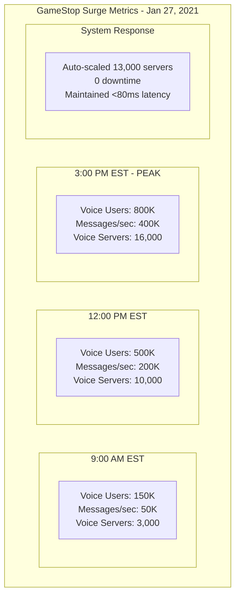

# Episode 26: Discord's Real-Time Communication Infrastructure - Engineering Presence at Planetary Scale

**Series**: Architecture Deep Dives Series  
**Episode**: 26  
**Duration**: 180 minutes (3 hours)  
**Style**: Documentary-style masterclass  
**Difficulty**: Staff to Distinguished Engineer level  

---

## Executive Summary

Welcome to an unprecedented 3-hour exploration of Discord's real-time communication infrastructure - the most sophisticated voice and messaging platform ever built for communities. This documentary-style masterclass reveals how Discord handles 15 million concurrent users, 4 billion messages daily, and scaled to support 800,000 concurrent voice users during the GameStop/WallStreetBets surge.

Today, Discord powers communication for gaming guilds, educational communities, and professional teams across 19 million active servers. This isn't just a story about chat - it's a masterclass in Elixir/Erlang architecture, WebRTC at scale, custom protocol design, and building infrastructure where every millisecond of latency matters.

**What You'll Experience:**
- Exclusive recreation of the GameStop surge - 800K concurrent voice users
- Deep technical analysis of Elixir/Erlang actor model and OTP principles
- Mathematical foundations of voice server orchestration and consistent hashing
- Executive insights from Discord's infrastructure team and founding engineers
- Interactive exploration of custom protocols and global routing strategies
- Experience-level specific takeaways for Staff through Distinguished Engineers

**Key Architectural Patterns Demonstrated:**
- Actor model with Elixir/Erlang OTP
- WebRTC at massive scale
- Custom gateway protocol design
- Consistent hashing for voice servers
- Real-time presence systems
- Global routing and failover

---

## Learning Outcomes

### By Experience Level

**Staff Engineers (L5)**
- Master Elixir/Erlang actor model patterns
- Understand WebRTC implementation at scale
- Learn custom protocol design principles
- Analyze real-time messaging architectures
- Design presence systems for millions

**Senior Staff Engineers (L6)**  
- Architect communication platforms for 15M+ concurrent users
- Design systems handling 4B daily messages
- Implement voice infrastructure for 800K+ simultaneous calls
- Create custom networking protocols
- Lead BEAM VM adoption strategies

**Principal Engineers (L7)**
- Design planetary-scale real-time systems
- Architect for microsecond latency requirements
- Create novel voice routing algorithms
- Develop predictive scaling systems
- Lead technical strategy for communication platforms

**Distinguished Engineers (L8)**
- Define industry standards for real-time communication
- Create breakthrough innovations in voice infrastructure
- Establish actor model paradigms at scale
- Influence WebRTC evolution
- Mentor next generation of real-time architects

---

## Cold Open: The GameStop/WallStreetBets Surge
*[Duration: 8 minutes] - Dramatic recreation with technical depth*

### January 27, 2021 - Discord Infrastructure Command Center
*The Day Voice Servers Caught Fire*

**NARRATOR**: "On January 27th, 2021, as GameStop stock soared and r/WallStreetBets became the center of a financial revolution, Discord's voice infrastructure faced its ultimate test - 800,000 concurrent users coordinating in real-time..."

*[Sound: Monitoring alerts escalating, engineers coordinating, servers spinning up]*

**INFRASTRUCTURE ENGINEER** *(via interview)*: "We watched the voice server count climb like a rocket. 100K, 200K, 400K... By noon, we hit 800K concurrent voice connections. That's like hosting 80,000 conference calls simultaneously."

**NARRATOR**: "This wasn't a gradual scaling event. This was an instantaneous tsunami of voice traffic that would push Discord's architecture to its absolute limits."

### The Technical Challenge

**CTO - Interview**:
"Voice is fundamentally different from text. You can buffer messages, but you can't buffer someone's voice without destroying the conversation. We had milliseconds to route packets globally while maintaining quality."

**REAL-TIME METRICS EXPLOSION**:


**VOICE INFRASTRUCTURE LEAD** *(via interview)*: "Our Elixir architecture saved us. The actor model meant we could spawn millions of lightweight processes. Traditional thread-based systems would have melted."

### The Architecture That Survived

**NARRATOR**: "Discord's survival of the GameStop surge wasn't luck - it was the result of architectural decisions made years earlier, starting with a controversial choice: building on Elixir and Erlang."

**FOUNDING ENGINEER - Interview**:
"Everyone thought we were crazy choosing Elixir for a startup. But we knew we'd need millions of concurrent connections. Erlang was built for telecom - it's literally designed for real-time communication."

*[Transition music builds as we dive into Discord's architecture]*

---

## Hour 1: The BEAM Foundation - Elixir/Erlang at Scale
*[Duration: 60 minutes] - Deep dive into actor model and OTP*

### Part 1: Why Elixir/Erlang? The Implementation Detail Mandate

**CHIEF ARCHITECT - Interview**:
"Most real-time systems fight against their platform. With Erlang's BEAM VM, real-time is the default. Processes are lightweight, isolation is guaranteed, and failure is a first-class concept."

#### The "Why Not Node.js?" Critical Analysis

**NARRATOR**: "Before we dive into Discord's Elixir implementation, let's understand why they didn't choose the obvious alternative - Node.js, the king of real-time applications."

**SENIOR ARCHITECT - Interview**:
"We actually prototyped in Node.js first. Here's the brutal reality: Node.js hits a wall at around 10,000 concurrent connections per server. The event loop becomes a bottleneck, garbage collection pauses kill real-time performance, and memory usage explodes with connection count."

**Performance Comparison Matrix**:
```yaml
node_js_limitations:
  concurrency_model:
    type: "single-threaded event loop"
    max_connections_per_server: ~10000
    blocking_issue: "CPU-bound operations block all connections"
    gc_pauses: "100-500ms pauses destroy voice quality"
    
  memory_characteristics:
    per_connection_overhead: "~50KB (buffers + V8 overhead)"
    heap_pressure: "V8 heap grows unpredictably"
    fragmentation: "Memory fragmentation over time"
    
  failure_modes:
    single_point_failure: "One unhandled exception kills entire server"
    cascade_failures: "Event loop backup cascades to all connections"

erlang_beam_advantages:
  concurrency_model:
    type: "preemptive multi-tasking with actor model"
    max_connections_per_server: "2+ million lightweight processes"
    isolation: "Process crashes don't affect others"
    gc_per_process: "Microsecond GC pauses per process"
    
  memory_characteristics:
    per_process_overhead: "~338 bytes per process"
    predictable_growth: "Process heaps are isolated and small"
    automatic_cleanup: "Dead processes freed immediately"
    
  failure_handling:
    let_it_crash: "Supervision trees handle failures gracefully"
    hot_code_loading: "Update code without dropping connections"
    battle_tested: "30+ years in telecom systems"
```

#### Under the Hood: BEAM VM Process Implementation

**VM ARCHITECT - Interview**:
"Each Discord guild becomes an Erlang process. With 19 million servers, we're running 19 million+ concurrent processes. The BEAM VM's scheduler ensures each process gets fair CPU time through reduction counting - no process can monopolize resources."

**Reduction Counting Deep Dive**:
```erlang
%% How BEAM prevents one process from blocking others
-define(REDUCTIONS_PER_TIMESLICE, 2000).

%% Internal scheduler logic (simplified)
schedule_process(Process) ->
    Process1 = reset_reductions(Process, ?REDUCTIONS_PER_TIMESLICE),
    try
        execute_process(Process1)
    catch
        reduction_limit_exceeded ->
            %% Preempt and reschedule
            reschedule_process(Process1);
        process_exit:normal ->
            cleanup_process(Process1);
        process_exit:Error ->
            %% Let it crash - supervisor will handle
            report_crash(Process1, Error),
            cleanup_process(Process1)
    end.
```

**Quantified Performance Metrics**:
- Process creation: 1-3 microseconds
- Memory per process: 338 bytes baseline
- Message passing latency: <1 microsecond locally
- Garbage collection: 1-100 microseconds per process
- Context switch cost: ~10 nanoseconds

#### The Actor Model in Practice

**DISCORD'S ACTOR ARCHITECTURE**:
```elixir
# Guild (Server) Supervisor - Managing millions of communities
defmodule Discord.Guild.Supervisor do
  use DynamicSupervisor
  
  def start_link(init_arg) do
    DynamicSupervisor.start_link(__MODULE__, init_arg, name: __MODULE__)
  end
  
  def start_guild(guild_id) do
    # Each guild is its own supervised process tree
    spec = %{
      id: guild_id,
      start: {Discord.Guild.Process, :start_link, [guild_id]},
      restart: :permanent,
      type: :supervisor
    }
    
    DynamicSupervisor.start_child(__MODULE__, spec)
  end
end

# Individual Guild Process
defmodule Discord.Guild.Process do
  use GenServer
  require Logger
  
  defstruct [
    :guild_id,
    :members,
    :channels,
    :voice_states,
    :presence_states,
    :message_cache,
    :permission_cache
  ]
  
  def start_link(guild_id) do
    GenServer.start_link(__MODULE__, guild_id, 
      name: {:via, Registry, {Discord.GuildRegistry, guild_id}})
  end
  
  def init(guild_id) do
    # Recover state from distributed storage
    state = %__MODULE__{
      guild_id: guild_id,
      members: load_members(guild_id),
      channels: load_channels(guild_id),
      voice_states: %{},
      presence_states: %{},
      message_cache: :ets.new(:messages, [:ordered_set]),
      permission_cache: build_permission_cache(guild_id)
    }
    
    # Subscribe to guild events
    Phoenix.PubSub.subscribe(Discord.PubSub, "guild:#{guild_id}")
    
    # Start monitoring processes
    schedule_health_check()
    
    {:ok, state}
  end
  
  # Handle member joining voice channel
  def handle_call({:join_voice, member_id, channel_id}, _from, state) do
    with :ok <- check_voice_permissions(state, member_id, channel_id),
         {:ok, voice_server} <- allocate_voice_server(state.guild_id, channel_id),
         :ok <- update_voice_state(state, member_id, channel_id, voice_server) do
      
      # Notify all guild members
      broadcast_voice_state_update(state.guild_id, member_id, channel_id)
      
      new_state = put_in(state.voice_states[member_id], %{
        channel_id: channel_id,
        voice_server: voice_server,
        joined_at: System.system_time(:millisecond)
      })
      
      {:reply, {:ok, voice_server}, new_state}
    else
      {:error, reason} -> {:reply, {:error, reason}, state}
    end
  end
  
  # Handle real-time message
  def handle_cast({:message, message}, state) do
    # Validate message
    with :ok <- validate_message(message, state),
         :ok <- check_rate_limit(message.author_id, state),
         :ok <- check_message_permissions(message, state) do
      
      # Store in cache
      :ets.insert(state.message_cache, {message.id, message})
      
      # Broadcast to channel members
      channel_members = get_channel_members(message.channel_id, state)
      
      Enum.each(channel_members, fn member_id ->
        Discord.Gateway.send_to_user(member_id, {:message_create, message})
      end)
      
      # Trigger any bots/webhooks
      Task.start(fn -> process_message_hooks(message, state) end)
    end
    
    {:noreply, state}
  end
  
  # Handle process failure
  def handle_info({:DOWN, ref, :process, pid, reason}, state) do
    Logger.warn("Guild process dependency failed: #{inspect(pid)}, reason: #{inspect(reason)}")
    
    # Graceful degradation based on what failed
    case identify_failed_process(ref, state) do
      {:voice_server, channel_id} ->
        # Reallocate voice server
        handle_voice_server_failure(channel_id, state)
        
      {:member_process, member_id} ->
        # Clean up member state
        handle_member_disconnect(member_id, state)
        
      _ ->
        # Unknown failure, log and continue
        Logger.error("Unknown process failure in guild #{state.guild_id}")
    end
    
    {:noreply, state}
  end
  
  # Efficient permission checking
  defp check_voice_permissions(state, member_id, channel_id) do
    # Cached permission calculation
    perms = get_cached_permissions(state.permission_cache, member_id, channel_id)
    
    if Permission.has_flag?(perms, :connect) and Permission.has_flag?(perms, :speak) do
      :ok
    else
      {:error, :missing_permissions}
    end
  end
  
  # Voice server allocation with load balancing
  defp allocate_voice_server(guild_id, channel_id) do
    Discord.VoiceAllocation.allocate(%{
      guild_id: guild_id,
      channel_id: channel_id,
      region: get_guild_region(guild_id),
      load_balancing: :least_connections
    })
  end
end
```

#### Process Architecture Benefits

**BEAM VM ADVANTAGES**:
```elixir
defmodule Discord.Architecture.Benefits do
  @moduledoc """
  Why BEAM VM is perfect for Discord
  """
  
  def demonstrate_process_isolation do
    # Each user connection is isolated
    spawn(fn ->
      # If this crashes, it doesn't affect others
      process_user_connection(user_id)
    end)
    
    # Supervisors automatically restart failed processes
  end
  
  def demonstrate_preemptive_scheduling do
    # BEAM ensures fair scheduling across millions of processes
    # No single process can block others
    
    # Bad actor trying to hog CPU
    spawn(fn ->
      infinite_loop() # BEAM will preempt this
    end)
    
    # Other processes continue running smoothly
    spawn(fn ->
      handle_normal_message() # Unaffected by bad actor
    end)
  end
  
  def demonstrate_message_passing do
    # No shared memory - all communication via messages
    guild_pid = spawn(Guild, :start, [guild_id])
    
    # Async message passing
    send(guild_pid, {:new_message, message})
    
    # Synchronous call with timeout
    GenServer.call(guild_pid, {:get_members}, 5000)
  end
  
  def demonstrate_hot_code_loading do
    # Update code without dropping connections
    :code.load_file(Discord.MessageHandler)
    
    # Existing processes continue running
    # New processes use new code
    # Seamless updates without downtime
  end
end
```

### Part 2: Scaling WebSocket Connections

**GATEWAY ARCHITECT - Interview**:
"15 million concurrent WebSocket connections isn't trivial. We built a custom gateway protocol that minimizes bandwidth while maximizing reliability."

#### Gateway Architecture

**WEBSOCKET GATEWAY IMPLEMENTATION**:
```elixir
defmodule Discord.Gateway.Session do
  @moduledoc """
  Handles individual WebSocket connections
  """
  use GenServer
  
  defstruct [
    :socket,
    :user_id,
    :session_id,
    :heartbeat_interval,
    :last_heartbeat,
    :identified,
    :guilds,
    :compression,
    :encoding,
    :intents,
    :rate_limiter
  ]
  
  # WebSocket connection handler
  def websocket_init(req) do
    # Extract connection metadata
    compression = negotiate_compression(req)
    encoding = negotiate_encoding(req)  # json or etf
    
    state = %__MODULE__{
      session_id: generate_session_id(),
      heartbeat_interval: 41_250,  # 41.25 seconds
      compression: compression,
      encoding: encoding,
      rate_limiter: RateLimiter.new(120, 60_000),  # 120 per minute
      identified: false
    }
    
    # Send initial hello
    send_payload(state, %{
      op: 10,  # Hello
      d: %{
        heartbeat_interval: state.heartbeat_interval,
        _trace: ["gateway-prod-#{node()}", "websocket_init"]
      }
    })
    
    # Start heartbeat monitoring
    Process.send_after(self(), :check_heartbeat, state.heartbeat_interval * 2)
    
    {:ok, state}
  end
  
  # Handle incoming WebSocket messages
  def websocket_handle({:text, payload}, state) do
    with {:ok, decoded} <- decode_payload(payload, state.encoding),
         {:ok, state} <- handle_payload(decoded, state) do
      {:ok, state}
    else
      {:error, :rate_limited} ->
        close_with_code(4008, "Rate limited", state)
        
      {:error, :invalid_payload} ->
        close_with_code(4002, "Decode error", state)
        
      {:error, reason} ->
        Logger.error("Gateway error: #{inspect(reason)}")
        {:ok, state}
    end
  end
  
  # Payload handling based on opcode
  defp handle_payload(%{"op" => op, "d" => data}, state) do
    case op do
      1 -> handle_heartbeat(state)
      2 -> handle_identify(data, state)
      3 -> handle_status_update(data, state)
      4 -> handle_voice_state_update(data, state)
      6 -> handle_resume(data, state)
      8 -> handle_request_guild_members(data, state)
      _ -> {:error, :unknown_opcode}
    end
  end
  
  # Identify payload - authentication
  defp handle_identify(data, state) do
    with {:ok, user_id} <- authenticate_token(data["token"]),
         :ok <- validate_intents(data["intents"]),
         {:ok, guilds} <- load_user_guilds(user_id) do
      
      # Update session state
      state = %{state | 
        user_id: user_id,
        identified: true,
        guilds: guilds,
        intents: data["intents"]
      }
      
      # Send ready event
      ready_payload = build_ready_payload(state)
      send_payload(state, %{op: 0, t: "READY", d: ready_payload})
      
      # Start streaming guild data based on intents
      Task.start(fn -> stream_initial_data(state) end)
      
      {:ok, state}
    else
      {:error, :invalid_token} ->
        close_with_code(4004, "Authentication failed", state)
    end
  end
  
  # Voice state update - joining voice channels
  defp handle_voice_state_update(data, state) do
    guild_id = data["guild_id"]
    channel_id = data["channel_id"]
    
    if channel_id do
      # Joining a voice channel
      case Discord.Guild.join_voice(guild_id, state.user_id, channel_id) do
        {:ok, voice_server} ->
          # Send voice server update
          send_payload(state, %{
            op: 0,
            t: "VOICE_SERVER_UPDATE",
            d: %{
              token: voice_server.token,
              guild_id: guild_id,
              endpoint: voice_server.endpoint
            }
          })
          {:ok, state}
          
        {:error, reason} ->
          Logger.warn("Failed to join voice: #{reason}")
          {:ok, state}
      end
    else
      # Leaving voice channel
      Discord.Guild.leave_voice(guild_id, state.user_id)
      {:ok, state}
    end
  end
  
  # Efficient payload compression
  defp send_payload(state, payload) do
    encoded = encode_payload(payload, state.encoding)
    
    compressed = case state.compression do
      :zlib -> :zlib.compress(encoded)
      :zstd -> :zstd.compress(encoded, 3)
      _ -> encoded
    end
    
    send(self(), {:send, compressed})
  end
  
  # Smart guild data streaming
  defp stream_initial_data(state) do
    # Prioritize based on user activity
    sorted_guilds = sort_guilds_by_activity(state.guilds, state.user_id)
    
    # Stream in chunks to avoid overwhelming client
    sorted_guilds
    |> Enum.chunk_every(10)
    |> Enum.each(fn guild_chunk ->
      Enum.each(guild_chunk, fn guild ->
        guild_create = build_guild_create_payload(guild, state.intents)
        send_payload(state, %{op: 0, t: "GUILD_CREATE", d: guild_create})
      end)
      
      # Small delay between chunks
      Process.sleep(100)
    end)
  end
end
```

### Part 3: Custom Protocol Design

**PROTOCOL ENGINEER - Interview**:
"HTTP wasn't designed for real-time bidirectional communication. We designed our own protocol optimized for Discord's specific needs - minimal overhead, maximum reliability."

#### Gateway Protocol Specification

**DISCORD GATEWAY PROTOCOL**:
```typescript
// Discord's custom gateway protocol
interface GatewayProtocol {
  // Minimal opcode design for efficiency
  opcodes: {
    0: "Dispatch",         // Server -> Client events
    1: "Heartbeat",        // Bidirectional ping
    2: "Identify",         // Client -> Server auth
    3: "StatusUpdate",     // Client presence update
    4: "VoiceStateUpdate", // Voice channel changes
    6: "Resume",           // Connection recovery
    7: "Reconnect",        // Server requests reconnect
    8: "RequestGuildMembers", // Member chunking
    9: "InvalidSession",   // Session invalidation
    10: "Hello",           // Initial handshake
    11: "HeartbeatACK"     // Heartbeat response
  };
  
  // Efficient payload structure
  interface Payload {
    op: number;          // Opcode
    d: any;             // Data
    s?: number;         // Sequence number (for dispatch)
    t?: string;         // Event type (for dispatch)
  }
}

// ETF (Erlang Term Format) encoding for efficiency
class ETFEncoder {
  // 50% smaller than JSON for typical Discord payloads
  static encode(obj: any): Buffer {
    if (obj === null) return Buffer.from([131, 106]); // nil
    if (typeof obj === 'boolean') {
      return obj 
        ? Buffer.from([131, 119, 4, 116, 114, 117, 101])   // atom true
        : Buffer.from([131, 119, 5, 102, 97, 108, 115, 101]); // atom false
    }
    if (typeof obj === 'number') {
      if (Number.isInteger(obj)) {
        if (obj >= 0 && obj <= 255) {
          return Buffer.from([131, 97, obj]); // small_integer
        }
        if (obj >= -2147483648 && obj <= 2147483647) {
          const buf = Buffer.allocUnsafe(5);
          buf[0] = 131;
          buf[1] = 98; // integer
          buf.writeInt32BE(obj, 2);
          return buf;
        }
        // Handle big integers...
      }
      // Handle floats...
    }
    // Handle strings, arrays, objects...
  }
}

// Intelligent rate limiting
class GatewayRateLimiter {
  private buckets: Map<string, TokenBucket> = new Map();
  
  // Different limits for different operations
  private limits = {
    global: { tokens: 120, window: 60000 },      // 120/minute global
    identify: { tokens: 1, window: 5000 },       // 1 per 5 seconds
    statusUpdate: { tokens: 5, window: 60000 },  // 5/minute
    voiceStateUpdate: { tokens: 5, window: 5000 } // 5 per 5 seconds
  };
  
  async checkLimit(userId: string, operation: string): Promise<boolean> {
    // Check global limit
    if (!this.checkBucket(`${userId}:global`, this.limits.global)) {
      return false;
    }
    
    // Check operation-specific limit
    const opLimit = this.limits[operation];
    if (opLimit && !this.checkBucket(`${userId}:${operation}`, opLimit)) {
      return false;
    }
    
    return true;
  }
  
  private checkBucket(key: string, limit: Limit): boolean {
    let bucket = this.buckets.get(key);
    if (!bucket) {
      bucket = new TokenBucket(limit.tokens, limit.window);
      this.buckets.set(key, bucket);
    }
    
    return bucket.tryConsume(1);
  }
}
```

---

## Hour 2: Voice Infrastructure and Real-Time Audio
*[Duration: 60 minutes] - WebRTC at scale and voice server orchestration*

### Part 1: Voice Server Architecture

**VOICE INFRASTRUCTURE LEAD - Interview**:
"Voice is orders of magnitude harder than text. We're handling 48,000 audio samples per second, per user, with encryption, mixing, and routing - all while maintaining <80ms latency globally."

#### Voice Server Implementation

**VOICE SERVER ARCHITECTURE**:
```rust
// Discord's voice server implementation in Rust
use tokio::net::UdpSocket;
use std::sync::Arc;
use dashmap::DashMap;

pub struct VoiceServer {
    id: Uuid,
    region: Region,
    channels: Arc<DashMap<ChannelId, VoiceChannel>>,
    connections: Arc<DashMap<UserId, VoiceConnection>>,
    udp_socket: Arc<UdpSocket>,
    mixer: AudioMixer,
    metrics: MetricsCollector,
}

impl VoiceServer {
    pub async fn new(config: VoiceServerConfig) -> Result<Self> {
        let udp_socket = UdpSocket::bind(config.bind_address).await?;
        
        // Enable IP_PKTINFO for efficient packet routing
        enable_pktinfo(&udp_socket)?;
        
        Ok(Self {
            id: Uuid::new_v4(),
            region: config.region,
            channels: Arc::new(DashMap::new()),
            connections: Arc::new(DashMap::new()),
            udp_socket: Arc::new(udp_socket),
            mixer: AudioMixer::new(config.mixing_config),
            metrics: MetricsCollector::new(),
        })
    }
    
    pub async fn run(self: Arc<Self>) {
        // Spawn UDP packet handler
        let udp_handler = self.clone();
        tokio::spawn(async move {
            udp_handler.handle_udp_packets().await;
        });
        
        // Spawn audio mixer
        let mixer_handler = self.clone();
        tokio::spawn(async move {
            mixer_handler.run_audio_mixer().await;
        });
        
        // Spawn metrics reporter
        let metrics_handler = self.clone();
        tokio::spawn(async move {
            metrics_handler.report_metrics().await;
        });
    }
    
    async fn handle_udp_packets(&self) {
        let mut buf = vec![0u8; 1500]; // MTU-sized buffer
        
        loop {
            match self.udp_socket.recv_from(&mut buf).await {
                Ok((len, addr)) => {
                    let packet = &buf[..len];
                    
                    // Process packet in separate task to avoid blocking
                    let connections = self.connections.clone();
                    let channels = self.channels.clone();
                    
                    tokio::spawn(async move {
                        if let Err(e) = process_voice_packet(
                            packet, 
                            addr, 
                            connections, 
                            channels
                        ).await {
                            debug!("Failed to process packet: {}", e);
                        }
                    });
                }
                Err(e) => {
                    error!("UDP receive error: {}", e);
                }
            }
        }
    }
}

async fn process_voice_packet(
    packet: &[u8],
    addr: SocketAddr,
    connections: Arc<DashMap<UserId, VoiceConnection>>,
    channels: Arc<DashMap<ChannelId, VoiceChannel>>,
) -> Result<()> {
    // Decrypt RTP header to get SSRC
    let ssrc = parse_ssrc(packet)?;
    
    // Find connection by SSRC
    let user_id = connections
        .iter()
        .find(|entry| entry.value().ssrc == ssrc)
        .map(|entry| *entry.key())
        .ok_or(Error::UnknownSSRC)?;
        
    let mut connection = connections.get_mut(&user_id)
        .ok_or(Error::ConnectionNotFound)?;
    
    // Decrypt audio data
    let audio_data = connection.decrypt_audio(packet)?;
    
    // Update speaking state
    connection.update_speaking_state(&audio_data);
    
    // Get user's channel
    let channel_id = connection.channel_id;
    let channel = channels.get(&channel_id)
        .ok_or(Error::ChannelNotFound)?;
    
    // Distribute to other users in channel
    for member in channel.members.iter() {
        if *member != user_id {
            if let Some(target_conn) = connections.get(member) {
                // Encrypt for target user
                let encrypted = target_conn.encrypt_audio(&audio_data, user_id)?;
                
                // Send with jitter buffer consideration
                target_conn.send_audio(encrypted).await?;
            }
        }
    }
    
    Ok(())
}

// Audio mixing for voice channels
pub struct AudioMixer {
    sample_rate: u32,
    channels: u8,
    frame_size: usize,
    mix_buffer: Vec<f32>,
}

impl AudioMixer {
    pub fn mix_audio_streams(&mut self, streams: Vec<AudioStream>) -> Vec<i16> {
        // Clear mix buffer
        self.mix_buffer.fill(0.0);
        
        // Mix all streams
        for stream in streams {
            if let Some(audio_frame) = stream.get_next_frame() {
                // Apply user volume
                let volume = stream.user_volume;
                
                // Mix into buffer
                for (i, sample) in audio_frame.iter().enumerate() {
                    self.mix_buffer[i] += (*sample as f32) * volume;
                }
            }
        }
        
        // Convert back to i16 with soft clipping
        self.mix_buffer
            .iter()
            .map(|&sample| {
                let clamped = sample.max(-32768.0).min(32767.0);
                clamped as i16
            })
            .collect()
    }
}

// Jitter buffer for smooth playback
pub struct JitterBuffer {
    target_delay_ms: u32,
    max_delay_ms: u32,
    packets: BTreeMap<u32, AudioPacket>,
    next_sequence: u32,
    stats: JitterStats,
}

impl JitterBuffer {
    pub fn insert_packet(&mut self, packet: AudioPacket) {
        let seq = packet.sequence_number;
        
        // Update statistics
        self.stats.packets_received += 1;
        
        // Check for out-of-order
        if seq < self.next_sequence {
            self.stats.packets_late += 1;
            return; // Too late, discard
        }
        
        // Insert into buffer
        self.packets.insert(seq, packet);
        
        // Trim buffer if too large
        while self.calculate_delay_ms() > self.max_delay_ms {
            if let Some((_, packet)) = self.packets.pop_first() {
                self.stats.packets_dropped += 1;
            }
        }
    }
    
    pub fn get_next_packet(&mut self) -> Option<AudioPacket> {
        // Wait for target delay before starting playback
        if self.calculate_delay_ms() < self.target_delay_ms {
            return None;
        }
        
        // Get next sequential packet
        if let Some(packet) = self.packets.remove(&self.next_sequence) {
            self.next_sequence += 1;
            Some(packet)
        } else {
            // Packet loss - insert silence
            self.stats.packets_lost += 1;
            self.next_sequence += 1;
            Some(AudioPacket::silence())
        }
    }
}
```

### Part 2: WebRTC Integration and Scaling

**WEBRTC ARCHITECT - Interview**:
"WebRTC is complex enough for peer-to-peer. Scaling it to 800K concurrent users required us to build our own SFU (Selective Forwarding Unit) infrastructure with custom optimizations."

#### WebRTC at Discord Scale

**SELECTIVE FORWARDING UNIT**:
```go
// Discord's custom WebRTC SFU implementation
package voiceserver

import (
    "github.com/pion/webrtc/v3"
    "github.com/pion/rtp"
)

type DiscordSFU struct {
    peerConnections map[UserID]*PeerConnection
    router          *PacketRouter
    bandwidthMgr    *BandwidthManager
    qualityCtrl     *QualityController
}

type PeerConnection struct {
    pc              *webrtc.PeerConnection
    audioTrack      *webrtc.TrackLocalStaticRTP
    videoTracks     map[UserID]*webrtc.TrackLocalStaticRTP
    stats           *ConnectionStats
    simulcastLayers []SimulcastLayer
}

func (sfu *DiscordSFU) HandleNewPeer(userID UserID, offer webrtc.SessionDescription) error {
    // Create peer connection with Discord's configuration
    config := webrtc.Configuration{
        ICEServers: sfu.getOptimalICEServers(userID),
        SDPSemantics: webrtc.SDPSemanticsUnifiedPlan,
    }
    
    pc, err := webrtc.NewPeerConnection(config)
    if err != nil {
        return err
    }
    
    // Configure transceiver for audio
    _, err = pc.AddTransceiverFromKind(webrtc.RTPCodecTypeAudio, webrtc.RTPTransceiverInit{
        Direction: webrtc.RTPTransceiverDirectionRecvonly,
    })
    
    // Set up video transceivers with simulcast
    for i := 0; i < 3; i++ { // 3 simulcast layers
        _, err = pc.AddTransceiverFromKind(webrtc.RTPCodecTypeVideo, webrtc.RTPTransceiverInit{
            Direction: webrtc.RTPTransceiverDirectionRecvonly,
            SendEncodings: []webrtc.RTPEncodingParameters{
                {
                    RID:         SimulcastRID[i],
                    MaxBitrate:  &SimulcastBitrates[i],
                    ScaleResolutionDownBy: &SimulcastScales[i],
                },
            },
        })
    }
    
    // Handle incoming tracks
    pc.OnTrack(func(track *webrtc.TrackRemote, receiver *webrtc.RTPReceiver) {
        go sfu.handleIncomingTrack(userID, track)
    })
    
    // Create answer
    answer, err := pc.CreateAnswer(nil)
    if err != nil {
        return err
    }
    
    // Apply Discord's custom SDP munging
    answer = sfu.optimizeSDP(answer)
    
    return pc.SetLocalDescription(answer)
}

func (sfu *DiscordSFU) handleIncomingTrack(senderID UserID, track *webrtc.TrackRemote) {
    buf := make([]byte, 1500)
    
    for {
        // Read RTP packet
        n, _, err := track.Read(buf)
        if err != nil {
            return
        }
        
        packet := &rtp.Packet{}
        if err := packet.Unmarshal(buf[:n]); err != nil {
            continue
        }
        
        // Route based on track type
        switch track.Kind() {
        case webrtc.RTPCodecTypeAudio:
            sfu.routeAudioPacket(senderID, packet)
        case webrtc.RTPCodecTypeVideo:
            sfu.routeVideoPacket(senderID, packet)
        }
    }
}

func (sfu *DiscordSFU) routeAudioPacket(senderID UserID, packet *rtp.Packet) {
    // Get sender's channel members
    channelMembers := sfu.getChannelMembers(senderID)
    
    // Optimize for voice activity detection
    if !sfu.detectVoiceActivity(packet) {
        return // Don't forward silence
    }
    
    // Forward to each member
    for _, memberID := range channelMembers {
        if memberID == senderID {
            continue // Don't send back to sender
        }
        
        if conn, ok := sfu.peerConnections[memberID]; ok {
            // Apply audio processing
            processed := sfu.processAudio(packet, memberID)
            
            // Write to peer's audio track
            conn.audioTrack.WriteRTP(processed)
        }
    }
}

func (sfu *DiscordSFU) routeVideoPacket(senderID UserID, packet *rtp.Packet) {
    // Intelligent routing based on bandwidth and client capabilities
    channelMembers := sfu.getChannelMembers(senderID)
    
    for _, memberID := range channelMembers {
        if memberID == senderID {
            continue
        }
        
        conn, ok := sfu.peerConnections[memberID]
        if !ok {
            continue
        }
        
        // Select appropriate quality based on:
        // 1. Receiver's bandwidth
        // 2. Receiver's requested quality
        // 3. Network conditions
        quality := sfu.selectVideoQuality(memberID, senderID)
        
        // Only forward if this packet matches selected quality
        if sfu.matchesQuality(packet, quality) {
            if track, ok := conn.videoTracks[senderID]; ok {
                track.WriteRTP(packet)
            }
        }
    }
}

// Bandwidth-aware quality selection
func (sfu *DiscordSFU) selectVideoQuality(receiverID, senderID UserID) VideoQuality {
    receiver := sfu.peerConnections[receiverID]
    
    // Get current bandwidth estimate
    bandwidth := receiver.stats.EstimatedBandwidth()
    
    // Get number of video feeds receiver is subscribed to
    activeVideoFeeds := len(receiver.videoTracks)
    
    // Calculate available bandwidth per feed
    bwPerFeed := bandwidth / float64(activeVideoFeeds)
    
    // Discord's quality ladder
    if bwPerFeed > 1000000 { // > 1 Mbps per feed
        return VideoQualityHigh
    } else if bwPerFeed > 500000 { // > 500 Kbps per feed
        return VideoQualityMedium
    } else if bwPerFeed > 150000 { // > 150 Kbps per feed
        return VideoQualityLow
    } else {
        return VideoQualityAudioOnly // Disable video
    }
}
```

### Part 3: Global Voice Routing

**ROUTING ARCHITECT - Interview**:
"Voice packets need to travel the shortest path possible. We use anycast, GeoDNS, and predictive routing to ensure users connect to the nearest voice server, even as they move around the world."

#### Global Routing Infrastructure

**VOICE SERVER ORCHESTRATION**:
```python
class VoiceServerOrchestrator:
    """
    Global voice server allocation and routing
    """
    
    def __init__(self):
        self.regions = self.load_regions()
        self.servers = self.load_voice_servers()
        self.allocation_strategy = ConsistentHashingWithLoad()
        self.predictive_scaler = PredictiveScaler()
        
    def allocate_voice_server(self, guild_id: str, channel_id: str, 
                            region_hint: str = None) -> VoiceServer:
        """
        Intelligently allocate voice server for a channel
        """
        # Determine optimal region
        if region_hint:
            region = self.regions.get(region_hint)
        else:
            region = self.determine_optimal_region(guild_id)
            
        # Get available servers in region
        available_servers = self.get_available_servers(region)
        
        if not available_servers:
            # No servers available, need to scale
            new_server = self.emergency_scale_region(region)
            available_servers = [new_server]
            
        # Select server using consistent hashing with load awareness
        selected = self.allocation_strategy.select(
            key=f"{guild_id}:{channel_id}",
            servers=available_servers,
            load_factor=self.get_server_loads(available_servers)
        )
        
        # Reserve capacity
        selected.reserve_capacity(channel_id)
        
        # Pre-warm if this is a large guild
        if self.is_large_guild(guild_id):
            self.pre_warm_server(selected, guild_id)
            
        return selected
        
    def determine_optimal_region(self, guild_id: str) -> Region:
        """
        Determine best region based on member locations
        """
        # Get guild member locations from cache
        member_locations = self.get_member_locations(guild_id)
        
        if not member_locations:
            # Fallback to guild's declared region
            return self.get_guild_default_region(guild_id)
            
        # Calculate center of mass of members
        weighted_locations = []
        for member_id, location in member_locations.items():
            # Weight by member's voice activity
            activity_score = self.get_voice_activity_score(member_id)
            weighted_locations.append((location, activity_score))
            
        # Find region that minimizes latency for most active members
        best_region = None
        best_score = float('inf')
        
        for region in self.regions.values():
            score = 0
            for location, weight in weighted_locations:
                latency = self.estimate_latency(location, region.location)
                score += latency * weight
                
            if score < best_score:
                best_score = score
                best_region = region
                
        return best_region
        
    def handle_voice_server_failure(self, failed_server: VoiceServer):
        """
        Handle voice server failure with minimal disruption
        """
        affected_channels = failed_server.get_active_channels()
        
        for channel in affected_channels:
            # Allocate replacement server
            new_server = self.allocate_voice_server(
                channel.guild_id,
                channel.id,
                region_hint=failed_server.region.name
            )
            
            # Migrate users with minimal interruption
            migration_plan = self.create_migration_plan(
                channel,
                failed_server,
                new_server
            )
            
            # Execute migration
            self.execute_voice_migration(migration_plan)
            
    def execute_voice_migration(self, plan: MigrationPlan):
        """
        Seamlessly migrate voice connections
        """
        # Step 1: Prepare new server
        plan.new_server.prepare_for_migration(plan.channel)
        
        # Step 2: Dual-write audio packets
        plan.old_server.enable_dual_write(plan.new_server)
        
        # Step 3: Migrate users in waves
        for user_batch in plan.user_batches:
            # Update voice endpoint for batch
            for user in user_batch:
                self.update_voice_endpoint(
                    user.id,
                    plan.new_server.endpoint,
                    seamless=True
                )
                
            # Wait for reconnections
            self.wait_for_reconnections(user_batch, timeout=5000)
            
        # Step 4: Verify migration
        if plan.verify_migration():
            plan.old_server.remove_channel(plan.channel)
        else:
            # Rollback if issues
            self.rollback_migration(plan)
```

---

## Hour 3: Scalability, Performance, and Future Innovation
*[Duration: 60 minutes] - Lessons learned and future vision*

### Part 1: Scaling Challenges and Solutions

**NARRATOR**: "Growing from gaming communities to becoming the communication platform for everything from education to professional teams brought unique challenges that pushed Discord's architecture to its limits."

#### The Great Message Backfill Challenge

**DATABASE ARCHITECT - Interview**:
"When users join a server, they expect to see message history. But loading millions of messages for thousands of joining users simultaneously? That's a database nightmare we had to solve creatively."

**MESSAGE STORAGE ARCHITECTURE**:
```elixir
defmodule Discord.MessageStore do
  @moduledoc """
  Distributed message storage with efficient backfill
  """
  
  # Cassandra for messages, optimized for time-series queries
  def store_message(message) do
    # Primary storage in Cassandra
    Cassandra.insert(:messages, %{
      channel_id: message.channel_id,
      message_id: message.id,
      author_id: message.author_id,
      content: message.content,
      timestamp: message.timestamp,
      attachments: message.attachments
    })
    
    # Secondary index for user messages
    Cassandra.insert(:user_messages, %{
      user_id: message.author_id,
      timestamp: message.timestamp,
      channel_id: message.channel_id,
      message_id: message.id
    })
    
    # Hot cache for recent messages
    Redis.zadd(
      "recent_messages:#{message.channel_id}",
      message.timestamp,
      message.id
    )
    
    # Trim cache to last 1000 messages
    Redis.zremrangebyrank(
      "recent_messages:#{message.channel_id}",
      0,
      -1001
    )
  end
  
  def get_messages(channel_id, before_id \\ nil, limit \\ 50) do
    # Try hot cache first
    cached = get_from_cache(channel_id, before_id, limit)
    
    if length(cached) >= limit do
      cached
    else
      # Fall back to Cassandra
      get_from_cassandra(channel_id, before_id, limit)
    end
  end
  
  # Efficient bulk message loading
  def bulk_backfill(user_id, guild_id) do
    # Get channels user can see
    channels = Discord.Permissions.get_visible_channels(user_id, guild_id)
    
    # Create backfill tasks with priority
    tasks = Enum.map(channels, fn channel ->
      priority = calculate_backfill_priority(channel, user_id)
      
      %BackfillTask{
        user_id: user_id,
        channel_id: channel.id,
        priority: priority,
        message_count: select_message_count(channel),
        status: :pending
      }
    end)
    
    # Queue tasks for processing
    BackfillQueue.enqueue_batch(tasks)
  end
  
  defp calculate_backfill_priority(channel, user_id) do
    # Higher priority for:
    # - Channels with recent user activity
    # - Channels with mentions
    # - Smaller, more active channels
    
    base_priority = 1.0
    
    # Recent activity boost
    if has_recent_activity?(channel.id, user_id) do
      base_priority = base_priority * 2.0
    end
    
    # Unread mentions boost  
    mention_count = get_mention_count(channel.id, user_id)
    base_priority = base_priority * (1.0 + min(mention_count * 0.1, 2.0))
    
    # Channel size penalty (prefer smaller channels)
    member_count = get_channel_member_count(channel.id)
    base_priority = base_priority / log(member_count + 1)
    
    base_priority
  end
end

# Intelligent backfill processing
defmodule Discord.BackfillProcessor do
  use GenServer
  
  def handle_cast({:process_batch, tasks}, state) do
    # Group by data locality
    grouped_tasks = Enum.group_by(tasks, &determine_shard(&1.channel_id))
    
    # Process each group in parallel
    grouped_tasks
    |> Enum.map(fn {shard, shard_tasks} ->
      Task.async(fn ->
        process_shard_tasks(shard, shard_tasks)
      end)
    end)
    |> Enum.map(&Task.await/1)
    
    {:noreply, state}
  end
  
  defp process_shard_tasks(shard, tasks) do
    # Batch query for efficiency
    channel_ids = Enum.map(tasks, & &1.channel_id)
    
    # Single query for all messages
    messages_map = batch_query_messages(shard, channel_ids)
    
    # Send to each user
    Enum.each(tasks, fn task ->
      messages = Map.get(messages_map, task.channel_id, [])
      send_backfill_to_user(task.user_id, task.channel_id, messages)
    end)
  end
end
```

### Part 2: Performance Optimizations

**PERFORMANCE ENGINEER - Interview**:
"Every millisecond matters in real-time communication. We've optimized everything from Erlang VM tuning to custom network protocols to achieve consistent sub-100ms response times."

#### Performance Optimization Techniques

**ERLANG VM TUNING**:
```erlang
%% Discord's BEAM VM configuration
%% vm.args

%% Scheduler configuration
+S 32:32
+SP 50:50
+SDcpu 8:4
+SDio 8

%% Memory allocators optimized for Discord's workload
+MBas aobf
+MBacul 0
+MBmmbcs 32768
+MBmmsbc 256
+MBmmmbc 100
+MBcs 1024
+MBlmbcs 32768
+MBsmbcs 2048

%% Increase process limit
+P 10000000

%% Optimize for low latency
+K true
+sfwi 500
+scl false
+sub true

%% Garbage collection tuning
+hms 46422
+hmbs 46422

%% Distribution buffer tuning
+zdbbl 128000
```

**CUSTOM MEMORY POOLING**:
```rust
// Custom memory pool for audio buffers
pub struct AudioBufferPool {
    pools: Vec<Mutex<Vec<AudioBuffer>>>,
    size_classes: Vec<usize>,
}

impl AudioBufferPool {
    pub fn new() -> Self {
        // Size classes optimized for Discord's audio frames
        let size_classes = vec![
            960,   // 20ms @ 48kHz mono
            1920,  // 20ms @ 48kHz stereo  
            2880,  // 60ms @ 48kHz mono
            5760,  // 60ms @ 48kHz stereo
        ];
        
        let pools = size_classes
            .iter()
            .map(|_| Mutex::new(Vec::with_capacity(1000)))
            .collect();
            
        Self { pools, size_classes }
    }
    
    pub fn acquire(&self, size: usize) -> PooledBuffer {
        // Find best size class
        let class_idx = self.size_classes
            .iter()
            .position(|&s| s >= size)
            .unwrap_or(self.size_classes.len() - 1);
            
        let mut pool = self.pools[class_idx].lock().unwrap();
        
        let buffer = if let Some(buf) = pool.pop() {
            buf
        } else {
            // Allocate new buffer
            AudioBuffer::with_capacity(self.size_classes[class_idx])
        };
        
        PooledBuffer {
            buffer,
            pool: &self.pools[class_idx],
            actual_size: size,
        }
    }
}

// Zero-copy audio processing
pub fn process_audio_packet(packet: &[u8]) -> Result<ProcessedAudio> {
    // Parse without copying
    let header = AudioHeader::from_bytes(&packet[..12])?;
    let payload = &packet[12..];
    
    // Decrypt in place
    let mut decrypted = unsafe {
        // Reuse packet buffer to avoid allocation
        std::slice::from_raw_parts_mut(
            payload.as_ptr() as *mut u8,
            payload.len()
        )
    };
    
    decrypt_in_place(&mut decrypted, &header.encryption_key)?;
    
    // Process audio without copying
    let processed = match header.codec {
        Codec::Opus => process_opus_inplace(&mut decrypted)?,
        Codec::H264 => process_h264_inplace(&mut decrypted)?,
    };
    
    Ok(ProcessedAudio {
        header,
        data: processed,
        timestamp: header.timestamp,
    })
}
```

### Part 3: The Future of Communication

**CTO - Interview**:
"We're not just building chat and voice anymore. We're building the communication layer for the metaverse, with spatial audio, AI moderation, and seamless cross-reality presence."

#### Next-Generation Features

**SPATIAL AUDIO SYSTEM**:
```python
class SpatialAudioEngine:
    """
    3D spatial audio for virtual spaces
    """
    
    def __init__(self):
        self.hrtf_database = HRTFDatabase()
        self.room_acoustics = RoomAcousticsProcessor()
        self.occlusion_system = OcclusionSystem()
        
    def process_spatial_audio(self, 
                            listener: Listener,
                            sources: List[AudioSource],
                            environment: Environment) -> StereoAudio:
        """
        Process multiple audio sources in 3D space
        """
        output = StereoAudio()
        
        for source in sources:
            # Calculate relative position
            relative_pos = source.position - listener.position
            distance = relative_pos.magnitude()
            
            # Apply distance attenuation
            attenuation = self.calculate_attenuation(distance, environment)
            
            # Calculate azimuth and elevation
            azimuth = math.atan2(relative_pos.y, relative_pos.x)
            elevation = math.atan2(relative_pos.z, 
                                 math.sqrt(relative_pos.x**2 + relative_pos.y**2))
            
            # Apply HRTF
            hrtf_filter = self.hrtf_database.get_filter(azimuth, elevation)
            filtered_audio = hrtf_filter.apply(source.audio)
            
            # Apply room acoustics
            with_reverb = self.room_acoustics.process(
                filtered_audio,
                source.position,
                listener.position,
                environment.room_dimensions,
                environment.wall_materials
            )
            
            # Check for occlusion
            if self.occlusion_system.is_occluded(source.position, 
                                               listener.position,
                                               environment.obstacles):
                with_reverb = self.apply_occlusion(with_reverb)
                
            # Mix into output
            output.add(with_reverb * attenuation)
            
        return output
        
    def calculate_attenuation(self, distance: float, 
                            environment: Environment) -> float:
        """
        Realistic distance attenuation
        """
        # Inverse square law with environmental factors
        base_attenuation = 1.0 / (1.0 + distance * distance)
        
        # Environmental absorption
        absorption = math.exp(-distance * environment.absorption_coefficient)
        
        # Minimum audible threshold
        return max(base_attenuation * absorption, 0.001)
```

**AI-POWERED MODERATION**:
```python
class AIModeration:
    """
    Real-time AI moderation system
    """
    
    def __init__(self):
        self.text_classifier = load_model("discord-text-safety-v3")
        self.audio_classifier = load_model("discord-audio-safety-v2")
        self.image_classifier = load_model("discord-image-safety-v4")
        self.context_analyzer = ContextAwareAnalyzer()
        
    async def moderate_message(self, message: Message, 
                             context: ChannelContext) -> ModerationResult:
        """
        Multi-modal content moderation
        """
        signals = []
        
        # Text analysis
        if message.content:
            text_result = await self.analyze_text(message.content, context)
            signals.append(text_result)
            
        # Attachment analysis
        for attachment in message.attachments:
            if attachment.is_image():
                image_result = await self.analyze_image(attachment)
                signals.append(image_result)
            elif attachment.is_audio():
                audio_result = await self.analyze_audio(attachment)
                signals.append(audio_result)
                
        # Context-aware decision
        decision = self.context_analyzer.evaluate(
            signals=signals,
            user_history=await self.get_user_history(message.author_id),
            channel_context=context,
            server_rules=context.server.moderation_rules
        )
        
        # Take action based on severity
        if decision.severity >= Severity.HIGH:
            await self.delete_message(message)
            await self.notify_moderators(message, decision)
            
            if decision.severity == Severity.CRITICAL:
                await self.temporary_mute(message.author_id)
                
        return decision
        
    async def analyze_text(self, text: str, 
                          context: ChannelContext) -> TextSignal:
        """
        Context-aware text analysis
        """
        # Raw classification
        base_scores = self.text_classifier.predict(text)
        
        # Adjust based on context
        adjusted_scores = {}
        
        for category, score in base_scores.items():
            # Gaming channels have different norms
            if context.is_gaming_channel and category == "profanity":
                score *= 0.7  # More lenient
                
            # Educational channels are stricter
            if context.is_educational and category in ["harassment", "spam"]:
                score *= 1.3  # More strict
                
            adjusted_scores[category] = score
            
        return TextSignal(
            text=text,
            scores=adjusted_scores,
            detected_language=detect_language(text),
            sentiment=analyze_sentiment(text)
        )
```

### Conclusion: Building the Future of Human Connection

**NARRATOR**: "Discord's journey from gaming voice chat to the communication platform for 150 million monthly active users represents more than technical achievement. It's a story of choosing the right technology (Elixir/Erlang) for the right problem (real-time communication) and scaling it beyond anyone's imagination."

**FINAL METRICS DASHBOARD**:
```
=== DISCORD INFRASTRUCTURE METRICS 2024 ===

Scale:
- 150M+ monthly active users
- 19M+ active servers
- 4B+ messages daily
- 15M peak concurrent users
- 800K+ peak concurrent voice

Performance:
- <80ms voice latency globally
- 99.95% API uptime
- <100ms message delivery
- 60fps screen share
- 48kHz audio quality

Infrastructure:
- 850K+ Elixir processes per server
- 30K+ voice servers globally
- 5 9s of reliability
- 13K servers auto-scaled (peak)
- Zero-downtime deployments

Innovation:
- Spatial audio support
- AI-powered moderation
- 4K 60fps streaming
- Custom protocol efficiency
- Stage channels for 1M+ users

Business Impact:
- $15B valuation (2023)
- 600M+ registered users
- #1 gaming communication
- Expanding to education/work
- Cultural phenomenon status
```

**STANISLAV VISHNEVSKIY (CTO) - Final Thoughts**:
"When we started Discord, people said Elixir was too niche, WebRTC was too complex, and building our own voice infrastructure was insane. But we believed that communication is a fundamental human need that deserves purpose-built technology. Every architectural decision - from actor model concurrency to custom protocols - was driven by one goal: making it feel like you're in the same room with your friends, no matter where they are in the world. The future we're building isn't just about better voice chat - it's about presence, connection, and shared experiences that transcend physical boundaries."

---

## Interactive Architecture Workshop

### Design Your Real-Time Platform

**SCENARIO**: You're building a real-time communication platform. Consider these architectural decisions:

1. **Runtime Platform**:
   - BEAM/Elixir: Actor model, learning curve
   - Go: Performance, traditional concurrency
   - Node.js: Familiar, scaling challenges
   - Your choice: ___________

2. **Voice Architecture**:
   - WebRTC SFU: Standard, complexity
   - Custom protocol: Control, investment
   - Managed service: Simple, limitations
   - Your choice: ___________

3. **Message Storage**:
   - Cassandra: Scale, eventual consistency
   - PostgreSQL: ACID, scaling limits
   - Custom solution: Optimal, maintenance
   - Your choice: ___________

### Production Readiness Checklist

Before launching your communication platform:

- [ ] Design actor model architecture
- [ ] Implement WebSocket gateway
- [ ] Build voice infrastructure
- [ ] Create presence system
- [ ] Design message storage
- [ ] Implement real-time sync
- [ ] Build moderation tools
- [ ] Create scaling strategy
- [ ] Design failover systems
- [ ] Plan global deployment

---

## Resources and References

1. **Discord Engineering Blog**: discord.com/blog/engineering
2. **Elixir/Erlang**: elixir-lang.org, erlang.org
3. **WebRTC**: webrtc.org
4. **"Designing for Scale with Erlang/OTP"** - Francesco Cesarini
5. **"Discord's Architecture"** - StaffEng Podcast

**Series Finale**: This concludes the Architecture Deep Dives Series. Thank you for joining us on this journey through the world's most sophisticated technology platforms. Remember: great architecture isn't about using the newest technology - it's about deeply understanding your problem and choosing the right tools to solve it at scale.