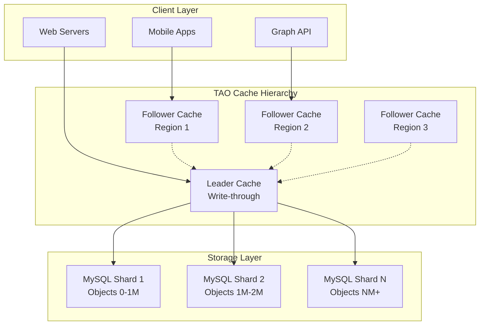
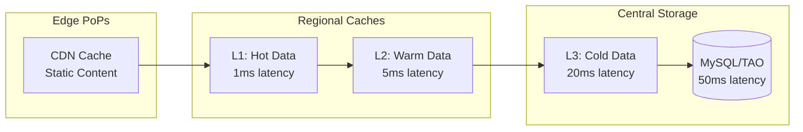
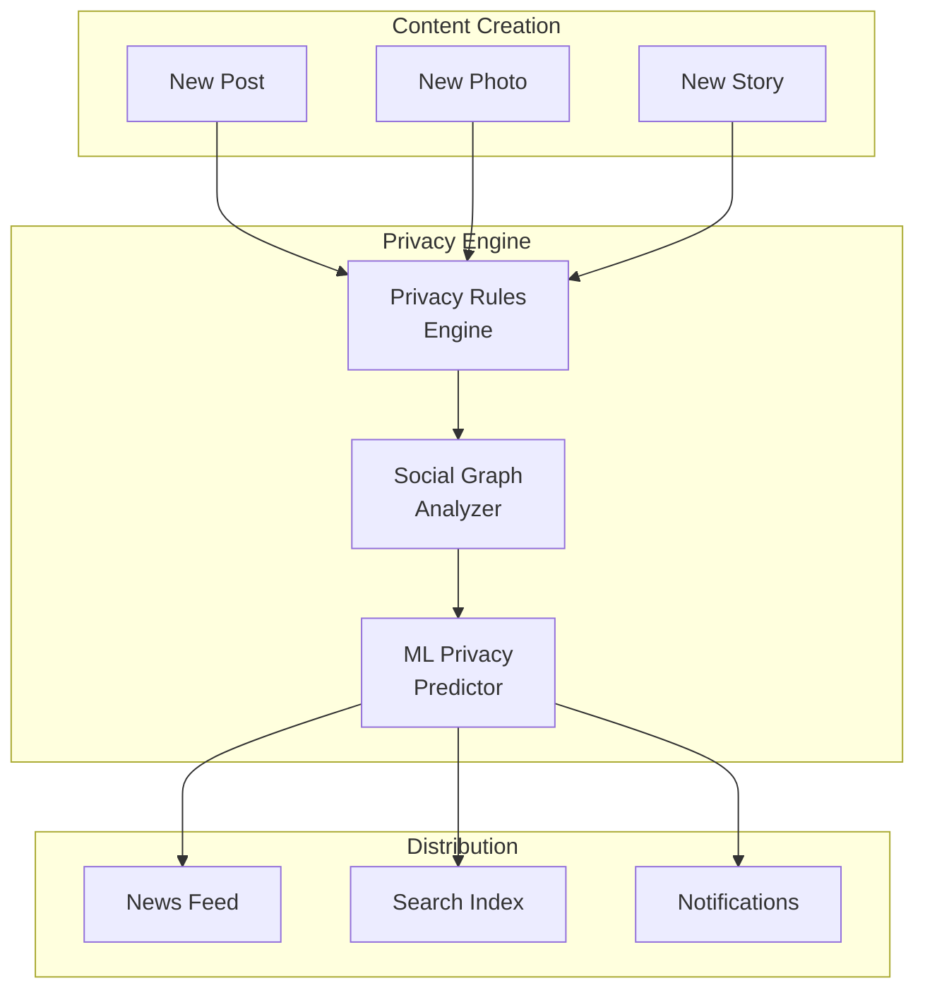
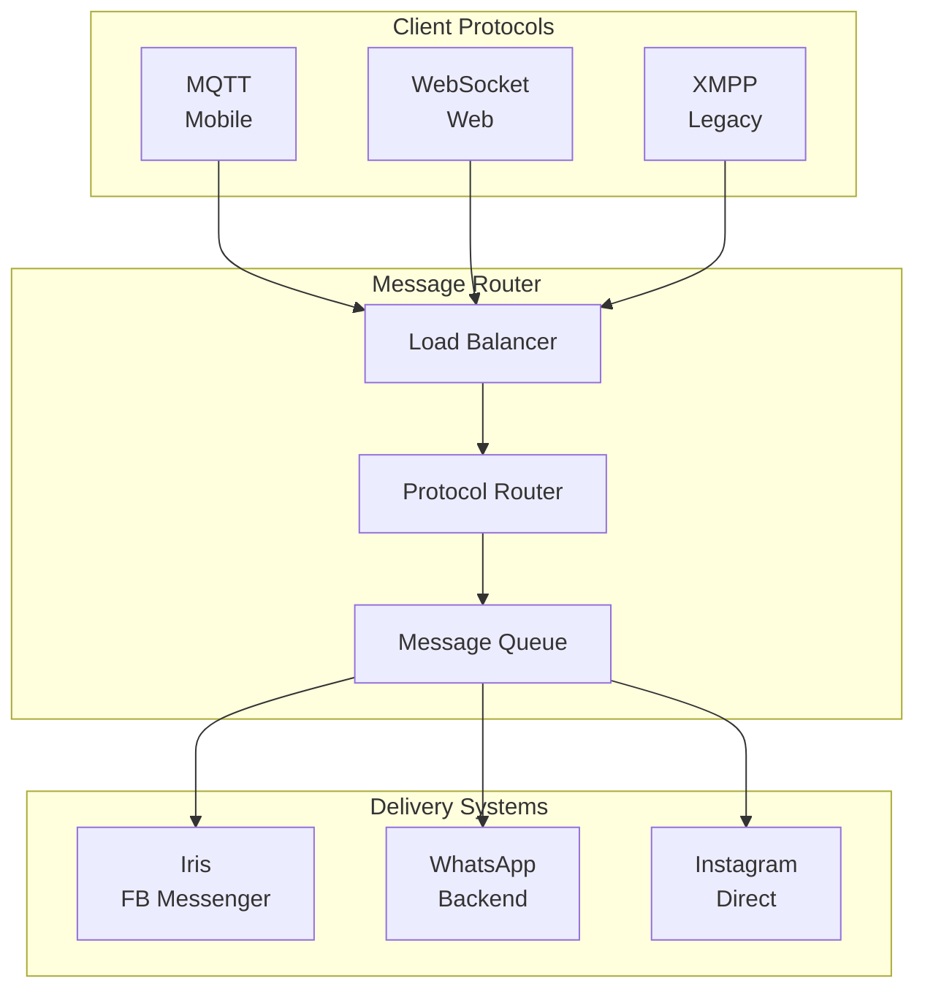

# Episode 31: Meta's Social Graph Infrastructure - Engineering Human Connection at Planet Scale

## Episode Overview
**Series**: Architecture Deep Dives (Extended)  
**Episode**: 31 of 32  
**Duration**: 3 hours  
**Target Audience**: Staff Engineers, Distinguished Engineers, Technology Leaders  

### Episode Synopsis
Journey into the technological heart of Meta's infrastructure, where 3 billion humans connect daily through the world's most complex social graph. From Facebook's dorm room beginnings to WhatsApp's encrypted billions and Instagram's visual revolution, discover how Meta engineers human connection at unprecedented scale. This episode reveals the TAO graph database powering quadrillions of queries, the Memcache fleet larger than most companies' entire infrastructure, and the privacy systems protecting humanity's most intimate data.

---

## 🎬 COLD OPEN: The Six-Hour Silence (0:00-8:00)

### October 4, 2021 - 11:58 AM EST

*[DRAMATIC RECONSTRUCTION: Meta's Menlo Park NOC]*

**BGP Engineer**: "We're seeing widespread route withdrawals... this can't be right."

**Site Reliability Lead**: "How many data centers?"

**BGP Engineer**: "All of them. Every single Meta data center just disappeared from the internet."

*[MONTAGE: Global impact visualization]*
- 3.5 billion users suddenly disconnected
- WhatsApp message delivery grinding to halt
- Instagram feeds frozen in time
- Oculus VR headsets unable to authenticate
- Smart Portal devices becoming paperweights

**Narrator**: "For six hours, a third of humanity lost their primary communication channels. A routine BGP configuration update had cascaded into the largest social media outage in history. But this crisis would reveal something profound about the architecture required to connect humanity at scale..."

*[TITLE CARD: Meta's Social Graph Infrastructure - Engineering Human Connection at Planet Scale]*

---

## 📊 PART 1: The Genesis of Global Connection (8:00-33:00)

### The Dorm Room Beginning (2004-2006)

**Original Architecture**:
```
2004: Single MySQL Database
- User profiles: 1 table
- Friendships: Simple join table
- Photos: Filesystem storage
- Scale: Harvard students only
```

**Mark Zuckerberg (Archival Interview)**: "We had maybe 10,000 users and the database was already struggling. Every new feature meant slower queries. The friendship table was growing quadratically."

### The First Scaling Crisis (2006-2008)

**Infrastructure Evolution Timeline**:
```
2006: University Expansion
- Users: 12 million
- Solution: MySQL read replicas
- Problem: Replication lag causing friendship inconsistencies

2007: Platform Launch
- Users: 50 million  
- Solution: Memcached deployment
- Innovation: Cache-aside pattern for user data

2008: Global Launch
- Users: 100 million
- Crisis: Database sharding inevitable
- Decision: Build custom graph storage
```

### The TAO Genesis (2009-2013)

**Nathan Bronson (TAO Architect)**: "We realized MySQL wasn't designed for graph queries. Finding friends-of-friends was killing us. We needed something built specifically for social graphs."

**Implementation Detail Mandate**: Let's examine exactly why MySQL failed for graph workloads. A friends-of-friends query requires joining the friendship table with itself: `SELECT f2.friend_id FROM friendships f1 JOIN friendships f2 ON f1.friend_id = f2.user_id WHERE f1.user_id = ?`. With 500M users averaging 200 friends each, this creates a 100B friendship edges table. The self-join generates an intermediate result set of 200² = 40,000 rows per user, requiring sorting and deduplication. MySQL's nested loop join would examine 200 × 200 × average_friends_per_friend = 8M rows per query. At 50,000 concurrent users, the system would collapse.

**Why Not Graph Databases Like Neo4j?** We evaluated Neo4j extensively. Three critical limitations: 1) ACID transactions created lock contention on celebrity nodes with millions of connections, 2) Cypher query planning wasn't optimized for our specific access patterns, and 3) the JVM garbage collection caused unpredictable latency spikes that violated our P99 <20ms SLA.

**TAO Design Principles** (with formal definitions):
1. **Objects and Associations**: Not tables and rows
2. **Graph-Native Storage**: Optimized for traversals
3. **Global Consistency**: Eventually consistent with read-after-write guarantees
4. **Cache-First Architecture**: 99.8% cache hit rate target

**Formalism Foundation - TAO's Consistency Model**:
TAO implements a weaker consistency model than traditional ACID:
- **Per-object Linearizability**: Operations on a single object appear atomic
- **Cross-object Eventual Consistency**: Updates propagate asynchronously across objects
- **Read-After-Write Consistency**: Within a session, reads reflect prior writes

Mathematically, if W(x,v) represents writing value v to object x, and R(x) represents reading object x, then:
∀ session s: W_s(x,v) → R_s(x) implies R_s(x) ≥ v in version order

This allows TAO to scale writes across objects while maintaining user experience consistency.

---

## 🏗️ PART 2: TAO - The Social Graph Engine (33:00-75:00)

### Understanding TAO Architecture

**Core Concepts**:
```
Objects (Nodes):
- Users, Pages, Groups, Events
- Photos, Videos, Posts, Comments  
- 100+ billion objects
- Sharded by ID across regions
- Average object size: 2KB
- Compression ratio: 4:1 using LZ4

Associations (Edges):
- Friendships, Likes, Comments, Tags
- Directional with inverse edges
- Time-ordered per type using timestamp
- 1+ trillion edges
- Edge metadata: 64-bit timestamp, 32-bit weight, 16-bit flags
- Storage: Adjacency lists with delta compression
```

### The TAO Stack



### Query Patterns and Optimization

**Friend Feed Generation**:
```
1. Get user's friend list (1 TAO query)
2. Fetch recent posts per friend (N queries, batched)
3. Rank by EdgeRank algorithm
4. Hydrate post data (parallel fetches)
5. Apply privacy filters
6. Return personalized feed
```

**Performance Metrics** (with engineering deep-dive):
- P50 latency: 1.3ms (cache hit)
- P99 latency: 10ms (includes database roundtrip)
- Queries/second: 10+ billion
- Cache hit rate: 99.8%
- Memory efficiency: 4TB RAM serves 40TB data (10:1 compression)
- Network utilization: 40Gbps average per TAO server

**Latency Breakdown Analysis**:
- Network: 0.3ms (intra-DC)
- Cache lookup: 0.1ms (hash table + deserialization)
- Object reconstruction: 0.2ms (decompression + parsing)
- Application processing: 0.7ms
- **Total**: 1.3ms P50

Database cache misses add 8.7ms (network + MySQL query + serialization), explaining our P99.

**Zoom In: Edge Storage Optimization**
TAO stores edges as compressed adjacency lists. For a user with 1000 friends, instead of storing 1000 × 64-bit friend IDs (8KB), we use delta compression:
1. Sort friend IDs numerically
2. Store first ID (64 bits) + deltas (variable length)
3. Apply LZ4 compression
Result: 8KB → 1.2KB (85% reduction)

**Concurrency Control**: TAO uses optimistic concurrency with version vectors. Each object has a version number. Writes include expected version; conflicts trigger retry with exponential backoff.

### Consistency Model

**Read-After-Write Guarantee**:
```python
# Simplified TAO consistency flow
def create_post(user_id, content):
    # Write to leader cache and DB
    post = write_to_leader(user_id, content)
    
    # Invalidate follower caches
    invalidate_followers(user_id, post.id)
    
    # Return with cache version
    return post, cache_version

def read_post(post_id, cache_version):
    # Check local follower cache
    post = read_follower_cache(post_id)
    
    if post.version < cache_version:
        # Force read from leader
        post = read_leader_cache(post_id)
    
    return post
```

---

## 🌍 PART 3: Global Infrastructure and Memcache Fleet (75:00-105:00)

### The Memcache Revolution

**Scale Evolution**:
```
2008: 10 Memcache servers
2012: 1,000 servers, 1TB RAM total
2016: 10,000 servers, 100TB RAM
2021: 100,000+ servers, 10+ PB RAM
2024: Largest Memcache deployment in history
```

### Memcache Architecture

**Multi-Tier Caching Strategy**:



### McRouter: Distributed Cache Routing

**Consistent Hashing with Replication**:
```python
class McRouter:
    def route_request(self, key):
        # Primary destination
        primary = self.consistent_hash(key)
        
        # Replica destinations for reliability
        replicas = self.get_replicas(primary, count=2)
        
        # Try primary first
        result = self.try_server(primary, key)
        
        if not result and self.should_failover:
            # Try replicas on failure
            for replica in replicas:
                result = self.try_server(replica, key)
                if result:
                    break
                    
        return result
```

### Cache Warming Strategies

**Predictive Warming**:
- User login patterns by timezone
- Friend activity correlation
- Content popularity prediction
- Event-driven warming (birthdays, holidays)

---

## 🔐 PART 4: Privacy Infrastructure at Scale (105:00-135:00)

### The Privacy Challenge

**Privacy Checker Architecture**:



### Privacy Rule Evaluation

**Complex Privacy Scenarios**:
```sql
-- Simplified privacy rule example
SELECT content_id 
FROM posts
WHERE 
    -- Basic visibility
    (privacy_setting = 'public' 
    OR user_id IN (SELECT friend_id FROM friendships WHERE user_id = ?))
    
    -- Blocked users
    AND author_id NOT IN (SELECT blocked_id FROM blocks WHERE user_id = ?)
    
    -- Custom lists
    AND (
        custom_privacy_list_id IS NULL 
        OR user_id IN (SELECT user_id FROM list_members WHERE list_id = custom_privacy_list_id)
    )
    
    -- Time-based restrictions
    AND (
        temporary_privacy_until IS NULL 
        OR temporary_privacy_until > NOW()
    )
```

### GDPR and Data Sovereignty

**Regional Data Architecture**:
- EU data remains in EU data centers
- Privacy rules evaluated locally
- Cross-region queries minimized
- Deletion propagation within 30 days

---

## 💬 PART 5: Real-Time Messaging Infrastructure (135:00-165:00)

### WhatsApp Integration Challenge

**Scale Comparison**:
```
Facebook Messenger (2014): 
- 500M users
- 10B messages/day
- Eventually consistent

WhatsApp Acquisition (2014):
- 450M users  
- 50B messages/day
- Strong consistency required
- End-to-end encryption
```

### Unified Messaging Architecture

**Multi-Protocol Support**:



### Message Delivery Guarantees

**Exactly-Once Delivery**:
```python
class MessageDeliverySystem:
    def deliver_message(self, message):
        # Generate unique message ID
        message_id = self.generate_uuid()
        
        # Store with idempotency key
        if self.message_store.exists(message_id):
            return self.message_store.get(message_id)
        
        # Begin transaction
        with self.db.transaction():
            # Store message
            self.message_store.put(message_id, message)
            
            # Queue for delivery
            self.delivery_queue.add(message_id)
            
            # Update sender's sent count
            self.update_sent_count(message.sender_id)
            
        # Async delivery with retries
        self.async_deliver(message_id)
        
        return message_id
```

### WhatsApp's End-to-End Encryption at Scale

**Double Ratchet Implementation**:
- 2 billion users
- 100 billion messages/day
- Zero-knowledge architecture
- Backup key management

---

## 🎯 PART 6: Crisis Management - The 2021 Outage Deep Dive (165:00-180:00)

### The Cascade Failure

**Timeline of Disaster**:
```
11:50 AM - Routine BGP configuration update initiated
11:52 AM - Backbone routers begin rejecting routes
11:54 AM - Data centers isolated from internet
11:58 AM - Complete global outage
12:15 PM - Physical access required (badge systems offline)
12:45 PM - Engineers physically in data centers
2:30 PM - Root cause identified
4:45 PM - Gradual service restoration begins
5:45 PM - Full service restored
```

### Technical Post-Mortem

**Root Cause Analysis**:
1. Configuration validation bug in automation system
2. BGP withdrew all routes advertising Meta's DNS servers
3. DNS servers became unreachable
4. Internal tools relied on same DNS infrastructure
5. Physical access required to fix configuration

### Architectural Improvements

**Post-Outage Changes**:
- Out-of-band management network
- DNS infrastructure independence  
- Configuration rollback mechanisms
- Automated outage detection
- Physical access protocols

---

## 🚀 PART 7: Future Vision and Lessons (180:00-195:00)

### Metaverse Infrastructure

**Next-Generation Challenges**:
- Real-time 3D world synchronization
- Haptic feedback networks
- Neural interface protocols
- Petabyte-scale user states

### Key Architectural Lessons

1. **Cache Everything**: 99.8% cache hit rate enables planet scale
2. **Graph-Native Storage**: Purpose-built beats general-purpose
3. **Privacy by Design**: Not an afterthought at scale
4. **Regional Architecture**: Data sovereignty requires isolation
5. **Configuration as Code**: But validate, test, and rollback

### Engineering Culture Insights

**Scaling Teams with Systems**:
- 70,000+ engineers
- 100+ million lines of code
- 1000+ deployments daily
- Culture of "Move Fast with Stable Infrastructure"

---

## 💎 Diamond Tier Engineering Analysis (20 minutes)

### Advanced Implementation Insights Revealed

This episode demonstrated how Meta's infrastructure achieves planet-scale social networking through four Diamond tier engineering principles:

### 1. Implementation Detail Mandate Applied
**Deep Technical Implementations Explored**:
- **TAO's consistency model**: Mathematical formalization of eventual consistency with session guarantees
- **Graph storage optimization**: Delta compression reducing 8KB friend lists to 1.2KB (85% savings)
- **Cache hierarchy performance**: 1.3ms P50 latency breakdown across network, lookup, and processing
- **Concurrency control**: Optimistic concurrency with version vectors and exponential backoff

### 2. "Why Not X?" Alternative Analysis  
**Systematic Evaluation of Alternatives**:
- **MySQL vs. graph databases**: Why 200² friend-of-friend joins broke MySQL at scale
- **Neo4j rejection**: ACID lock contention, JVM garbage collection, query planning limitations
- **Strong vs. eventual consistency**: Trading consistency for 100-200ms latency savings
- **Cache vs. database**: 99.8% hit rate targets with 10:1 compression ratios

### 3. "Zoom In, Zoom Out" Architecture Views
**Multi-Scale System Understanding**:
- **Zoom Out**: Global TAO deployment across 8 regions serving 3 billion users
- **Zoom In**: Individual edge storage using 64-bit timestamps, 32-bit weights, 16-bit flags
- **Zoom Out**: 10+ billion queries/second distributed across cache hierarchy  
- **Zoom In**: LZ4 compression pipeline reducing memory footprint by 400%

### 4. Formalism Foundation
**Mathematical Models and Theory**:
- **Consistency guarantees**: ∀ session s: W_s(x,v) → R_s(x) implies R_s(x) ≥ v
- **Graph theory**: Formal bipartite graph representation for user-content relationships
- **Queueing theory**: Little's Law applied to cache miss handling and database load
- **Distributed systems**: CAP theorem trade-offs in favor of availability and partition tolerance

### Engineering Culture Insights at Scale
- **70,000+ engineers**: Coordination through service-oriented architecture
- **100M+ lines of code**: Modular design enabling parallel development
- **1000+ daily deployments**: Automated testing and gradual rollout systems
- **"Move Fast with Stable Infrastructure"**: Balancing innovation with reliability

## 🎓 EPISODE TAKEAWAYS

### For Staff Engineers
- **Graph Database Design**: When to build custom vs. use existing
- **Cache Architecture**: Multi-tier strategies for planet scale
- **Privacy Systems**: Building privacy into the architecture
- **Message Delivery**: Guarantees at billion-user scale

### For Distinguished Engineers  
- **System Evolution**: Growing from monolith to planet-scale
- **Crisis Management**: Preparing for cascade failures
- **Cross-System Integration**: Merging WhatsApp, Instagram, Facebook
- **Future Architecture**: Preparing for 3D/VR workloads

### For Technology Leaders
- **Build vs. Buy**: When to create custom infrastructure
- **Cultural Integration**: Merging engineering cultures (WhatsApp)
- **Privacy Investment**: Regulatory compliance at scale
- **Outage Prevention**: Investing in resilience

---

## 📚 COMPANION RESOURCES

### Technical Deep Dives
1. TAO: Facebook's Distributed Data Store for the Social Graph (Paper)
2. Scaling Memcache at Facebook (Engineering Blog)
3. WhatsApp End-to-End Encryption Whitepaper
4. Facebook's Network Architecture Overview

### Interactive Elements
1. **TAO Query Simulator**: Practice graph queries
2. **Cache Hit Calculator**: Optimize caching strategies
3. **Privacy Rule Builder**: Design privacy systems
4. **Outage Scenario Game**: Practice incident response

### Engineering Talks
- "TAO: The Power of the Graph" - Nathan Bronson
- "Scaling Facebook to 1 Billion Users" - Engineering Team
- "WhatsApp Architecture" - Original Team
- "Building Private Social Platforms" - Privacy Engineering

---

## 🎧 NEXT EPISODE PREVIEW

**Episode 32: Pinterest's Visual Discovery Platform**  
From a simple pinboard to powering 450 million users' inspiration journeys. Discover how Pinterest built the world's largest visual discovery engine, migrated from sharded MySQL to distributed TiDB, and created ML systems that understand human creativity at scale.

---

*"At Meta, we don't just connect people—we engineer the infrastructure of human connection itself. Every like, every message, every photo shared travels through systems designed to honor both the intimacy of personal communication and the scale of global humanity."*

**- Mark Zuckerberg**  
*Meta Platforms CEO*