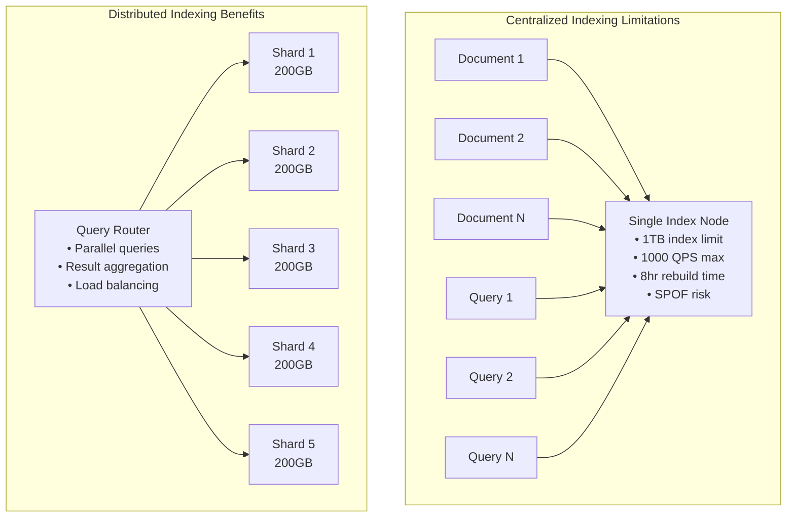
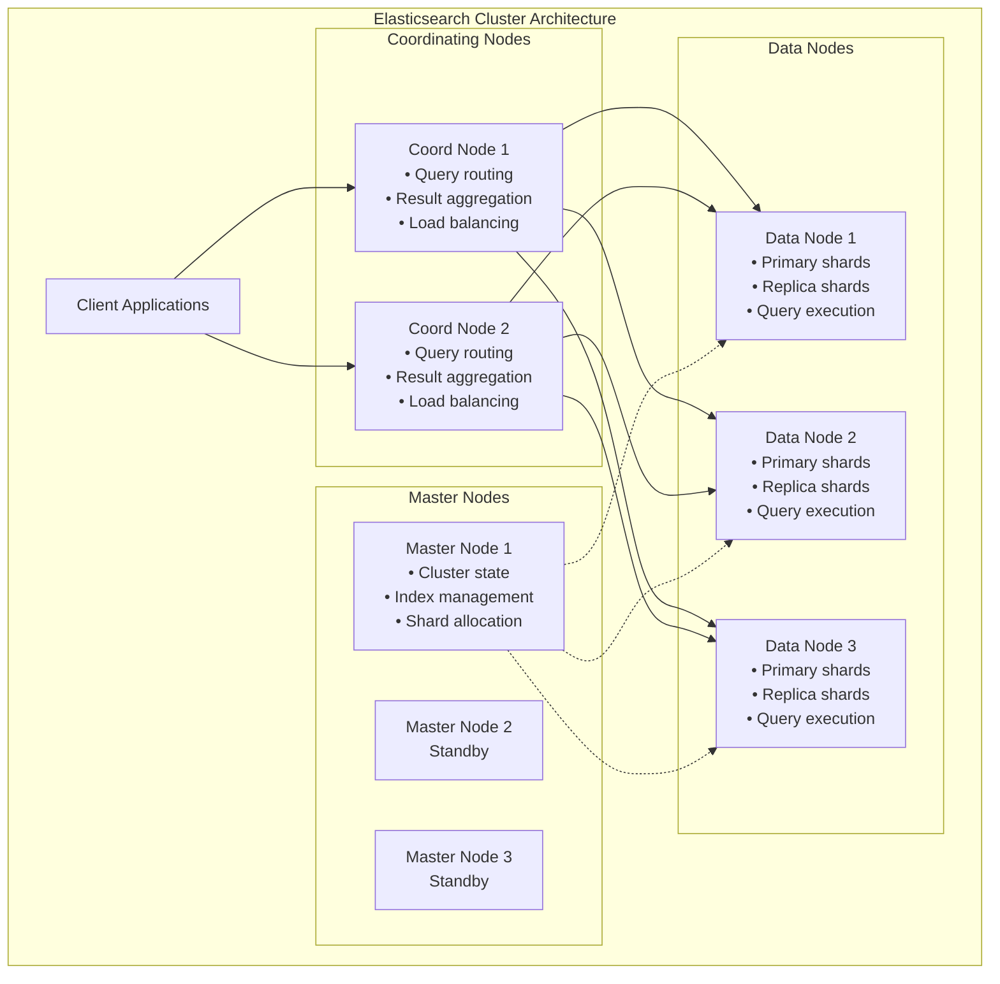

# Episode 71: Distributed Indexing - Architectures, Sharding, and Search System Optimization

**Duration**: 2.5 hours  
**Objective**: Master distributed indexing architectures, sharding strategies, and optimization techniques for large-scale search systems

---

## Table of Contents

1. [Fundamentals of Distributed Indexing](#fundamentals-of-distributed-indexing)
2. [Inverted Index Architecture](#inverted-index-architecture)
3. [Index Sharding Strategies](#index-sharding-strategies)
4. [Distributed Index Construction](#distributed-index-construction)
5. [Query Processing and Routing](#query-processing-and-routing)
6. [Elasticsearch Architecture Deep Dive](#elasticsearch-architecture-deep-dive)
7. [Performance Optimization Techniques](#performance-optimization-techniques)
8. [Consistency and Replication in Search](#consistency-and-replication-in-search)
9. [Real-World Production Systems](#real-world-production-systems)
10. [Advanced Topics and Future Trends](#advanced-topics-and-future-trends)

---

## Fundamentals of Distributed Indexing

### Why Distributed Indexing?

Traditional single-node indexing systems face fundamental scalability limits:

- **Storage Limitations**: Index size bounded by single machine capacity
- **Query Throughput**: CPU and memory bottlenecks on single node
- **Index Construction Time**: Rebuilding large indices takes hours/days
- **Fault Tolerance**: Single point of failure



### Core Design Principles

**1. Horizontal Partitioning (Sharding)**
```python
# Document-based sharding
def get_shard_id(document_id: str, num_shards: int) -> int:
    return hash(document_id) % num_shards

# Term-based sharding
def get_term_shard(term: str, num_shards: int) -> int:
    return hash(term) % num_shards

# Hybrid approach - most common in practice
class HybridSharding:
    def __init__(self, doc_shards: int, term_replicas: int):
        self.doc_shards = doc_shards
        self.term_replicas = term_replicas
    
    def get_document_shard(self, doc_id: str) -> int:
        return hash(doc_id) % self.doc_shards
    
    def get_term_shards(self, term: str) -> List[int]:
        """Each term replicated across multiple shards"""
        base_shard = hash(term) % self.doc_shards
        return [(base_shard + i) % self.doc_shards 
                for i in range(self.term_replicas)]
```

**2. Parallel Processing**
```python
from concurrent.futures import ThreadPoolExecutor
import asyncio

class DistributedQueryProcessor:
    def __init__(self, shards: List[SearchShard]):
        self.shards = shards
    
    async def search_parallel(self, query: str, limit: int = 10) -> SearchResults:
        """Execute query across all shards in parallel"""
        
        # Phase 1: Scatter query to all shards
        tasks = []
        for shard in self.shards:
            task = asyncio.create_task(
                shard.search(query, limit=limit*2)  # Over-fetch for better ranking
            )
            tasks.append(task)
        
        # Phase 2: Gather results
        shard_results = await asyncio.gather(*tasks)
        
        # Phase 3: Merge and rank globally
        return self.merge_and_rank(shard_results, limit)
    
    def merge_and_rank(self, shard_results: List[SearchResults], limit: int) -> SearchResults:
        """Merge results using distributed ranking algorithm"""
        all_results = []
        for results in shard_results:
            all_results.extend(results.documents)
        
        # Global ranking considering cross-shard score normalization
        all_results.sort(key=lambda d: d.normalized_score, reverse=True)
        return SearchResults(all_results[:limit])
```

**3. Fault Tolerance Through Replication**
```python
class ReplicatedIndex:
    def __init__(self, primary_shards: int, replica_count: int):
        self.primary_shards = primary_shards
        self.replica_count = replica_count
        self.shard_map = self.build_shard_map()
    
    def build_shard_map(self) -> Dict[int, List[ShardReplica]]:
        shard_map = {}
        for shard_id in range(self.primary_shards):
            replicas = []
            for replica_id in range(self.replica_count + 1):  # +1 for primary
                replica = ShardReplica(
                    shard_id=shard_id,
                    replica_id=replica_id,
                    is_primary=(replica_id == 0)
                )
                replicas.append(replica)
            shard_map[shard_id] = replicas
        return shard_map
    
    async def search_with_failover(self, query: str) -> SearchResults:
        """Search with automatic failover to replicas"""
        results = []
        
        for shard_id in range(self.primary_shards):
            replicas = self.shard_map[shard_id]
            
            # Try primary first, then replicas
            for replica in replicas:
                try:
                    shard_result = await replica.search(query, timeout=1.0)
                    results.append(shard_result)
                    break  # Success, move to next shard
                except TimeoutError:
                    continue  # Try next replica
                except Exception as e:
                    self.mark_replica_failed(replica)
                    continue
        
        return self.merge_results(results)
```

---

## Inverted Index Architecture

### Traditional Inverted Index Structure

An inverted index maps each unique term to the documents containing it:

```python
class InvertedIndex:
    def __init__(self):
        # term -> posting list
        self.term_index: Dict[str, PostingList] = {}
        # document metadata
        self.document_store: Dict[str, DocumentMetadata] = {}
    
    def add_document(self, doc_id: str, content: str, metadata: Dict):
        """Add document to index"""
        # Store document metadata
        self.document_store[doc_id] = DocumentMetadata(
            id=doc_id,
            length=len(content.split()),
            **metadata
        )
        
        # Tokenize and index terms
        terms = self.tokenize(content)
        term_positions = self.extract_positions(terms)
        
        for term, positions in term_positions.items():
            if term not in self.term_index:
                self.term_index[term] = PostingList(term)
            
            self.term_index[term].add_posting(
                doc_id=doc_id,
                term_frequency=len(positions),
                positions=positions
            )

class PostingList:
    def __init__(self, term: str):
        self.term = term
        self.document_frequency = 0
        self.postings: List[Posting] = []
    
    def add_posting(self, doc_id: str, term_frequency: int, positions: List[int]):
        posting = Posting(
            doc_id=doc_id,
            term_frequency=term_frequency,
            positions=positions
        )
        self.postings.append(posting)
        self.document_frequency += 1

@dataclass
class Posting:
    doc_id: str
    term_frequency: int
    positions: List[int]
    
@dataclass 
class DocumentMetadata:
    id: str
    length: int
    timestamp: datetime
    content_hash: str
```

### Distributed Index Architecture Patterns

**1. Document-Sharded Index**
```mermaid
graph TB
    subgraph "Document-Sharded Architecture"
        D1[Documents 1-1000]
        D2[Documents 1001-2000]  
        D3[Documents 2001-3000]
        
        S1[Shard 1<br/>Inverted Index<br/>for docs 1-1000]
        S2[Shard 2<br/>Inverted Index<br/>for docs 1001-2000]
        S3[Shard 3<br/>Inverted Index<br/>for docs 2001-3000]
        
        D1 --> S1
        D2 --> S2
        D3 --> S3
        
        Q[Query: "machine learning"]
        Q --> S1
        Q --> S2  
        Q --> S3
        
        S1 --> AGG[Result Aggregator]
        S2 --> AGG
        S3 --> AGG
    end
```

**Pros**: Easy to scale, good for updates, simple routing
**Cons**: All shards needed for every query, complex result merging

**2. Term-Sharded Index**
```mermaid
graph TB
    subgraph "Term-Sharded Architecture"
        T1[Terms A-H]
        T2[Terms I-P]
        T3[Terms Q-Z]
        
        S1[Shard 1<br/>Terms A-H<br/>+ all documents]
        S2[Shard 2<br/>Terms I-P<br/>+ all documents]
        S3[Shard 3<br/>Terms Q-Z<br/>+ all documents]
        
        T1 --> S1
        T2 --> S2
        T3 --> S3
        
        Q[Query: "machine learning"]
        Q --> S2
        Q --> S3
        
        S2 --> AGG[Result Aggregator]
        S3 --> AGG
    end
```

**Pros**: Only relevant shards queried, efficient for rare terms
**Cons**: Load balancing challenges, complex updates

**3. Hybrid Architecture (Most Common)**
```python
class HybridDistributedIndex:
    def __init__(self, num_shards: int, replication_factor: int):
        self.num_shards = num_shards
        self.replication_factor = replication_factor
        self.shards = []
        
        for i in range(num_shards):
            shard = IndexShard(
                shard_id=i,
                document_range=self.get_document_range(i),
                replicas=replication_factor
            )
            self.shards.append(shard)
    
    def index_document(self, doc_id: str, content: str):
        """Route document to appropriate shard"""
        shard_id = self.get_document_shard(doc_id)
        shard = self.shards[shard_id]
        
        # Index on primary shard
        shard.primary.index_document(doc_id, content)
        
        # Replicate to backup shards asynchronously
        for replica in shard.replicas:
            asyncio.create_task(
                replica.index_document(doc_id, content)
            )
    
    async def search(self, query: str) -> SearchResults:
        """Execute distributed search"""
        # Parse query into terms
        query_terms = self.parse_query(query)
        
        # Phase 1: Scatter to all shards (document partitioning)
        search_tasks = []
        for shard in self.shards:
            task = asyncio.create_task(
                shard.search(query_terms)
            )
            search_tasks.append(task)
        
        # Phase 2: Gather results
        shard_results = await asyncio.gather(*search_tasks)
        
        # Phase 3: Global ranking and merging
        return self.global_rank_and_merge(shard_results)
```

---

## Index Sharding Strategies

### Hash-Based Sharding

**Simple Hash Sharding**:
```python
class HashBasedSharding:
    def __init__(self, num_shards: int):
        self.num_shards = num_shards
    
    def get_shard(self, document_id: str) -> int:
        """Use consistent hashing for document distribution"""
        return hash(document_id) % self.num_shards
    
    def get_shard_for_query(self, query: str) -> List[int]:
        """For search, need to query all shards"""
        return list(range(self.num_shards))
```

**Consistent Hashing for Dynamic Scaling**:
```python
import hashlib
from typing import Dict, List, Tuple

class ConsistentHashingShards:
    def __init__(self, initial_shards: List[str], virtual_nodes: int = 150):
        self.virtual_nodes = virtual_nodes
        self.ring: Dict[int, str] = {}
        self.shards = set()
        
        for shard in initial_shards:
            self.add_shard(shard)
    
    def _hash(self, key: str) -> int:
        return int(hashlib.md5(key.encode()).hexdigest(), 16)
    
    def add_shard(self, shard: str):
        """Add new shard to ring"""
        self.shards.add(shard)
        
        for i in range(self.virtual_nodes):
            virtual_key = f"{shard}:{i}"
            hash_value = self._hash(virtual_key)
            self.ring[hash_value] = shard
    
    def remove_shard(self, shard: str):
        """Remove shard and redistribute data"""
        self.shards.discard(shard)
        
        keys_to_remove = []
        for hash_value, ring_shard in self.ring.items():
            if ring_shard == shard:
                keys_to_remove.append(hash_value)
        
        for key in keys_to_remove:
            del self.ring[key]
    
    def get_shard(self, document_id: str) -> str:
        """Find responsible shard for document"""
        if not self.ring:
            raise ValueError("No shards available")
        
        hash_value = self._hash(document_id)
        
        # Find next shard clockwise on ring
        sorted_hashes = sorted(self.ring.keys())
        for ring_hash in sorted_hashes:
            if ring_hash >= hash_value:
                return self.ring[ring_hash]
        
        # Wrap around to first shard
        return self.ring[sorted_hashes[0]]
```

### Range-Based Sharding

```python
class RangeBasedSharding:
    def __init__(self, ranges: List[Tuple[str, str]]):
        """
        ranges: List of (start_key, end_key) tuples
        Example: [('a', 'm'), ('n', 'z')]
        """
        self.ranges = sorted(ranges)
        self.shard_map = {i: r for i, r in enumerate(ranges)}
    
    def get_shard(self, document_id: str) -> int:
        """Find shard based on document ID range"""
        for shard_id, (start, end) in self.shard_map.items():
            if start <= document_id < end:
                return shard_id
        
        # Default to last shard if no match
        return len(self.shard_map) - 1
    
    def rebalance_ranges(self, shard_stats: Dict[int, int]):
        """Rebalance ranges based on document counts"""
        total_docs = sum(shard_stats.values())
        target_per_shard = total_docs // len(self.shard_map)
        
        # Algorithm to recompute ranges for balanced distribution
        # Implementation depends on key distribution analysis
        pass
```

### Content-Based Sharding

```python
from sklearn.feature_extraction.text import TfidfVectorizer
from sklearn.cluster import KMeans
import numpy as np

class ContentBasedSharding:
    def __init__(self, num_shards: int, sample_docs: List[str]):
        self.num_shards = num_shards
        self.vectorizer = TfidfVectorizer(max_features=1000)
        self.cluster_model = KMeans(n_clusters=num_shards)
        
        # Train on sample documents to learn content clusters
        self.train(sample_docs)
    
    def train(self, sample_docs: List[str]):
        """Learn content clusters from sample documents"""
        # Convert documents to TF-IDF vectors
        tfidf_matrix = self.vectorizer.fit_transform(sample_docs)
        
        # Cluster documents by content similarity
        self.cluster_model.fit(tfidf_matrix.toarray())
    
    def get_shard(self, document_content: str) -> int:
        """Assign document to shard based on content similarity"""
        # Convert document to TF-IDF vector
        doc_vector = self.vectorizer.transform([document_content])
        
        # Predict cluster (shard)
        shard_id = self.cluster_model.predict(doc_vector.toarray())[0]
        return shard_id
    
    def get_query_shards(self, query: str, top_k: int = 3) -> List[int]:
        """Find most relevant shards for query"""
        query_vector = self.vectorizer.transform([query]).toarray()
        
        # Calculate similarity to each cluster centroid
        centroids = self.cluster_model.cluster_centers_
        similarities = np.dot(query_vector, centroids.T).flatten()
        
        # Return top-k most similar shards
        top_shards = np.argsort(similarities)[-top_k:]
        return top_shards.tolist()
```

---

## Distributed Index Construction

### Parallel Index Building

**Map-Reduce Style Index Construction**:
```python
from collections import defaultdict
from typing import Iterator, Tuple

class DistributedIndexBuilder:
    def __init__(self, num_workers: int, num_shards: int):
        self.num_workers = num_workers
        self.num_shards = num_shards
        self.workers = [IndexWorker(i) for i in range(num_workers)]
    
    async def build_index(self, document_stream: Iterator[Document]) -> Dict[int, InvertedIndex]:
        """Build distributed index using map-reduce approach"""
        
        # Phase 1: Map - Distribute documents to workers
        worker_tasks = []
        document_batches = self.partition_documents(document_stream)
        
        for i, batch in enumerate(document_batches):
            worker = self.workers[i % self.num_workers]
            task = asyncio.create_task(
                worker.process_batch(batch, self.num_shards)
            )
            worker_tasks.append(task)
        
        # Phase 2: Collect partial indices from workers
        partial_indices = await asyncio.gather(*worker_tasks)
        
        # Phase 3: Reduce - Merge partial indices by shard
        final_indices = {}
        for shard_id in range(self.num_shards):
            final_indices[shard_id] = self.merge_shard_indices(
                [partial[shard_id] for partial in partial_indices]
            )
        
        return final_indices
    
    def partition_documents(self, document_stream: Iterator[Document]) -> List[List[Document]]:
        """Partition documents into batches for parallel processing"""
        batches = [[] for _ in range(self.num_workers)]
        
        for i, doc in enumerate(document_stream):
            batch_id = i % self.num_workers
            batches[batch_id].append(doc)
        
        return batches

class IndexWorker:
    def __init__(self, worker_id: int):
        self.worker_id = worker_id
    
    async def process_batch(self, documents: List[Document], num_shards: int) -> Dict[int, PartialIndex]:
        """Process document batch and create partial indices"""
        partial_indices = {i: PartialIndex() for i in range(num_shards)}
        
        for doc in documents:
            # Determine which shard this document belongs to
            shard_id = hash(doc.id) % num_shards
            
            # Process document and update partial index
            terms = self.extract_terms(doc.content)
            partial_indices[shard_id].add_document(doc.id, terms)
        
        return partial_indices
    
    def extract_terms(self, content: str) -> Dict[str, TermInfo]:
        """Extract and process terms from document content"""
        # Tokenization, stemming, stop word removal
        tokens = self.tokenize(content)
        term_counts = defaultdict(int)
        term_positions = defaultdict(list)
        
        for pos, token in enumerate(tokens):
            term = self.normalize_term(token)
            term_counts[term] += 1
            term_positions[term].append(pos)
        
        terms = {}
        for term, count in term_counts.items():
            terms[term] = TermInfo(
                frequency=count,
                positions=term_positions[term]
            )
        
        return terms
```

### Incremental Index Updates

**Real-time Updates with Write-Ahead Logging**:
```python
import asyncio
from datetime import datetime
from enum import Enum

class UpdateType(Enum):
    ADD = "add"
    UPDATE = "update"
    DELETE = "delete"

class IndexUpdateManager:
    def __init__(self, shards: Dict[int, IndexShard]):
        self.shards = shards
        self.update_queue = asyncio.Queue()
        self.wal_writer = WriteAheadLog("index_updates.wal")
        
        # Start background update processor
        asyncio.create_task(self.process_updates())
    
    async def add_document(self, doc_id: str, content: str):
        """Add new document to index"""
        update = IndexUpdate(
            type=UpdateType.ADD,
            doc_id=doc_id,
            content=content,
            timestamp=datetime.utcnow()
        )
        
        # Log update for durability
        await self.wal_writer.log_update(update)
        
        # Queue for processing
        await self.update_queue.put(update)
    
    async def update_document(self, doc_id: str, new_content: str):
        """Update existing document"""
        update = IndexUpdate(
            type=UpdateType.UPDATE,
            doc_id=doc_id,
            content=new_content,
            timestamp=datetime.utcnow()
        )
        
        await self.wal_writer.log_update(update)
        await self.update_queue.put(update)
    
    async def delete_document(self, doc_id: str):
        """Delete document from index"""
        update = IndexUpdate(
            type=UpdateType.DELETE,
            doc_id=doc_id,
            timestamp=datetime.utcnow()
        )
        
        await self.wal_writer.log_update(update)
        await self.update_queue.put(update)
    
    async def process_updates(self):
        """Background process to apply index updates"""
        batch = []
        batch_timeout = 1.0  # Process batch every second
        
        while True:
            try:
                # Collect updates for batch processing
                update = await asyncio.wait_for(
                    self.update_queue.get(),
                    timeout=batch_timeout
                )
                batch.append(update)
                
                # Process more updates if available (up to batch size)
                while len(batch) < 100:  # Max batch size
                    try:
                        update = self.update_queue.get_nowait()
                        batch.append(update)
                    except asyncio.QueueEmpty:
                        break
                
                # Apply batch updates
                await self.apply_batch_updates(batch)
                batch.clear()
                
            except asyncio.TimeoutError:
                # Process any pending updates
                if batch:
                    await self.apply_batch_updates(batch)
                    batch.clear()
    
    async def apply_batch_updates(self, updates: List[IndexUpdate]):
        """Apply batch of updates to appropriate shards"""
        # Group updates by shard
        shard_updates = defaultdict(list)
        
        for update in updates:
            shard_id = hash(update.doc_id) % len(self.shards)
            shard_updates[shard_id].append(update)
        
        # Apply updates to each shard in parallel
        tasks = []
        for shard_id, shard_update_list in shard_updates.items():
            shard = self.shards[shard_id]
            task = asyncio.create_task(
                shard.apply_updates(shard_update_list)
            )
            tasks.append(task)
        
        await asyncio.gather(*tasks)
```

---

## Query Processing and Routing

### Query Planning and Optimization

```python
from abc import ABC, abstractmethod
from dataclasses import dataclass
from typing import List, Dict, Set

@dataclass
class QueryPlan:
    """Execution plan for distributed query"""
    query_type: str
    target_shards: List[int]
    execution_order: List[str]
    estimated_cost: float
    timeout: float

class QueryPlanner:
    def __init__(self, shard_statistics: Dict[int, ShardStats]):
        self.shard_stats = shard_statistics
        self.cost_model = QueryCostModel()
    
    def create_plan(self, query: ParsedQuery) -> QueryPlan:
        """Create optimal execution plan for query"""
        
        if query.type == "phrase":
            return self.plan_phrase_query(query)
        elif query.type == "boolean":
            return self.plan_boolean_query(query)
        elif query.type == "fuzzy":
            return self.plan_fuzzy_query(query)
        else:
            return self.plan_term_query(query)
    
    def plan_boolean_query(self, query: ParsedQuery) -> QueryPlan:
        """Optimize boolean query execution"""
        terms = query.terms
        
        # Order terms by selectivity (rarest first)
        term_selectivity = {}
        for term in terms:
            term_selectivity[term] = self.estimate_term_selectivity(term)
        
        # Sort terms by selectivity for optimal execution
        ordered_terms = sorted(terms, key=lambda t: term_selectivity[t])
        
        # Determine which shards to query
        target_shards = self.select_target_shards(terms)
        
        # Estimate execution cost
        estimated_cost = self.cost_model.estimate_boolean_query_cost(
            ordered_terms, target_shards, self.shard_stats
        )
        
        return QueryPlan(
            query_type="boolean",
            target_shards=target_shards,
            execution_order=ordered_terms,
            estimated_cost=estimated_cost,
            timeout=self.calculate_timeout(estimated_cost)
        )
    
    def estimate_term_selectivity(self, term: str) -> float:
        """Estimate how selective a term is (lower = more selective)"""
        total_docs = sum(stats.document_count for stats in self.shard_stats.values())
        total_term_occurrences = sum(
            stats.term_frequencies.get(term, 0) 
            for stats in self.shard_stats.values()
        )
        
        if total_docs == 0:
            return 1.0
        
        return total_term_occurrences / total_docs

class DistributedQueryExecutor:
    def __init__(self, shards: Dict[int, SearchShard], thread_pool_size: int = 20):
        self.shards = shards
        self.thread_pool = ThreadPoolExecutor(max_workers=thread_pool_size)
        self.query_planner = QueryPlanner({
            shard_id: shard.get_statistics() 
            for shard_id, shard in shards.items()
        })
    
    async def execute_query(self, query: str, options: QueryOptions = None) -> SearchResults:
        """Execute distributed query with optimization"""
        
        # Parse and analyze query
        parsed_query = self.parse_query(query)
        
        # Create execution plan
        plan = self.query_planner.create_plan(parsed_query)
        
        # Execute query based on plan
        if plan.query_type == "boolean":
            return await self.execute_boolean_query(parsed_query, plan)
        elif plan.query_type == "phrase":
            return await self.execute_phrase_query(parsed_query, plan)
        else:
            return await self.execute_simple_query(parsed_query, plan)
    
    async def execute_boolean_query(self, query: ParsedQuery, plan: QueryPlan) -> SearchResults:
        """Execute boolean query with optimization"""
        
        # Phase 1: Execute most selective term first
        first_term = plan.execution_order[0]
        initial_results = await self.execute_term_query(first_term, plan.target_shards)
        
        # Phase 2: Intersect with remaining terms
        for term in plan.execution_order[1:]:
            if query.operators[term] == "AND":
                # Intersection - only query shards that have candidates
                candidate_shards = self.get_shards_with_candidates(initial_results)
                term_results = await self.execute_term_query(term, candidate_shards)
                initial_results = self.intersect_results(initial_results, term_results)
            elif query.operators[term] == "OR":
                # Union - query all target shards
                term_results = await self.execute_term_query(term, plan.target_shards)
                initial_results = self.union_results(initial_results, term_results)
            elif query.operators[term] == "NOT":
                # Exclusion
                term_results = await self.execute_term_query(term, plan.target_shards)
                initial_results = self.exclude_results(initial_results, term_results)
        
        return initial_results
    
    async def execute_term_query(self, term: str, target_shards: List[int]) -> SearchResults:
        """Execute single term query across specified shards"""
        tasks = []
        
        for shard_id in target_shards:
            shard = self.shards[shard_id]
            task = asyncio.create_task(
                shard.search_term(term)
            )
            tasks.append(task)
        
        shard_results = await asyncio.gather(*tasks)
        return self.merge_term_results(shard_results)
```

### Result Merging and Ranking

```python
import heapq
from typing import Iterator

class DistributedResultMerger:
    def __init__(self, ranking_model: RankingModel):
        self.ranking_model = ranking_model
    
    def merge_ranked_results(self, shard_results: List[SearchResults], 
                           limit: int = 10) -> SearchResults:
        """Merge pre-ranked results from multiple shards"""
        
        # Use k-way merge with heaps for efficiency
        result_heap = []
        shard_iterators = []
        
        # Initialize heap with first result from each shard
        for shard_id, results in enumerate(shard_results):
            if results.documents:
                iterator = iter(results.documents)
                first_doc = next(iterator)
                heapq.heappush(result_heap, (-first_doc.score, shard_id, first_doc))
                shard_iterators.append(iterator)
            else:
                shard_iterators.append(iter([]))
        
        # Merge results maintaining global ranking
        merged_results = []
        while result_heap and len(merged_results) < limit:
            neg_score, shard_id, document = heapq.heappop(result_heap)
            merged_results.append(document)
            
            # Add next result from same shard if available
            try:
                next_doc = next(shard_iterators[shard_id])
                heapq.heappush(result_heap, (-next_doc.score, shard_id, next_doc))
            except StopIteration:
                pass
        
        return SearchResults(
            documents=merged_results,
            total_hits=sum(r.total_hits for r in shard_results),
            query_time=max(r.query_time for r in shard_results)
        )
    
    def merge_with_global_ranking(self, shard_results: List[SearchResults],
                                  query: str, limit: int = 10) -> SearchResults:
        """Merge results and apply global ranking"""
        
        # Collect all documents from all shards
        all_documents = []
        for results in shard_results:
            all_documents.extend(results.documents)
        
        # Apply global ranking model
        for doc in all_documents:
            doc.global_score = self.ranking_model.calculate_global_score(
                doc, query, self.get_global_statistics()
            )
        
        # Sort by global score and return top results
        all_documents.sort(key=lambda d: d.global_score, reverse=True)
        
        return SearchResults(
            documents=all_documents[:limit],
            total_hits=len(all_documents),
            query_time=max(r.query_time for r in shard_results)
        )

class TfIdfGlobalRanking:
    """Global TF-IDF ranking that considers collection-wide statistics"""
    
    def __init__(self, global_stats: GlobalCorpusStatistics):
        self.global_stats = global_stats
    
    def calculate_global_score(self, document: SearchDocument, 
                             query: str, context: QueryContext) -> float:
        """Calculate TF-IDF score using global corpus statistics"""
        
        query_terms = self.tokenize(query)
        score = 0.0
        
        for term in query_terms:
            # Term frequency in document (normalized)
            tf = document.term_frequencies.get(term, 0)
            normalized_tf = tf / (tf + 1.0)  # Avoid log(0)
            
            # Inverse document frequency (global)
            total_docs = self.global_stats.total_documents
            docs_with_term = self.global_stats.document_frequencies.get(term, 0)
            
            if docs_with_term > 0:
                idf = math.log(total_docs / docs_with_term)
            else:
                idf = 0
            
            # Document length normalization
            doc_length_norm = 1.0 / (1.0 + 0.5 * (
                document.length / self.global_stats.average_document_length
            ))
            
            term_score = normalized_tf * idf * doc_length_norm
            score += term_score
        
        return score
```

---

## Elasticsearch Architecture Deep Dive

### Cluster Architecture



### Shard Allocation and Management

```python
class ElasticsearchShardAllocator:
    """Simplified version of Elasticsearch shard allocation logic"""
    
    def __init__(self, cluster_state: ClusterState):
        self.cluster_state = cluster_state
        self.allocation_rules = [
            SameShardAllocation(),
            ReplicaAfterPrimaryAllocation(),  
            DiskThresholdAllocation(),
            AwarenessAllocation()
        ]
    
    def allocate_shards(self, index: IndexMetadata) -> AllocationPlan:
        """Allocate shards for new index"""
        
        plan = AllocationPlan()
        available_nodes = self.get_available_data_nodes()
        
        # Allocate primary shards
        for shard_id in range(index.number_of_shards):
            primary_shard = Shard(
                index=index.name,
                shard_id=shard_id,
                shard_type=ShardType.PRIMARY
            )
            
            # Find best node for primary shard
            best_node = self.find_best_node(primary_shard, available_nodes)
            plan.add_allocation(primary_shard, best_node)
            
            # Allocate replica shards
            for replica_id in range(index.number_of_replicas):
                replica_shard = Shard(
                    index=index.name,
                    shard_id=shard_id,
                    shard_type=ShardType.REPLICA,
                    replica_id=replica_id
                )
                
                # Find node for replica (must be different from primary)
                replica_nodes = [n for n in available_nodes if n != best_node]
                replica_node = self.find_best_node(replica_shard, replica_nodes)
                plan.add_allocation(replica_shard, replica_node)
        
        return plan
    
    def find_best_node(self, shard: Shard, candidate_nodes: List[Node]) -> Node:
        """Find best node for shard using allocation rules"""
        
        node_scores = {}
        for node in candidate_nodes:
            score = 0.0
            
            # Apply allocation rules
            for rule in self.allocation_rules:
                if rule.can_allocate(shard, node, self.cluster_state):
                    score += rule.get_score(shard, node, self.cluster_state)
                else:
                    score = -1.0  # Rule violation
                    break
            
            node_scores[node] = score
        
        # Return node with highest score
        return max(node_scores.items(), key=lambda x: x[1])[0]

class SameShardAllocation:
    """Prevent same shard (primary/replica) on same node"""
    
    def can_allocate(self, shard: Shard, node: Node, cluster_state: ClusterState) -> bool:
        existing_shards = cluster_state.get_shards_on_node(node)
        
        for existing in existing_shards:
            if (existing.index == shard.index and 
                existing.shard_id == shard.shard_id):
                return False  # Same shard already on this node
        
        return True
    
    def get_score(self, shard: Shard, node: Node, cluster_state: ClusterState) -> float:
        return 1.0  # Neutral score if allocation is allowed

class DiskThresholdAllocation:
    """Prevent allocation on nodes with low disk space"""
    
    def __init__(self, low_watermark: float = 0.85, high_watermark: float = 0.90):
        self.low_watermark = low_watermark
        self.high_watermark = high_watermark
    
    def can_allocate(self, shard: Shard, node: Node, cluster_state: ClusterState) -> bool:
        disk_usage = node.get_disk_usage_percentage()
        
        if shard.shard_type == ShardType.PRIMARY:
            return disk_usage < self.high_watermark
        else:
            return disk_usage < self.low_watermark
    
    def get_score(self, shard: Shard, node: Node, cluster_state: ClusterState) -> float:
        disk_usage = node.get_disk_usage_percentage()
        # Higher score for nodes with more free space
        return 1.0 - disk_usage
```

### Query Execution Pipeline

```python
class ElasticsearchQueryExecutor:
    """Elasticsearch-style distributed query execution"""
    
    def __init__(self, cluster: ElasticsearchCluster):
        self.cluster = cluster
    
    async def execute_search(self, request: SearchRequest) -> SearchResponse:
        """Execute search request across cluster"""
        
        # Phase 1: Query phase - collect document IDs and scores
        query_results = await self.execute_query_phase(request)
        
        # Phase 2: Fetch phase - retrieve document content
        if request.needs_fetch_phase():
            return await self.execute_fetch_phase(request, query_results)
        else:
            return SearchResponse(hits=query_results)
    
    async def execute_query_phase(self, request: SearchRequest) -> List[SearchHit]:
        """Execute query phase across all relevant shards"""
        
        # Determine target shards
        target_shards = self.get_target_shards(request)
        
        # Execute query on each shard
        tasks = []
        for shard in target_shards:
            task = asyncio.create_task(
                shard.execute_query(request)
            )
            tasks.append(task)
        
        # Collect results from all shards
        shard_results = await asyncio.gather(*tasks)
        
        # Merge and sort results globally
        all_hits = []
        for result in shard_results:
            all_hits.extend(result.hits)
        
        # Global sorting by score
        all_hits.sort(key=lambda hit: hit.score, reverse=True)
        
        # Return top results
        return all_hits[:request.size]
    
    async def execute_fetch_phase(self, request: SearchRequest, 
                                  hits: List[SearchHit]) -> SearchResponse:
        """Fetch full document content for top hits"""
        
        # Group hits by shard for efficient fetching
        shard_hits = defaultdict(list)
        for hit in hits:
            shard = self.cluster.get_shard_for_document(hit.doc_id)
            shard_hits[shard].append(hit)
        
        # Fetch documents from each shard
        fetch_tasks = []
        for shard, hit_list in shard_hits.items():
            task = asyncio.create_task(
                shard.fetch_documents([hit.doc_id for hit in hit_list])
            )
            fetch_tasks.append(task)
        
        # Collect fetched documents
        fetched_docs = await asyncio.gather(*fetch_tasks)
        
        # Merge documents back with hits
        doc_map = {}
        for doc_list in fetched_docs:
            for doc in doc_list:
                doc_map[doc.id] = doc
        
        # Populate hits with document content
        for hit in hits:
            if hit.doc_id in doc_map:
                hit.source = doc_map[hit.doc_id].source
        
        return SearchResponse(
            hits=hits,
            total=len(hits),
            query_time=request.get_execution_time()
        )
```

---

## Performance Optimization Techniques

### Index Optimization

**1. Segment Merging and Optimization**:
```python
class SegmentMergePolicy:
    """Policy for merging index segments"""
    
    def __init__(self, max_segments: int = 10, min_segment_size: int = 10**6):
        self.max_segments = max_segments
        self.min_segment_size = min_segment_size
    
    def should_merge(self, segments: List[Segment]) -> bool:
        """Determine if segments should be merged"""
        
        # Too many small segments
        small_segments = [s for s in segments if s.size < self.min_segment_size]
        if len(small_segments) > self.max_segments:
            return True
        
        # Segments with many deletes
        segments_with_deletes = [s for s in segments if s.deletion_ratio > 0.1]
        if len(segments_with_deletes) > 5:
            return True
        
        return False
    
    def select_merge_candidates(self, segments: List[Segment]) -> List[Segment]:
        """Select segments to merge"""
        
        # Sort by size and select smallest segments first
        sorted_segments = sorted(segments, key=lambda s: s.size)
        
        merge_candidates = []
        total_size = 0
        
        for segment in sorted_segments:
            if total_size + segment.size < self.max_merge_size():
                merge_candidates.append(segment)
                total_size += segment.size
            
            if len(merge_candidates) >= 10:  # Max segments per merge
                break
        
        return merge_candidates
    
    def max_merge_size(self) -> int:
        """Maximum size for merged segment"""
        return 5 * (10**9)  # 5GB

class IndexOptimizer:
    def __init__(self, shard: IndexShard):
        self.shard = shard
        self.merge_policy = SegmentMergePolicy()
    
    async def optimize_shard(self):
        """Optimize shard by merging segments"""
        segments = self.shard.get_segments()
        
        if self.merge_policy.should_merge(segments):
            merge_candidates = self.merge_policy.select_merge_candidates(segments)
            await self.merge_segments(merge_candidates)
    
    async def merge_segments(self, segments: List[Segment]):
        """Merge multiple segments into one"""
        merged_segment = Segment(f"merged_{int(time.time())}")
        
        # Merge posting lists from all segments
        all_terms = set()
        for segment in segments:
            all_terms.update(segment.get_terms())
        
        for term in all_terms:
            merged_postings = []
            for segment in segments:
                postings = segment.get_postings(term)
                merged_postings.extend(postings)
            
            # Sort and deduplicate postings
            merged_postings.sort(key=lambda p: p.doc_id)
            merged_segment.add_term(term, merged_postings)
        
        # Replace old segments with merged segment
        self.shard.replace_segments(segments, merged_segment)
```

**2. Caching Strategies**:
```python
from functools import lru_cache
from typing import Optional

class IndexCache:
    """Multi-level caching for search indices"""
    
    def __init__(self, max_memory_mb: int = 1024):
        self.max_memory = max_memory_mb * 1024 * 1024
        self.query_cache = LRUCache(maxsize=1000)
        self.field_cache = FieldDataCache(max_memory_mb // 2)
        self.filter_cache = FilterCache(max_memory_mb // 4)
        self.request_cache = RequestCache(max_memory_mb // 4)
    
    def get_cached_query_result(self, query_hash: str) -> Optional[SearchResults]:
        """Get cached query results"""
        return self.query_cache.get(query_hash)
    
    def cache_query_result(self, query_hash: str, results: SearchResults):
        """Cache query results"""
        self.query_cache[query_hash] = results
    
    def get_field_data(self, field: str, doc_id: str) -> Optional[Any]:
        """Get cached field data"""
        return self.field_cache.get(f"{field}:{doc_id}")
    
    def cache_field_data(self, field: str, doc_id: str, value: Any):
        """Cache field data"""
        self.field_cache.set(f"{field}:{doc_id}", value)

class FieldDataCache:
    """Cache for document field values"""
    
    def __init__(self, max_memory_mb: int):
        self.max_memory = max_memory_mb * 1024 * 1024
        self.cache = {}
        self.memory_usage = 0
        self.access_times = {}
    
    def get(self, key: str) -> Optional[Any]:
        if key in self.cache:
            self.access_times[key] = time.time()
            return self.cache[key]
        return None
    
    def set(self, key: str, value: Any):
        value_size = sys.getsizeof(value)
        
        # Evict if necessary
        while self.memory_usage + value_size > self.max_memory:
            self.evict_lru()
        
        self.cache[key] = value
        self.memory_usage += value_size
        self.access_times[key] = time.time()
    
    def evict_lru(self):
        """Evict least recently used item"""
        if not self.access_times:
            return
        
        lru_key = min(self.access_times.items(), key=lambda x: x[1])[0]
        value = self.cache[lru_key]
        
        del self.cache[lru_key]
        del self.access_times[lru_key]
        self.memory_usage -= sys.getsizeof(value)
```

### Query Performance Optimization

**1. Query Rewriting and Optimization**:
```python
class QueryOptimizer:
    """Optimize queries for better performance"""
    
    def optimize_query(self, query: ParsedQuery) -> ParsedQuery:
        """Apply various query optimizations"""
        
        # Apply optimization passes
        optimized = query
        optimized = self.rewrite_boolean_queries(optimized)
        optimized = self.optimize_range_queries(optimized)
        optimized = self.apply_constant_folding(optimized)
        optimized = self.reorder_clauses(optimized)
        
        return optimized
    
    def rewrite_boolean_queries(self, query: ParsedQuery) -> ParsedQuery:
        """Rewrite boolean queries for efficiency"""
        
        if query.type != "boolean":
            return query
        
        # Convert OR queries with many terms to terms query
        if len(query.clauses) > 10 and all(c.operator == "OR" for c in query.clauses):
            return ParsedQuery(
                type="terms",
                field=query.clauses[0].field,
                values=[c.term for c in query.clauses]
            )
        
        # Apply De Morgan's laws to reduce NOT clauses
        return self.apply_demorgans_law(query)
    
    def optimize_range_queries(self, query: ParsedQuery) -> ParsedQuery:
        """Optimize range queries"""
        
        if query.type != "range":
            return query
        
        # Use more efficient range implementation for numeric fields
        if self.is_numeric_field(query.field):
            return ParsedQuery(
                type="numeric_range",
                field=query.field,
                gte=query.gte,
                lte=query.lte
            )
        
        return query
    
    def reorder_clauses(self, query: ParsedQuery) -> ParsedQuery:
        """Reorder query clauses by selectivity"""
        
        if query.type != "boolean":
            return query
        
        # Estimate selectivity for each clause
        clause_selectivity = []
        for clause in query.clauses:
            selectivity = self.estimate_clause_selectivity(clause)
            clause_selectivity.append((clause, selectivity))
        
        # Sort by selectivity (most selective first)
        clause_selectivity.sort(key=lambda x: x[1])
        
        query.clauses = [clause for clause, _ in clause_selectivity]
        return query

class QueryExecutionPlanner:
    """Plan query execution for optimal performance"""
    
    def __init__(self, index_stats: IndexStatistics):
        self.index_stats = index_stats
    
    def create_execution_plan(self, query: ParsedQuery) -> ExecutionPlan:
        """Create optimal execution plan"""
        
        if query.type == "boolean":
            return self.plan_boolean_execution(query)
        elif query.type == "phrase":
            return self.plan_phrase_execution(query)
        else:
            return self.plan_simple_execution(query)
    
    def plan_boolean_execution(self, query: ParsedQuery) -> ExecutionPlan:
        """Plan boolean query execution"""
        
        plan = ExecutionPlan()
        
        # Sort clauses by estimated cost
        sorted_clauses = sorted(
            query.clauses, 
            key=lambda c: self.estimate_clause_cost(c)
        )
        
        # Start with most selective clause
        current_candidates = None
        
        for clause in sorted_clauses:
            if clause.operator == "MUST":
                if current_candidates is None:
                    # First clause - get initial candidates
                    plan.add_step(f"execute_term_query({clause.term})")
                    current_candidates = clause.term
                else:
                    # Intersection with previous results
                    plan.add_step(f"intersect({current_candidates}, {clause.term})")
                    current_candidates = f"intersect_{len(plan.steps)}"
            
            elif clause.operator == "SHOULD":
                # Union operation
                plan.add_step(f"union({current_candidates}, {clause.term})")
                current_candidates = f"union_{len(plan.steps)}"
            
            elif clause.operator == "MUST_NOT":
                # Exclusion operation
                plan.add_step(f"exclude({current_candidates}, {clause.term})")
                current_candidates = f"exclude_{len(plan.steps)}"
        
        return plan
```

---

## Consistency and Replication in Search

### Near Real-Time Search

```python
class NearRealTimeIndex:
    """Implementation of near-real-time search indexing"""
    
    def __init__(self, commit_interval: float = 1.0):
        self.commit_interval = commit_interval
        self.in_memory_buffer = InMemoryBuffer()
        self.committed_segments = []
        self.last_commit_time = time.time()
        
        # Background commit task
        asyncio.create_task(self.periodic_commit())
    
    async def add_document(self, doc_id: str, content: str):
        """Add document to in-memory buffer"""
        document = Document(id=doc_id, content=content, timestamp=time.time())
        await self.in_memory_buffer.add(document)
    
    async def search(self, query: str) -> SearchResults:
        """Search across both committed segments and in-memory buffer"""
        
        # Search committed segments
        committed_results = await self.search_committed_segments(query)
        
        # Search in-memory buffer
        buffer_results = await self.in_memory_buffer.search(query)
        
        # Merge results
        return self.merge_results(committed_results, buffer_results)
    
    async def periodic_commit(self):
        """Periodically commit in-memory buffer to disk"""
        while True:
            await asyncio.sleep(self.commit_interval)
            
            if self.should_commit():
                await self.commit()
    
    def should_commit(self) -> bool:
        """Determine if commit is needed"""
        return (
            self.in_memory_buffer.size() > 1000 or  # Buffer size threshold
            time.time() - self.last_commit_time > self.commit_interval
        )
    
    async def commit(self):
        """Commit in-memory buffer to persistent segment"""
        if self.in_memory_buffer.is_empty():
            return
        
        # Create new segment from buffer
        segment = await self.create_segment_from_buffer()
        
        # Add to committed segments
        self.committed_segments.append(segment)
        
        # Clear buffer
        self.in_memory_buffer.clear()
        
        # Update commit time
        self.last_commit_time = time.time()
        
        # Trigger background merge if needed
        if len(self.committed_segments) > 10:
            asyncio.create_task(self.merge_segments())

class InMemoryBuffer:
    """In-memory buffer for real-time indexing"""
    
    def __init__(self):
        self.documents = {}
        self.inverted_index = defaultdict(list)
        self.lock = asyncio.Lock()
    
    async def add(self, document: Document):
        """Add document to in-memory index"""
        async with self.lock:
            self.documents[document.id] = document
            
            # Update inverted index
            terms = self.extract_terms(document.content)
            for term, positions in terms.items():
                posting = InMemoryPosting(
                    doc_id=document.id,
                    positions=positions,
                    timestamp=document.timestamp
                )
                self.inverted_index[term].append(posting)
    
    async def search(self, query: str) -> SearchResults:
        """Search in-memory buffer"""
        async with self.lock:
            query_terms = self.parse_query(query)
            matching_docs = set()
            
            # Find documents matching query terms
            for term in query_terms:
                if term in self.inverted_index:
                    for posting in self.inverted_index[term]:
                        matching_docs.add(posting.doc_id)
            
            # Score and return results
            results = []
            for doc_id in matching_docs:
                document = self.documents[doc_id]
                score = self.calculate_score(document, query_terms)
                results.append(SearchHit(doc_id, score, document))
            
            results.sort(key=lambda hit: hit.score, reverse=True)
            return SearchResults(results)
```

### Replica Consistency Models

```python
class ReplicaConsistencyManager:
    """Manage consistency across index replicas"""
    
    def __init__(self, consistency_level: str = "quorum"):
        self.consistency_level = consistency_level
        self.replicas = {}
    
    async def write_document(self, doc_id: str, content: str) -> WriteResult:
        """Write document with specified consistency"""
        
        if self.consistency_level == "one":
            return await self.write_to_one_replica(doc_id, content)
        elif self.consistency_level == "quorum":
            return await self.write_to_quorum(doc_id, content)
        elif self.consistency_level == "all":
            return await self.write_to_all_replicas(doc_id, content)
        else:
            raise ValueError(f"Unknown consistency level: {self.consistency_level}")
    
    async def write_to_quorum(self, doc_id: str, content: str) -> WriteResult:
        """Write to majority of replicas"""
        replicas = list(self.replicas.values())
        quorum_size = len(replicas) // 2 + 1
        
        # Send write request to all replicas
        write_tasks = []
        for replica in replicas:
            task = asyncio.create_task(
                replica.write_document(doc_id, content)
            )
            write_tasks.append(task)
        
        # Wait for quorum to succeed
        successful_writes = 0
        failed_writes = 0
        
        for task in asyncio.as_completed(write_tasks):
            try:
                result = await task
                if result.success:
                    successful_writes += 1
                else:
                    failed_writes += 1
                
                # Return success once quorum is reached
                if successful_writes >= quorum_size:
                    return WriteResult(success=True, replicas_written=successful_writes)
                
                # Return failure if quorum impossible
                if failed_writes > len(replicas) - quorum_size:
                    return WriteResult(success=False, replicas_written=successful_writes)
            
            except Exception as e:
                failed_writes += 1
        
        return WriteResult(success=False, replicas_written=successful_writes)
    
    async def read_with_consistency(self, query: str) -> SearchResults:
        """Read with consistency guarantees"""
        
        if self.consistency_level == "eventual":
            return await self.read_from_any_replica(query)
        elif self.consistency_level == "strong":
            return await self.read_from_primary(query)
        elif self.consistency_level == "quorum":
            return await self.read_with_quorum_consistency(query)
    
    async def read_with_quorum_consistency(self, query: str) -> SearchResults:
        """Read with quorum consistency"""
        replicas = list(self.replicas.values())
        quorum_size = len(replicas) // 2 + 1
        
        # Read from quorum of replicas
        read_tasks = []
        for replica in replicas[:quorum_size]:
            task = asyncio.create_task(replica.search(query))
            read_tasks.append(task)
        
        # Get results from quorum
        results = await asyncio.gather(*read_tasks)
        
        # Resolve conflicts using vector clocks or timestamps
        return self.resolve_read_conflicts(results)
```

---

## Real-World Production Systems

### Google Search Architecture

```python
class GoogleSearchArchitecture:
    """Simplified model of Google's search architecture"""
    
    def __init__(self):
        self.web_crawler = WebCrawler()
        self.index_servers = []  # Thousands of servers
        self.doc_servers = []    # Store cached web pages
        self.link_graph = LinkGraph()  # PageRank calculations
        self.query_servers = []  # Handle search queries
    
    async def process_search_query(self, query: str, user_context: UserContext) -> SearchResults:
        """Process search query through Google's pipeline"""
        
        # Phase 1: Query understanding and expansion
        expanded_query = await self.expand_query(query, user_context)
        
        # Phase 2: Retrieve candidate documents from index servers
        candidates = await self.retrieve_candidates(expanded_query)
        
        # Phase 3: Rank candidates using PageRank and relevance signals
        ranked_results = await self.rank_results(candidates, expanded_query, user_context)
        
        # Phase 4: Retrieve snippets from doc servers
        final_results = await self.generate_snippets(ranked_results, query)
        
        return SearchResults(
            results=final_results,
            query_time=time.time() - start_time,
            total_results=len(candidates)
        )
    
    async def retrieve_candidates(self, query: ExpandedQuery) -> List[DocumentCandidate]:
        """Retrieve candidates from distributed index servers"""
        
        # Scatter query to relevant index servers
        # Each server holds part of the web index
        server_tasks = []
        
        for server in self.index_servers:
            # Each server processes query for its index shard
            task = asyncio.create_task(
                server.find_matching_documents(query)
            )
            server_tasks.append(task)
        
        # Gather results from all servers
        server_results = await asyncio.gather(*server_tasks)
        
        # Combine and deduplicate candidates
        all_candidates = []
        seen_urls = set()
        
        for result_list in server_results:
            for candidate in result_list:
                if candidate.url not in seen_urls:
                    all_candidates.append(candidate)
                    seen_urls.add(candidate.url)
        
        return all_candidates
    
    async def rank_results(self, candidates: List[DocumentCandidate], 
                          query: ExpandedQuery, 
                          context: UserContext) -> List[RankedResult]:
        """Rank results using multiple signals"""
        
        ranking_signals = RankingSignalCalculator()
        ranked_results = []
        
        for candidate in candidates:
            # Calculate various ranking signals
            relevance_score = ranking_signals.calculate_relevance(candidate, query)
            authority_score = self.link_graph.get_pagerank(candidate.url)
            freshness_score = ranking_signals.calculate_freshness(candidate)
            user_personalization = ranking_signals.calculate_personalization(candidate, context)
            
            # Combine signals into final score
            final_score = (
                0.4 * relevance_score +
                0.3 * authority_score +
                0.2 * user_personalization +
                0.1 * freshness_score
            )
            
            ranked_results.append(RankedResult(
                candidate=candidate,
                score=final_score,
                signals={
                    'relevance': relevance_score,
                    'authority': authority_score,
                    'freshness': freshness_score,
                    'personalization': user_personalization
                }
            ))
        
        # Sort by final score
        ranked_results.sort(key=lambda r: r.score, reverse=True)
        return ranked_results[:1000]  # Top 1000 results

class LinkGraph:
    """Simplified PageRank calculation"""
    
    def __init__(self):
        self.graph = {}  # url -> [outgoing_urls]
        self.pagerank_scores = {}
        self.damping_factor = 0.85
    
    def calculate_pagerank(self, iterations: int = 50):
        """Calculate PageRank scores for all URLs"""
        
        urls = list(self.graph.keys())
        n = len(urls)
        
        # Initialize PageRank scores
        for url in urls:
            self.pagerank_scores[url] = 1.0 / n
        
        # Iterate PageRank calculation
        for iteration in range(iterations):
            new_scores = {}
            
            for url in urls:
                # Calculate new PageRank score
                rank_sum = 0.0
                
                # Sum contributions from incoming links
                for incoming_url in urls:
                    if url in self.graph.get(incoming_url, []):
                        outgoing_count = len(self.graph[incoming_url])
                        if outgoing_count > 0:
                            rank_sum += self.pagerank_scores[incoming_url] / outgoing_count
                
                # Apply PageRank formula
                new_scores[url] = (1 - self.damping_factor) / n + self.damping_factor * rank_sum
            
            self.pagerank_scores = new_scores
    
    def get_pagerank(self, url: str) -> float:
        """Get PageRank score for URL"""
        return self.pagerank_scores.get(url, 0.0)
```

### Elasticsearch Production Configuration

```python
class ElasticsearchProductionSetup:
    """Production-ready Elasticsearch cluster configuration"""
    
    def __init__(self):
        self.cluster_config = self.get_production_cluster_config()
        self.index_templates = self.get_index_templates()
        self.monitoring_config = self.get_monitoring_config()
    
    def get_production_cluster_config(self) -> Dict:
        """Production cluster configuration"""
        return {
            "cluster.name": "production-search-cluster",
            
            # Node roles
            "node.master": True,
            "node.data": True,
            "node.ingest": False,
            
            # Memory settings
            "bootstrap.memory_lock": True,
            "ES_JAVA_OPTS": "-Xms16g -Xmx16g",  # Half of available RAM
            
            # Discovery and cluster formation
            "discovery.seed_hosts": [
                "elasticsearch-master-1:9300",
                "elasticsearch-master-2:9300", 
                "elasticsearch-master-3:9300"
            ],
            "cluster.initial_master_nodes": [
                "elasticsearch-master-1",
                "elasticsearch-master-2",
                "elasticsearch-master-3"
            ],
            
            # Shard allocation
            "cluster.routing.allocation.disk.threshold.enabled": True,
            "cluster.routing.allocation.disk.watermark.low": "85%",
            "cluster.routing.allocation.disk.watermark.high": "90%",
            "cluster.routing.allocation.disk.watermark.flood_stage": "95%",
            
            # Recovery settings
            "cluster.routing.allocation.node_concurrent_recoveries": 4,
            "indices.recovery.max_bytes_per_sec": "100mb",
            
            # Thread pools
            "thread_pool.search.size": 24,  # CPU cores * 1.5
            "thread_pool.search.queue_size": 1000,
            "thread_pool.index.size": 8,    # CPU cores / 2
            "thread_pool.index.queue_size": 200,
            
            # Circuit breakers
            "indices.breaker.total.limit": "70%",
            "indices.breaker.fielddata.limit": "40%",
            "indices.breaker.request.limit": "20%"
        }
    
    def get_index_templates(self) -> Dict:
        """Production index templates"""
        return {
            "logs_template": {
                "index_patterns": ["logs-*"],
                "settings": {
                    "number_of_shards": 3,
                    "number_of_replicas": 1,
                    "refresh_interval": "30s",  # Reduce refresh frequency
                    
                    # Optimize for time-series data
                    "index.codec": "best_compression",
                    "index.merge.policy.max_merged_segment": "5gb",
                    
                    # Hot-warm architecture
                    "index.routing.allocation.require.data": "hot"
                },
                "mappings": {
                    "properties": {
                        "@timestamp": {"type": "date"},
                        "level": {"type": "keyword"},
                        "message": {
                            "type": "text",
                            "analyzer": "standard",
                            "fields": {
                                "keyword": {
                                    "type": "keyword",
                                    "ignore_above": 256
                                }
                            }
                        },
                        "host": {"type": "keyword"},
                        "service": {"type": "keyword"}
                    }
                }
            },
            
            "products_template": {
                "index_patterns": ["products-*"],
                "settings": {
                    "number_of_shards": 5,
                    "number_of_replicas": 2,  # Higher availability for product data
                    "refresh_interval": "1s",  # Near real-time for product updates
                    
                    # Custom analyzers for product search
                    "analysis": {
                        "analyzer": {
                            "product_analyzer": {
                                "type": "custom",
                                "tokenizer": "standard",
                                "filter": [
                                    "lowercase",
                                    "stop",
                                    "product_synonym"
                                ]
                            }
                        },
                        "filter": {
                            "product_synonym": {
                                "type": "synonym",
                                "synonyms": [
                                    "laptop,notebook,computer",
                                    "phone,mobile,smartphone"
                                ]
                            }
                        }
                    }
                },
                "mappings": {
                    "properties": {
                        "name": {
                            "type": "text",
                            "analyzer": "product_analyzer",
                            "fields": {
                                "suggest": {
                                    "type": "completion"
                                }
                            }
                        },
                        "description": {
                            "type": "text",
                            "analyzer": "product_analyzer"
                        },
                        "price": {"type": "float"},
                        "category": {"type": "keyword"},
                        "brand": {"type": "keyword"},
                        "in_stock": {"type": "boolean"},
                        "created_at": {"type": "date"}
                    }
                }
            }
        }
    
    def get_monitoring_config(self) -> Dict:
        """Monitoring and alerting configuration"""
        return {
            "monitoring": {
                "collection.enabled": True,
                "exporters": {
                    "http": {
                        "type": "http",
                        "enabled": True,
                        "host": ["monitoring-elasticsearch:9200"]
                    }
                }
            },
            
            "alerts": [
                {
                    "name": "High CPU Usage",
                    "condition": "nodes.os.cpu.usage > 80",
                    "threshold_seconds": 300,
                    "actions": ["email", "slack"]
                },
                {
                    "name": "Low Disk Space",
                    "condition": "nodes.fs.available_bytes < 1073741824",  # 1GB
                    "threshold_seconds": 60,
                    "actions": ["email", "pagerduty"]
                },
                {
                    "name": "High Query Latency", 
                    "condition": "nodes.indices.search.query_time_ms > 1000",
                    "threshold_seconds": 180,
                    "actions": ["email"]
                },
                {
                    "name": "Shard Allocation Issues",
                    "condition": "cluster.routing.unassigned_shards > 0",
                    "threshold_seconds": 300,
                    "actions": ["email", "slack"]
                }
            ]
        }
```

---

## Advanced Topics and Future Trends

### Machine Learning Enhanced Search

```python
import torch
import numpy as np
from transformers import AutoModel, AutoTokenizer

class NeuralSearchIndex:
    """Search index enhanced with neural embeddings"""
    
    def __init__(self, model_name: str = "sentence-transformers/all-MiniLM-L6-v2"):
        self.tokenizer = AutoTokenizer.from_pretrained(model_name)
        self.encoder_model = AutoModel.from_pretrained(model_name)
        self.embedding_dim = self.encoder_model.config.hidden_size
        
        # Vector index for similarity search
        self.vector_index = FaissVectorIndex(self.embedding_dim)
        self.document_embeddings = {}
    
    def encode_text(self, text: str) -> np.ndarray:
        """Encode text into dense vector representation"""
        inputs = self.tokenizer(text, return_tensors="pt", truncation=True, padding=True)
        
        with torch.no_grad():
            outputs = self.encoder_model(**inputs)
            # Use CLS token embedding as document representation
            embeddings = outputs.last_hidden_state[:, 0, :].numpy()
        
        return embeddings.flatten()
    
    async def index_document(self, doc_id: str, content: str):
        """Index document with both traditional and neural features"""
        
        # Traditional keyword indexing
        await self.traditional_index.add_document(doc_id, content)
        
        # Neural embedding indexing
        embedding = self.encode_text(content)
        self.document_embeddings[doc_id] = embedding
        self.vector_index.add_vector(doc_id, embedding)
    
    async def hybrid_search(self, query: str, alpha: float = 0.7) -> SearchResults:
        """Hybrid search combining keyword and neural similarity"""
        
        # Keyword search results
        keyword_results = await self.traditional_index.search(query)
        
        # Neural similarity search
        query_embedding = self.encode_text(query)
        neural_results = self.vector_index.similarity_search(query_embedding, k=100)
        
        # Combine results using weighted score
        combined_scores = {}
        
        # Add keyword scores
        for result in keyword_results.documents:
            combined_scores[result.doc_id] = alpha * result.score
        
        # Add neural similarity scores
        for doc_id, similarity_score in neural_results:
            if doc_id in combined_scores:
                combined_scores[doc_id] += (1 - alpha) * similarity_score
            else:
                combined_scores[doc_id] = (1 - alpha) * similarity_score
        
        # Sort by combined score
        sorted_results = sorted(
            combined_scores.items(), 
            key=lambda x: x[1], 
            reverse=True
        )
        
        # Return top results
        top_results = []
        for doc_id, score in sorted_results[:20]:
            document = await self.document_store.get_document(doc_id)
            top_results.append(SearchHit(doc_id, score, document))
        
        return SearchResults(top_results)

class FaissVectorIndex:
    """FAISS-based vector similarity index"""
    
    def __init__(self, embedding_dim: int):
        import faiss
        
        self.embedding_dim = embedding_dim
        self.index = faiss.IndexFlatIP(embedding_dim)  # Inner product for cosine similarity
        self.doc_id_map = {}  # Index position -> doc_id
        self.current_size = 0
    
    def add_vector(self, doc_id: str, embedding: np.ndarray):
        """Add document embedding to index"""
        # Normalize for cosine similarity
        normalized_embedding = embedding / np.linalg.norm(embedding)
        
        self.index.add(normalized_embedding.reshape(1, -1).astype(np.float32))
        self.doc_id_map[self.current_size] = doc_id
        self.current_size += 1
    
    def similarity_search(self, query_embedding: np.ndarray, k: int = 10) -> List[Tuple[str, float]]:
        """Find k most similar documents to query"""
        # Normalize query embedding
        normalized_query = query_embedding / np.linalg.norm(query_embedding)
        
        # Search FAISS index
        similarities, indices = self.index.search(
            normalized_query.reshape(1, -1).astype(np.float32), 
            k
        )
        
        # Convert to (doc_id, similarity) pairs
        results = []
        for i, similarity in zip(indices[0], similarities[0]):
            doc_id = self.doc_id_map[i]
            results.append((doc_id, float(similarity)))
        
        return results
```

### Real-Time Analytics Integration

```python
class RealTimeAnalyticsIndex:
    """Index that supports both search and real-time analytics"""
    
    def __init__(self):
        self.search_index = InvertedIndex()
        self.analytics_store = AnalyticsStore()
        self.stream_processor = StreamProcessor()
    
    async def ingest_document(self, document: Document):
        """Ingest document for both search and analytics"""
        
        # Index for search
        await self.search_index.add_document(document.id, document.content)
        
        # Store for analytics
        await self.analytics_store.store_document(document)
        
        # Update real-time aggregations
        await self.update_realtime_aggregations(document)
    
    async def update_realtime_aggregations(self, document: Document):
        """Update streaming aggregations"""
        
        # Extract analytics dimensions
        timestamp = document.timestamp
        category = document.metadata.get('category')
        user_id = document.metadata.get('user_id')
        
        # Update time-series counters
        await self.analytics_store.increment_counter(
            f"documents_per_hour:{timestamp.hour}",
            value=1,
            window_size=3600  # 1 hour
        )
        
        # Update category distribution
        if category:
            await self.analytics_store.increment_counter(
                f"category_distribution:{category}",
                value=1
            )
        
        # Update user activity
        if user_id:
            await self.analytics_store.increment_counter(
                f"user_activity:{user_id}",
                value=1,
                window_size=86400  # 24 hours
            )
    
    async def search_with_analytics(self, query: str) -> SearchWithAnalytics:
        """Search with aggregated analytics"""
        
        # Execute search
        search_results = await self.search_index.search(query)
        
        # Get related analytics
        analytics_data = await self.get_search_analytics(query, search_results)
        
        return SearchWithAnalytics(
            results=search_results,
            analytics=analytics_data
        )
    
    async def get_search_analytics(self, query: str, 
                                   results: SearchResults) -> AnalyticsData:
        """Get analytics data related to search results"""
        
        # Analyze result distribution by category
        category_distribution = {}
        for result in results.documents:
            category = result.metadata.get('category', 'unknown')
            category_distribution[category] = category_distribution.get(category, 0) + 1
        
        # Get time-series data for search trends
        search_trends = await self.analytics_store.get_time_series(
            f"search_query:{hash(query)}", 
            hours=24
        )
        
        # Get related queries
        related_queries = await self.find_related_queries(query)
        
        return AnalyticsData(
            category_distribution=category_distribution,
            search_trends=search_trends,
            related_queries=related_queries,
            total_results=results.total_hits
        )

class StreamProcessor:
    """Process document streams for real-time analytics"""
    
    def __init__(self, window_size: int = 60):
        self.window_size = window_size
        self.sliding_windows = {}
        self.aggregators = [
            CountAggregator(),
            AvgAggregator(),
            TopKAggregator(k=10)
        ]
    
    async def process_document(self, document: Document):
        """Process document through streaming aggregators"""
        
        current_window = int(time.time()) // self.window_size
        
        for aggregator in self.aggregators:
            await aggregator.update(document, current_window)
    
    def get_current_aggregations(self) -> Dict[str, Any]:
        """Get current aggregation results"""
        
        results = {}
        current_window = int(time.time()) // self.window_size
        
        for aggregator in self.aggregators:
            results[aggregator.name] = aggregator.get_result(current_window)
        
        return results

class CountAggregator:
    """Count aggregator for streaming data"""
    
    def __init__(self):
        self.name = "count"
        self.window_counts = defaultdict(int)
    
    async def update(self, document: Document, window: int):
        self.window_counts[window] += 1
    
    def get_result(self, current_window: int) -> int:
        return self.window_counts[current_window]

class TopKAggregator:
    """Top-K aggregator using Count-Min Sketch"""
    
    def __init__(self, k: int = 10, width: int = 1000, depth: int = 5):
        self.name = "top_k"
        self.k = k
        self.sketches = {}  # window -> CountMinSketch
        self.heap_approximations = {}  # window -> heap of top-k items
    
    async def update(self, document: Document, window: int):
        # Initialize sketch for window if needed
        if window not in self.sketches:
            self.sketches[window] = CountMinSketch(width=1000, depth=5)
            self.heap_approximations[window] = []
        
        # Extract key to track (e.g., terms, categories)
        terms = self.extract_terms(document.content)
        
        for term in terms:
            # Update sketch
            self.sketches[window].update(term)
            
            # Update top-k approximation
            estimated_count = self.sketches[window].query(term)
            self.update_top_k_heap(window, term, estimated_count)
    
    def update_top_k_heap(self, window: int, item: str, count: int):
        """Update top-k heap with new count"""
        heap = self.heap_approximations[window]
        
        # Remove item if already in heap
        heap = [(c, i) for c, i in heap if i != item]
        
        # Add updated item
        heapq.heappush(heap, (count, item))
        
        # Keep only top-k items
        if len(heap) > self.k:
            heapq.heappop(heap)
        
        self.heap_approximations[window] = heap
    
    def get_result(self, current_window: int) -> List[Tuple[str, int]]:
        if current_window not in self.heap_approximations:
            return []
        
        heap = self.heap_approximations[current_window]
        return sorted(heap, key=lambda x: x[0], reverse=True)
```

### Multi-Modal Search

```python
class MultiModalSearchIndex:
    """Search index supporting text, images, and other modalities"""
    
    def __init__(self):
        self.text_index = TextSearchIndex()
        self.image_index = ImageSearchIndex()
        self.audio_index = AudioSearchIndex()
        self.fusion_model = ModalityFusionModel()
    
    async def index_multimodal_document(self, document: MultiModalDocument):
        """Index document with multiple modalities"""
        
        # Index text content
        if document.text_content:
            await self.text_index.add_document(document.id, document.text_content)
        
        # Index images
        if document.images:
            for image in document.images:
                await self.image_index.add_image(document.id, image)
        
        # Index audio
        if document.audio:
            await self.audio_index.add_audio(document.id, document.audio)
    
    async def multimodal_search(self, query: MultiModalQuery) -> SearchResults:
        """Search across multiple modalities"""
        
        results_by_modality = {}
        
        # Text search
        if query.text_query:
            text_results = await self.text_index.search(query.text_query)
            results_by_modality['text'] = text_results
        
        # Image similarity search
        if query.query_image:
            image_results = await self.image_index.similarity_search(query.query_image)
            results_by_modality['image'] = image_results
        
        # Audio similarity search  
        if query.query_audio:
            audio_results = await self.audio_index.similarity_search(query.query_audio)
            results_by_modality['audio'] = audio_results
        
        # Fuse results across modalities
        fused_results = await self.fusion_model.fuse_results(
            results_by_modality, 
            query.modality_weights
        )
        
        return fused_results

class ImageSearchIndex:
    """Image search using deep learning features"""
    
    def __init__(self, model_name: str = "resnet50"):
        import torchvision.models as models
        import torchvision.transforms as transforms
        
        self.feature_extractor = models.resnet50(pretrained=True)
        self.feature_extractor.fc = torch.nn.Identity()  # Remove final layer
        self.feature_extractor.eval()
        
        self.transform = transforms.Compose([
            transforms.Resize(256),
            transforms.CenterCrop(224),
            transforms.ToTensor(),
            transforms.Normalize(mean=[0.485, 0.456, 0.406], 
                               std=[0.229, 0.224, 0.225])
        ])
        
        self.image_features = {}  # doc_id -> feature_vector
        self.feature_index = None  # FAISS index for similarity search
    
    def extract_image_features(self, image: PIL.Image) -> np.ndarray:
        """Extract deep features from image"""
        
        # Preprocess image
        input_tensor = self.transform(image).unsqueeze(0)
        
        # Extract features
        with torch.no_grad():
            features = self.feature_extractor(input_tensor)
        
        return features.numpy().flatten()
    
    async def add_image(self, doc_id: str, image: PIL.Image):
        """Add image to search index"""
        
        # Extract features
        features = self.extract_image_features(image)
        
        # Store features
        self.image_features[doc_id] = features
        
        # Update FAISS index
        if self.feature_index is None:
            import faiss
            self.feature_index = faiss.IndexFlatL2(features.shape[0])
        
        self.feature_index.add(features.reshape(1, -1).astype(np.float32))
    
    async def similarity_search(self, query_image: PIL.Image, k: int = 10) -> SearchResults:
        """Find similar images"""
        
        # Extract query features
        query_features = self.extract_image_features(query_image)
        
        # Search FAISS index
        distances, indices = self.feature_index.search(
            query_features.reshape(1, -1).astype(np.float32), 
            k
        )
        
        # Convert to search results
        results = []
        doc_ids = list(self.image_features.keys())
        
        for i, distance in zip(indices[0], distances[0]):
            doc_id = doc_ids[i]
            similarity = 1.0 / (1.0 + distance)  # Convert distance to similarity
            results.append(SearchHit(doc_id, similarity))
        
        return SearchResults(results)

class ModalityFusionModel:
    """Fuse results from different modalities"""
    
    def __init__(self):
        self.fusion_strategies = {
            'weighted_sum': self.weighted_sum_fusion,
            'rank_fusion': self.rank_fusion,
            'neural_fusion': self.neural_fusion
        }
    
    async def fuse_results(self, results_by_modality: Dict[str, SearchResults],
                          weights: Dict[str, float],
                          strategy: str = 'weighted_sum') -> SearchResults:
        """Fuse search results from different modalities"""
        
        fusion_fn = self.fusion_strategies[strategy]
        return await fusion_fn(results_by_modality, weights)
    
    async def weighted_sum_fusion(self, results_by_modality: Dict[str, SearchResults],
                                 weights: Dict[str, float]) -> SearchResults:
        """Simple weighted sum fusion"""
        
        document_scores = defaultdict(float)
        
        for modality, results in results_by_modality.items():
            weight = weights.get(modality, 1.0)
            
            for hit in results.documents:
                document_scores[hit.doc_id] += weight * hit.score
        
        # Sort by fused score
        sorted_results = sorted(
            document_scores.items(),
            key=lambda x: x[1],
            reverse=True
        )
        
        # Create search hits
        fused_hits = []
        for doc_id, score in sorted_results:
            fused_hits.append(SearchHit(doc_id, score))
        
        return SearchResults(fused_hits)
    
    async def rank_fusion(self, results_by_modality: Dict[str, SearchResults],
                         weights: Dict[str, float]) -> SearchResults:
        """Reciprocal rank fusion"""
        
        document_scores = defaultdict(float)
        
        for modality, results in results_by_modality.items():
            weight = weights.get(modality, 1.0)
            
            for rank, hit in enumerate(results.documents):
                # RRF score: 1 / (rank + 60)
                rrf_score = 1.0 / (rank + 60)
                document_scores[hit.doc_id] += weight * rrf_score
        
        # Sort by RRF score
        sorted_results = sorted(
            document_scores.items(),
            key=lambda x: x[1], 
            reverse=True
        )
        
        # Create search hits
        fused_hits = []
        for doc_id, score in sorted_results:
            fused_hits.append(SearchHit(doc_id, score))
        
        return SearchResults(fused_hits)
```

---

## Summary and Key Takeaways

### Core Principles of Distributed Indexing

1. **Horizontal Partitioning**: Distribute data across multiple nodes to overcome single-machine limits
2. **Parallel Processing**: Execute queries concurrently across shards for better performance
3. **Fault Tolerance**: Use replication and consistent hashing for high availability
4. **Consistency Trade-offs**: Balance between consistency, performance, and availability

### Performance Optimization Strategies

1. **Smart Sharding**: Choose shard keys that provide good distribution and query locality
2. **Caching**: Multi-level caching from query results to field data
3. **Index Structure**: Optimize segment merging and use appropriate data structures
4. **Query Optimization**: Rewrite queries and plan execution for maximum efficiency

### Production Best Practices

1. **Monitoring**: Track key metrics like query latency, indexing throughput, and resource usage
2. **Capacity Planning**: Plan for data growth and query load increases
3. **Backup and Recovery**: Implement reliable backup strategies and test recovery procedures
4. **Security**: Secure inter-node communication and implement proper access controls

### Future Trends

1. **AI Integration**: Neural embeddings and machine learning enhanced relevance
2. **Multi-Modal Search**: Supporting text, images, audio, and other data types
3. **Real-Time Analytics**: Combining search and analytics in unified systems
4. **Edge Computing**: Distributed indexing at the edge for reduced latency

This comprehensive overview of distributed indexing provides the foundation for building scalable, high-performance search systems that can handle massive data volumes while maintaining fast query response times and high availability.