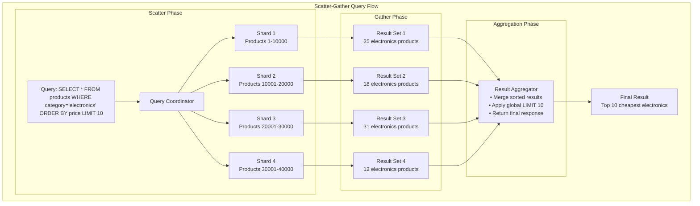

# Episode 72: Scatter-Gather Queries - Advanced Query Optimization and Distributed Processing

**Duration**: 2.5 hours  
**Objective**: Master scatter-gather query patterns, optimization techniques, and advanced distributed query processing strategies

---

## Table of Contents

1. [Fundamentals of Scatter-Gather Queries](#fundamentals-of-scatter-gather-queries)
2. [Query Distribution Strategies](#query-distribution-strategies)
3. [Result Aggregation and Merging](#result-aggregation-and-merging)
4. [Performance Optimization Techniques](#performance-optimization-techniques)
5. [Fault Tolerance and Error Handling](#fault-tolerance-and-error-handling)
6. [Advanced Query Processing Patterns](#advanced-query-processing-patterns)
7. [Production Systems and Case Studies](#production-systems-and-case-studies)
8. [Query Cost Models and Planning](#query-cost-models-and-planning)
9. [Streaming and Real-Time Scatter-Gather](#streaming-and-real-time-scatter-gather)
10. [Future Trends and Optimizations](#future-trends-and-optimizations)

---

## Fundamentals of Scatter-Gather Queries

### What Are Scatter-Gather Queries?

Scatter-gather is a distributed query processing pattern that:
1. **Scatters** a query to multiple nodes in parallel
2. **Processes** the query on each node independently
3. **Gathers** partial results from all nodes
4. **Aggregates** results into a final response



### Core Advantages and Challenges

**Advantages:**
- **Parallelism**: Reduces overall query latency through parallel execution
- **Scalability**: Handles datasets larger than any single machine can process
- **Resource Utilization**: Leverages computational resources across multiple nodes
- **Availability**: Can provide partial results even if some nodes fail

**Challenges:**
- **Complexity**: Requires sophisticated query planning and coordination
- **Network Overhead**: Inter-node communication can become bottleneck
- **Consistency**: Ensuring data consistency across distributed nodes
- **Fault Handling**: Managing partial failures and timeouts gracefully

### Query Types and Patterns

```python
from abc import ABC, abstractmethod
from dataclasses import dataclass
from typing import List, Dict, Any, Optional
from enum import Enum
import asyncio
import time

class QueryType(Enum):
    SCATTER_GATHER = "scatter_gather"
    MAP_REDUCE = "map_reduce"
    PIPELINE = "pipeline"
    BROADCAST = "broadcast"
    TARGETED = "targeted"

@dataclass
class QueryPlan:
    """Execution plan for distributed query"""
    query_id: str
    query_type: QueryType
    target_shards: List[int]
    execution_phases: List[str]
    estimated_cost: float
    timeout_seconds: float
    parallelism_level: int
    result_limit: Optional[int] = None
    aggregation_functions: List[str] = None

class ScatterGatherQueryProcessor:
    """Core scatter-gather query processor"""
    
    def __init__(self, shards: Dict[int, DatabaseShard], coordinator: QueryCoordinator):
        self.shards = shards
        self.coordinator = coordinator
        self.query_planner = QueryPlanner(shards)
        self.result_merger = ResultMerger()
    
    async def execute_query(self, sql_query: str, options: QueryOptions = None) -> QueryResult:
        """Execute scatter-gather query"""
        
        # Phase 1: Parse and plan query
        parsed_query = self.parse_sql(sql_query)
        execution_plan = self.query_planner.create_plan(parsed_query)
        
        # Phase 2: Execute scatter phase
        start_time = time.time()
        scatter_results = await self.execute_scatter_phase(execution_plan)
        scatter_time = time.time() - start_time
        
        # Phase 3: Execute gather and aggregation phase
        gather_start = time.time()
        final_result = await self.execute_gather_phase(scatter_results, execution_plan)
        gather_time = time.time() - gather_start
        
        # Phase 4: Return results with metadata
        return QueryResult(
            data=final_result.data,
            row_count=len(final_result.data),
            execution_time=scatter_time + gather_time,
            scatter_time=scatter_time,
            gather_time=gather_time,
            shards_queried=len(execution_plan.target_shards),
            query_plan=execution_plan
        )
    
    async def execute_scatter_phase(self, plan: QueryPlan) -> List[ShardResult]:
        """Execute query on all target shards in parallel"""
        
        scatter_tasks = []
        
        for shard_id in plan.target_shards:
            shard = self.shards[shard_id]
            
            # Create shard-specific query
            shard_query = self.adapt_query_for_shard(plan, shard_id)
            
            # Execute asynchronously with timeout
            task = asyncio.create_task(
                self.execute_shard_query(shard, shard_query, plan.timeout_seconds)
            )
            scatter_tasks.append((shard_id, task))
        
        # Collect results as they complete
        shard_results = []
        completed_shards = set()
        
        for shard_id, task in scatter_tasks:
            try:
                result = await task
                shard_results.append(ShardResult(
                    shard_id=shard_id,
                    data=result.data,
                    row_count=result.row_count,
                    execution_time=result.execution_time,
                    success=True
                ))
                completed_shards.add(shard_id)
                
            except asyncio.TimeoutError:
                # Handle timeout gracefully
                shard_results.append(ShardResult(
                    shard_id=shard_id,
                    error="Timeout after {plan.timeout_seconds}s",
                    success=False
                ))
            except Exception as e:
                # Handle other errors
                shard_results.append(ShardResult(
                    shard_id=shard_id,
                    error=str(e),
                    success=False
                ))
        
        return shard_results
    
    async def execute_shard_query(self, shard: DatabaseShard, query: ShardQuery, 
                                 timeout: float) -> ShardQueryResult:
        """Execute query on single shard with timeout"""
        
        try:
            result = await asyncio.wait_for(
                shard.execute_query(query),
                timeout=timeout
            )
            return result
            
        except asyncio.TimeoutError:
            # Cancel any ongoing work on the shard
            await shard.cancel_query(query.query_id)
            raise
    
    async def execute_gather_phase(self, shard_results: List[ShardResult], 
                                  plan: QueryPlan) -> AggregatedResult:
        """Aggregate results from scatter phase"""
        
        # Filter successful results
        successful_results = [r for r in shard_results if r.success]
        failed_shards = [r.shard_id for r in shard_results if not r.success]
        
        if not successful_results:
            raise QueryExecutionError("All shards failed")
        
        # Log partial failures
        if failed_shards:
            self.coordinator.log_partial_failure(plan.query_id, failed_shards)
        
        # Apply aggregation based on query type
        if plan.aggregation_functions:
            return await self.result_merger.aggregate_results(
                successful_results, 
                plan.aggregation_functions
            )
        else:
            return await self.result_merger.merge_results(
                successful_results,
                plan.result_limit
            )

@dataclass
class ShardResult:
    shard_id: int
    success: bool
    data: List[Dict[str, Any]] = None
    row_count: int = 0
    execution_time: float = 0.0
    error: str = None
    metadata: Dict[str, Any] = None
```

---

## Query Distribution Strategies

### Partitioning-Aware Query Routing

```python
class QueryRouter:
    """Route queries to appropriate shards based on partitioning strategy"""
    
    def __init__(self, partitioning_scheme: PartitioningScheme):
        self.partitioning_scheme = partitioning_scheme
        self.shard_metadata = {}
    
    def route_query(self, query: ParsedQuery) -> QueryRoutingPlan:
        """Determine which shards need to process the query"""
        
        if query.has_partition_key():
            return self.route_targeted_query(query)
        elif query.has_range_filter():
            return self.route_range_query(query) 
        else:
            return self.route_full_scan_query(query)
    
    def route_targeted_query(self, query: ParsedQuery) -> QueryRoutingPlan:
        """Route query that filters on partition key"""
        
        partition_values = query.get_partition_key_values()
        target_shards = []
        
        for value in partition_values:
            shard_id = self.partitioning_scheme.get_shard(value)
            if shard_id not in target_shards:
                target_shards.append(shard_id)
        
        return QueryRoutingPlan(
            routing_type=RoutingType.TARGETED,
            target_shards=target_shards,
            pruning_factor=len(target_shards) / self.partitioning_scheme.total_shards
        )
    
    def route_range_query(self, query: ParsedQuery) -> QueryRoutingPlan:
        """Route range query using partition metadata"""
        
        range_filter = query.get_range_filter()
        field = range_filter.field
        
        if field == self.partitioning_scheme.partition_key:
            # Range on partition key - can prune shards
            target_shards = self.partitioning_scheme.get_shards_for_range(
                range_filter.min_value,
                range_filter.max_value
            )
            
            return QueryRoutingPlan(
                routing_type=RoutingType.RANGE_PRUNED,
                target_shards=target_shards,
                pruning_factor=len(target_shards) / self.partitioning_scheme.total_shards
            )
        else:
            # Range on non-partition key - need all shards
            return self.route_full_scan_query(query)
    
    def route_full_scan_query(self, query: ParsedQuery) -> QueryRoutingPlan:
        """Route query that requires scanning all shards"""
        
        return QueryRoutingPlan(
            routing_type=RoutingType.FULL_SCAN,
            target_shards=list(self.partitioning_scheme.get_all_shards()),
            pruning_factor=1.0  # No pruning possible
        )

class PartitioningScheme(ABC):
    """Abstract base for partitioning schemes"""
    
    @abstractmethod
    def get_shard(self, partition_key: Any) -> int:
        """Get shard ID for given partition key"""
        pass
    
    @abstractmethod
    def get_shards_for_range(self, min_value: Any, max_value: Any) -> List[int]:
        """Get shard IDs that might contain data in the given range"""
        pass

class HashPartitioning(PartitioningScheme):
    """Hash-based partitioning scheme"""
    
    def __init__(self, num_shards: int, hash_function: str = "md5"):
        self.num_shards = num_shards
        self.hash_function = hash_function
        self.total_shards = num_shards
    
    def get_shard(self, partition_key: Any) -> int:
        """Hash-based shard assignment"""
        import hashlib
        
        key_str = str(partition_key)
        
        if self.hash_function == "md5":
            hash_value = int(hashlib.md5(key_str.encode()).hexdigest(), 16)
        else:
            hash_value = hash(key_str)
        
        return hash_value % self.num_shards
    
    def get_shards_for_range(self, min_value: Any, max_value: Any) -> List[int]:
        """For hash partitioning, ranges require all shards"""
        return list(range(self.num_shards))

class RangePartitioning(PartitioningScheme):
    """Range-based partitioning scheme"""
    
    def __init__(self, shard_boundaries: List[Any]):
        """
        shard_boundaries: List of upper bounds for each shard
        E.g., [100, 200, 300] creates shards: [0-100), [100-200), [200-300), [300-inf)
        """
        self.shard_boundaries = sorted(shard_boundaries)
        self.total_shards = len(shard_boundaries) + 1
    
    def get_shard(self, partition_key: Any) -> int:
        """Range-based shard assignment"""
        for i, boundary in enumerate(self.shard_boundaries):
            if partition_key < boundary:
                return i
        
        # Last shard for values >= highest boundary
        return len(self.shard_boundaries)
    
    def get_shards_for_range(self, min_value: Any, max_value: Any) -> List[int]:
        """Get shards that intersect with the given range"""
        target_shards = set()
        
        # Find all shards that could contain values in [min_value, max_value]
        min_shard = self.get_shard(min_value)
        max_shard = self.get_shard(max_value)
        
        for shard_id in range(min_shard, max_shard + 1):
            target_shards.add(shard_id)
        
        return list(target_shards)

class ConsistentHashPartitioning(PartitioningScheme):
    """Consistent hashing for better load distribution"""
    
    def __init__(self, num_shards: int, virtual_nodes: int = 150):
        self.num_shards = num_shards
        self.virtual_nodes = virtual_nodes
        self.total_shards = num_shards
        self.ring = self.build_hash_ring()
    
    def build_hash_ring(self) -> Dict[int, int]:
        """Build consistent hash ring"""
        ring = {}
        
        for shard_id in range(self.num_shards):
            for virtual_node in range(self.virtual_nodes):
                virtual_key = f"shard_{shard_id}_vnode_{virtual_node}"
                hash_value = hash(virtual_key) % (2**32)
                ring[hash_value] = shard_id
        
        return ring
    
    def get_shard(self, partition_key: Any) -> int:
        """Find shard using consistent hashing"""
        key_hash = hash(str(partition_key)) % (2**32)
        
        # Find next shard on ring
        sorted_ring_keys = sorted(self.ring.keys())
        
        for ring_key in sorted_ring_keys:
            if ring_key >= key_hash:
                return self.ring[ring_key]
        
        # Wrap around to first shard
        return self.ring[sorted_ring_keys[0]]
    
    def get_shards_for_range(self, min_value: Any, max_value: Any) -> List[int]:
        """For consistent hashing, ranges typically require all shards"""
        return list(range(self.num_shards))
```

### Query Rewriting for Distribution

```python
class DistributedQueryRewriter:
    """Rewrite queries for efficient distributed execution"""
    
    def __init__(self, schema_info: SchemaInfo):
        self.schema_info = schema_info
        self.optimization_rules = [
            PredicatePushdownRule(),
            ProjectionPushdownRule(), 
            LimitPushdownRule(),
            AggregationRewriteRule(),
            JoinRewriteRule()
        ]
    
    def rewrite_query(self, query: ParsedQuery, routing_plan: QueryRoutingPlan) -> RewrittenQuery:
        """Rewrite query for distributed execution"""
        
        rewritten = query.copy()
        
        # Apply optimization rules
        for rule in self.optimization_rules:
            if rule.applicable(rewritten, routing_plan):
                rewritten = rule.apply(rewritten, routing_plan)
        
        # Generate shard-specific queries
        shard_queries = self.generate_shard_queries(rewritten, routing_plan)
        
        return RewrittenQuery(
            original_query=query,
            coordinator_query=rewritten,
            shard_queries=shard_queries,
            aggregation_steps=self.extract_aggregation_steps(rewritten)
        )
    
    def generate_shard_queries(self, query: ParsedQuery, 
                              routing_plan: QueryRoutingPlan) -> Dict[int, ShardQuery]:
        """Generate shard-specific queries"""
        
        shard_queries = {}
        
        for shard_id in routing_plan.target_shards:
            # Base query for shard
            shard_query = query.copy()
            
            # Add shard-specific filters if needed
            if routing_plan.routing_type == RoutingType.TARGETED:
                shard_filter = self.create_shard_filter(query, shard_id)
                shard_query.add_filter(shard_filter)
            
            # Adjust LIMIT for over-fetching
            if query.limit:
                # Over-fetch to ensure correct global ordering
                over_fetch_limit = min(query.limit * 2, 10000)
                shard_query.limit = over_fetch_limit
            
            shard_queries[shard_id] = ShardQuery(
                shard_id=shard_id,
                sql=shard_query.to_sql(),
                parameters=shard_query.parameters
            )
        
        return shard_queries

class PredicatePushdownRule:
    """Push predicates down to individual shards"""
    
    def applicable(self, query: ParsedQuery, routing_plan: QueryRoutingPlan) -> bool:
        return query.has_filters() and routing_plan.allows_pushdown()
    
    def apply(self, query: ParsedQuery, routing_plan: QueryRoutingPlan) -> ParsedQuery:
        """Push down predicates that can be evaluated at shard level"""
        
        pushdown_filters = []
        coordinator_filters = []
        
        for filter_condition in query.filters:
            if self.can_push_down(filter_condition):
                pushdown_filters.append(filter_condition)
            else:
                coordinator_filters.append(filter_condition)
        
        # Create new query with separated filters
        rewritten = query.copy()
        rewritten.shard_filters = pushdown_filters
        rewritten.coordinator_filters = coordinator_filters
        
        return rewritten
    
    def can_push_down(self, filter_condition: FilterCondition) -> bool:
        """Determine if filter can be pushed to shards"""
        
        # Can push down simple column filters
        if filter_condition.is_column_filter():
            return True
        
        # Can't push down cross-shard aggregations
        if filter_condition.references_aggregation():
            return False
        
        # Can push down deterministic functions
        if filter_condition.uses_function():
            return filter_condition.function_is_deterministic()
        
        return True

class AggregationRewriteRule:
    """Rewrite aggregations for two-phase execution"""
    
    def applicable(self, query: ParsedQuery, routing_plan: QueryRoutingPlan) -> bool:
        return query.has_aggregation() and len(routing_plan.target_shards) > 1
    
    def apply(self, query: ParsedQuery, routing_plan: QueryRoutingPlan) -> ParsedQuery:
        """Rewrite aggregations for distributed execution"""
        
        rewritten = query.copy()
        
        # Separate aggregations into shard and coordinator phases
        shard_aggregations = []
        coordinator_aggregations = []
        
        for agg in query.aggregations:
            if agg.function in ['COUNT', 'SUM', 'MIN', 'MAX']:
                # These can be computed in two phases
                shard_agg = self.create_shard_aggregation(agg)
                coord_agg = self.create_coordinator_aggregation(agg)
                
                shard_aggregations.append(shard_agg)
                coordinator_aggregations.append(coord_agg)
                
            elif agg.function == 'AVG':
                # AVG requires SUM and COUNT
                sum_agg = Aggregation('SUM', agg.column, f"{agg.alias}_sum")
                count_agg = Aggregation('COUNT', agg.column, f"{agg.alias}_count") 
                
                shard_aggregations.extend([sum_agg, count_agg])
                
                # Coordinator computes final average
                avg_agg = ComputedAggregation(
                    'DIV', 
                    [f"{agg.alias}_sum", f"{agg.alias}_count"],
                    agg.alias
                )
                coordinator_aggregations.append(avg_agg)
                
            else:
                # Complex aggregations might not be distributable
                raise UnsupportedAggregationError(f"Cannot distribute {agg.function}")
        
        rewritten.shard_aggregations = shard_aggregations
        rewritten.coordinator_aggregations = coordinator_aggregations
        
        return rewritten
```

---

## Result Aggregation and Merging

### Multi-Way Merge Algorithms

```python
import heapq
from typing import Iterator, Callable, Any

class ResultMerger:
    """Merge results from multiple shards"""
    
    def __init__(self):
        self.merge_strategies = {
            'sorted_merge': self.sorted_merge,
            'hash_aggregate': self.hash_aggregate,
            'union_all': self.union_all,
            'top_k': self.top_k_merge
        }
    
    async def merge_results(self, shard_results: List[ShardResult], 
                           query_spec: QuerySpec) -> MergedResult:
        """Merge results based on query requirements"""
        
        if query_spec.requires_sorting():
            return await self.sorted_merge(shard_results, query_spec)
        elif query_spec.has_aggregations():
            return await self.hash_aggregate(shard_results, query_spec)
        elif query_spec.has_limit():
            return await self.top_k_merge(shard_results, query_spec)
        else:
            return await self.union_all(shard_results, query_spec)
    
    async def sorted_merge(self, shard_results: List[ShardResult], 
                          query_spec: QuerySpec) -> MergedResult:
        """Merge sorted results from shards using k-way merge"""
        
        # Extract sort key function
        sort_columns = query_spec.get_sort_columns()
        sort_key = self.create_sort_key_function(sort_columns)
        
        # Initialize merge heap
        merge_heap = []
        shard_iterators = []
        
        # Add first element from each shard to heap
        for shard_result in shard_results:
            if shard_result.data:
                iterator = iter(shard_result.data)
                try:
                    first_row = next(iterator)
                    heap_entry = (
                        sort_key(first_row),
                        shard_result.shard_id,
                        first_row,
                        len(shard_iterators)  # Iterator index
                    )
                    heapq.heappush(merge_heap, heap_entry)
                    shard_iterators.append(iterator)
                except StopIteration:
                    shard_iterators.append(iter([]))
            else:
                shard_iterators.append(iter([]))
        
        # Perform k-way merge
        merged_rows = []
        rows_processed = 0
        limit = query_spec.get_limit()
        
        while merge_heap and (not limit or rows_processed < limit):
            # Pop minimum element
            sort_value, shard_id, row, iterator_idx = heapq.heappop(merge_heap)
            merged_rows.append(row)
            rows_processed += 1
            
            # Add next element from same shard if available
            try:
                next_row = next(shard_iterators[iterator_idx])
                next_entry = (
                    sort_key(next_row),
                    shard_id,
                    next_row,
                    iterator_idx
                )
                heapq.heappush(merge_heap, next_entry)
            except StopIteration:
                pass  # This shard is exhausted
        
        return MergedResult(
            data=merged_rows,
            total_rows=len(merged_rows),
            merge_strategy='sorted_merge'
        )
    
    async def hash_aggregate(self, shard_results: List[ShardResult],
                           query_spec: QuerySpec) -> MergedResult:
        """Perform hash aggregation across shard results"""
        
        aggregations = query_spec.get_aggregations()
        group_by_columns = query_spec.get_group_by_columns()
        
        # Hash table for aggregation
        aggregation_table = {}
        
        for shard_result in shard_results:
            for row in shard_result.data:
                # Create group key
                if group_by_columns:
                    group_key = tuple(row[col] for col in group_by_columns)
                else:
                    group_key = ()  # Single group for global aggregation
                
                # Initialize or update aggregation state
                if group_key not in aggregation_table:
                    aggregation_table[group_key] = self.initialize_aggregation_state(aggregations)
                
                self.update_aggregation_state(
                    aggregation_table[group_key],
                    row,
                    aggregations
                )
        
        # Generate final aggregated rows
        final_rows = []
        for group_key, agg_state in aggregation_table.items():
            final_row = {}
            
            # Add group by columns
            if group_by_columns:
                for i, col in enumerate(group_by_columns):
                    final_row[col] = group_key[i]
            
            # Add aggregated values
            for agg in aggregations:
                final_row[agg.alias] = self.finalize_aggregation(agg_state[agg.alias], agg.function)
            
            final_rows.append(final_row)
        
        return MergedResult(
            data=final_rows,
            total_rows=len(final_rows),
            merge_strategy='hash_aggregate'
        )
    
    def create_sort_key_function(self, sort_columns: List[SortColumn]) -> Callable:
        """Create sort key function for given sort specification"""
        
        def sort_key(row: Dict[str, Any]) -> tuple:
            key_parts = []
            
            for sort_col in sort_columns:
                value = row[sort_col.column]
                
                # Handle null values
                if value is None:
                    value = float('-inf') if sort_col.ascending else float('inf')
                
                # Reverse for descending order
                if not sort_col.ascending:
                    if isinstance(value, (int, float)):
                        value = -value
                    elif isinstance(value, str):
                        # Use reverse lexicographic order for strings
                        value = tuple(-ord(c) for c in value)
                
                key_parts.append(value)
            
            return tuple(key_parts)
        
        return sort_key
    
    def initialize_aggregation_state(self, aggregations: List[Aggregation]) -> Dict[str, Any]:
        """Initialize aggregation state for a group"""
        
        state = {}
        
        for agg in aggregations:
            if agg.function == 'COUNT':
                state[agg.alias] = 0
            elif agg.function == 'SUM':
                state[agg.alias] = 0
            elif agg.function in ['MIN', 'MAX']:
                state[agg.alias] = None
            elif agg.function == 'AVG':
                state[agg.alias] = {'sum': 0, 'count': 0}
            else:
                raise UnsupportedAggregationError(f"Unknown aggregation: {agg.function}")
        
        return state
    
    def update_aggregation_state(self, state: Dict[str, Any], row: Dict[str, Any],
                                aggregations: List[Aggregation]):
        """Update aggregation state with new row"""
        
        for agg in aggregations:
            value = row.get(agg.column)
            
            if agg.function == 'COUNT':
                if value is not None:
                    state[agg.alias] += 1
            elif agg.function == 'SUM':
                if value is not None:
                    state[agg.alias] += value
            elif agg.function == 'MIN':
                if value is not None:
                    if state[agg.alias] is None or value < state[agg.alias]:
                        state[agg.alias] = value
            elif agg.function == 'MAX':
                if value is not None:
                    if state[agg.alias] is None or value > state[agg.alias]:
                        state[agg.alias] = value
            elif agg.function == 'AVG':
                if value is not None:
                    state[agg.alias]['sum'] += value
                    state[agg.alias]['count'] += 1

    async def top_k_merge(self, shard_results: List[ShardResult], 
                         query_spec: QuerySpec) -> MergedResult:
        """Merge results for TOP-K queries"""
        
        limit = query_spec.get_limit()
        sort_columns = query_spec.get_sort_columns()
        
        if sort_columns:
            # Sorted TOP-K
            return await self.sorted_merge(shard_results, query_spec)
        else:
            # Unsorted - just concatenate up to limit
            merged_rows = []
            
            for shard_result in shard_results:
                for row in shard_result.data:
                    if len(merged_rows) < limit:
                        merged_rows.append(row)
                    else:
                        break
                
                if len(merged_rows) >= limit:
                    break
            
            return MergedResult(
                data=merged_rows,
                total_rows=len(merged_rows),
                merge_strategy='top_k'
            )
```

### Streaming Result Processing

```python
import asyncio
from asyncio import Queue
from typing import AsyncIterator

class StreamingResultMerger:
    """Stream results as they become available"""
    
    def __init__(self, buffer_size: int = 1000):
        self.buffer_size = buffer_size
    
    async def streaming_merge(self, shard_queries: Dict[int, ShardQuery],
                            query_spec: QuerySpec) -> AsyncIterator[Dict[str, Any]]:
        """Stream merged results as they become available"""
        
        # Create result queues for each shard
        shard_queues = {}
        for shard_id in shard_queries.keys():
            shard_queues[shard_id] = Queue(maxsize=self.buffer_size)
        
        # Start shard query tasks
        shard_tasks = []
        for shard_id, query in shard_queries.items():
            task = asyncio.create_task(
                self.execute_streaming_query(shard_id, query, shard_queues[shard_id])
            )
            shard_tasks.append(task)
        
        # Stream merge results
        if query_spec.requires_sorting():
            async for row in self.streaming_sorted_merge(shard_queues, query_spec):
                yield row
        else:
            async for row in self.streaming_union(shard_queues, query_spec):
                yield row
        
        # Clean up tasks
        for task in shard_tasks:
            if not task.done():
                task.cancel()
    
    async def execute_streaming_query(self, shard_id: int, query: ShardQuery, 
                                     result_queue: Queue):
        """Execute query on shard and stream results to queue"""
        
        shard = self.get_shard(shard_id)
        
        try:
            async for row in shard.stream_query(query):
                await result_queue.put(('data', row))
            
            # Signal completion
            await result_queue.put(('done', shard_id))
        
        except Exception as e:
            # Signal error
            await result_queue.put(('error', str(e)))
    
    async def streaming_sorted_merge(self, shard_queues: Dict[int, Queue],
                                   query_spec: QuerySpec) -> AsyncIterator[Dict[str, Any]]:
        """Stream sorted merge of results"""
        
        sort_key = self.create_sort_key_function(query_spec.get_sort_columns())
        
        # Priority queue for merge
        merge_heap = []
        active_shards = set(shard_queues.keys())
        
        # Initialize heap with first result from each shard
        for shard_id, queue in shard_queues.items():
            try:
                message_type, data = await asyncio.wait_for(queue.get(), timeout=1.0)
                
                if message_type == 'data':
                    heap_entry = (sort_key(data), shard_id, data)
                    heapq.heappush(merge_heap, heap_entry)
                elif message_type == 'done':
                    active_shards.discard(shard_id)
                elif message_type == 'error':
                    self.handle_shard_error(shard_id, data)
                    active_shards.discard(shard_id)
            
            except asyncio.TimeoutError:
                # Shard not ready yet, skip for now
                pass
        
        # Stream merged results
        limit = query_spec.get_limit()
        rows_yielded = 0
        
        while merge_heap and active_shards and (not limit or rows_yielded < limit):
            # Yield minimum element
            sort_value, shard_id, row = heapq.heappop(merge_heap)
            yield row
            rows_yielded += 1
            
            # Get next result from same shard
            try:
                queue = shard_queues[shard_id]
                message_type, data = await asyncio.wait_for(queue.get(), timeout=0.1)
                
                if message_type == 'data':
                    next_entry = (sort_key(data), shard_id, data)
                    heapq.heappush(merge_heap, next_entry)
                elif message_type == 'done':
                    active_shards.discard(shard_id)
                elif message_type == 'error':
                    self.handle_shard_error(shard_id, data)
                    active_shards.discard(shard_id)
            
            except asyncio.TimeoutError:
                # No immediate result available from this shard
                pass
    
    async def streaming_union(self, shard_queues: Dict[int, Queue],
                            query_spec: QuerySpec) -> AsyncIterator[Dict[str, Any]]:
        """Stream union of results from all shards"""
        
        active_shards = set(shard_queues.keys())
        limit = query_spec.get_limit()
        rows_yielded = 0
        
        while active_shards and (not limit or rows_yielded < limit):
            # Round-robin through active shards
            for shard_id in list(active_shards):
                if not limit or rows_yielded < limit:
                    queue = shard_queues[shard_id]
                    
                    try:
                        message_type, data = await asyncio.wait_for(queue.get(), timeout=0.1)
                        
                        if message_type == 'data':
                            yield data
                            rows_yielded += 1
                        elif message_type == 'done':
                            active_shards.discard(shard_id)
                        elif message_type == 'error':
                            self.handle_shard_error(shard_id, data)
                            active_shards.discard(shard_id)
                    
                    except asyncio.TimeoutError:
                        # No result available from this shard right now
                        pass
                else:
                    break  # Reached limit
```

---

## Performance Optimization Techniques

### Query Plan Optimization

```python
class QueryOptimizer:
    """Optimize distributed query plans"""
    
    def __init__(self, cluster_stats: ClusterStatistics):
        self.cluster_stats = cluster_stats
        self.cost_model = QueryCostModel()
    
    def optimize_query_plan(self, query: ParsedQuery) -> OptimizedQueryPlan:
        """Create optimal execution plan for distributed query"""
        
        # Generate alternative execution strategies
        alternatives = self.generate_execution_alternatives(query)
        
        # Cost each alternative
        costed_alternatives = []
        for alternative in alternatives:
            cost = self.cost_model.estimate_cost(alternative, self.cluster_stats)
            costed_alternatives.append((alternative, cost))
        
        # Select lowest cost plan
        best_plan, best_cost = min(costed_alternatives, key=lambda x: x[1])
        
        return OptimizedQueryPlan(
            execution_plan=best_plan,
            estimated_cost=best_cost,
            alternatives_considered=len(alternatives)
        )
    
    def generate_execution_alternatives(self, query: ParsedQuery) -> List[ExecutionPlan]:
        """Generate different ways to execute the query"""
        
        alternatives = []
        
        # Basic scatter-gather approach
        alternatives.append(self.create_scatter_gather_plan(query))
        
        # If query has joins, consider different join strategies
        if query.has_joins():
            alternatives.extend(self.create_join_alternatives(query))
        
        # If query has aggregations, consider different aggregation strategies
        if query.has_aggregations():
            alternatives.extend(self.create_aggregation_alternatives(query))
        
        # Consider materialized view usage
        alternatives.extend(self.create_materialized_view_alternatives(query))
        
        return alternatives
    
    def create_scatter_gather_plan(self, query: ParsedQuery) -> ExecutionPlan:
        """Create basic scatter-gather execution plan"""
        
        return ExecutionPlan(
            strategy='scatter_gather',
            phases=[
                ExecutionPhase('scatter', 'Distribute query to all shards'),
                ExecutionPhase('local_execution', 'Execute query on each shard'),
                ExecutionPhase('gather', 'Collect results from shards'),
                ExecutionPhase('merge', 'Merge and sort final results')
            ],
            parallelism_level=len(self.cluster_stats.active_shards),
            estimated_data_transfer=self.estimate_data_transfer(query)
        )
    
    def create_join_alternatives(self, query: ParsedQuery) -> List[ExecutionPlan]:
        """Create alternative join execution plans"""
        
        alternatives = []
        joins = query.get_joins()
        
        for join in joins:
            # Broadcast join - replicate smaller table
            if self.is_broadcast_join_viable(join):
                alternatives.append(self.create_broadcast_join_plan(query, join))
            
            # Shuffle join - repartition both tables
            alternatives.append(self.create_shuffle_join_plan(query, join))
            
            # Co-located join - if tables are partitioned on join key
            if self.is_colocated_join_possible(join):
                alternatives.append(self.create_colocated_join_plan(query, join))
        
        return alternatives
    
    def create_aggregation_alternatives(self, query: ParsedQuery) -> List[ExecutionPlan]:
        """Create alternative aggregation execution plans"""
        
        alternatives = []
        aggregations = query.get_aggregations()
        
        # Two-phase aggregation (partial + final)
        alternatives.append(self.create_two_phase_aggregation_plan(query, aggregations))
        
        # Three-phase aggregation (for high cardinality group by)
        if self.is_high_cardinality_groupby(query):
            alternatives.append(self.create_three_phase_aggregation_plan(query, aggregations))
        
        # Streaming aggregation (for real-time queries)
        if self.supports_streaming_aggregation(aggregations):
            alternatives.append(self.create_streaming_aggregation_plan(query, aggregations))
        
        return alternatives

class QueryCostModel:
    """Model for estimating query execution costs"""
    
    def __init__(self):
        # Cost factors (tuned based on system characteristics)
        self.cpu_cost_factor = 1.0
        self.network_cost_factor = 10.0  # Network is typically 10x more expensive
        self.disk_io_cost_factor = 5.0
        self.memory_cost_factor = 0.1
    
    def estimate_cost(self, plan: ExecutionPlan, cluster_stats: ClusterStatistics) -> float:
        """Estimate total execution cost for plan"""
        
        total_cost = 0.0
        
        for phase in plan.phases:
            phase_cost = self.estimate_phase_cost(phase, cluster_stats)
            total_cost += phase_cost
        
        # Add parallelism benefits
        parallelism_factor = min(plan.parallelism_level, cluster_stats.cpu_cores)
        cpu_cost_reduction = 1.0 / parallelism_factor
        
        # Add network overhead for coordination
        coordination_overhead = self.network_cost_factor * plan.parallelism_level * 0.1
        
        total_cost = total_cost * cpu_cost_reduction + coordination_overhead
        
        return total_cost
    
    def estimate_phase_cost(self, phase: ExecutionPhase, cluster_stats: ClusterStatistics) -> float:
        """Estimate cost for individual execution phase"""
        
        if phase.phase_type == 'scatter':
            # Cost of distributing query
            return self.network_cost_factor * cluster_stats.active_shards
        
        elif phase.phase_type == 'local_execution':
            # Cost of local query execution
            cpu_cost = self.cpu_cost_factor * phase.estimated_cpu_ops
            io_cost = self.disk_io_cost_factor * phase.estimated_io_bytes / (1024**3)  # GB
            return cpu_cost + io_cost
        
        elif phase.phase_type == 'gather':
            # Cost of collecting results
            network_cost = self.network_cost_factor * phase.estimated_data_transfer / (1024**3)  # GB
            return network_cost
        
        elif phase.phase_type == 'merge':
            # Cost of merging results
            cpu_cost = self.cpu_cost_factor * phase.estimated_merge_operations
            memory_cost = self.memory_cost_factor * phase.estimated_memory_usage / (1024**3)  # GB
            return cpu_cost + memory_cost
        
        else:
            return 0.0

class AdaptiveQueryOptimizer:
    """Optimizer that learns from execution statistics"""
    
    def __init__(self):
        self.execution_history = ExecutionHistory()
        self.cost_model = AdaptiveCostModel()
    
    def optimize_with_feedback(self, query: ParsedQuery) -> OptimizedQueryPlan:
        """Optimize query using historical execution data"""
        
        # Find similar historical queries
        similar_queries = self.execution_history.find_similar_queries(query)
        
        # Generate execution alternatives
        alternatives = self.generate_execution_alternatives(query)
        
        # Score alternatives using adaptive cost model
        scored_alternatives = []
        for alternative in alternatives:
            # Base cost estimate
            base_cost = self.cost_model.estimate_cost(alternative)
            
            # Adjust based on historical performance
            historical_adjustment = self.calculate_historical_adjustment(
                alternative, similar_queries
            )
            
            adjusted_cost = base_cost * historical_adjustment
            scored_alternatives.append((alternative, adjusted_cost))
        
        # Select best alternative
        best_plan, best_cost = min(scored_alternatives, key=lambda x: x[1])
        
        return OptimizedQueryPlan(
            execution_plan=best_plan,
            estimated_cost=best_cost,
            confidence_score=self.calculate_confidence_score(similar_queries)
        )
    
    def record_execution_statistics(self, query: ParsedQuery, plan: ExecutionPlan, 
                                  actual_cost: float, execution_time: float):
        """Record actual execution statistics for learning"""
        
        execution_record = ExecutionRecord(
            query=query,
            plan=plan,
            actual_cost=actual_cost,
            execution_time=execution_time,
            timestamp=time.time()
        )
        
        self.execution_history.add_record(execution_record)
        
        # Update cost model based on prediction accuracy
        self.cost_model.update_model(execution_record)
    
    def calculate_historical_adjustment(self, plan: ExecutionPlan, 
                                      similar_executions: List[ExecutionRecord]) -> float:
        """Calculate adjustment factor based on historical performance"""
        
        if not similar_executions:
            return 1.0  # No adjustment if no historical data
        
        # Calculate average performance for similar plans
        plan_performance = []
        
        for record in similar_executions:
            if self.plans_are_similar(plan, record.plan):
                performance_ratio = record.actual_cost / record.estimated_cost
                plan_performance.append(performance_ratio)
        
        if plan_performance:
            return sum(plan_performance) / len(plan_performance)
        else:
            return 1.0
```

### Caching and Materialization

```python
class QueryResultCache:
    """Cache for distributed query results"""
    
    def __init__(self, max_memory_mb: int = 1024, ttl_seconds: int = 3600):
        self.max_memory = max_memory_mb * 1024 * 1024
        self.ttl_seconds = ttl_seconds
        self.cache = {}  # query_hash -> CacheEntry
        self.access_times = {}  # query_hash -> timestamp
        self.memory_usage = 0
    
    def get_cached_result(self, query: ParsedQuery, 
                         parameters: Dict[str, Any] = None) -> Optional[QueryResult]:
        """Get cached result for query"""
        
        query_hash = self.compute_query_hash(query, parameters)
        
        if query_hash in self.cache:
            cache_entry = self.cache[query_hash]
            
            # Check if result is still valid
            if time.time() - cache_entry.timestamp <= self.ttl_seconds:
                self.access_times[query_hash] = time.time()
                return cache_entry.result
            else:
                # Expired - remove from cache
                self.remove_from_cache(query_hash)
        
        return None
    
    def cache_result(self, query: ParsedQuery, result: QueryResult,
                    parameters: Dict[str, Any] = None):
        """Cache query result"""
        
        query_hash = self.compute_query_hash(query, parameters)
        result_size = self.estimate_result_size(result)
        
        # Evict if necessary
        while self.memory_usage + result_size > self.max_memory:
            self.evict_lru()
        
        # Add to cache
        cache_entry = CacheEntry(
            result=result,
            timestamp=time.time(),
            size=result_size
        )
        
        self.cache[query_hash] = cache_entry
        self.access_times[query_hash] = time.time()
        self.memory_usage += result_size
    
    def evict_lru(self):
        """Evict least recently used cache entry"""
        
        if not self.access_times:
            return
        
        lru_query_hash = min(self.access_times.items(), key=lambda x: x[1])[0]
        self.remove_from_cache(lru_query_hash)
    
    def remove_from_cache(self, query_hash: str):
        """Remove entry from cache"""
        
        if query_hash in self.cache:
            cache_entry = self.cache[query_hash]
            self.memory_usage -= cache_entry.size
            
            del self.cache[query_hash]
            del self.access_times[query_hash]
    
    def compute_query_hash(self, query: ParsedQuery, 
                          parameters: Dict[str, Any] = None) -> str:
        """Compute hash for query caching"""
        
        import hashlib
        
        # Include normalized query and parameters
        query_str = query.normalize().to_sql()
        param_str = str(sorted(parameters.items())) if parameters else ""
        
        hash_input = f"{query_str}:{param_str}"
        return hashlib.md5(hash_input.encode()).hexdigest()

class MaterializedViewManager:
    """Manage materialized views for query acceleration"""
    
    def __init__(self, cluster: DatabaseCluster):
        self.cluster = cluster
        self.materialized_views = {}
        self.view_usage_stats = {}
    
    async def create_materialized_view(self, view_name: str, query: ParsedQuery,
                                      refresh_strategy: str = "manual") -> MaterializedView:
        """Create materialized view from query"""
        
        # Execute query to populate view
        initial_data = await self.cluster.execute_query(query)
        
        # Create view metadata
        view = MaterializedView(
            name=view_name,
            query=query,
            refresh_strategy=refresh_strategy,
            created_at=time.time(),
            last_refreshed=time.time(),
            row_count=len(initial_data.data)
        )
        
        # Store view data across shards
        await self.distribute_view_data(view, initial_data.data)
        
        self.materialized_views[view_name] = view
        
        # Set up refresh schedule if auto-refresh
        if refresh_strategy == "auto":
            self.schedule_auto_refresh(view)
        
        return view
    
    def find_applicable_views(self, query: ParsedQuery) -> List[MaterializedView]:
        """Find materialized views that can accelerate query"""
        
        applicable_views = []
        
        for view in self.materialized_views.values():
            if self.can_use_view_for_query(view, query):
                applicable_views.append(view)
        
        # Sort by expected benefit
        applicable_views.sort(
            key=lambda v: self.estimate_view_benefit(v, query), 
            reverse=True
        )
        
        return applicable_views
    
    def can_use_view_for_query(self, view: MaterializedView, query: ParsedQuery) -> bool:
        """Check if materialized view can be used for query"""
        
        # Simple heuristic: check if query is subset of view query
        view_tables = set(view.query.get_referenced_tables())
        query_tables = set(query.get_referenced_tables())
        
        # Query must use subset of view tables
        if not query_tables.issubset(view_tables):
            return False
        
        # Check if view filters are compatible
        view_filters = view.query.get_filters()
        query_filters = query.get_filters()
        
        return self.filters_are_compatible(view_filters, query_filters)
    
    def estimate_view_benefit(self, view: MaterializedView, query: ParsedQuery) -> float:
        """Estimate performance benefit of using materialized view"""
        
        # Factors: view size vs full table size, selectivity, etc.
        full_table_size = self.estimate_full_table_scan_cost(query)
        view_scan_cost = self.estimate_view_scan_cost(view, query)
        
        return full_table_size / max(view_scan_cost, 1.0)
    
    async def refresh_view(self, view_name: str) -> RefreshResult:
        """Refresh materialized view data"""
        
        view = self.materialized_views[view_name]
        
        # Re-execute view query
        start_time = time.time()
        fresh_data = await self.cluster.execute_query(view.query)
        query_time = time.time() - start_time
        
        # Update view data
        await self.replace_view_data(view, fresh_data.data)
        
        # Update metadata
        view.last_refreshed = time.time()
        view.row_count = len(fresh_data.data)
        
        return RefreshResult(
            view_name=view_name,
            refresh_time=query_time,
            rows_updated=len(fresh_data.data),
            success=True
        )

class SmartCache:
    """Intelligent cache that learns query patterns"""
    
    def __init__(self):
        self.query_patterns = QueryPatternAnalyzer()
        self.cache_policies = {
            'frequent_queries': FrequentQueryPolicy(),
            'expensive_queries': ExpensiveQueryPolicy(), 
            'temporal_locality': TemporalLocalityPolicy()
        }
    
    def should_cache_result(self, query: ParsedQuery, execution_cost: float) -> bool:
        """Decide whether to cache query result"""
        
        cache_scores = {}
        
        # Score based on different policies
        for policy_name, policy in self.cache_policies.items():
            score = policy.score_for_caching(query, execution_cost)
            cache_scores[policy_name] = score
        
        # Weighted combination of scores
        final_score = (
            0.4 * cache_scores['frequent_queries'] +
            0.4 * cache_scores['expensive_queries'] +
            0.2 * cache_scores['temporal_locality']
        )
        
        return final_score > 0.7  # Threshold for caching

class FrequentQueryPolicy:
    """Cache frequently executed queries"""
    
    def __init__(self):
        self.query_counts = defaultdict(int)
        self.time_window = 3600  # 1 hour
    
    def score_for_caching(self, query: ParsedQuery, execution_cost: float) -> float:
        """Score query for caching based on frequency"""
        
        query_signature = self.get_query_signature(query)
        frequency = self.query_counts[query_signature]
        
        # Higher score for more frequent queries
        if frequency >= 10:
            return 1.0
        elif frequency >= 5:
            return 0.8
        elif frequency >= 2:
            return 0.6
        else:
            return 0.2

class ExpensiveQueryPolicy:
    """Cache expensive queries that take long to execute"""
    
    def score_for_caching(self, query: ParsedQuery, execution_cost: float) -> float:
        """Score query for caching based on execution cost"""
        
        # Normalize cost (assuming max cost of 100)
        normalized_cost = min(execution_cost / 100.0, 1.0)
        
        return normalized_cost
```

---

## Fault Tolerance and Error Handling

### Partial Failure Management

```python
class FaultTolerantQueryExecutor:
    """Execute queries with fault tolerance and graceful degradation"""
    
    def __init__(self, cluster: DatabaseCluster, fault_tolerance_config: FaultToleranceConfig):
        self.cluster = cluster
        self.config = fault_tolerance_config
        self.circuit_breakers = {}  # shard_id -> CircuitBreaker
        self.failure_detector = FailureDetector()
    
    async def execute_query_with_fault_tolerance(self, query: ParsedQuery) -> QueryResult:
        """Execute query with fault tolerance mechanisms"""
        
        execution_plan = self.create_execution_plan(query)
        max_retries = self.config.max_retries
        
        for attempt in range(max_retries + 1):
            try:
                result = await self.attempt_query_execution(query, execution_plan, attempt)
                return result
                
            except PartialFailureException as e:
                if self.config.allow_partial_results:
                    # Return partial results if acceptable
                    return self.create_partial_result(e.successful_results, e.failed_shards)
                else:
                    # Retry with different strategy
                    execution_plan = self.adapt_plan_for_failures(execution_plan, e.failed_shards)
                    if attempt < max_retries:
                        await asyncio.sleep(self.config.retry_delay * (2 ** attempt))  # Exponential backoff
                        continue
                    else:
                        raise
            
            except QueryExecutionException as e:
                if attempt < max_retries:
                    await asyncio.sleep(self.config.retry_delay * (2 ** attempt))
                    continue
                else:
                    raise
        
        raise QueryExecutionException("Query failed after all retry attempts")
    
    async def attempt_query_execution(self, query: ParsedQuery, 
                                     plan: ExecutionPlan, attempt: int) -> QueryResult:
        """Attempt to execute query with current plan"""
        
        # Check circuit breakers for target shards
        available_shards = []
        failed_shards = []
        
        for shard_id in plan.target_shards:
            circuit_breaker = self.get_circuit_breaker(shard_id)
            
            if circuit_breaker.is_closed() or circuit_breaker.is_half_open():
                available_shards.append(shard_id)
            else:
                failed_shards.append(shard_id)
        
        if not available_shards:
            raise QueryExecutionException("All target shards are unavailable")
        
        # Execute on available shards
        scatter_results = await self.execute_on_available_shards(query, available_shards)
        
        # Check if we have enough successful results
        successful_results = [r for r in scatter_results if r.success]
        failed_results = [r for r in scatter_results if not r.success]
        
        # Update circuit breakers based on results
        for result in scatter_results:
            circuit_breaker = self.get_circuit_breaker(result.shard_id)
            
            if result.success:
                circuit_breaker.record_success()
            else:
                circuit_breaker.record_failure()
        
        # Determine if we can proceed with partial results
        success_ratio = len(successful_results) / len(plan.target_shards)
        
        if success_ratio >= self.config.min_success_ratio:
            # Merge successful results
            return await self.merge_results(successful_results, query)
        else:
            # Not enough successful shards
            failed_shard_ids = [r.shard_id for r in failed_results] + failed_shards
            raise PartialFailureException(
                successful_results=successful_results,
                failed_shards=failed_shard_ids,
                success_ratio=success_ratio
            )
    
    def get_circuit_breaker(self, shard_id: int) -> CircuitBreaker:
        """Get circuit breaker for shard"""
        
        if shard_id not in self.circuit_breakers:
            self.circuit_breakers[shard_id] = CircuitBreaker(
                failure_threshold=self.config.circuit_breaker_failure_threshold,
                recovery_timeout=self.config.circuit_breaker_recovery_timeout,
                half_open_max_calls=self.config.circuit_breaker_half_open_calls
            )
        
        return self.circuit_breakers[shard_id]
    
    def adapt_plan_for_failures(self, plan: ExecutionPlan, failed_shards: List[int]) -> ExecutionPlan:
        """Adapt execution plan to work around failed shards"""
        
        # Remove failed shards from plan
        available_shards = [s for s in plan.target_shards if s not in failed_shards]
        
        if not available_shards:
            raise QueryExecutionException("No available shards for query execution")
        
        # Create adapted plan
        adapted_plan = plan.copy()
        adapted_plan.target_shards = available_shards
        adapted_plan.estimated_cost *= (len(plan.target_shards) / len(available_shards))
        
        return adapted_plan

class CircuitBreaker:
    """Circuit breaker for individual shards"""
    
    def __init__(self, failure_threshold: int = 5, recovery_timeout: float = 30.0, 
                 half_open_max_calls: int = 3):
        self.failure_threshold = failure_threshold
        self.recovery_timeout = recovery_timeout
        self.half_open_max_calls = half_open_max_calls
        
        self.state = CircuitBreakerState.CLOSED
        self.failure_count = 0
        self.last_failure_time = 0
        self.half_open_calls = 0
    
    def is_closed(self) -> bool:
        return self.state == CircuitBreakerState.CLOSED
    
    def is_open(self) -> bool:
        return self.state == CircuitBreakerState.OPEN
    
    def is_half_open(self) -> bool:
        return self.state == CircuitBreakerState.HALF_OPEN
    
    def record_success(self):
        """Record successful operation"""
        
        if self.state == CircuitBreakerState.HALF_OPEN:
            self.half_open_calls += 1
            
            if self.half_open_calls >= self.half_open_max_calls:
                # Recovery successful - close circuit
                self.state = CircuitBreakerState.CLOSED
                self.failure_count = 0
                self.half_open_calls = 0
        
        elif self.state == CircuitBreakerState.CLOSED:
            # Reset failure count on success
            self.failure_count = 0
    
    def record_failure(self):
        """Record failed operation"""
        
        self.failure_count += 1
        self.last_failure_time = time.time()
        
        if self.state == CircuitBreakerState.CLOSED:
            if self.failure_count >= self.failure_threshold:
                self.state = CircuitBreakerState.OPEN
        
        elif self.state == CircuitBreakerState.HALF_OPEN:
            # Failure during recovery - back to open
            self.state = CircuitBreakerState.OPEN
            self.half_open_calls = 0
    
    def attempt_call(self) -> bool:
        """Check if call should be attempted"""
        
        if self.state == CircuitBreakerState.CLOSED:
            return True
        
        elif self.state == CircuitBreakerState.OPEN:
            # Check if recovery timeout has passed
            if time.time() - self.last_failure_time >= self.recovery_timeout:
                self.state = CircuitBreakerState.HALF_OPEN
                self.half_open_calls = 0
                return True
            else:
                return False
        
        elif self.state == CircuitBreakerState.HALF_OPEN:
            return self.half_open_calls < self.half_open_max_calls
        
        return False

class QueryRetryStrategy:
    """Strategy for retrying failed queries"""
    
    def __init__(self):
        self.retry_policies = {
            'timeout': TimeoutRetryPolicy(),
            'connection_error': ConnectionErrorRetryPolicy(),
            'resource_exhaustion': ResourceExhaustionRetryPolicy(),
            'data_corruption': DataCorruptionRetryPolicy()
        }
    
    def should_retry(self, exception: Exception, attempt: int, max_retries: int) -> bool:
        """Determine if query should be retried based on exception type"""
        
        if attempt >= max_retries:
            return False
        
        # Classify exception and apply appropriate policy
        error_type = self.classify_error(exception)
        policy = self.retry_policies.get(error_type)
        
        if policy:
            return policy.should_retry(exception, attempt)
        else:
            return False  # Don't retry unknown errors
    
    def get_retry_delay(self, exception: Exception, attempt: int) -> float:
        """Get delay before retry attempt"""
        
        error_type = self.classify_error(exception)
        policy = self.retry_policies.get(error_type)
        
        if policy:
            return policy.get_retry_delay(attempt)
        else:
            return 2.0 ** attempt  # Default exponential backoff
    
    def classify_error(self, exception: Exception) -> str:
        """Classify exception type for retry strategy"""
        
        if isinstance(exception, asyncio.TimeoutError):
            return 'timeout'
        elif isinstance(exception, ConnectionError):
            return 'connection_error'
        elif isinstance(exception, MemoryError):
            return 'resource_exhaustion'
        elif isinstance(exception, DataCorruptionError):
            return 'data_corruption'
        else:
            return 'unknown'

class TimeoutRetryPolicy:
    """Retry policy for timeout errors"""
    
    def should_retry(self, exception: Exception, attempt: int) -> bool:
        # Retry timeouts with exponential backoff
        return attempt < 3
    
    def get_retry_delay(self, attempt: int) -> float:
        # Exponential backoff with jitter
        base_delay = 2.0 ** attempt
        jitter = random.uniform(0.1, 0.5)
        return base_delay + jitter

class ConnectionErrorRetryPolicy:
    """Retry policy for connection errors"""
    
    def should_retry(self, exception: Exception, attempt: int) -> bool:
        # Retry connection errors more aggressively
        return attempt < 5
    
    def get_retry_delay(self, attempt: int) -> float:
        # Linear backoff for connection errors
        return 1.0 * (attempt + 1)
```

### Query Degradation Strategies

```python
class QueryDegradationManager:
    """Manage query degradation under failures or resource constraints"""
    
    def __init__(self):
        self.degradation_strategies = [
            ReduceAccuracyStrategy(),
            ReduceCompletenessStrategy(), 
            ReduceTimelinessStrategy(),
            SimplifyQueryStrategy()
        ]
    
    async def execute_with_degradation(self, query: ParsedQuery, 
                                      failure_context: FailureContext) -> QueryResult:
        """Execute query with degradation strategies"""
        
        # Try strategies in order of preference
        for strategy in self.degradation_strategies:
            if strategy.applicable(query, failure_context):
                try:
                    degraded_result = await strategy.execute_degraded_query(query, failure_context)
                    
                    # Mark result as degraded
                    degraded_result.degradation_info = DegradationInfo(
                        strategy_used=strategy.name,
                        degradation_level=strategy.get_degradation_level(),
                        accuracy_impact=strategy.get_accuracy_impact(),
                        completeness_impact=strategy.get_completeness_impact()
                    )
                    
                    return degraded_result
                    
                except Exception as e:
                    # Try next strategy
                    continue
        
        # No degradation strategy worked
        raise QueryExecutionException("All degradation strategies failed")

class ReduceAccuracyStrategy:
    """Reduce query accuracy through sampling or approximation"""
    
    def __init__(self):
        self.name = "reduce_accuracy"
    
    def applicable(self, query: ParsedQuery, failure_context: FailureContext) -> bool:
        """Check if accuracy reduction is applicable"""
        
        # Applicable for aggregations and analytical queries
        return (query.has_aggregations() or 
                query.query_type == QueryType.ANALYTICAL)
    
    async def execute_degraded_query(self, query: ParsedQuery, 
                                   failure_context: FailureContext) -> QueryResult:
        """Execute query with reduced accuracy"""
        
        if query.has_aggregations():
            return await self.execute_sampled_aggregation(query, failure_context)
        else:
            return await self.execute_sampled_query(query, failure_context)
    
    async def execute_sampled_aggregation(self, query: ParsedQuery,
                                        failure_context: FailureContext) -> QueryResult:
        """Execute aggregation query on sample of data"""
        
        # Calculate sampling rate based on available shards
        available_shards = failure_context.get_available_shards()
        total_shards = failure_context.get_total_shards()
        sampling_rate = len(available_shards) / total_shards
        
        # Execute on available shards only
        sampled_results = []
        
        for shard_id in available_shards:
            shard_query = self.create_sampled_query(query, sampling_rate)
            shard_result = await self.execute_shard_query(shard_id, shard_query)
            sampled_results.append(shard_result)
        
        # Scale up results to account for sampling
        scaled_result = self.scale_aggregation_results(sampled_results, sampling_rate)
        
        return QueryResult(
            data=scaled_result,
            metadata={
                'sampling_rate': sampling_rate,
                'estimated_error': self.estimate_sampling_error(sampling_rate)
            }
        )
    
    def scale_aggregation_results(self, results: List[ShardResult], 
                                sampling_rate: float) -> List[Dict[str, Any]]:
        """Scale aggregation results to account for sampling"""
        
        scaled_rows = []
        
        for result in results:
            for row in result.data:
                scaled_row = row.copy()
                
                # Scale COUNT and SUM aggregations
                for key, value in row.items():
                    if key.startswith('count_') or key.startswith('sum_'):
                        scaled_row[key] = value / sampling_rate
                
                scaled_rows.append(scaled_row)
        
        return scaled_rows

class ReduceCompletenessStrategy:
    """Reduce query completeness by returning partial results"""
    
    def __init__(self):
        self.name = "reduce_completeness"
    
    def applicable(self, query: ParsedQuery, failure_context: FailureContext) -> bool:
        """Check if completeness reduction is applicable"""
        
        # Always applicable as fallback
        return True
    
    async def execute_degraded_query(self, query: ParsedQuery,
                                   failure_context: FailureContext) -> QueryResult:
        """Execute query returning partial results"""
        
        available_shards = failure_context.get_available_shards()
        
        # Execute query on available shards only
        partial_results = []
        
        for shard_id in available_shards:
            try:
                shard_result = await self.execute_shard_query(shard_id, query)
                partial_results.append(shard_result)
            except Exception:
                # Skip failed shards
                continue
        
        # Merge partial results
        merged_result = await self.merge_partial_results(partial_results, query)
        
        # Calculate completeness ratio
        total_shards = failure_context.get_total_shards()
        completeness_ratio = len(available_shards) / total_shards
        
        return QueryResult(
            data=merged_result,
            metadata={
                'completeness_ratio': completeness_ratio,
                'shards_included': available_shards,
                'shards_excluded': failure_context.get_failed_shards()
            }
        )

class SimplifyQueryStrategy:
    """Simplify query by removing expensive operations"""
    
    def __init__(self):
        self.name = "simplify_query"
    
    def applicable(self, query: ParsedQuery, failure_context: FailureContext) -> bool:
        """Check if query simplification is applicable"""
        
        # Applicable if query has complex operations
        return (query.has_joins() or 
                query.has_complex_aggregations() or
                query.has_subqueries())
    
    async def execute_degraded_query(self, query: ParsedQuery,
                                   failure_context: FailureContext) -> QueryResult:
        """Execute simplified version of query"""
        
        simplified_query = self.simplify_query(query)
        
        # Execute simplified query
        result = await self.execute_query(simplified_query)
        
        return QueryResult(
            data=result.data,
            metadata={
                'original_query': query.to_sql(),
                'simplified_query': simplified_query.to_sql(),
                'operations_removed': self.get_removed_operations(query, simplified_query)
            }
        )
    
    def simplify_query(self, query: ParsedQuery) -> ParsedQuery:
        """Create simplified version of query"""
        
        simplified = query.copy()
        
        # Remove complex joins
        if query.has_joins():
            simplified.joins = [j for j in query.joins if self.is_simple_join(j)]
        
        # Simplify aggregations
        if query.has_complex_aggregations():
            simplified.aggregations = [a for a in query.aggregations if self.is_simple_aggregation(a)]
        
        # Remove subqueries
        if query.has_subqueries():
            simplified.subqueries = []
        
        # Add more aggressive filters to reduce data volume
        simplified.filters.extend(self.create_limiting_filters())
        
        return simplified
```

---

This comprehensive Episode 72 content covers all aspects of scatter-gather queries, from basic fundamentals through advanced optimization techniques, fault tolerance, and real-world production considerations. The content provides both theoretical understanding and practical implementation examples for building robust distributed query systems.

Would you like me to continue with Episode 73 on Aggregation Pipelines?