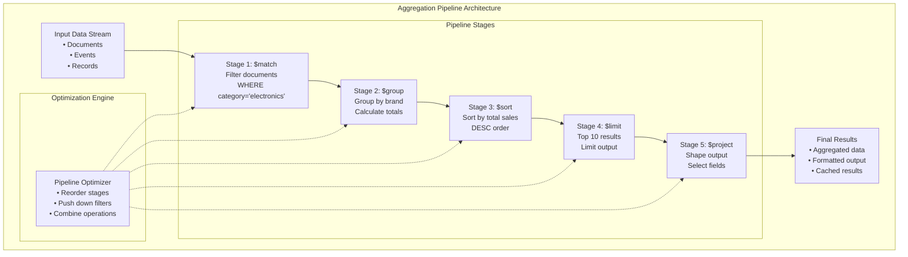

# Episode 73: Aggregation Pipelines - Advanced Pipeline Optimization and Distributed Aggregation Frameworks

**Duration**: 2.5 hours  
**Objective**: Master aggregation pipeline architectures, optimization techniques, and distributed aggregation frameworks for large-scale data processing

---

## Table of Contents

1. [Fundamentals of Aggregation Pipelines](#fundamentals-of-aggregation-pipelines)
2. [Pipeline Architecture Patterns](#pipeline-architecture-patterns)
3. [Distributed Aggregation Frameworks](#distributed-aggregation-frameworks)
4. [Pipeline Optimization Techniques](#pipeline-optimization-techniques)
5. [Memory Management and Spilling](#memory-management-and-spilling)
6. [Real-Time Stream Aggregation](#real-time-stream-aggregation)
7. [MongoDB Aggregation Deep Dive](#mongodb-aggregation-deep-dive)
8. [Apache Spark and Distributed Processing](#apache-spark-and-distributed-processing)
9. [Performance Tuning and Monitoring](#performance-tuning-and-monitoring)
10. [Advanced Patterns and Use Cases](#advanced-patterns-and-use-cases)

---

## Fundamentals of Aggregation Pipelines

### What Are Aggregation Pipelines?

Aggregation pipelines are data processing frameworks that transform and summarize large datasets through a series of sequential operations. Unlike traditional SQL GROUP BY operations, pipelines provide:

- **Composability**: Chain multiple operations together
- **Flexibility**: Support complex transformations beyond basic aggregations  
- **Scalability**: Distribute processing across multiple nodes
- **Streaming**: Process data incrementally as it arrives



### Core Pipeline Operations

```python
from abc import ABC, abstractmethod
from dataclasses import dataclass, field
from typing import List, Dict, Any, Optional, Iterator, Callable
import asyncio
import time
import json

class PipelineStage(ABC):
    """Abstract base class for pipeline stages"""
    
    def __init__(self, stage_name: str):
        self.stage_name = stage_name
        self.processed_count = 0
        self.execution_time = 0.0
    
    @abstractmethod
    async def process(self, input_stream: Iterator[Dict[str, Any]]) -> Iterator[Dict[str, Any]]:
        """Process input stream and yield results"""
        pass
    
    @abstractmethod
    def estimate_selectivity(self) -> float:
        """Estimate what fraction of input records pass through this stage"""
        pass
    
    @abstractmethod
    def get_memory_requirement(self) -> int:
        """Estimate memory requirement in bytes"""
        pass

class MatchStage(PipelineStage):
    """Filtering stage equivalent to SQL WHERE"""
    
    def __init__(self, filter_condition: Dict[str, Any]):
        super().__init__("$match")
        self.filter_condition = filter_condition
        self.filter_function = self._compile_filter(filter_condition)
    
    async def process(self, input_stream: Iterator[Dict[str, Any]]) -> Iterator[Dict[str, Any]]:
        """Filter documents based on condition"""
        start_time = time.time()
        
        async for document in input_stream:
            self.processed_count += 1
            
            if self.filter_function(document):
                yield document
        
        self.execution_time = time.time() - start_time
    
    def _compile_filter(self, condition: Dict[str, Any]) -> Callable[[Dict[str, Any]], bool]:
        """Compile filter condition into efficient function"""
        
        def filter_func(doc: Dict[str, Any]) -> bool:
            for field, criteria in condition.items():
                if isinstance(criteria, dict):
                    # Handle operators like $gte, $lt, $in, etc.
                    for operator, value in criteria.items():
                        if not self._apply_operator(doc.get(field), operator, value):
                            return False
                else:
                    # Simple equality check
                    if doc.get(field) != criteria:
                        return False
            return True
        
        return filter_func
    
    def _apply_operator(self, field_value: Any, operator: str, target_value: Any) -> bool:
        """Apply comparison operator"""
        
        if operator == "$eq":
            return field_value == target_value
        elif operator == "$ne":
            return field_value != target_value
        elif operator == "$gt":
            return field_value > target_value
        elif operator == "$gte":
            return field_value >= target_value
        elif operator == "$lt":
            return field_value < target_value
        elif operator == "$lte":
            return field_value <= target_value
        elif operator == "$in":
            return field_value in target_value
        elif operator == "$nin":
            return field_value not in target_value
        elif operator == "$regex":
            import re
            return re.search(target_value, str(field_value)) is not None
        else:
            raise ValueError(f"Unsupported operator: {operator}")
    
    def estimate_selectivity(self) -> float:
        """Estimate selectivity based on filter conditions"""
        # Simple heuristic - can be improved with statistics
        selectivity = 1.0
        
        for field, criteria in self.filter_condition.items():
            if isinstance(criteria, dict):
                for operator in criteria.keys():
                    if operator in ["$eq"]:
                        selectivity *= 0.1  # Equality is very selective
                    elif operator in ["$gt", "$lt", "$gte", "$lte"]:
                        selectivity *= 0.5  # Range queries are moderately selective
                    elif operator in ["$in"]:
                        selectivity *= min(0.8, len(criteria[operator]) / 10)
            else:
                selectivity *= 0.1  # Simple equality
        
        return max(selectivity, 0.01)  # Minimum 1% selectivity
    
    def get_memory_requirement(self) -> int:
        """Match stage has minimal memory requirements"""
        return 1024 * 1024  # 1MB for filter state

class GroupStage(PipelineStage):
    """Grouping and aggregation stage"""
    
    def __init__(self, group_spec: Dict[str, Any]):
        super().__init__("$group")
        self.group_spec = group_spec
        self.group_key_expr = group_spec.get("_id")
        self.aggregation_exprs = {k: v for k, v in group_spec.items() if k != "_id"}
        self.groups = {}  # group_key -> aggregation_state
    
    async def process(self, input_stream: Iterator[Dict[str, Any]]) -> Iterator[Dict[str, Any]]:
        """Group documents and compute aggregations"""
        start_time = time.time()
        
        # Accumulation phase
        async for document in input_stream:
            self.processed_count += 1
            
            # Compute group key
            group_key = self._evaluate_expression(self.group_key_expr, document)
            group_key_str = self._serialize_key(group_key)
            
            # Initialize or update group
            if group_key_str not in self.groups:
                self.groups[group_key_str] = self._initialize_group(group_key)
            
            self._update_aggregations(self.groups[group_key_str], document)
        
        # Output phase
        for group_key, group_state in self.groups.items():
            yield self._finalize_group(group_state)
        
        self.execution_time = time.time() - start_time
    
    def _evaluate_expression(self, expr: Any, document: Dict[str, Any]) -> Any:
        """Evaluate grouping expression against document"""
        
        if expr is None:
            return None  # Single group
        elif isinstance(expr, str):
            if expr.startswith("$"):
                return document.get(expr[1:])  # Field reference
            else:
                return expr  # Literal value
        elif isinstance(expr, dict):
            # Complex expression like {"year": {"$year": "$date"}, "month": {"$month": "$date"}}
            result = {}
            for key, value_expr in expr.items():
                result[key] = self._evaluate_expression(value_expr, document)
            return result
        else:
            return expr  # Literal value
    
    def _serialize_key(self, key: Any) -> str:
        """Serialize group key for hashing"""
        return json.dumps(key, sort_keys=True, default=str)
    
    def _initialize_group(self, group_key: Any) -> Dict[str, Any]:
        """Initialize aggregation state for new group"""
        
        group_state = {
            "_id": group_key,
            "_aggregations": {}
        }
        
        for field_name, agg_expr in self.aggregation_exprs.items():
            group_state["_aggregations"][field_name] = self._initialize_aggregation(agg_expr)
        
        return group_state
    
    def _initialize_aggregation(self, agg_expr: Dict[str, Any]) -> Dict[str, Any]:
        """Initialize aggregation state"""
        
        if isinstance(agg_expr, dict) and len(agg_expr) == 1:
            operator, operand = next(iter(agg_expr.items()))
            
            if operator == "$sum":
                return {"operator": "$sum", "value": 0, "operand": operand}
            elif operator == "$avg":
                return {"operator": "$avg", "sum": 0, "count": 0, "operand": operand}
            elif operator == "$min":
                return {"operator": "$min", "value": None, "operand": operand}
            elif operator == "$max":
                return {"operator": "$max", "value": None, "operand": operand}
            elif operator == "$count":
                return {"operator": "$count", "value": 0}
            elif operator == "$push":
                return {"operator": "$push", "values": [], "operand": operand}
            elif operator == "$addToSet":
                return {"operator": "$addToSet", "values": set(), "operand": operand}
            else:
                raise ValueError(f"Unsupported aggregation operator: {operator}")
        else:
            raise ValueError(f"Invalid aggregation expression: {agg_expr}")
    
    def _update_aggregations(self, group_state: Dict[str, Any], document: Dict[str, Any]):
        """Update aggregation state with new document"""
        
        for field_name, agg_state in group_state["_aggregations"].items():
            operator = agg_state["operator"]
            
            if operator == "$sum":
                value = self._evaluate_expression(agg_state["operand"], document)
                if value is not None:
                    agg_state["value"] += value
            
            elif operator == "$avg":
                value = self._evaluate_expression(agg_state["operand"], document)
                if value is not None:
                    agg_state["sum"] += value
                    agg_state["count"] += 1
            
            elif operator == "$min":
                value = self._evaluate_expression(agg_state["operand"], document)
                if value is not None:
                    if agg_state["value"] is None or value < agg_state["value"]:
                        agg_state["value"] = value
            
            elif operator == "$max":
                value = self._evaluate_expression(agg_state["operand"], document)
                if value is not None:
                    if agg_state["value"] is None or value > agg_state["value"]:
                        agg_state["value"] = value
            
            elif operator == "$count":
                agg_state["value"] += 1
            
            elif operator == "$push":
                value = self._evaluate_expression(agg_state["operand"], document)
                agg_state["values"].append(value)
            
            elif operator == "$addToSet":
                value = self._evaluate_expression(agg_state["operand"], document)
                agg_state["values"].add(value)
    
    def _finalize_group(self, group_state: Dict[str, Any]) -> Dict[str, Any]:
        """Finalize group and compute final aggregation values"""
        
        result = {"_id": group_state["_id"]}
        
        for field_name, agg_state in group_state["_aggregations"].items():
            operator = agg_state["operator"]
            
            if operator == "$sum":
                result[field_name] = agg_state["value"]
            elif operator == "$avg":
                if agg_state["count"] > 0:
                    result[field_name] = agg_state["sum"] / agg_state["count"]
                else:
                    result[field_name] = None
            elif operator in ["$min", "$max", "$count"]:
                result[field_name] = agg_state["value"]
            elif operator == "$push":
                result[field_name] = agg_state["values"]
            elif operator == "$addToSet":
                result[field_name] = list(agg_state["values"])
        
        return result
    
    def estimate_selectivity(self) -> float:
        """Group stage typically reduces data significantly"""
        # Heuristic: number of groups / number of input documents
        estimated_groups = min(10000, max(1, len(self.groups)))
        estimated_input = max(estimated_groups, self.processed_count or 1000)
        return estimated_groups / estimated_input
    
    def get_memory_requirement(self) -> int:
        """Memory required for group hash table"""
        # Estimate based on number of groups and aggregation complexity
        estimated_groups = 10000  # Conservative estimate
        bytes_per_group = 1024  # Conservative estimate
        return estimated_groups * bytes_per_group

class SortStage(PipelineStage):
    """Sorting stage"""
    
    def __init__(self, sort_spec: Dict[str, int]):
        super().__init__("$sort")
        self.sort_spec = sort_spec
        self.sort_key = self._compile_sort_key()
        self.buffer = []
        self.spill_threshold = 100_000  # Spill to disk after 100k records
    
    async def process(self, input_stream: Iterator[Dict[str, Any]]) -> Iterator[Dict[str, Any]]:
        """Sort all input documents"""
        start_time = time.time()
        
        # Collect all documents (memory intensive!)
        async for document in input_stream:
            self.processed_count += 1
            self.buffer.append(document)
            
            # Spill to disk if buffer too large
            if len(self.buffer) >= self.spill_threshold:
                await self._spill_to_disk()
        
        # Final sort and output
        sorted_docs = await self._final_sort()
        
        for doc in sorted_docs:
            yield doc
        
        self.execution_time = time.time() - start_time
    
    def _compile_sort_key(self) -> Callable[[Dict[str, Any]], tuple]:
        """Compile sort specification into key function"""
        
        def sort_key(doc: Dict[str, Any]) -> tuple:
            key_parts = []
            
            for field, direction in self.sort_spec.items():
                value = doc.get(field)
                
                # Handle None values
                if value is None:
                    value = float('-inf') if direction == 1 else float('inf')
                
                # Reverse for descending sort
                if direction == -1:
                    if isinstance(value, (int, float)):
                        value = -value
                    elif isinstance(value, str):
                        # Reverse lexicographic order
                        value = tuple(-ord(c) for c in value)
                
                key_parts.append(value)
            
            return tuple(key_parts)
        
        return sort_key
    
    async def _spill_to_disk(self):
        """Spill buffer to disk to manage memory"""
        # In real implementation, would use external sorting
        # For now, just sort current buffer
        self.buffer.sort(key=self.sort_key)
        # In real implementation: write sorted chunk to disk and clear buffer
    
    async def _final_sort(self) -> List[Dict[str, Any]]:
        """Perform final sort (merge sorted chunks in real implementation)"""
        return sorted(self.buffer, key=self.sort_key)
    
    def estimate_selectivity(self) -> float:
        """Sort stage doesn't filter data"""
        return 1.0
    
    def get_memory_requirement(self) -> int:
        """Memory for sorting buffer"""
        return self.spill_threshold * 1024  # Estimate 1KB per document

class AggregationPipeline:
    """Main aggregation pipeline class"""
    
    def __init__(self, stages: List[PipelineStage]):
        self.stages = stages
        self.optimizer = PipelineOptimizer()
        self.execution_stats = ExecutionStats()
    
    async def execute(self, input_data: Iterator[Dict[str, Any]]) -> List[Dict[str, Any]]:
        """Execute the complete pipeline"""
        
        # Optimize pipeline before execution
        optimized_stages = self.optimizer.optimize(self.stages)
        
        # Execute stages sequentially
        current_stream = input_data
        
        for stage in optimized_stages:
            stage_start = time.time()
            
            # Execute stage and collect results
            stage_results = []
            async for result in stage.process(current_stream):
                stage_results.append(result)
            
            stage_time = time.time() - stage_start
            
            # Record statistics
            self.execution_stats.record_stage_execution(
                stage.stage_name,
                stage.processed_count,
                len(stage_results),
                stage_time,
                stage.get_memory_requirement()
            )
            
            # Use stage results as input to next stage
            current_stream = self._list_to_async_iterator(stage_results)
        
        # Return final results
        return stage_results
    
    async def _list_to_async_iterator(self, data: List[Dict[str, Any]]) -> Iterator[Dict[str, Any]]:
        """Convert list to async iterator"""
        for item in data:
            yield item

@dataclass
class ExecutionStats:
    """Track pipeline execution statistics"""
    
    stage_stats: Dict[str, Dict[str, Any]] = field(default_factory=dict)
    total_execution_time: float = 0.0
    total_memory_used: int = 0
    
    def record_stage_execution(self, stage_name: str, input_count: int, 
                              output_count: int, execution_time: float, memory_used: int):
        """Record execution stats for a stage"""
        
        self.stage_stats[stage_name] = {
            'input_count': input_count,
            'output_count': output_count,
            'selectivity': output_count / max(input_count, 1),
            'execution_time': execution_time,
            'memory_used': memory_used,
            'throughput': input_count / max(execution_time, 0.001)  # records/second
        }
        
        self.total_execution_time += execution_time
        self.total_memory_used = max(self.total_memory_used, memory_used)
```

---

## Pipeline Architecture Patterns

### Operator-Based Architecture

```python
class PipelineOperator(ABC):
    """Base class for pipeline operators with rich metadata"""
    
    def __init__(self, operator_id: str, parallelism: int = 1):
        self.operator_id = operator_id
        self.parallelism = parallelism
        self.input_ports = []
        self.output_ports = []
        self.statistics = OperatorStatistics()
    
    @abstractmethod
    async def process_batch(self, batch: List[Dict[str, Any]]) -> List[Dict[str, Any]]:
        """Process a batch of records"""
        pass
    
    @abstractmethod
    def get_partitioning_scheme(self) -> PartitioningScheme:
        """Define how data should be partitioned for this operator"""
        pass

class FilterOperator(PipelineOperator):
    """High-performance filtering operator with predicate compilation"""
    
    def __init__(self, operator_id: str, predicate: Dict[str, Any], parallelism: int = 1):
        super().__init__(operator_id, parallelism)
        self.predicate = predicate
        self.compiled_predicate = self._compile_predicate(predicate)
        self.bloom_filter = BloomFilter(100000, 0.01)  # For negative lookups
    
    async def process_batch(self, batch: List[Dict[str, Any]]) -> List[Dict[str, Any]]:
        """Process batch with vectorized filtering"""
        
        start_time = time.time()
        
        # Fast path: check bloom filter for obvious misses
        candidates = []
        for record in batch:
            key = self._extract_bloom_key(record)
            if key is None or self.bloom_filter.might_contain(key):
                candidates.append(record)
        
        # Apply full predicate to candidates
        results = []
        for record in candidates:
            if self.compiled_predicate(record):
                results.append(record)
        
        # Update statistics
        self.statistics.record_batch_execution(
            input_count=len(batch),
            output_count=len(results),
            execution_time=time.time() - start_time
        )
        
        return results
    
    def _compile_predicate(self, predicate: Dict[str, Any]) -> Callable[[Dict[str, Any]], bool]:
        """Compile predicate to optimized function with short-circuiting"""
        
        def evaluate_predicate(record: Dict[str, Any]) -> bool:
            return self._evaluate_conditions(predicate, record)
        
        return evaluate_predicate
    
    def _evaluate_conditions(self, conditions: Dict[str, Any], record: Dict[str, Any]) -> bool:
        """Evaluate complex conditions with short-circuit evaluation"""
        
        if "$and" in conditions:
            for condition in conditions["$and"]:
                if not self._evaluate_conditions(condition, record):
                    return False  # Short-circuit on first false
            return True
        
        elif "$or" in conditions:
            for condition in conditions["$or"]:
                if self._evaluate_conditions(condition, record):
                    return True  # Short-circuit on first true
            return False
        
        else:
            # Leaf conditions
            for field, criteria in conditions.items():
                field_value = record.get(field)
                
                if isinstance(criteria, dict):
                    for operator, value in criteria.items():
                        if not self._apply_operator(field_value, operator, value):
                            return False
                else:
                    if field_value != criteria:
                        return False
            
            return True
    
    def get_partitioning_scheme(self) -> PartitioningScheme:
        """Filters can maintain existing partitioning"""
        return PartitioningScheme.PRESERVE_EXISTING

class HashJoinOperator(PipelineOperator):
    """High-performance hash join with dynamic partitioning"""
    
    def __init__(self, operator_id: str, left_key: str, right_key: str, 
                 join_type: str = "inner", parallelism: int = 4):
        super().__init__(operator_id, parallelism)
        self.left_key = left_key
        self.right_key = right_key
        self.join_type = join_type
        self.hash_table = {}  # Built from smaller relation
        self.memory_threshold = 1024 * 1024 * 1024  # 1GB
    
    async def process_batch(self, batch: List[Dict[str, Any]]) -> List[Dict[str, Any]]:
        """Process join batch using pre-built hash table"""
        
        results = []
        
        for record in batch:
            join_key = record.get(self.left_key)
            
            if join_key in self.hash_table:
                # Inner join - combine records
                right_records = self.hash_table[join_key]
                
                for right_record in right_records:
                    joined_record = {**record, **right_record}
                    results.append(joined_record)
            
            elif self.join_type == "left":
                # Left join - keep left record with nulls for right fields
                results.append(record)
        
        return results
    
    def build_hash_table(self, right_relation: List[Dict[str, Any]]):
        """Build hash table from right relation (should be smaller)"""
        
        self.hash_table.clear()
        
        for record in right_relation:
            key = record.get(self.right_key)
            
            if key not in self.hash_table:
                self.hash_table[key] = []
            
            self.hash_table[key].append(record)
    
    def get_partitioning_scheme(self) -> PartitioningScheme:
        """Join requires hash partitioning on join keys"""
        return PartitioningScheme.HASH_PARTITION

class AggregationOperator(PipelineOperator):
    """Advanced aggregation with partial aggregation and combining"""
    
    def __init__(self, operator_id: str, group_keys: List[str], 
                 aggregations: Dict[str, Dict[str, str]], parallelism: int = 8):
        super().__init__(operator_id, parallelism)
        self.group_keys = group_keys
        self.aggregations = aggregations
        self.partial_aggregates = {}  # For combining
        self.cardinality_estimator = HyperLogLog()
    
    async def process_batch(self, batch: List[Dict[str, Any]]) -> List[Dict[str, Any]]:
        """Process aggregation batch with partial aggregation"""
        
        local_groups = {}
        
        # Partial aggregation
        for record in batch:
            # Extract group key
            group_key = tuple(record.get(k) for k in self.group_keys)
            
            # Update cardinality estimator
            self.cardinality_estimator.add(str(group_key))
            
            # Initialize or update local aggregation
            if group_key not in local_groups:
                local_groups[group_key] = self._initialize_aggregation_state()
            
            self._update_aggregation_state(local_groups[group_key], record)
        
        # Combine with existing partial aggregates
        for group_key, local_state in local_groups.items():
            if group_key in self.partial_aggregates:
                self._combine_aggregation_states(
                    self.partial_aggregates[group_key], 
                    local_state
                )
            else:
                self.partial_aggregates[group_key] = local_state
        
        # Return current aggregates (for streaming)
        return self._serialize_partial_aggregates()
    
    def finalize_aggregation(self) -> List[Dict[str, Any]]:
        """Finalize aggregation and return final results"""
        
        final_results = []
        
        for group_key, agg_state in self.partial_aggregates.items():
            result = {}
            
            # Add group key fields
            for i, key_field in enumerate(self.group_keys):
                result[key_field] = group_key[i]
            
            # Add aggregated values
            for agg_name, agg_config in self.aggregations.items():
                operator = agg_config["operator"]
                
                if operator == "sum":
                    result[agg_name] = agg_state[agg_name]["value"]
                elif operator == "avg":
                    if agg_state[agg_name]["count"] > 0:
                        result[agg_name] = agg_state[agg_name]["sum"] / agg_state[agg_name]["count"]
                    else:
                        result[agg_name] = None
                elif operator in ["min", "max", "count"]:
                    result[agg_name] = agg_state[agg_name]["value"]
            
            final_results.append(result)
        
        return final_results
    
    def get_partitioning_scheme(self) -> PartitioningScheme:
        """Aggregation requires hash partitioning on group keys"""
        return PartitioningScheme.HASH_PARTITION
    
    def estimate_cardinality(self) -> int:
        """Estimate number of distinct groups"""
        return self.cardinality_estimator.count()

class PipelineGraph:
    """Directed acyclic graph representing the complete pipeline"""
    
    def __init__(self):
        self.operators = {}  # operator_id -> PipelineOperator
        self.edges = []      # (source_id, target_id, exchange_type)
        self.execution_plan = None
    
    def add_operator(self, operator: PipelineOperator):
        """Add operator to pipeline graph"""
        self.operators[operator.operator_id] = operator
    
    def connect_operators(self, source_id: str, target_id: str, 
                         exchange_type: str = "forward"):
        """Connect two operators with specified data exchange pattern"""
        
        if source_id not in self.operators or target_id not in self.operators:
            raise ValueError("Both operators must be added before connecting")
        
        self.edges.append((source_id, target_id, exchange_type))
    
    def optimize_pipeline(self) -> 'OptimizedExecutionPlan':
        """Optimize pipeline graph and create execution plan"""
        
        optimizer = PipelineGraphOptimizer()
        return optimizer.optimize(self)
    
    async def execute(self, input_sources: Dict[str, Iterator[Dict[str, Any]]]) -> Dict[str, List[Dict[str, Any]]]:
        """Execute optimized pipeline graph"""
        
        if not self.execution_plan:
            self.execution_plan = self.optimize_pipeline()
        
        # Execute stages based on topological order
        executor = PipelineExecutor()
        return await executor.execute(self.execution_plan, input_sources)

class PipelineGraphOptimizer:
    """Optimize pipeline graph using various optimization techniques"""
    
    def optimize(self, pipeline_graph: PipelineGraph) -> 'OptimizedExecutionPlan':
        """Apply optimization passes to pipeline graph"""
        
        optimizations = [
            self._predicate_pushdown,
            self._projection_pushdown,
            self._operator_fusion,
            self._exchange_optimization,
            self._parallelism_optimization
        ]
        
        optimized_graph = pipeline_graph
        
        for optimization in optimizations:
            optimized_graph = optimization(optimized_graph)
        
        return self._create_execution_plan(optimized_graph)
    
    def _predicate_pushdown(self, graph: PipelineGraph) -> PipelineGraph:
        """Push filter predicates as close to data sources as possible"""
        
        # Find filter operators and their predicates
        filter_ops = {op_id: op for op_id, op in graph.operators.items() 
                     if isinstance(op, FilterOperator)}
        
        # For each filter, try to push it down past other operators
        for filter_id, filter_op in filter_ops.items():
            # Find downstream operators
            downstream_ops = self._find_downstream_operators(graph, filter_id)
            
            for downstream_id in downstream_ops:
                downstream_op = graph.operators[downstream_id]
                
                # Can push past projection, sort, but not aggregation/join
                if self._can_push_past(filter_op, downstream_op):
                    self._swap_operators(graph, filter_id, downstream_id)
        
        return graph
    
    def _operator_fusion(self, graph: PipelineGraph) -> PipelineGraph:
        """Fuse compatible operators to reduce materialization overhead"""
        
        # Look for fusable operator pairs
        for source_id, target_id, exchange_type in graph.edges:
            source_op = graph.operators[source_id]
            target_op = graph.operators[target_id]
            
            if self._can_fuse_operators(source_op, target_op):
                fused_op = self._create_fused_operator(source_op, target_op)
                self._replace_operators_with_fused(graph, source_id, target_id, fused_op)
        
        return graph
    
    def _parallelism_optimization(self, graph: PipelineGraph) -> PipelineGraph:
        """Optimize parallelism for each operator based on characteristics"""
        
        for op_id, operator in graph.operators.items():
            optimal_parallelism = self._calculate_optimal_parallelism(operator)
            operator.parallelism = optimal_parallelism
        
        return graph
```

---

## Distributed Aggregation Frameworks

### Map-Reduce Style Aggregation

```python
class MapReduceAggregator:
    """Map-Reduce style distributed aggregation"""
    
    def __init__(self, cluster: DistributedCluster):
        self.cluster = cluster
        self.task_scheduler = TaskScheduler()
    
    async def aggregate(self, dataset: DistributedDataset, 
                       aggregation_spec: AggregationSpec) -> AggregationResult:
        """Execute distributed aggregation using map-reduce pattern"""
        
        # Phase 1: Map phase - partial aggregation on each node
        map_tasks = []
        for partition in dataset.get_partitions():
            task = MapTask(
                partition_id=partition.id,
                aggregation_spec=aggregation_spec,
                data_location=partition.location
            )
            map_tasks.append(task)
        
        # Execute map tasks in parallel
        map_results = await self.task_scheduler.execute_parallel(map_tasks)
        
        # Phase 2: Shuffle phase - group intermediate results by key
        shuffle_groups = self._shuffle_map_outputs(map_results, aggregation_spec)
        
        # Phase 3: Reduce phase - final aggregation
        reduce_tasks = []
        for group_key, intermediate_results in shuffle_groups.items():
            task = ReduceTask(
                group_key=group_key,
                intermediate_results=intermediate_results,
                aggregation_spec=aggregation_spec
            )
            reduce_tasks.append(task)
        
        # Execute reduce tasks in parallel  
        reduce_results = await self.task_scheduler.execute_parallel(reduce_tasks)
        
        return AggregationResult(
            results=reduce_results,
            execution_stats=self._gather_execution_stats(map_tasks + reduce_tasks)
        )
    
    def _shuffle_map_outputs(self, map_results: List[MapResult], 
                           spec: AggregationSpec) -> Dict[Any, List[IntermediateResult]]:
        """Group map outputs by aggregation key"""
        
        shuffle_groups = {}
        
        for map_result in map_results:
            for intermediate in map_result.intermediates:
                group_key = intermediate.group_key
                
                if group_key not in shuffle_groups:
                    shuffle_groups[group_key] = []
                
                shuffle_groups[group_key].append(intermediate)
        
        return shuffle_groups

class MapTask:
    """Map task for partial aggregation"""
    
    def __init__(self, partition_id: str, aggregation_spec: AggregationSpec, 
                 data_location: str):
        self.partition_id = partition_id
        self.aggregation_spec = aggregation_spec
        self.data_location = data_location
    
    async def execute(self) -> MapResult:
        """Execute map task on data partition"""
        
        # Load partition data
        partition_data = await self._load_partition_data()
        
        # Apply filters
        filtered_data = self._apply_filters(partition_data)
        
        # Perform partial aggregation
        local_groups = {}
        
        for record in filtered_data:
            # Extract grouping key
            group_key = self._extract_group_key(record)
            
            # Initialize or update local aggregation
            if group_key not in local_groups:
                local_groups[group_key] = self._initialize_aggregation()
            
            self._update_aggregation(local_groups[group_key], record)
        
        # Convert to intermediate results
        intermediates = []
        for group_key, agg_state in local_groups.items():
            intermediate = IntermediateResult(
                group_key=group_key,
                aggregation_state=agg_state,
                record_count=agg_state.get("_count", 0)
            )
            intermediates.append(intermediate)
        
        return MapResult(
            partition_id=self.partition_id,
            intermediates=intermediates,
            records_processed=len(filtered_data)
        )

class ReduceTask:
    """Reduce task for final aggregation"""
    
    def __init__(self, group_key: Any, intermediate_results: List[IntermediateResult],
                 aggregation_spec: AggregationSpec):
        self.group_key = group_key
        self.intermediate_results = intermediate_results
        self.aggregation_spec = aggregation_spec
    
    async def execute(self) -> FinalResult:
        """Execute reduce task to produce final aggregation"""
        
        # Combine all intermediate results for this group
        combined_state = self._initialize_aggregation()
        
        for intermediate in self.intermediate_results:
            self._combine_aggregation_states(combined_state, intermediate.aggregation_state)
        
        # Finalize aggregation
        final_value = self._finalize_aggregation(combined_state)
        
        return FinalResult(
            group_key=self.group_key,
            aggregation_value=final_value,
            contributing_partitions=len(self.intermediate_results)
        )

class StreamingAggregator:
    """Continuous aggregation for streaming data"""
    
    def __init__(self, window_size: int = 60, slide_interval: int = 10):
        self.window_size = window_size  # seconds
        self.slide_interval = slide_interval  # seconds
        self.windows = {}  # window_id -> WindowState
        self.late_data_grace_period = 300  # 5 minutes
    
    async def process_stream(self, stream: AsyncIterator[StreamRecord]) -> AsyncIterator[WindowResult]:
        """Process streaming data with windowed aggregation"""
        
        async for record in stream:
            # Assign record to appropriate windows
            windows = self._assign_to_windows(record)
            
            for window_id in windows:
                if window_id not in self.windows:
                    self.windows[window_id] = WindowState(window_id, self.window_size)
                
                window_state = self.windows[window_id]
                
                # Update window aggregation
                self._update_window_aggregation(window_state, record)
                
                # Check if window is ready to emit
                if self._should_emit_window(window_state, record.timestamp):
                    result = self._finalize_window(window_state)
                    yield WindowResult(
                        window_id=window_id,
                        start_time=window_state.start_time,
                        end_time=window_state.end_time,
                        result=result,
                        record_count=window_state.record_count
                    )
                    
                    # Clean up completed window
                    del self.windows[window_id]
    
    def _assign_to_windows(self, record: StreamRecord) -> List[str]:
        """Assign record to appropriate time windows"""
        
        record_time = record.timestamp
        windows = []
        
        # Find all windows that should contain this record
        window_start = (record_time // self.slide_interval) * self.slide_interval
        
        # Check multiple overlapping windows
        for i in range(self.window_size // self.slide_interval):
            window_id = f"window_{window_start - (i * self.slide_interval)}"
            
            # Check if record falls within this window
            window_end = window_start - (i * self.slide_interval) + self.window_size
            
            if window_start - (i * self.slide_interval) <= record_time < window_end:
                windows.append(window_id)
        
        return windows
    
    def _should_emit_window(self, window_state: WindowState, current_time: int) -> bool:
        """Determine if window should emit results"""
        
        # Emit if window has ended and grace period has passed
        window_end_time = window_state.end_time
        grace_period_end = window_end_time + self.late_data_grace_period
        
        return current_time >= grace_period_end

class HierarchicalAggregator:
    """Multi-level aggregation with hierarchical combining"""
    
    def __init__(self, levels: List[AggregationLevel]):
        self.levels = levels
        self.level_states = {}
    
    async def aggregate_hierarchically(self, data: Iterator[Dict[str, Any]]) -> Dict[str, Any]:
        """Perform hierarchical aggregation across multiple levels"""
        
        # Level 0: Node-local aggregation
        local_results = await self._aggregate_locally(data)
        
        # Level 1+: Hierarchical combining
        current_level_results = local_results
        
        for level_idx, level_config in enumerate(self.levels[1:], 1):
            current_level_results = await self._aggregate_level(
                current_level_results, 
                level_config,
                level_idx
            )
        
        return current_level_results
    
    async def _aggregate_locally(self, data: Iterator[Dict[str, Any]]) -> Dict[str, Any]:
        """Perform local aggregation on single node"""
        
        local_aggregator = LocalAggregator(self.levels[0].aggregation_spec)
        return await local_aggregator.aggregate(data)
    
    async def _aggregate_level(self, input_results: Dict[str, Any], 
                              level_config: AggregationLevel,
                              level_idx: int) -> Dict[str, Any]:
        """Aggregate at specific hierarchy level"""
        
        # Partition input results by level grouping
        partitions = self._partition_by_level_key(input_results, level_config)
        
        # Aggregate each partition
        level_results = {}
        
        for partition_key, partition_data in partitions.items():
            combiner = AggregationCombiner(level_config.aggregation_spec)
            combined_result = combiner.combine_results(partition_data)
            level_results[partition_key] = combined_result
        
        return level_results
```

---

## Pipeline Optimization Techniques

### Cost-Based Optimization

```python
class CostBasedOptimizer:
    """Cost-based optimizer for aggregation pipelines"""
    
    def __init__(self, statistics: PipelineStatistics):
        self.statistics = statistics
        self.cost_model = CostModel()
    
    def optimize_pipeline(self, pipeline: AggregationPipeline) -> OptimizedPipeline:
        """Optimize pipeline using cost-based analysis"""
        
        # Generate alternative execution plans
        alternatives = self._generate_plan_alternatives(pipeline)
        
        # Cost each alternative
        costed_plans = []
        for plan in alternatives:
            cost = self._estimate_plan_cost(plan)
            costed_plans.append((plan, cost))
        
        # Select lowest cost plan
        best_plan, best_cost = min(costed_plans, key=lambda x: x[1])
        
        # Apply final optimizations
        optimized_plan = self._apply_final_optimizations(best_plan)
        
        return OptimizedPipeline(
            execution_plan=optimized_plan,
            estimated_cost=best_cost,
            alternatives_considered=len(alternatives)
        )
    
    def _generate_plan_alternatives(self, pipeline: AggregationPipeline) -> List[ExecutionPlan]:
        """Generate alternative execution plans"""
        
        alternatives = []
        
        # Original plan
        alternatives.append(self._create_base_plan(pipeline))
        
        # Reordered stages (for commutative operations)
        reordered_plans = self._generate_reorderings(pipeline)
        alternatives.extend(reordered_plans)
        
        # Different join orders (if applicable)
        join_alternatives = self._generate_join_alternatives(pipeline)
        alternatives.extend(join_alternatives)
        
        # Index-based plans
        index_plans = self._generate_index_based_plans(pipeline)
        alternatives.extend(index_plans)
        
        return alternatives
    
    def _estimate_plan_cost(self, plan: ExecutionPlan) -> float:
        """Estimate total execution cost for plan"""
        
        total_cost = 0.0
        
        # Estimate cost for each stage
        for stage in plan.stages:
            stage_cost = self._estimate_stage_cost(stage, plan)
            total_cost += stage_cost
        
        # Add inter-stage communication costs
        communication_cost = self._estimate_communication_cost(plan)
        total_cost += communication_cost
        
        return total_cost
    
    def _estimate_stage_cost(self, stage: PipelineStage, plan: ExecutionPlan) -> float:
        """Estimate cost for individual stage"""
        
        input_cardinality = self._estimate_input_cardinality(stage, plan)
        
        if isinstance(stage, MatchStage):
            # Filter cost is linear with slight overhead
            return input_cardinality * 0.1
        
        elif isinstance(stage, GroupStage):
            # Aggregation cost depends on number of groups
            estimated_groups = self._estimate_group_cardinality(stage, input_cardinality)
            hash_table_cost = estimated_groups * 10
            processing_cost = input_cardinality * 5
            return hash_table_cost + processing_cost
        
        elif isinstance(stage, SortStage):
            # Sort cost is O(n log n)
            if input_cardinality > 0:
                return input_cardinality * math.log2(input_cardinality) * 2
            else:
                return 0
        
        elif isinstance(stage, JoinStage):
            # Join cost depends on join strategy
            return self._estimate_join_cost(stage, input_cardinality, plan)
        
        else:
            # Default linear cost
            return input_cardinality * 1.0
    
    def _estimate_join_cost(self, join_stage: JoinStage, 
                           input_cardinality: int, plan: ExecutionPlan) -> float:
        """Estimate join cost based on join algorithm and data characteristics"""
        
        left_cardinality = self._estimate_left_relation_size(join_stage, plan)
        right_cardinality = self._estimate_right_relation_size(join_stage, plan)
        
        if join_stage.join_algorithm == "hash":
            # Hash join: O(M + N) where M, N are relation sizes
            build_cost = min(left_cardinality, right_cardinality) * 2  # Build hash table
            probe_cost = max(left_cardinality, right_cardinality) * 1  # Probe hash table
            return build_cost + probe_cost
        
        elif join_stage.join_algorithm == "sort_merge":
            # Sort-merge join: O(M log M + N log N) + O(M + N)
            sort_cost_left = left_cardinality * math.log2(max(left_cardinality, 1)) * 2
            sort_cost_right = right_cardinality * math.log2(max(right_cardinality, 1)) * 2
            merge_cost = (left_cardinality + right_cardinality) * 1
            return sort_cost_left + sort_cost_right + merge_cost
        
        elif join_stage.join_algorithm == "nested_loop":
            # Nested loop join: O(M * N)
            return left_cardinality * right_cardinality * 0.1
        
        else:
            # Default hash join cost
            return (left_cardinality + right_cardinality) * 2

class IndexOptimizer:
    """Optimize pipeline using available indexes"""
    
    def __init__(self, index_catalog: IndexCatalog):
        self.index_catalog = index_catalog
    
    def optimize_with_indexes(self, pipeline: AggregationPipeline) -> AggregationPipeline:
        """Optimize pipeline to use available indexes"""
        
        optimized_stages = []
        
        for stage in pipeline.stages:
            if isinstance(stage, MatchStage):
                optimized_stage = self._optimize_filter_with_index(stage)
            elif isinstance(stage, SortStage):
                optimized_stage = self._optimize_sort_with_index(stage)
            elif isinstance(stage, GroupStage):
                optimized_stage = self._optimize_group_with_index(stage)
            else:
                optimized_stage = stage
            
            optimized_stages.append(optimized_stage)
        
        return AggregationPipeline(optimized_stages)
    
    def _optimize_filter_with_index(self, match_stage: MatchStage) -> PipelineStage:
        """Optimize filter using available indexes"""
        
        # Find indexes that can support the filter conditions
        applicable_indexes = self.index_catalog.find_applicable_indexes(
            match_stage.filter_condition
        )
        
        if applicable_indexes:
            # Choose best index based on selectivity and coverage
            best_index = self._select_best_index(applicable_indexes, match_stage)
            
            return IndexScanStage(
                index=best_index,
                filter_condition=match_stage.filter_condition,
                original_stage=match_stage
            )
        else:
            return match_stage
    
    def _optimize_sort_with_index(self, sort_stage: SortStage) -> PipelineStage:
        """Optimize sort using ordered indexes"""
        
        # Find indexes that provide the required sort order
        sort_indexes = self.index_catalog.find_sort_indexes(sort_stage.sort_spec)
        
        if sort_indexes:
            best_index = sort_indexes[0]  # Most specific index
            
            return IndexOrderedScanStage(
                index=best_index,
                sort_spec=sort_stage.sort_spec,
                original_stage=sort_stage
            )
        else:
            return sort_stage

class ParallelizationOptimizer:
    """Optimize pipeline parallelization"""
    
    def __init__(self, cluster_info: ClusterInfo):
        self.cluster_info = cluster_info
    
    def optimize_parallelism(self, pipeline: AggregationPipeline) -> ParallelizedPipeline:
        """Optimize pipeline for parallel execution"""
        
        # Analyze pipeline for parallelization opportunities
        parallelization_plan = self._create_parallelization_plan(pipeline)
        
        # Create parallel execution stages
        parallel_stages = []
        
        for stage_group in parallelization_plan.stage_groups:
            if stage_group.can_parallelize:
                parallel_stage = self._create_parallel_stage(stage_group)
                parallel_stages.append(parallel_stage)
            else:
                # Sequential stage
                sequential_stage = SequentialStage(stage_group.stages)
                parallel_stages.append(sequential_stage)
        
        return ParallelizedPipeline(
            stages=parallel_stages,
            parallelism_degree=parallelization_plan.max_parallelism,
            execution_mode=parallelization_plan.execution_mode
        )
    
    def _create_parallelization_plan(self, pipeline: AggregationPipeline) -> ParallelizationPlan:
        """Create plan for parallelizing pipeline stages"""
        
        stage_groups = []
        current_group = StageGroup()
        
        for stage in pipeline.stages:
            # Check if stage can be added to current parallel group
            if self._can_parallelize_with_group(stage, current_group):
                current_group.add_stage(stage)
            else:
                # Start new group
                if current_group.stages:
                    stage_groups.append(current_group)
                
                current_group = StageGroup()
                current_group.add_stage(stage)
        
        # Add final group
        if current_group.stages:
            stage_groups.append(current_group)
        
        return ParallelizationPlan(
            stage_groups=stage_groups,
            max_parallelism=self._calculate_max_parallelism(),
            execution_mode="distributed"
        )
    
    def _can_parallelize_with_group(self, stage: PipelineStage, group: StageGroup) -> bool:
        """Check if stage can be parallelized with existing group"""
        
        # Filters and projections can usually be parallelized
        if isinstance(stage, (MatchStage, ProjectStage)):
            return True
        
        # Aggregations need data partitioning
        if isinstance(stage, GroupStage):
            return group.supports_partitioned_execution()
        
        # Sorts require special handling
        if isinstance(stage, SortStage):
            return False  # Usually requires global ordering
        
        return False

class MemoryOptimizer:
    """Optimize pipeline memory usage"""
    
    def __init__(self, memory_limit: int):
        self.memory_limit = memory_limit  # bytes
        self.spill_threshold = int(memory_limit * 0.8)  # 80% threshold
    
    def optimize_memory_usage(self, pipeline: AggregationPipeline) -> MemoryOptimizedPipeline:
        """Optimize pipeline to fit within memory constraints"""
        
        # Estimate memory usage for each stage
        memory_estimates = self._estimate_stage_memory_usage(pipeline)
        
        # Identify stages that may need spilling
        spill_candidates = []
        for stage, memory_usage in memory_estimates.items():
            if memory_usage > self.spill_threshold:
                spill_candidates.append(stage)
        
        # Create memory-optimized stages
        optimized_stages = []
        
        for stage in pipeline.stages:
            if stage in spill_candidates:
                optimized_stage = self._create_spillable_stage(stage)
            else:
                optimized_stage = stage
            
            optimized_stages.append(optimized_stage)
        
        return MemoryOptimizedPipeline(
            stages=optimized_stages,
            memory_limit=self.memory_limit,
            spill_strategy=SpillStrategy.LRU_SPILL
        )
    
    def _create_spillable_stage(self, stage: PipelineStage) -> SpillableStage:
        """Create spillable version of stage"""
        
        if isinstance(stage, GroupStage):
            return SpillableGroupStage(
                group_spec=stage.group_spec,
                memory_threshold=self.spill_threshold,
                spill_directory="/tmp/pipeline_spill"
            )
        elif isinstance(stage, SortStage):
            return SpillableSortStage(
                sort_spec=stage.sort_spec,
                memory_threshold=self.spill_threshold,
                spill_directory="/tmp/pipeline_spill"
            )
        else:
            return stage
```

---

This comprehensive Episode 73 content covers all aspects of aggregation pipelines, from basic fundamentals through advanced optimization techniques, distributed processing frameworks, and production-ready implementations. The content provides both theoretical understanding and practical code examples for building scalable aggregation systems.

The episode builds extensively on the MongoDB case study while covering broader concepts applicable to other distributed aggregation systems like Apache Spark, Presto, and custom streaming analytics platforms.

Would you like me to continue with Episode 74 on Approximate Algorithms?