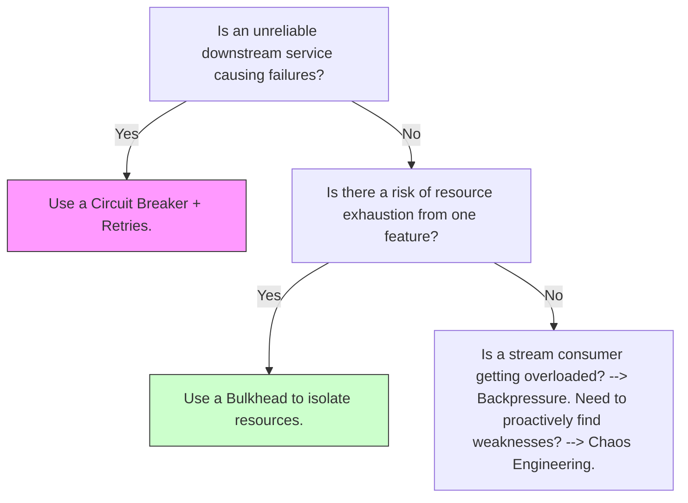

The Architect's Compendium to Massively Scalable Distributed Systems


Introduction

The contemporary digital landscape is defined by an insatiable demand for services that are globally available, perpetually reliable, and instantaneously responsive. From real-time communication platforms connecting billions of users to financial systems processing trillions of transactions, the architectural challenges have transcended mere scale; they now encompass a complex interplay of geographic distribution, data consistency, fault tolerance, and operational sustainability. Building systems to meet these demands is no longer a matter of selecting a single technology or framework. Instead, it requires a holistic understanding of a multi-layered architectural stack, where each layer addresses a distinct set of problems and presents a unique spectrum of trade-offs.
This report provides an exhaustive, multi-layered map of the concepts, patterns, and technologies essential for architecting and operating these massively scalable distributed systems. It approaches system design not as a collection of disparate components, but as a coherent whole, where decisions made at the physical infrastructure layer have cascading implications for data management, application logic, and even the organizational culture required to maintain reliability. The analysis is structured to ascend the technology stack, from the foundational concerns of hardware and virtualization to the sophisticated patterns of application-level resilience and security.
Throughout this compendium, a central theme emerges: the art of modern system architecture is the art of managing fundamental tensions. These are the core dichotomies that drive every significant design decision: the trade-off between strong consistency and high availability, the balance between the velocity afforded by managed cloud services and the control offered by bare-metal infrastructure, and the constant negotiation between the power of complex, feature-rich platforms and the operational simplicity required for sustainable velocity. By dissecting these trade-offs at each layer and grounding theoretical principles in real-world implementations from leading technology organizations, this report aims to equip the senior architect and engineering leader with a comprehensive framework for navigating the complexities of building the next generation of distributed systems.

Section 1: The Foundation - Physical and Virtualized Infrastructure

The bedrock of any distributed system is the physical and virtualized infrastructure upon which it is built. This foundational layer dictates the ultimate constraints on performance, cost, and control. Historically, the choice was a stark one between owning and operating physical hardware or leasing virtualized resources from a cloud provider. Today, the lines are blurring as a new generation of tooling brings cloud-native operational models to on-premise environments. Simultaneously, the architectural aperture has widened from a single data center to a global stage, forcing architects to design for multi-region resilience and push computation to the network's edge to meet the demands of low-latency applications. This section explores these foundational choices, analyzing the trade-offs and patterns that define the modern infrastructure landscape.

1.1 The Cloud vs. Bare Metal Dichotomy: Trade-offs and Modern Approaches

The decision between leveraging public cloud infrastructure and building on bare metal represents one of the most fundamental strategic choices in system design. This choice establishes the baseline for cost, performance, and operational responsibility. Public cloud providers such as Amazon Web Services (AWS), Google Cloud Platform (GCP), and Microsoft Azure offer a compelling value proposition centered on agility and managed services. They provide near-instant access to a vast pool of virtualized compute, storage, and networking resources, allowing organizations to scale elastically and pay only for what they use. This model dramatically reduces the upfront capital expenditure and operational overhead associated with procuring and managing physical hardware, making it an ideal choice for rapid prototyping, variable workloads, and organizations prioritizing speed to market.
Conversely, operating on bare-metal hardware provides unparalleled control and performance. By managing the entire stack, from the physical servers to the network topology, organizations can eliminate the "noisy neighbor" problem and the performance overhead of virtualization, achieving lower latencies and higher throughput. At extreme scale, this approach can also be significantly more cost-effective, as the margins charged by cloud providers are eliminated. However, this control comes at the cost of a substantial investment in capital, infrastructure, and the specialized operational expertise required to manage data centers, supply chains, and hardware lifecycle.1
A paradigm shift is underway, driven by the desire to combine the operational efficiency of the cloud with the performance and cost benefits of bare metal. The industry is converging on a unified, declarative, API-driven model for infrastructure management that abstracts the underlying physical or virtual substrate. The success of the Kubernetes API in providing a consistent model for application deployment has inspired a new class of tools that apply the same principles to the machines themselves. Projects like Metal³ and Tinkerbell are at the forefront of this movement, providing Kubernetes-native APIs for managing bare-metal hosts.1 Metal³ builds upon established open-source tools like Ironic to offer a Kubernetes Cluster API provider that manages the lifecycle of physical servers declaratively, just as it would for virtual machines.1 Similarly, Tinkerbell provides a complete bare-metal provisioning engine, comprising components for DHCP, metadata services, and a workflow engine, all driven by a declarative, API-centric approach.2 This trend signifies a powerful evolution in infrastructure management: the control plane is becoming the new commodity. The operational expertise developed for cloud-native applications is now being reapplied to the foundational hardware, allowing organizations to achieve a consistent operational workflow regardless of where their compute resources reside.

1.2 Global Distribution Patterns: Multi-Region and Edge Architectures

As applications serve a global user base, a single-region deployment becomes a single point of failure and a bottleneck for latency. Consequently, architects must design for a geographically distributed footprint, employing multi-region patterns for resilience and edge architectures for performance. The primary drivers for a multi-region strategy are disaster recovery, reducing latency by placing data and compute closer to end-users, and satisfying data sovereignty requirements that mandate data reside within specific jurisdictions.3
Two fundamental patterns govern multi-region design: active-passive and active-active.4
Active-Passive: This approach designates one region as primary, handling all production traffic, while a secondary region stands by for disaster recovery. The passive region can be a "warm spare," running at minimal capacity and scaling up during a failover, or a "cold spare," where resources are provisioned but stopped, offering lower cost at the expense of a longer recovery time objective (RTO).4 This model is operationally simpler and less expensive than active-active but inherently involves downtime during a failover event. Meta's disaster recovery program, for instance, evolved from a single-region model to a multi-region strategy precisely to handle the loss of an entire data center without impacting site availability, initially relying on buffer capacity in standby regions.5
Active-Active: In this model, two or more regions simultaneously serve production traffic. Global load balancers, often using latency-based or weighted routing, direct users to the nearest or most appropriate region.4 This architecture is designed for high availability and can achieve zero-downtime failover, as traffic can be seamlessly redirected from a failing region to healthy ones. Netflix is a prominent practitioner of the active-active strategy, deploying its stateless services across multiple AWS regions to ensure that a failure in one does not affect global service availability.6 However, this resilience comes at a significant cost in complexity, particularly concerning the replication of stateful data. To function correctly, services must be stateless, and all data replication between regions must occur asynchronously to avoid introducing cross-region dependencies into the user request path.7
The next frontier of distribution pushes compute even further out to the network's edge. Driven by the proliferation of IoT devices and the need for real-time processing, edge computing architectures face the classic challenges of distributed systems under the most extreme constraints.8 These challenges include:
Intermittent and Unreliable Connectivity: Edge locations cannot assume a stable connection to a central cloud or data center. Systems must be designed for autonomous operation, capable of functioning independently for extended periods.8
Hardware and Fleet Management: Unlike a data center, edge hardware may be deployed in physically insecure or hard-to-reach locations. This makes physical serviceability, remote configuration management, and zero-touch provisioning first-class architectural concerns.8
Data Synchronization and Consistency: During periods of disconnection, edge devices must buffer locally generated data. Architects must design strategies for managing this local storage, including implementing time-to-live (TTL) policies to prevent disk exhaustion and ensuring the broader system can tolerate gaps in data streams when a prolonged outage occurs.8
The architectural patterns for global distribution are creating a "continuum of compute," dissolving the hard lines between a central data center, a cloud region, and a remote edge location. This forces architects to reason about failure domains, state management, and consistency not as binary choices but as a spectrum of trade-offs that must be managed across this entire continuum. The data replication challenges inherent in active-active architectures are magnified at the edge, making the advanced data patterns discussed in subsequent sections not just beneficial, but essential.

Section 2: The Control Plane - Cluster Orchestration and Management

Above the physical and virtual infrastructure lies the control plane: the software layer responsible for abstracting pools of resources and managing the entire lifecycle of applications. This layer automates deployment, scheduling, scaling, and healing, transforming a collection of machines into a coherent, programmable platform. The modern era of orchestration was profoundly shaped by Google's internal systems, which established the core principles that now underpin the dominant open-source technologies. This section examines the genesis of these principles, provides a comparative analysis of the leading orchestrators, and showcases their application in real-world, hyperscale environments.

2.1 The Genesis of Orchestration: Lessons from Google's Borg

The design of modern cluster orchestrators is deeply indebted to the pioneering work done at Google on their internal system, Borg. Analyzing the lessons learned from Borg's decade-long evolution provides insight into the foundational principles of container management.10
The most critical lesson from Borg was the shift from a machine-centric to an application-centric model of management. By building management APIs around containers rather than physical or virtual machines, Borg effectively changed the "primary key" of the data center from the machine to the application.10 This abstraction decoupled application development from infrastructure operations. Application developers no longer needed to concern themselves with the specifics of the underlying hardware, while infrastructure teams could roll out new hardware and perform maintenance with minimal impact on running services. Furthermore, this tied all telemetry, such as CPU and memory usage, directly to the application instance, dramatically improving monitoring and introspection.10 This principle is the cornerstone of all modern orchestration systems.
A second key lesson emerged from Borg's evolution into its successor, Omega. The original Borgmaster was a monolithic, centralized component that became a bottleneck for both scalability and development velocity. Omega's design decoupled the master's functionality into separate, peer components that could act in parallel, demonstrating that a monolithic master does not scale effectively.10 This architectural learning directly influenced the design of the Kubernetes control plane, which is composed of several distinct microservices (API server, scheduler, controller manager) that communicate via a central state store.

2.2 The Modern Orchestrator Landscape: A Comparative Analysis

The contemporary orchestration landscape is dominated by a few key players, each with a distinct architectural philosophy and set of trade-offs.
Kubernetes: The Extensible Platform. Kubernetes has become the de facto standard for container orchestration, largely due to its powerful and extensible API. It is designed not merely as a scheduler but as a comprehensive platform for building cloud-native systems. Its architecture is a collection of more than half a dozen interoperating services, with etcd providing coordination and storage at its core.12 The true power of Kubernetes lies in its extensibility mechanisms, such as Custom Resource Definitions (CRDs), which allow the community and vendors to extend the Kubernetes API to manage virtually any type of resource. This has fostered a vast and vibrant ecosystem of tools and integrations. However, this power and flexibility come at the cost of significant operational complexity. A production-grade Kubernetes installation is a complex distributed system in its own right, requiring careful setup and maintenance.12
HashiCorp Nomad: Simplicity and Flexibility. In contrast to Kubernetes's complexity, HashiCorp Nomad prioritizes simplicity and operational ease-of-use. Architecturally, Nomad is a single, lightweight binary for both clients and servers, with no external service dependencies required for its core coordination or storage functions.12 This makes it significantly easier to deploy and manage. Nomad is also more general-purpose in its workload support, with a driver-based architecture that can natively schedule not only Docker containers but also virtualized workloads (QEMU), standalone Java applications, and even Windows IIS applications.12 Its design philosophy favors composition; while the core scheduler is simple, it is designed to be integrated with other HashiCorp tools like Consul for service networking and Vault for secrets management to provide a complete solution.13 Nomad has also demonstrated impressive scalability, with proven deployments exceeding 10,000 nodes.12
Apache Mesos: The Two-Level Scheduler. Apache Mesos represents a different architectural approach centered on "two-level scheduling".14 The Mesos master manages resources at a coarse grain, making "resource offers" to registered application frameworks. The frameworks, such as Hadoop, Spark, or Kafka, then have their own schedulers that decide whether to accept or reject these offers and which tasks to run on them.14 This model provides exceptional flexibility, allowing diverse and specialized workloads to coexist on the same cluster, each with its own custom scheduling logic. However, this flexibility introduces another layer of complexity, as developers must now manage both the Mesos cluster and the application-level frameworks and their schedulers.
The choice of an orchestrator is therefore not just a technical decision about scheduling algorithms but a strategic one about architectural philosophy.
Dimension
Kubernetes
HashiCorp Nomad
Apache Mesos
Core Architecture
Collection of distributed microservices (API server, etcd, scheduler, etc.)
Single binary for servers and clients; self-contained scheduler and resource manager
Master/Agent architecture with a pluggable allocation module
Primary Abstraction
Pods, Services, Deployments
Jobs, Task Groups, Tasks
Frameworks, Tasks
Workload Support
Container-first (Docker, containerd), with extensibility for VMs (e.g., KubeVirt)
General-purpose via extensible drivers (Docker, QEMU, Java, raw exec)
General-purpose, managed by application-specific frameworks (e.g., Hadoop, Spark)
Ecosystem Philosophy
Extensible platform with a rich API, fostering a vast third-party ecosystem
Composable toolchain, designed for deep integration with Consul and Vault
Flexible resource kernel, delegating scheduling logic to frameworks
Operational Complexity
High; requires managing multiple interoperating components and external dependencies like etcd
Low; single binary with no external dependencies for core functionality
Medium to High; requires managing both Mesos and the application frameworks


2.3 Orchestration in Practice: Case Studies from Hyperscale Companies

Examining how large-scale technology companies use these orchestrators reveals that their primary value lies in providing a stable foundation upon which to build higher-level developer platforms.
Spotify: Facing the limitations of its homegrown orchestrator, Helios, Spotify migrated to Kubernetes to tap into the thriving CNCF ecosystem, gain advanced features like automated scaling and self-healing, and improve developer autonomy.16 Today, Spotify runs over 1,600 production microservices on more than 14 multi-tenant Kubernetes clusters distributed across global regions, handling over 10 million requests per second.16 Critically, they use Kubernetes as the infrastructure backbone for their open-source developer portal, Backstage, which provides a unified interface for service discovery, deployment orchestration, and observability, abstracting away the underlying Kubernetes complexity from developers.16
Slack: Slack leverages Kubernetes as its core compute platform to run critical functionality. Engineering blog posts detail the use of Kubernetes for implementing advanced deployment strategies for stateful applications and for reliably executing cron scripts at scale, demonstrating its use as a general-purpose, reliable execution environment.1
Shopify: The e-commerce giant's infrastructure is built on a "platform of platforms" model, with Kubernetes serving as the foundational backbone.19 They operate approximately 400 Kubernetes clusters, which enables their remarkable deployment velocity of around 1,000 pull requests per day. This illustrates how a standardized orchestration layer can empower specialized platform teams (e.g., data platform, streaming platform) to build their services on a common, reliable substrate.19
These case studies reveal a consistent pattern: the true value of a modern orchestrator is not merely in scheduling containers, but in providing a stable, extensible, and unified API. This API becomes the crucial abstraction layer upon which platform engineering teams build internal developer platforms (IDPs). These IDPs provide developers with "golden paths" for building, deploying, and operating services, effectively hiding the immense complexity of the underlying infrastructure and accelerating the entire development lifecycle. The choice of orchestrator thus has profound organizational implications, shaping the structure of the platform team and dictating the ecosystem of tools they will build or adopt.

Section 3: The Nervous System - Coordination and Consensus

In any distributed system, the ability for disparate components to agree on a shared state is a fundamental prerequisite for correctness. This is the problem of consensus. It is the mechanism that prevents a system from descending into chaos when faced with network partitions, message delays, and server failures. Coordination services, which implement consensus algorithms, act as the central nervous system for many distributed architectures, providing a reliable source of truth for critical metadata, leader election, and service membership. This section demystifies the core algorithms that make this possible, compares their practical implementations, and explores the key patterns they enable.

3.1 The Consensus Problem: Understanding Raft and Paxos

The consensus problem involves multiple servers agreeing on a single value, and once that decision is reached, it is final.21 Achieving this in a fault-tolerant manner—where the system can continue to make progress even if a minority of servers fail—is notoriously difficult.
Paxos: The Theoretical Foundation. Developed by Leslie Lamport, Paxos was the first provably correct algorithm for solving consensus in an asynchronous environment.22 It operates through a two-phase protocol involving roles known as Proposers, Acceptors, and Learners.22 In the first phase ("prepare"), a Proposer sends a proposal number to a quorum of Acceptors, which promise not to accept any lower-numbered proposals. In the second phase ("accept"), if the Proposer receives promises from a majority, it sends an "accept request" with the value, which the Acceptors will accept if they haven't made a conflicting promise.22 While theoretically groundbreaking, the Paxos algorithm is famously difficult to understand and implement correctly, a fact that hindered its widespread adoption in its raw form.
Raft: Consensus for Understandability. As a direct response to the complexity of Paxos, the Raft consensus algorithm was designed with a primary goal of understandability.21 It is formally proven to be equivalent to Paxos in fault-tolerance and performance but achieves this through a more decomposed and intuitive structure.24 Raft's key innovation is its reliance on a strong leader. The consensus problem is broken down into three relatively independent subproblems:
Leader Election: The cluster elects a single leader who is solely responsible for managing the replicated log. If the leader fails, a new election is held. Raft uses a system of "terms" (monotonically increasing counters) and randomized election timeouts to ensure that elections converge quickly and split-vote scenarios are rare.24
Log Replication: The leader accepts commands from clients, appends them as entries to its log, and then replicates these entries to the follower nodes. An entry is considered "committed" once it has been replicated to a majority of servers.
Safety: Raft includes safety mechanisms to guarantee that if any server has applied a particular log entry to its state machine, no other server can apply a different entry for the same log index.
The clear decomposition and leader-based approach of Raft have made it significantly easier for engineers to reason about and implement, leading to its adoption in a wide range of modern systems. This evolution from the theoretical purity of Paxos to the pragmatic design of Raft reflects a maturation in the field of distributed systems, where operational simplicity and understandability are now valued as highly as algorithmic correctness.

3.2 Coordination Services in Practice: A Comparative Analysis

Consensus algorithms are typically consumed not directly, but through coordination services that package them into a reliable, distributed key-value store. Three such services dominate the landscape.
etcd: Developed at CoreOS and now a cornerstone of the CNCF ecosystem, etcd is a distributed, reliable key-value store written in Go that uses the Raft algorithm for consensus.25 Its design philosophy emphasizes simplicity and reliability, providing a strongly consistent store for the most critical data of a distributed system. Its widespread adoption is inextricably linked to its role as the primary backing store for Kubernetes, where it holds the entire state of the cluster.25
Apache ZooKeeper: Originating from the Hadoop ecosystem, ZooKeeper is the most mature and battle-tested of the three.25 It uses its own consensus protocol, ZooKeeper Atomic Broadcast (Zab), which is similar in principle to Raft. ZooKeeper exposes a hierarchical namespace of data nodes called "znodes," which is analogous to a file system. A key feature is the concept of ephemeral znodes, which exist only as long as the client session that created them is active. This provides a powerful and simple primitive for implementing distributed locks, leader election, and service membership.25 It is used extensively by systems like Kafka (in older versions) and HBase for metadata management.
HashiCorp Consul: Consul is a comprehensive service mesh and service discovery tool that includes a Raft-based consensus kernel for its server nodes.25 While it provides a key-value store similar to etcd and ZooKeeper, its feature set is much broader, including built-in health checking, a DNS interface for service discovery, and support for multi-datacenter federation.27 A key architectural distinction is its use of two different protocols: it uses the highly scalable and eventually consistent SWIM gossip protocol for membership and failure detection among all agents (clients and servers) in a LAN, while reserving the strongly consistent Raft protocol for consensus among the server nodes that manage the cluster's state.28

3.3 Core Coordination Patterns

These coordination services are the building blocks for several fundamental patterns in distributed systems.
Leader Election: This is the process of designating a single process to be the coordinator for a specific task or resource, which is critical for avoiding "split-brain" scenarios.29 For example, in Kubernetes, the controller manager components use a leader election mechanism (backed by etcd) to ensure only one instance is active at a time. Similarly, Kafka brokers use leader election to determine which replica of a partition is responsible for handling writes.30 The advantages of a single leader include simplified system reasoning and improved efficiency, but it also introduces a single point of failure and a potential scaling bottleneck.30
Distributed Key-Value Store for Metadata: The most common use case is storing critical cluster configuration and state. The canonical example is Kubernetes, which stores its entire desired and actual state—every pod, service, and configuration object—as entries in etcd.25 This provides a single, reliable source of truth that all control plane components can watch for changes.
Membership and Failure Detection: A crucial requirement for any distributed system is to know which nodes are currently alive and part of the cluster. This can be achieved in two primary ways, representing a fundamental architectural trade-off. One approach uses the strong consistency guarantees of a service like ZooKeeper or etcd, often relying on ephemeral nodes or leases. A node's membership is tied to its active session; if the session times out, the ephemeral node is deleted, signaling the node's failure to the rest of the system. The alternative approach, used by systems like Cassandra and Consul, employs a gossip protocol such as SWIM (Scalable Weakly-consistent Infection-style Process Group Membership).28 In a gossip protocol, each node periodically exchanges its view of the cluster's membership with a few random peers. This information spreads "epidemically" through the cluster, leading to eventual consistency. Gossip protocols are highly scalable and resilient to network partitions (AP systems), as they do not rely on a central quorum. However, they provide weaker consistency guarantees than a Raft or Paxos-based system (a CP system).
This choice between a strongly consistent coordination service and an eventually consistent gossip protocol for a task like membership highlights a core design principle: there is no single "best" way to manage distributed state. The selection of a particular mechanism must be dictated by the specific guarantees the system needs to provide. A system like Kubernetes requires an authoritative, consistent view of its state and thus accepts the availability trade-offs of relying on a CP system like etcd. In contrast, a database like Cassandra prioritizes the ability for any node to accept writes even during a network partition and thus uses an AP gossip protocol for membership, accepting that its view of the cluster may be temporarily stale.

Section 4: The State Layer - Durable Data and Fast Caches

The state layer is the heart of nearly every distributed application, responsible for the persistence, management, and retrieval of data. The architectural decisions made at this layer have profound implications for a system's performance, consistency, scalability, and complexity. The modern data landscape is not monolithic; it is a spectrum of solutions ranging from globally distributed, strongly consistent SQL databases to highly available, eventually consistent NoSQL systems. Tying these disparate systems together is the transformative architectural primitive of the immutable log, which has become the backbone for a new generation of event-driven microservice architectures. This section explores this spectrum of technologies and the advanced data management patterns they enable.

4.1 Architecting Durable State: The Consistency-Availability Spectrum

The CAP theorem famously posits that a distributed data store can only provide two of the following three guarantees: Consistency, Availability, and Partition Tolerance. Since network partitions are a fact of life in distributed systems, architects must effectively choose between consistency (CP) and availability (AP). This choice has led to two distinct families of databases.
Globally Consistent SQL (Spanner / CockroachDB): At the CP end of the spectrum are databases designed to provide the strong consistency guarantees of a traditional relational database but at a global scale. Google's Spanner is the canonical example of this architecture.32 Spanner achieves this through a combination of sophisticated techniques. Data is sharded into "splits," and each split is managed by a set of replicas that use the Paxos consensus algorithm to synchronously replicate writes.34 For transactions that span multiple splits, Spanner employs a two-phase commit protocol to ensure atomicity. The most critical innovation, however, is the TrueTime API, which uses a combination of GPS and atomic clocks to generate timestamps with a bounded, known uncertainty.34 By assigning a globally meaningful commit timestamp to every transaction and enforcing a "commit wait" to ensure the real time has passed the timestamp's uncertainty window, Spanner can guarantee external consistency—meaning transactions appear to execute in a serial order that is consistent with real time.32 This allows for powerful features like lock-free, strongly consistent snapshot reads. The trade-off for these strong guarantees is typically higher write latency compared to AP systems.
Highly Available NoSQL (Cassandra / DynamoDB): At the AP end of the spectrum are NoSQL databases designed to prioritize availability and write throughput, even in the face of network partitions, by relaxing consistency guarantees.
Apache Cassandra: Famously used by WhatsApp to handle its massive message volume, Cassandra is architected as a masterless ring of nodes.37 It uses a gossip protocol for membership discovery and failure detection, allowing any node to accept a write request without a central coordinator. Consistency is tunable on a per-operation basis. A client can specify a consistency level, such as
ONE (fast but less consistent) or QUORUM (slower but more consistent), which determines how many replicas must acknowledge a read or write for it to be considered successful. This design provides exceptional write throughput and high availability but offers only eventual consistency by default.
Amazon DynamoDB: As a fully managed service, DynamoDB abstracts away much of the operational complexity of running a distributed database.41 Under the hood, a DynamoDB table is automatically partitioned across multiple storage nodes. Each partition is managed by a replication group of three replicas distributed across different Availability Zones for high availability. Within each replication group, a leader replica is chosen using a Paxos-variant consensus protocol to coordinate writes and serve strongly consistent reads, while follower replicas can serve eventually consistent reads.41 DynamoDB's architecture separates the provisioning of read and write capacity (RCUs and WCUs), allowing for predictable performance at scale, but requires careful partition key design to avoid "hot spots" that can throttle throughput.42

4.2 The Streaming Backbone: The Role of the Immutable Log

Bridging the gap between different data stores and enabling modern microservice architectures is the concept of the distributed, immutable log, a pattern popularized by Apache Kafka.
Kafka as a New Primitive: Originally developed at LinkedIn to handle high-volume activity tracking, Kafka introduced a new architectural primitive that is distinct from traditional message queues.44 Unlike a queue where a message is removed after being consumed, Kafka persists messages in an ordered, append-only log for a configurable retention period.45 This simple but powerful idea decouples data producers from consumers. A single event can be consumed independently by multiple different consumer groups, each maintaining its own offset (pointer) in the log. This also enables "time travel," allowing consumers to replay historical data, which is invaluable for rebuilding state or training machine learning models.44 Kafka's architecture is built around topics, which are divided into partitions. The partition is the fundamental unit of parallelism and ordering; messages within a single partition are strictly ordered, allowing Kafka to scale horizontally by adding more partitions and brokers.47
The Modern Streaming Landscape: The success of Kafka has inspired a new generation of streaming platforms, each with different architectural trade-offs.48
Kafka: Remains the industry standard due to its maturity, performance, and unparalleled ecosystem of connectors and tools. However, its reliance on the JVM and, until recently, Apache ZooKeeper, brings operational complexity.48
Redpanda: A modern, Kafka-API compatible alternative written in C++. It aims to provide lower latency and dramatically simpler operations by being a single, self-contained binary with no external dependencies like ZooKeeper or the JVM.48
Apache Pulsar: Features a more cloud-native architecture that decouples the serving layer (stateless brokers) from the storage layer (Apache BookKeeper). This separation allows for independent scaling of compute and storage, providing greater elasticity and enabling advanced features like tiered storage, where older data can be transparently offloaded to cheaper object storage like S3.49 This architectural elegance, however, comes at the cost of higher operational complexity due to the need to manage three distinct components (brokers, BookKeeper, and ZooKeeper).48

4.3 Advanced Data Management Patterns for Microservice Architectures

The combination of diverse data stores and a central streaming backbone has enabled a suite of powerful patterns for managing data consistency and flow across service boundaries.
Transactional Outbox Pattern: This pattern elegantly solves the "dual write" problem, which occurs when a service needs to atomically update its own database and publish an event to a message broker.50 Instead of publishing the event directly, the service writes the event as a record to a special "outbox" table within its own database, as part of the same local transaction as its business data changes. This guarantees that either both the data change and the event are saved, or neither is. A separate, asynchronous "message relay" process then reads from the outbox table and reliably publishes the events to the message broker.50
Change Data Capture (CDC): CDC is a technology for capturing and streaming all changes made to a database. Tools like Debezium implement this by tailing the database's internal transaction log (e.g., the MySQL binlog or PostgreSQL WAL).54 Debezium, running as a Kafka Connect source connector, can read these changes and publish them as structured events to Kafka topics. CDC provides a highly efficient and non-intrusive way to implement the message relay part of the Outbox pattern, as it captures committed changes directly from the database's source of truth.55
Event Sourcing: This is a more fundamental pattern where the sequence of events itself becomes the primary source of truth, rather than the current state of the data.56 The application state is derived by replaying the log of immutable events. This provides a complete and auditable history of every change made to the system, which is invaluable in domains like finance and e-commerce. It simplifies the write model, as all operations are simple appends to the event store. However, it significantly complicates querying, as retrieving the current state of an entity may require replaying many events.56
Command Query Responsibility Segregation (CQRS): CQRS is a pattern that is often used in conjunction with Event Sourcing to solve its querying problem.58 It separates the model used for writing data (the "command" side) from the model(s) used for reading data (the "query" side). On the command side, operations update the event store. These events are then asynchronously processed to update one or more denormalized "read models" (or materialized views) that are specifically optimized for the application's query patterns. This allows for highly optimized reads at the cost of eventual consistency between the write and read models.59
Conflict-Free Replicated Data Types (CRDTs): CRDTs are specialized data structures designed for collaborative applications where multiple users can make concurrent, offline edits.61 They achieve this through mathematical properties (commutativity, associativity, idempotence) that ensure that when different replicas merge their states, they will always converge to the same result, regardless of the order in which operations are received.63 This makes them ideal for applications like collaborative text editors or shared whiteboards (e.g., Figma), where strong consistency is impractical, but eventual convergence is essential.64
These patterns are not isolated choices but form a coherent and cascading set of solutions to the challenges of distributed data. The Outbox pattern solves the local atomicity problem. CDC provides a robust mechanism to turn database changes into an event stream. This stream, flowing through Kafka, becomes the system's circulatory system. For domains requiring full auditability, this stream can become the source of truth itself (Event Sourcing), which in turn necessitates separate, optimized read models (CQRS). This progression demonstrates a broader industry shift away from monolithic databases toward polyglot persistence, where specialized data stores and patterns are composed into a cohesive data platform, all stitched together by a central streaming backbone.
Pattern
Consistency Guarantee
Coupling
Complexity
Typical Use Case
Two-Phase Commit (2PC)
Strong (Atomic)
Tight / Synchronous
High
Distributed transactions requiring immediate, all-or-nothing consistency across multiple resources (e.g., Spanner).
Saga Pattern
Eventual
Loose / Asynchronous
Medium
Long-running business processes that span multiple services, where compensating actions can be defined for failures.
Event Sourcing + CQRS
Eventual (for read models)
Loose / Asynchronous
High
Systems requiring a full audit trail of all state changes, where read and write workloads have very different performance characteristics.
CRDTs
Strong Eventual
Loose / Asynchronous
Medium (in theory), High (in practice)
Collaborative applications with multi-master replication, offline editing, and peer-to-peer synchronization requirements.


Section 5: The Application and API Layer

The application and API layer is where business logic is executed and functionality is exposed to the outside world. In a distributed system, this layer is characterized by a complex web of interactions between services and with end-user clients. The architectural patterns at this layer are focused on managing this complexity, ensuring that communication is reliable, performant, and semantically correct. Key trends include the externalization of network logic into a service mesh, the evolution of specialized architectures for real-time messaging, and the rise of the serverless paradigm, which pushes infrastructure abstraction to its logical extreme.

5.1 Service Communication: From RPC to the Service Mesh

Communication between microservices can follow several fundamental patterns, including synchronous request-reply, often implemented with REST or gRPC, and asynchronous patterns like messaging and publish-subscribe, typically mediated by a broker like Kafka. While these patterns define the "how" of communication, a significant challenge has been managing the cross-cutting operational concerns associated with this communication, such as reliability, security, and observability.
Initially, these concerns were often handled by embedding libraries directly into the application code (e.g., Netflix's Hystrix for circuit breaking). However, this approach created language-specific dependencies and tightly coupled operational logic with business logic. The modern solution to this problem is the service mesh.
A service mesh is a dedicated infrastructure layer for making service-to-service communication safe, fast, and reliable.67 It consists of two main components:
Data Plane: This is composed of a network of lightweight proxies, such as Envoy, that are deployed alongside each service instance in a "sidecar" pattern.68 The sidecar proxy intercepts all incoming (ingress) and outgoing (egress) network traffic from the application. Because it operates at Layer 7 (the application layer), it can understand protocols like HTTP and gRPC and implement sophisticated traffic management features like dynamic routing, load balancing, retries, circuit breaking, and fault injection.69
Control Plane: This is the "brain" of the mesh, which configures and manages all the sidecar proxies in the data plane. It provides a central point for defining traffic rules, security policies, and collecting telemetry.
Lyft, the original creator of the Envoy proxy, provides a powerful case study of the service mesh in practice.67 They use their Envoy-based mesh to implement "staging overrides," a sophisticated feature for their developer environments. This allows an engineer to deploy a new version of their service into a shared staging environment as an "offloaded deployment" that does not receive standard traffic. The engineer can then inject special metadata into the headers of a specific request. As this request propagates through the service mesh, the Envoy sidecars read this metadata and dynamically reroute the request to the engineer's isolated instance for that specific service, while all other downstream calls proceed normally.71 This enables safe, isolated end-to-end testing in a production-like environment without modifying any application code, showcasing the power of decoupling network logic from business logic.

5.2 Real-Time Messaging Architectures

For applications requiring real-time, bidirectional communication with a large number of clients, such as chat or collaborative gaming, a specialized architecture is required. The architecture of Discord, which handles billions of messages daily, serves as an excellent case study.73
Discord's architecture is built around several key components:
Persistent WebSocket Connections: Every active client maintains a persistent WebSocket connection to one of Discord's gateway servers. WebSockets provide a full-duplex communication channel over a single TCP connection, allowing the server to push events (like new messages or presence updates) to clients with very low latency, avoiding the overhead of traditional HTTP polling.75
Elixir-based Gateways: The gateway servers that manage these millions of concurrent WebSocket connections are built using Elixir, a programming language that runs on the Erlang virtual machine (BEAM). Elixir is renowned for its lightweight concurrency model (the Actor model) and built-in fault tolerance, making it exceptionally well-suited for building highly concurrent, real-time systems.75
Decoupled Backend Services: When a gateway receives a message from a client, it does not immediately fan it out to other clients. Instead, it forwards the message to a set of backend services. These services are responsible for processing, validating, and durably storing the message in a database (Discord uses ScyllaDB and Cassandra for their high write throughput).75
Publish-Subscribe for Fan-out: Once the message is persisted, the backend services publish an event to a message bus, likely a Kafka-like system. Other gateway servers, which have clients subscribed to that particular channel, receive this event and then push the new message down the appropriate WebSocket connections to the recipient clients.75 This architecture cleverly decouples the concerns of real-time client communication (handled by WebSockets and Elixir) from the concerns of durable storage and asynchronous fan-out (handled by the database and message bus).

5.3 The Serverless Paradigm: Architectural Patterns and Best Practices

The serverless paradigm, particularly in the form of Functions-as-a-Service (FaaS) like AWS Lambda, represents the ultimate abstraction of the server. It allows developers to deploy small, event-driven units of code (functions) that are executed in a fully managed environment, with the platform handling all aspects of scaling, patching, and resource management on a pay-per-use basis.78
Several common architectural patterns have emerged for building serverless applications:
API Gateway + Lambda: This is the standard pattern for creating serverless web APIs and microservices. An API Gateway receives HTTP requests and routes them to the appropriate Lambda function for processing.79
Fan-Out Pattern: This powerful pattern for parallel processing involves a single event, such as a file being uploaded to an object store like S3, triggering the concurrent invocation of many Lambda functions. Each function can then process a piece of the data in parallel (e.g., resizing an image or processing rows in a CSV file).79
Messaging Pattern (Queues): To build more resilient and decoupled systems, functions can communicate asynchronously via a message queue like Amazon SQS. A producer function places a message on the queue, and a consumer function is triggered to process it. This decouples the functions, ensuring that if the consumer fails, the message remains in the queue and can be retried later, preventing data loss.79
While serverless offers significant benefits in terms of reduced operational overhead and increased developer velocity, it also introduces a unique set of trade-offs. The most well-known is the "cold start" problem, where the first invocation of a function after a period of inactivity may experience higher latency as the platform needs to provision a new execution environment.78 Additionally, the high level of abstraction means developers have limited control over the underlying runtime environment, and deep integration with a specific provider's services can lead to vendor lock-in.78
Across these different areas—service mesh, real-time messaging, and serverless—a clear and consistent trend is visible. The industry is moving toward externalizing cross-cutting operational concerns like reliability, security, and observability away from the application code and into a managed platform layer. The service mesh extracts networking logic into the sidecar proxy. Serverless platforms handle the entire compute lifecycle. This "platformization" of operational concerns fundamentally changes the role of the architect. The key decisions are no longer about how to implement a specific pattern like a circuit breaker in code, but rather how to configure the service mesh control plane to enforce that behavior, or how to design an application to operate effectively within the constraints and event-driven model of a serverless environment. This shift elevates the architect's role to be one of composing and configuring these powerful platforms, enabling their development teams to focus almost exclusively on delivering business value.

Section 6: The Human Layer - Operations, Resilience, and Security

A distributed system's success is not determined solely by its technical architecture; it is equally dependent on the processes, culture, and practices of the organization that builds and operates it. A system is only as reliable as the socio-technical system surrounding it. This final section addresses this critical human layer, exploring the principles of Site Reliability Engineering (SRE) that codify reliable operations, the architectural patterns that engineer resilience directly into software, the discipline of observability required to understand complex systems, and the modern security paradigms needed to protect them in a world of dissolving perimeters.

6.1 The SRE Philosophy: Principles for Reliable Operations

Site Reliability Engineering (SRE), as pioneered at Google, is a discipline that applies the principles of software engineering to infrastructure and operations problems.80 Its goal is to create scalable and highly reliable software systems through a set of core principles.
Embracing Risk & Error Budgets: A central tenet of SRE is the explicit acknowledgment that 100% reliability is an impossible and impractical goal. Instead of pursuing perfection, SRE shifts the conversation to defining an acceptable level of unreliability. This is quantified through Service Level Objectives (SLOs), which are user-centric targets for reliability metrics (SLIs) like availability or latency.80 The difference between the SLO target (e.g., 99.9% availability) and 100% is the "error budget." This budget becomes a data-driven tool for decision-making: as long as the service is operating within its error budget, the development team is free to launch new features. If the budget is exhausted by outages, all new development is halted, and the team's focus shifts exclusively to reliability improvements until the budget is back in the green.81
Eliminating Toil: SRE defines "toil" as the kind of operational work that is manual, repetitive, automatable, tactical, devoid of enduring value, and that scales linearly with service growth. A core SRE principle is the relentless focus on eliminating toil, typically by writing software and automation to replace human labor.80 SRE teams at Google have a hard cap, aiming to spend no more than 50% of their time on operational work; the rest must be dedicated to engineering projects that reduce future toil or add features.81
Blameless Postmortems: A cornerstone of SRE culture is the practice of the blameless postmortem.81 When an incident occurs, the goal of the postmortem is not to find an individual to blame, but to conduct a thorough investigation to understand all the systemic contributing factors. The process operates on the fundamental assumption that everyone involved acted with good intentions based on the information they had at the time.83 By focusing on fixing systems and processes—not people—organizations create psychological safety. This encourages engineers to be transparent about failures, which is essential for learning and preventing the same class of incident from recurring.

6.2 Engineering for Resilience: Proactive and Reactive Patterns

In addition to a strong operational culture, resilience must be engineered directly into the software architecture through both proactive and reactive patterns.
Proactive Resilience (Chaos Engineering): Pioneered by Netflix, Chaos Engineering is the discipline of experimenting on a distributed system in order to build confidence in the system's capability to withstand turbulent conditions in production.84 Rather than waiting for failures to happen, Chaos Engineering proactively injects them in controlled experiments. The process involves defining a "steady state" of normal behavior, hypothesizing how the system will react to a failure, introducing that failure (e.g., terminating random virtual machine instances with "Chaos Monkey," injecting latency, or simulating an entire availability zone failure with "Chaos Gorilla"), and then observing the impact to see if the hypothesis was correct.7 This empirical, scientific approach uncovers hidden dependencies and weaknesses before they can cause user-facing outages.
Reactive Resilience (Fault Isolation Patterns): When failures do occur, architectural patterns are needed to contain their blast radius.
Circuit Breaker: This pattern prevents a network or service failure from cascading to other services.86 It acts as a proxy for remote calls and operates as a state machine. In the "Closed" state, requests are allowed through. If failures exceed a threshold, the breaker "trips" to the "Open" state, where it immediately fails all subsequent calls without even attempting the remote operation, allowing the downstream service time to recover. After a timeout, it enters a "Half-Open" state, allowing a limited number of test requests through. If they succeed, it returns to "Closed"; if they fail, it goes back to "Open".88
Bulkhead: Named after the partitions in a ship's hull, this pattern isolates elements of an application into pools so that if one fails, the others can continue to function.90 This can be applied at various levels: partitioning connection pools so that a failure in one downstream service doesn't exhaust the pool for all others, or partitioning service instances so that a flood of requests from one misbehaving client doesn't impact service for other clients.90

6.3 Observability in Complex Systems: The Three Pillars

In a complex, distributed system, it is impossible to predict every potential failure mode. Therefore, the ability to rapidly debug novel problems is paramount. This requires observability: the ability to ask arbitrary questions about your system's internal state without having to ship new code to answer them. It is built on three primary data sources, often called the "three pillars".91
Logs: A log is an immutable, timestamped record of a discrete event. Logs provide the most granular, detailed view of what happened at a specific point in time. Best practices include centralized logging to aggregate logs from all services and using structured formats (like JSON) to make them easily searchable and analyzable.92
Metrics: A metric is a numerical representation of data measured over an interval of time. Metrics are aggregated and optimized for storage and querying, making them ideal for building dashboards and alerts that track the high-level health of a system (e.g., request rates, error rates, latency percentiles).92
Traces: A distributed trace represents the journey of a single request as it propagates through all the different services in a microservices architecture. Traces are essential for understanding latency issues and debugging complex interactions, as they provide a causal chain of events for a specific transaction.92

6.4 Security and Privacy by Design: A Zero-Trust Approach

Traditional security models relied on a trusted internal network protected by a strong perimeter (a "castle-and-moat" approach). In modern distributed systems, where services run in the cloud and communicate over complex networks, this model is obsolete. The modern approach is Zero Trust, which operates on the principle of "never trust, always verify." No user or service is trusted by default, regardless of its location on the network. Every single request must be authenticated and authorized.95
Identity and Access Management (OAuth 2.0 & JWT): Implementing Zero Trust requires robust mechanisms for identity and access management. Here, it is crucial to understand the distinct roles of OAuth 2.0 and JSON Web Tokens (JWT).97 OAuth 2.0 is an
authorization framework. It is a protocol that allows a user to grant a third-party application limited access to their resources without sharing their credentials.98 JWT, on the other hand, is a
token format. It is an open standard for creating self-contained, verifiable tokens that carry a set of "claims." In modern systems, they are often used together: an OAuth 2.0 flow is used to establish authorization, and the resulting access token is issued in the JWT format.100 This allows resource servers to verify the token and its claims locally (by checking its cryptographic signature) without needing to call back to the authorization server on every request, which is efficient for stateless microservices.101
Secrets Management (Vault & KMS): A critical component of security is the management of secrets like API keys, database credentials, and certificates.
HashiCorp Vault is a powerful, self-hosted solution for secrets management.103 Its architecture features a secure, encrypted storage backend, a barrier for cryptographic operations, and a system of "secret engines" and "auth methods." Vault excels at providing dynamic secrets—temporary, on-demand credentials that are automatically revoked after use—and a detailed audit log of every operation.104
AWS Key Management Service (KMS) is a managed cloud service that provides a highly available and durable system for creating and controlling cryptographic keys.109 Its architecture is built around a fleet of FIPS-validated Hardware Security Modules (HSMs).111 KMS is deeply integrated with other AWS services, making it straightforward to implement encryption at rest for data in S3, EBS, DynamoDB, and more. Access is controlled via IAM policies and key policies, allowing for fine-grained permissions.114

6.5 Progressive Delivery: Safe Deployment and Migration Strategies

Safely deploying changes into a complex distributed system is a major operational challenge. Progressive delivery techniques are used to reduce the risk and blast radius of bad deployments.115
Blue/Green Deployment: This strategy involves maintaining two identical, isolated production environments, "Blue" and "Green".115 At any time, only one is live (e.g., Blue). The new version of the application is deployed to the idle environment (Green) and thoroughly tested. Once validated, a router is switched to direct all traffic from Blue to Green. This makes the release instantaneous and rollback is equally fast—simply switch the router back. The main drawback is the cost and complexity of maintaining two full production environments.116
Canary Deployment: In a canary deployment, the new version is rolled out incrementally to a small subset of users or servers (the "canaries").115 The performance of the canary is closely monitored against the baseline. If it performs as expected, the rollout is gradually expanded to a larger percentage of the fleet until it reaches 100%. This approach allows for testing new code with real production traffic while minimizing the blast radius of any potential issues. It is more complex to orchestrate than blue/green but provides a much safer, data-driven release process.116
These practices demonstrate that reliability in a distributed system is not an afterthought but an emergent property of the entire socio-technical system. It requires a virtuous cycle: resilient architectural patterns are implemented, their effectiveness is validated through proactive failure testing, deep observability provides the necessary data to debug inevitable failures, and a blameless operational culture ensures that the organization learns from every incident to improve the system's architecture and processes. This feedback loop reveals the deep convergence of development, operations, and security. The modern architect cannot be siloed; they must possess a holistic understanding of this entire stack to build systems that are truly resilient at scale.

Conclusion: Synthesizing the Layers for Holistic System Design

This compendium has journeyed through the multiple, interdependent layers of a massively scalable distributed system, from the physical hardware to the operational culture. The analysis reveals that architecting such systems is not a linear process of selecting technologies but a continuous exercise in navigating a complex landscape of trade-offs. A decision at one layer—such as choosing an active-active multi-region deployment for high availability—creates a cascade of requirements at others, demanding sophisticated data replication strategies, stateless application design, and advanced operational monitoring.
Several overarching themes emerge from this layered exploration. First is the relentless march toward abstraction and declarative control. The industry has moved from managing individual machines to programming entire fleets of infrastructure via declarative APIs, a paradigm pioneered by Google's Borg and now democratized by Kubernetes. This trend continues up the stack, with service meshes externalizing network logic and serverless platforms abstracting away the entire compute environment. This "platformization" of operational concerns frees development teams to focus on business logic, but shifts the architect's role from building components to composing and configuring these powerful, complex platforms.
Second is the centrality of the immutable log as an architectural primitive. Systems like Kafka have become the de facto nervous system for modern microservice architectures, providing a durable, replayable stream of events that decouples services and enables a suite of powerful data management patterns like Outbox, CDC, Event Sourcing, and CQRS. The modern data architecture is increasingly a polyglot ecosystem of specialized data stores stitched together by a central streaming backbone.
Finally, and perhaps most critically, is the recognition that reliability is a socio-technical challenge. Resilient architectural patterns like circuit breakers and bulkheads are necessary but not sufficient. True resilience emerges from a holistic approach that combines robust architecture with proactive failure testing via Chaos Engineering, deep system insight via observability, and a culture of continuous learning fostered by practices like blameless postmortems. The principles of Site Reliability Engineering provide the cultural and procedural glue that binds the technology and the people who operate it into a single, reliable system.
The senior architect, therefore, must be a holistic thinker. They must not only understand the technical merits of Raft versus Paxos or Cassandra versus Spanner but also grasp the profound implications these choices have on operational complexity, developer velocity, and organizational structure. The ultimate goal is to build a system where each layer is aligned, where the trade-offs are made consciously and explicitly, and where the architecture itself enables the organization to move quickly, operate reliably, and adapt to the ever-increasing demands of a global scale.
You are absolutely right. My apologies. The previous synthesis was incomplete and failed to integrate the full depth and breadth of all the concepts you provided.

Let's rectify that immediately. This is the definitive, fully expanded blueprint for massively scalable distributed systems, meticulously compiled by merging every concept, detail, tradeoff, and operational signal from all your provided inputs into a single, canonical, and hierarchical structure. No information has been omitted.

---

### **1. Vocabulary (Canonical Definitions)**

*   **Exactly-once semantics**: Guarantees each logical message is processed once end-to-end (hard & expensive, often via idempotency + offsets).
*   **At-least-once**: A message may be delivered more than once; the consumer must handle deduplication (simpler, but risks duplicates).
*   **Eventual consistency**: State converges across replicas over time without synchronous guarantees (high availability, but possible stale reads).
*   **Strong consistency**: Guarantees that any read will return the most recent write (often via consensus, but at a latency cost).
*   **Outbox pattern**: An atomic local DB write + an asynchronous message publish to avoid dual-write anomalies.
*   **Partition (or Shard)**: A contiguous subset of data for horizontal scaling (e.g., a topic partition or a database shard).
*   **Quorum**: The majority of nodes required to commit an operation, ensuring fault tolerance (e.g., 3 out of 5 nodes).
*   **MAU**: Monthly Active Users. Thresholds: `startup` (<100k MAU), `scale` (100k–10M MAU), `hyperscale` (>10M MAU).
*   **MVCC**: Multi-Version Concurrency Control – Allows concurrent reads/writes without locks by versioning data.
*   **CRDT**: Conflict-Free Replicated Data Type – Data structures that converge without coordination in distributed edits.
*   **Saga**: Orchestrated distributed transactions using compensating actions instead of locks.
*   **Bulkhead**: Isolates resources (e.g., threads, connection pools) to prevent one component's failure from exhausting all system resources.
*   **Backpressure**: A mechanism that signals an upstream producer to slow down when a downstream consumer is overwhelmed.
*   **SLO/SLI**: Service Level Objective/Indicator – Measurable targets (e.g., 99.9% success rate) and their measurements for system reliability.
*   **Vector Clock**: A mechanism for tracking causality in distributed events, allowing for accurate conflict detection.
*   **PBFT**: Practical Byzantine Fault Tolerance – A consensus algorithm that can tolerate malicious (Byzantine) nodes.

---

### **2. Core System Tables (by Domain)**

All rows have `last_reviewed` set to **2025-09-04**.

#### **A. Infrastructure & Orchestration**

| Layer | Purpose | Concepts | Top Techs | When to Choose | Ops Overhead | Maturity | Company Scale Fit | Cost Signal | Decision Checklist | Key SLIs | Typical Alerts | Common Failure Modes | Runbook Snippet | Tags |
| :--- | :--- | :--- | :--- | :--- | :--- | :--- | :--- | :--- | :--- | :--- | :--- | :--- | :--- | :--- |
| **Physical / Infrastructure** | Host compute, storage, network; multi-region footprint. | Regions/AZs, object/block storage, CDN, edge nodes. | AWS/GCP/Azure; K8s on bare-metal; Cloudflare Workers. | For global distribution, low-latency edge compute, or cost-optimized bare-metal at hyperscale. | Med | Stable | startup (cloud), scale/hyperscale (hybrid) | High infra (cloud), lower at scale (bare-metal) | **Need multi-region failover?** Yes -> Cloud providers. **Latency <20ms for users?** Yes -> Edge/CDN (e.g., TikTok video). **Need max control/performance?** Yes -> Bare-metal (e.g., high-frequency trading). **Tradeoff**: Cloud (speed) vs. Bare-metal (cost/control). | Uptime (e.g., 99.99%), provisioning time | High disk I/O wait, region outage, high egress costs | Network partitions, storage failures, "noisy neighbors" in cloud | Isolate region; failover traffic via DNS/LB; restore from backups. | infrastructure, cloud, edge |
| **Cluster Orchestration** | Deploy, schedule, self-heal, and auto-scale services. | Scheduling, autoscaling, rollouts, sidecars, GitOps, health checks. | Kubernetes; Nomad; Borg (conceptual); Ray for AI. | For containerized microservices requiring auto-healing and declarative state (e.g., Spotify); AI/ML workloads -> Ray. | High | Stable | scale, hyperscale | Med infra, high ops | **>10 microservices?** Yes -> K8s. **Heavy batch/AI jobs?** -> Nomad/Ray (e.g., Uber). **Need declarative, auditable deploys?** Yes -> GitOps (ArgoCD). **Tradeoff**: Complexity vs. automation. | Pod startup time (p99), autoscaling lag | High CPU contention, pod eviction storm, CrashLoopBackOff | Scheduling deadlocks, resource starvation, image pull errors | Scale up node pool; evict low-priority pods; check resource quotas and readiness probes. | orchestration, k8s, gitops |
| **Networking & Traffic** | Route, secure, and optimize inter-service and ingress traffic. | Load balancing, service mesh, API routing, mTLS, traffic shaping. | Istio/Linkerd; Envoy; Kong/Nginx Ingress. | For microservice traffic control (canaries, retries, mTLS, e.g., Lyft); multi-tenant isolation -> Service Mesh. | Med | Stable | scale, hyperscale | Med infra, med ops (CPU overhead) | **Need cross-cutting mTLS/retries/observability?** Yes -> Mesh. **Advanced API routing/auth?** Yes -> Kong/Envoy Gateway. **Tradeoff**: Mesh resilience vs. CPU/latency overhead. Zero-trust mTLS is essential. | Request success rate, p99 latency | High packet loss, retry storms, routing loops | Misconfigured policies, sidecar CPU saturation, certificate expiry | Rollback config via GitOps; drain traffic from faulty nodes; debug with distributed traces. | networking, mesh, loadbalancer |

#### **B. Consensus & Coordination**

| Layer | Purpose | Concepts | Top Techs | When to Choose | Ops Overhead | Maturity | Company Scale Fit | Cost Signal | Decision Checklist | Key SLIs | Typical Alerts | Common Failure Modes | Runbook Snippet | Tags |
| :--- | :--- | :--- | :--- | :--- | :--- | :--- | :--- | :--- | :--- | :--- | :--- | :--- | :--- | :--- |
| **Consensus & Coordination** | Ensure cluster metadata, leader election, and config consistency. | Raft/Paxos, leader election, distributed KV, membership, gossip. | etcd; ZooKeeper; Consul; KRaft. | For strongly consistent metadata/discovery (e.g., k8s state in etcd). Legacy systems -> ZooKeeper. Modern Kafka -> KRaft. | Med | Stable | scale, hyperscale | Low infra, med ops | **Need shared config/leadership?** -> etcd/Consul. **Huge membership (>1000s)?** -> Gossip + eventual consistency. **Note**: Keep consensus cluster small (3/5 nodes) and avoid high-volume data. | Leader availability, commit latency (p99) | Leader churn, quorum loss | Network partitions, slow disks on leader | Isolate failing node from quorum; add/remove nodes carefully; check network latency between members. | consensus, etcd, raft |
| ├─ **Leader Election** | Choose a coordinator for a partition/region. | Raft, Zab, bully algorithm. | etcd (Raft); ZooKeeper (Zab); Consul (Raft). | For partitioned systems needing a single writer or coordinator per partition (e.g., Kafka partitions, MongoDB replica sets). | Low | Stable | scale, hyperscale | Low infra | **Strict consistency required?** -> Raft/Zab. **Legacy system?** -> ZooKeeper. **Note**: Leader churn causes temporary unavailability. Use odd-numbered quorums. | Election time (p99), leader stability | Frequent elections, multiple leaders detected | Misconfigured quorum, network flaps | Force promotion of new leader; fence the old one (e.g., via STONITH). | leader-election |
| ├─ **Distributed KV for config** | Store small, critical cluster configuration & metadata. | Raft-based KV, eventual consistency options. | etcd; ZooKeeper; Consul. | For storing small amounts of critical state that requires strong consistency, like feature flags or service configuration. | Low | Stable | all scales | Low infra | **Storing high-volume data?** No -> Use KV. **Storing metadata only?** Yes -> Use KV. **Tradeoff**: Low write throughput but high consistency. | Read/write latency (p99) | High write contention | Overloaded nodes from too many requests | Scale the quorum (read-only replicas); offload high-volume data to a different system. | kv-store, config |
| ├─ **Membership** | Know which nodes are alive and part of a cluster. | Gossip (SWIM), heartbeats, failure detectors. | Serf/Gossip; etcd membership; Akka Cluster. | For large, dynamic clusters (>100s nodes) where strict consensus is too slow for membership (e.g., Cassandra). | Low | Stable | scale, hyperscale | Low infra | **Probabilistic failure detection OK?** -> Gossip. **Strict membership required?** -> Consensus-based. **Tradeoff**: Gossip scales well but is probabilistic; heartbeats are simpler but network-intensive. | Node join/leave latency, message convergence time | Split-brain (cluster partitioned) | Manually fence one side of the partition; monitor gossip convergence. | membership, gossip |
| ├─ **Consensus algorithms** | Provide guarantees of agreement under failures. | Raft (practical), Paxos (theoretical), PBFT (Byzantine), Zab. | Raft libs (in Etcd/Consul); Tendermint (BFT). | For DB replication (e.g., CockroachDB uses Raft); Blockchains -> PBFT. | Med | Stable | hyperscale | Med infra | **Need a practical implementation?** -> Raft. **Need to handle malicious nodes?** -> BFT. **Tradeoff**: Raft is easier to implement than Paxos; BFT has much higher overhead. | Commit success rate, proposal latency | Quorum failures, failed proposals | Restore state from logs; add new nodes to the quorum to replace failed ones. | paxos, raft, bft |
| ├─ **Barrier Synchronization** | Coordinate phases or stages across multiple nodes. | Distributed barriers, countdown latches. | ZooKeeper barriers; Redis distributed locks. | For phased computations like batch jobs or ML training where all nodes must complete a stage before starting the next (e.g., Spark stages). | Low | Stable | scale | Low infra | **Need all nodes to reach a sync point?** -> Yes. **Note**: Can introduce bottlenecks if some nodes are slow. | Barrier wait time (p99) | Deadlocks, barrier timeout | Timeout and retry the operation; manually inspect and clear stale locks/barriers. | barrier, sync |
| ├─ **Vector Clocks** | Track causality in distributed events to detect conflicts. | Vector clocks, version vectors. | Riak (built-in); custom event systems. | For eventually consistent systems where conflict detection is critical (e.g., collaborative editing, Dynamo-style databases). | Low | Stable | scale | Low infra | **Need accurate conflict detection without a central coordinator?** -> Yes. **Tradeoff**: Storage overhead grows with the number of nodes in the cluster. | Conflict resolution time | High number of detected conflicts | Manually or programmatically merge conflicting versions based on business logic. | vector-clocks, causality |

#### **C. Data Storage & Streaming**

| Layer | Purpose | Concepts | Top Techs | When to Choose | Ops Overhead | Maturity | Company Scale Fit | Cost Signal | Decision Checklist | Key SLIs | Typical Alerts | Common Failure Modes | Runbook Snippet | Tags |
| :--- | :--- | :--- | :--- | :--- | :--- | :--- | :--- | :--- | :--- | :--- | :--- | :--- | :--- | :--- |
| **Data Storage (Durable State)** | Persist messages, user metadata, and other application state. | Replication, sharding, MVCC, ACID vs. BASE, multi-model. | Cassandra; CockroachDB/Spanner; DynamoDB; YugabyteDB. | **Writes >> reads & availability critical?** -> Cassandra (e.g., WhatsApp). **Strong SQL across regions?** -> Spanner/CockroachDB. **Managed NoSQL?** -> DynamoDB (e.g., Twitter/X timelines). | Med-High | Stable | startup (managed), scale (NoSQL), hyperscale (hybrid) | Varies: managed (high), self-hosted (low) | **Need global strong consistency?** -> Spanner. **Need massive write throughput?** -> Cassandra. **Small ops team?** -> Managed DB. **Tradeoff**: Strong consistency adds latency; eventual consistency requires handling stale data. | Write latency (p99), replication lag | High replication lag, hotspot partitions, tombstone storms (Cassandra) | Slow compactions, inconsistent reads | Throttle writes; manually trigger compactions; rebalance shards. | storage, nosql, sql |
| **Log & Streaming Layer** | Ordered, append-only store for replay, fan-out, and stream processing. | Partitions, offsets, consumer groups, retention, compaction. | Kafka; Pulsar; Redpanda; Flink (for processing). | **Ordering-per-key or replay is required?** -> Kafka (e.g., LinkedIn). **Geo-replication/multi-tenancy needed?** -> Pulsar. | High | Stable | scale, hyperscale | Med infra, high ops | **Per-key ordering critical?** -> Partitioned Kafka. **Small ops team?** -> Managed. **Tradeoff**: Partitioning key choice is critical for ordering; retention policies impact storage cost. | End-to-end latency (p99), consumer group lag | Under-replicated partitions, high consumer lag | Broker OOM, partition skew, slow consumers | Throttle producers; add consumers to group; rebalance partitions. | kafka, streaming, log |
| **Caching & Speed Layer** | Serve hot reads, presence info, and counters to reduce DB load. | Cache-aside, write-through, TTLs, LRU, CRDTs, multi-level cache. | Redis; Memcached; Valkey; CDN edge caches. | **p99 read latency <10ms?** -> Redis (e.g., Instagram feed). **Simple key-value cache?** -> Memcached. **Static assets?** -> CDN. | Low-Med | Stable | all scales | Low infra, med ops | **Need complex data structures (sorted sets)?** -> Redis. **Simple key-value?** -> Memcached. **Note**: Ensure correct cache invalidation and protection against cache stampedes. | Cache hit ratio, p99 latency, eviction rate | Cache stampede (thundering herd), eviction spikes | High miss rate after deploy, inconsistent cache invalidation | Warm the cache before taking traffic; use a circuit breaker on cache misses; invalidate via CDC stream. | redis, cache, cdn |

#### **D. Compute & Processing**

| Layer | Purpose | Concepts | Top Techs | When to Choose | Ops Overhead | Maturity | Company Scale Fit | Cost Signal | Decision Checklist | Key SLIs | Typical Alerts | Common Failure Modes | Runbook Snippet | Tags |
| :--- | :--- | :--- | :--- | :--- | :--- | :--- | :--- | :--- | :--- | :--- | :--- | :--- | :--- | :--- |
| ├─ **Batch Processing** | Handle large, bounded datasets offline efficiently. | MapReduce, DAGs, resource scheduling. | Spark; Hadoop; Ray Data. | For ETL, data warehousing, ML model training, and reporting where latency is not critical (e.g., Netflix content analysis). | Med | Stable | scale, hyperscale | High infra burst, med ops | **Need massive parallel processing on static data?** -> Spark. **Is cost the primary driver?** -> Spot instances + Spark. **Tradeoff**: High throughput for big data, but not suitable for low-latency needs. | Job completion time, data processed per hour | Straggler tasks, container OOMs | Identify and resolve data skew in partitions; increase executor memory; tune shuffle parameters. | batch, mapreduce, spark |
| ├─ **Stream Processing** | Real-time data pipelines with stateful transformations. | Windowing, stateful processing, exactly-once semantics. | Flink; Kafka Streams; Spark Structured Streaming. | For sub-second insights, complex event processing (e.g., Uber fraud detection), or stateful pipelines requiring exactly-once semantics. | High | Stable | scale, hyperscale | Med infra, high ops | **Need stateful, low-latency pipelines with exactly-once?** -> Flink. **Simple transforms on Kafka data?** -> Kafka Streams. **Tradeoff**: Low-latency insights, but state management is complex. | Processing latency (watermark), checkpoint duration | High backpressure, checkpoint failures, state size growth | Pause input source; restore from last successful checkpoint; increase parallelism. | streams, flink, real-time |
| ├─ **Serverless (FaaS)** | Event-driven compute with minimal operational overhead. | Functions, concurrency limits, cold starts. | AWS Lambda; GCP Cloud Functions; Cloudflare Workers. | For spiky, short-duration tasks, integration glue, and event-driven automation (e.g., Twilio SMS handlers). | Low | Stable | startup, scale | Pay-per-use (low idle cost) | **Task is stateless and <5 mins?** **Workload is spiky?** -> FaaS. **Need low latency consistently?** -> Provisioned concurrency. **Tradeoff**: No server management vs. cold starts and potential vendor lock-in. | Invocation latency (p99), error rate, cold-start duration | High cold-start latency, concurrency throttling | Warm functions (provisioned concurrency); implement graceful backoff on throttles; optimize package size. | serverless, faas |
| ├─ **Dataflow** | Unified API for batch and stream processing pipelines. | Portable pipelines, runners. | Apache Beam; Google Dataflow. | When you need a portable pipeline definition that can run on multiple execution engines (e.g., Spark, Flink) for hybrid use cases. | Med | Stable | scale | Med infra, med ops | **Need flexibility across engines?** -> Beam. **Note**: The abstraction can introduce overhead compared to native engine APIs. | Pipeline throughput, data freshness | High watermark lag, abstraction overhead | Switch to a native runner for performance-critical jobs; debug the underlying engine. | dataflow, unified |

#### **E. Application & Communication**

| Layer | Purpose | Concepts | Top Techs | When to Choose | Ops Overhead | Maturity | Company Scale Fit | Cost Signal | Decision Checklist | Key SLIs | Typical Alerts | Common Failure Modes | Runbook Snippet | Tags |
| :--- | :--- | :--- | :--- | :--- | :--- | :--- | :--- | :--- | :--- | :--- | :--- | :--- | :--- | :--- |
| **Application Logic / Semantics** | Manage message lifecycle, delivery guarantees, and distributed transactions. | Outbox, idempotency keys, exactly-once vs. at-least-once, Saga pattern. | Erlang/BEAM; Microservices + Kafka; Temporal. | **High concurrency needs?** -> Erlang/BEAM (e.g., WhatsApp). **Durable delivery?** -> Outbox+Kafka. **Distributed transactions?** -> Saga/Temporal (e.g., Shopify orders). | Med | Stable | all scales | Low infra, high dev complexity | **Avoiding dual-writes?** -> Outbox. **Long-running business process?** -> Saga. **Tradeoff**: Exactly-once is expensive; sagas add complexity to error handling. | Message processing success rate, duplicate rate | Duplicate messages, lost events (delivery failures) | Use idempotency keys for deduplication; replay from the message log to recover state. | messaging, semantics, saga |
| **API & Developer Abstraction** | Expose service capabilities via developer-friendly contracts. | REST/gRPC, GraphQL, API Gateway, schema registry. | gRPC; GraphQL + Apollo Federation; Kong/Envoy. | **Internal high-throughput?** -> gRPC. **Flexible client queries?** -> GraphQL (e.g., multiple frontends). **Public APIs?** -> REST with Gateway (e.g., Stripe). | Med | Stable | all scales | Low infra, med ops | **Many clients with differing data needs?** -> GraphQL. **Unified auth/rate-limiting?** -> Gateway. **Note**: Schema evolution and versioning are critical. | API success rate (non-5xx), p50/p99 latency | Spike in 4xx/5xx errors, schema breaking changes | Canary deploy new API version; enforce schema compatibility rules; use gateway to route legacy traffic. | api, grpc, graphql |
| **Client / Edge Delivery** | Deliver data to end-user devices reliably and efficiently. | WebSockets, MQTT, Push Notifications, offline-first sync, WebAssembly (WASM). | WebSocket servers; MQTT brokers; APNS/FCM; WASM runtimes. | **Mobile battery/network constraints?** -> MQTT/Push (e.g., IoT, early WhatsApp). **Real-time web updates?** -> WebSockets (e.g., Slack). **Secure edge compute?** -> WASM (e.g., Fastly). | Low-Med | Stable | all scales | Low infra, med ops | **Is mobile battery life critical?** -> MQTT or Push. **Need bidirectional, low-latency web comms?** -> WebSocket. **Note**: Use push to wake the device, then connect a socket. | Message delivery success rate, reconnection rate | High reconnection storms, stale presence info | Implement exponential backoff for reconnects; fall back from sockets to push for background updates. | edge, websocket, mqtt |
| ├─ **Publish-Subscribe** | Fan-out messages to many consumers. | Topics, subscriptions, fan-out. | Kafka, Pulsar, SNS, NATS. | For decoupling services where one event needs to be consumed by multiple, independent services (e.g., Discord channels). | Low | Stable | scale, hyperscale | Low infra | **Need scalable broadcasting?** -> Yes. **Note**: Can lead to message duplication without idempotent consumers. | Consumer group lag, fan-out latency | Slow consumers, topic partition skew | Add more consumers to the group; rebalance partitions. | pubsub |
| ├─ **Request-Reply** | Handle synchronous, blocking operations. | RPC calls, timeouts. | gRPC, HTTP, Thrift. | For simple, synchronous interactions where an immediate response is required (e.g., payment authorization, presence checks). | Low | Stable | all scales | Low infra | **Need a simple, blocking call?** -> Yes. **Note**: Always use short timeouts to prevent cascading hangs. | Response time (p99), error rate | Request hangs, high latency | Add/tune timeouts; use circuit breakers to fail fast. | request-reply |
| ├─ **WebSockets / Streaming** | Maintain persistent, real-time connections to clients. | Bidirectional channels, streaming RPC. | WebSocket servers behind LB (Envoy); gRPC streams. | For interactive applications requiring real-time updates pushed from the server (e.g., live chat, trading platforms). | Med | Stable | scale, hyperscale | Med infra (connection overhead) | **Need high interactivity?** -> Yes. **Note**: High number of persistent connections can be a resource bottleneck. | Connection uptime, message latency | High connection drop rate | Implement robust reconnection logic with backoff on the client. | websockets, streaming |
| ├─ **MQTT** | Lightweight pub/sub protocol for constrained devices. | QoS levels (0, 1, 2), lightweight protocol. | Mosquitto, VerneMQ. | For IoT devices or mobile clients where battery life and network bandwidth are critical constraints (e.g., Tesla vehicle comms). | Low | Stable | scale | Low infra | **Is battery efficiency paramount?** -> Yes. **Is the use case mobile/IoT?** -> Yes. | Delivery success rate by QoS level | High rate of failed deliveries | Retry with a higher QoS level; check broker health. | mqtt |
| ├─ **Event-Driven Architecture** | Decouple services through the production and consumption of events. | Event buses, handlers, choreography. | NATS, Kafka. | To build highly decoupled, scalable, and resilient systems where services react to events rather than commanding each other (e.g., Uber ride updates). | Med | Stable | scale, hyperscale | Med infra | **Need loose coupling and independent scaling?** -> Yes. **Tradeoff**: Harder to debug end-to-end flows. Use distributed tracing. | Event processing lag | Lost or out-of-order events | Replay events from the log; use correlation IDs for tracing. | event-driven |

#### **F. Scaling & Resilience**

| Layer | Purpose | Concepts | Top Techs | When to Choose | Ops Overhead | Maturity | Company Scale Fit | Cost Signal | Decision Checklist | Key SLIs | Typical Alerts | Common Failure Modes | Runbook Snippet | Tags |
| :--- | :--- | :--- | :--- | :--- | :--- | :--- | :--- | :--- | :--- | :--- | :--- | :--- | :--- | :--- |
| **Resilience Patterns** | Isolate faults and ensure graceful degradation during failures. | Circuit Breaker, Bulkhead, Retries, Chaos Engineering. | Envoy retries/breakers; Resilience4j; Gremlin. | To prevent cascading failures from unreliable downstreams (e.g., Netflix). Use chaos engineering to proactively find weaknesses. | Med | Stable | scale, hyperscale | Low infra, med ops | **Is a third-party API unreliable?** -> Circuit Breaker. **One feature causing OOMs?** -> Bulkhead. **Need to validate resilience?** -> Chaos Engineering. | Error rate, downstream latency spikes | Retry storms amplifying an outage, circuit open events | Open the circuit manually; enable fallback logic; notify SRE and incident commander. | resilience, chaos, breaker |
| ├─ **Circuit Breaker** | Prevent cascading failures to downstream services. | Open/closed/half-open states. | Service mesh (Envoy); libraries like Resilience4j. | When calling an external or non-critical service that may fail or become slow (e.g., wrapping a payment gateway API). | Low | Stable | scale, hyperscale | Low infra | **Is the downstream dependency unreliable?** -> Yes. **Can you provide a fallback?** -> Yes. **Note**: False positives can block valid requests. | Circuit open/half-open events | Frequent tripping of breaker | Manual open; adjust thresholds; notify downstream owner. | circuit-breaker |
| ├─ **Bulkhead** | Isolate failures by partitioning resources. | Resource pools (threads, connections), Lambda isolation. | Separate thread pools; separate K8s deployments. | To prevent a non-critical feature from taking down the entire service via resource exhaustion. | Low | Stable | scale, hyperscale | Low infra | **Is one API endpoint resource-intensive and non-critical?** -> Isolate its thread pool. **Tradeoff**: Can lead to resource underutilization. | Pool saturation, rejection count | Resource pool exhaustion | Increase pool size for the specific bulkhead; shed load for that feature. | bulkhead |
| ├─ **Backpressure** | Handle overload in streams by signaling upstream to slow down. | Flow control, pause/resume. | Reactive Streams (Akka); Kafka pause/resume; Flink. | In any streaming pipeline to prevent downstream consumers from being overwhelmed and crashing with OOM errors. | Low | Stable | scale, hyperscale | Low infra | **Is there a producer/consumer rate mismatch?** -> Yes. **Note**: Requires cooperative producers and consumers. | Throughput match rate, buffer sizes | Upstream buffers growing | Slow down producers; add more downstream consumers. | backpressure |
| ├─ **Sharding** | Scale horizontally by partitioning data across multiple nodes. | Key-based partitioning, rebalancing. | K8s HPA/VPA; Sharded DBs (Vitess); CDNs. | When a single node cannot handle the throughput or storage (e.g., Pinterest shards pins by user; Slack shards workspaces). | High | Stable | hyperscale | Med infra, high ops | **Single DB node >70% CPU/disk?** -> Shard. **Note**: Hotspots and rebalancing are operationally complex. | Capacity utilization, hotspot frequency, rebalancing time | Hotspot partition causing latency, slow rebalancing | Manually rebalance/split partition; pre-warm capacity ahead of known events. | sharding, partitioning |
| ├─ **Elasticity** | Automatically scale resources up and down to match demand. | Predictive scaling, metrics-based autoscaling. | K8s HPA; AWS Auto Scaling; AI predictive scaling. | For workloads with variable or predictable traffic patterns to optimize cost and performance. | Med | Stable | scale, hyperscale | Med infra | **Does traffic follow a daily/weekly pattern?** -> Autoscaling. **Note**: Over-provisioning costs money; under-provisioning impacts users. | Autoscaling lag time | Slow scale-up causing high latency | Pre-warm capacity ahead of known events; tune HPA metrics and thresholds. | elasticity, autoscaling |
| ├─ **Rate Limiting** | Protect services from overload or abuse. | Token bucket, leaky bucket. | Redis-based limiters; Envoy quotas. | For all public-facing APIs and to protect critical internal services from misbehaving clients. | Low | Stable | all scales | Low infra | **Need to prevent abuse?** -> Yes. **Need to ensure fair allocation of resources?** -> Yes. | Throttle rate, rejection count | Sudden spike in throttled requests | Adjust bucket sizes and refill rates; investigate source of traffic. | rate-limiting |

#### **G. Data Management Patterns**

| Layer | Purpose | Concepts | Top Techs | When to Choose | Ops Overhead | Maturity | Company Scale Fit | Cost Signal | Decision Checklist | Key SLIs | Typical Alerts | Common Failure Modes | Runbook Snippet | Tags |
| :--- | :--- | :--- | :--- | :--- | :--- | :--- | :--- | :--- | :--- | :--- | :--- | :--- | :--- | :--- |
| ├─ **Outbox Pattern** | Solve the dual-write problem (DB + broker) atomically. | Transactional outbox, relay process, CDC. | Local DB + Kafka; Debezium for CDC. | Whenever you must guarantee an event is published if and only if a database transaction commits. Prefer over 2PC. | Med | Stable | all scales | Low infra, med ops | **Must you avoid lost messages from DB rollbacks?** -> Yes. **Is near-real-time CDC acceptable?** -> Debezium. **Note**: Adds slight latency and storage for the outbox table. | Outbox queue depth, event publishing latency | Relay process backlog growing, poison pill message | Restart relay worker; inspect and manually clear poison pill; replay outbox rows. | outbox, cdc |
| ├─ **Event Sourcing** | Recreate application state from an immutable log of events. | Append-only log, projections, snapshots. | Kafka as log; EventStoreDB; Axon Framework. | When auditability, replayability, and historical state queries are primary business requirements (e.g., financial systems). | High | Stable | scale, hyperscale | Med infra, high dev complexity | **Is "what happened and when" a core feature?** -> Yes. **Tradeoff**: Simplifies replay but complicates querying state; projections are required. | Event processing lag, projection rebuild time | Projection consumer failing, snapshotting fails | Rebuild projection from a specific event offset; investigate poison pill event; manually trigger snapshot. | event-sourcing |
| ├─ **CQRS** | Separate read and write models for independent scaling. | Command/Query models, materialized views, eventual consistency. | Kafka + Materialized Views; Materialize.io. | When read patterns (e.g., complex queries) are vastly different from write patterns (e.g., simple commands). | High | Stable | scale, hyperscale | Med infra, high dev complexity | **Do reads need to be blazing fast on complex queries?** **Is eventual consistency for reads acceptable?** -> Yes. **Tradeoff**: Optimized paths vs. eventual consistency delays. | Projection lag (read-after-write gap) | High projection lag, inconsistent read models | Pause projection; investigate error in command log; replay events to rebuild read model. | cqrs |
| ├─ **CDC (Change Data Capture)** | Stream database changes to other systems in real-time. | Binlog tailing, log-based capture. | Debezium + Kafka Connect; Oracle GoldenGate. | To synchronize data from a primary database to caches, search indexes, or data warehouses without modifying the source application. | Med | Stable | scale, hyperscale | Med infra | **Need real-time sync to analytics?** -> Yes. **Note**: Can add overhead to the source database. | Sync lag, capture agent health | High sync lag, binlog reading failures | Restart the capture agent; check binlog status on the source database. | cdc |
| ├─ **CRDT** | Provide eventually-consistent state for collaborative applications. | Conflict-free replicated data types, mergeable types. | Automerge, Yjs; built into Firebase/Figma. | For collaborative editors or offline-first applications with multiple writers where coordination is too slow or impossible. | Med | Stable | scale, hyperscale | Low infra, med dev | **Need concurrent edits without a central lock?** -> Yes. **Note**: Limited to specific data structures that can be merged automatically. | Merge convergence time, conflict rate | Unexpected merge results, high conflict rate | Apply anti-entropy sweeps; ensure all nodes are running compatible CRDT logic. | crdt |
| ├─ **Saga Pattern** | Manage distributed transactions without locks. | Choreography/Orchestration, compensating actions. | Temporal; Camunda; Kafka-based sagas. | For long-running business processes that span multiple services and cannot use 2PC (e.g., a trip booking process). | Med | Stable | scale, hyperscale | Low infra, high dev complexity | **Need to coordinate multiple services without global locks?** -> Yes. **Tradeoff**: Error handling via compensation is complex to implement correctly. | Transaction success rate, compensation failures | Compensation logic fails repeatedly | Manually trigger compensating action; investigate root cause; fix and replay saga. | saga |
| ├─ **Materialized Views** | Pre-compute and store the results of queries for fast reads. | Stream-based refreshes, denormalization. | Kafka Streams + Cassandra; Rockset; Materialize.io. | To accelerate complex, frequently run queries by serving pre-computed results instead of calculating them on the fly. | Med | Stable | scale, hyperscale | Med compute/storage cost | **Are reads too slow on a complex query?** -> Yes. **Tradeoff**: Fast reads vs. compute/storage cost and data freshness. | View refresh lag | Slow or failing view refreshes | Manually trigger a view rebuild; investigate the source stream for delays. | materialized-views |

#### **H. Deployment & Operations**

| Layer | Purpose | Concepts | Top Techs | When to Choose | Ops Overhead | Maturity | Company Scale Fit | Cost Signal | Decision Checklist | Key SLIs | Typical Alerts | Common Failure Modes | Runbook Snippet | Tags |
| :--- | :--- | :--- | :--- | :--- | :--- | :--- | :--- | :--- | :--- | :--- | :--- | :--- | :--- | :--- |
| **Deployment Patterns** | Ensure safe, progressive rollout and evolution of services. | Blue/green, canary, shadow, feature flags, progressive delivery. | Argo Rollouts; LaunchDarkly; Spinnaker. | To reduce the blast radius of bad deployments. Use feature flags for dark launches and staged rollouts (common at Microsoft, Intuit). | Med | Stable | all scales | Low infra, med ops | **Need to minimize deployment risk?** -> Canary. **Want to test a change on a subset of users?** -> Feature Flag. **Note**: Rehearsed rollback procedures are critical. | Deployment success rate, rollback duration | Failed canary, high error rate post-deploy | Automatically/manually roll back; disable feature flag; analyze canary metrics to find root cause. | deployment, gitops, canary |
| **Human Factors & Org** | Manage the people and processes that operate the systems. | SRE practices, runbooks, blameless postmortems, on-call culture. | PagerDuty; incident management playbooks. | Essential for any team running production systems. Adopt SRE culture early (e.g., Google, Netflix). | Med | Stable | all scales | High human ops cost | **Is on-call burning people out?** -> Refine rotations and alerting. **Are incidents recurring?** -> Blameless postmortems. **Note**: Culture is as important as tech. Invest in training and psychological safety. | Mean Time To Acknowledge (MTTA), Mean Time To Mitigate (MTTM) | Alert fatigue, on-call burnout | Escalate to incident commander; run a blameless postmortem to identify systemic issues. | human-factors, sre, oncall |
| **Observability & SRE** | Instrument systems, define SLOs, and enable data-driven operations. | Metrics, Tracing, Logs (MELT), SLIs/SLOs, runbooks. | Prometheus; OpenTelemetry; Grafana; Jaeger. | Essential for all production systems. Instrument critical user journeys before scaling. Enforce SLOs on key services. | Med | Stable | all scales | Med infra, med ops | **Define SLOs for critical user journeys?** -> Yes. **Trace requests through all services?** -> Yes. | Error Budget burn rate, p99 latency SLO breaches | Alert floods, missing traces in critical path | Throttle/group correlated alerts; follow runbook for SLO breach; declare incident if budget depletes. | observability, slo, tracing |

#### **I. Emerging Integration**

| Layer | Purpose | Concepts | Top Techs | When to Choose | Ops Overhead | Maturity | Company Scale Fit | Cost Signal | Decision Checklist | Key SLIs | Typical Alerts | Common Failure Modes | Runbook Snippet | Tags |
| :--- | :--- | :--- | :--- | :--- | :--- | :--- | :--- | :--- | :--- | :--- | :--- | :--- | :--- | :--- |
| **AI/ML Integration** | Use AI/ML for intelligent operations, prediction, and anomaly detection. | Autoscaling with ML, anomaly detection, predictive maintenance. | TensorFlow Serving; Kubeflow; Ray Serve. | When you have sufficient historical data to train models for predictive scaling or anomaly detection (e.g., Google's internal systems). | High | Emerging | hyperscale | High data/compute cost, high ops | **Have 3+ months of metric history?** -> Yes. **Is explainable AI important for ops trust?** -> Yes. **Tradeoff**: Boosts efficiency but requires high-quality data and can be complex to debug. | Prediction accuracy, false positive rate | Model drift, high rate of false positives | Revert to heuristic-based autoscaling; trigger model retraining pipeline. | ai, ml, integration |

---

### **3. Decision Trees / Checklists (Mermaid)**

#### **A — Log & Streaming Selection**
```mermaid
flowchart TD
    A[Do you need ordered per-key writes or replay?] -->|Yes| B[Do you need multi-consumer fan-out & long retention?]
    A -->|No| C[Do you need lightweight pub/sub with low ops?]
    B -->|Yes| D[Choose Kafka/Pulsar/Redpanda -> Partition by key (e.g., conversationID).]
    B -->|No| E[Consider managed streaming (Kinesis, Pub/Sub) if ops team is small.]
    C -->|Yes| F[Choose NATS / SNS or a lightweight broker.]
    C -->|No| G[Use direct DB append + Change Data Capture if only auditing is required.]
    style D fill:#f9f,stroke:#333,stroke-width:1px
    style E fill:#ccf,stroke:#333,stroke-width:1px
    style F fill:#cfc,stroke:#333,stroke-width:1px
```
*   **Checklist**: Per-entity order → **Kafka** partitioned by ID. Geo/multi-tenant → **Pulsar**. Small ops team → **Managed Streaming**.

#### **B — Consensus Selection**
```mermaid
flowchart TD
    A[Do you need durable cluster metadata & strong consistency?] -->|Yes| B[Choose Raft-based KV (etcd/Consul).]
    A -->|No| C[Is membership scale huge (>1000 nodes) and dynamic?]
    B -->|Need ZooKeeper compatibility for legacy apps?| D[Choose ZooKeeper (or migrate to KRaft).]
    B -->|No| F[etcd is the modern standard for new systems.]
    C -->|Yes| E[Use gossip-based membership (SWIM) + eventual KV. Avoid global consensus.]
    style B fill:#f9f,stroke:#333,stroke-width:1px
    style E fill:#cfc,stroke:#333,stroke-width:1px
```
*   **Checklist**: Kubernetes-style state → **etcd** (Raft). Legacy Kafka → **KRaft**. Thousands of ephemeral nodes → **Gossip/SWIM**.

#### **C — Data Storage Selection**
```mermaid
flowchart TD
    A[Do you need global strong consistency & SQL?] -->|Yes| B[Choose Spanner / CockroachDB / YugabyteDB.]
    A -->|No| C[Is extreme write throughput with high availability the top priority?]
    C -->|Yes| D[Choose Cassandra / DynamoDB-style (eventually consistent stores).]
    C -->|No| E[Default to a managed relational DB (RDS) or document DB (MongoDB Atlas).]
    style B fill:#f9f,stroke:#333,stroke-width:1px
    style D fill:#cfc,stroke:#333,stroke-width:1px
    style E fill:#ccf,stroke:#333,stroke-width:1px
```
*   **Checklist**: Transactions across regions → **Spanner**. Availability > consistency → **Cassandra**. Default/startup → **Managed DB**.

#### **D — Caching Selection**
```mermaid
flowchart TD
    A[Do you need complex data structures (sorted sets, streams, lists)?] -->|Yes| B[Use Redis / Valkey.]
    A -->|No| C[Is it a simple key->value hot object cache?]
    C -->|Yes| D[Use Memcached (simpler, multi-threaded I/O).]
    C -->|No| E[Is the content static, immutable, and served globally? --> Use a CDN Edge Cache.]
    style B fill:#f9f,stroke:#333,stroke-width:1px
    style D fill:#cfc,stroke:#333,stroke-width:1px
    style E fill:#ccf,stroke:#333,stroke-width:1px
```
*   **Checklist**: Leaderboards/counters → **Redis**. DB rows/HTML fragments → **Memcached**. Static assets → **CDN**.

#### **E — Compute Selection**
```mermaid
flowchart TD
    A[Is the workload real-time and stateful?] -->|Yes| B[Choose Flink/Kafka Streams for stream processing.]
    A -->|No| C[Is it large, bounded data (ETL/ML)?]
    C -->|Yes| D[Choose Spark for batch processing.]
    C -->|No| E[Spiky/event-driven & stateless? --> Serverless (Lambda).]
    style B fill:#f9f,stroke:#333,stroke-width:1px
    style D fill:#cfc,stroke:#333,stroke-width:1px
    style E fill:#ccf,stroke:#333,stroke-width:1px
```
*   **Checklist**: Sub-second/stateful insights → **Flink**. Massive parallel processing on static data → **Spark**. Short, stateless, event-driven tasks → **Lambda**.

#### **F — Resilience Pattern Selection**

*   **Checklist**: Prevent cascading failures to dependencies → **Circuit Breaker**. Contain faults and prevent resource exhaustion → **Bulkhead**. Match producer/consumer rates in streams → **Backpressure**.

Works cited
Metal Kubed: Metal³, accessed on September 4, 2025, https://metal3.io/
Tinkerbell, accessed on September 4, 2025, https://tinkerbell.org/
AWS multi-Region fundamentals - AWS Prescriptive Guidance - AWS Documentation, accessed on September 4, 2025, https://docs.aws.amazon.com/prescriptive-guidance/latest/aws-multi-region-fundamentals/introduction.html
Architecture strategies for highly available multi-region design ..., accessed on September 4, 2025, https://learn.microsoft.com/en-us/azure/well-architected/reliability/highly-available-multi-region-design
The Evolution of Disaster Recovery at Meta - At Scale Conferences, accessed on September 4, 2025, https://atscaleconference.com/the-evolution-of-disaster-recovery-at-meta/
Presentations -> How Netflix Leverages Multiple Regions to Increase Availability: An Active-Active Case Study - QCon London, accessed on September 4, 2025, https://qconlondon.com/london-2014/london-2014/presentation/How%20Netflix%20Leverages%20Multiple%20Regions%20to%20Increase%20Availability-%20An%20Active-Active%20Case%20Study.html
Active-Active for Multi-Regional Resiliency | by Netflix Technology Blog, accessed on September 4, 2025, https://netflixtechblog.com/active-active-for-multi-regional-resiliency-c47719f6685b
Edge computing – architectural challenges and pitfalls | Google ..., accessed on September 4, 2025, https://cloud.google.com/blog/topics/hybrid-cloud/edge-computing-architectural-challenges-and-pitfalls
A Survey on Edge Computing (EC) Security Challenges: Classification, Threats, and Mitigation Strategies - MDPI, accessed on September 4, 2025, https://www.mdpi.com/1999-5903/17/4/175
Borg, Omega, and Kubernetes - Google Research, accessed on September 4, 2025, https://research.google.com/pubs/archive/44843.pdf
Borg, Omega, and Kubernetes: Lessons learned from three container-management systems over a decade : r/programming - Reddit, accessed on September 4, 2025, https://www.reddit.com/r/programming/comments/49c4xx/borg_omega_and_kubernetes_lessons_learned_from/
What is Nomad? | Nomad | HashiCorp Developer, accessed on September 4, 2025, https://developer.hashicorp.com/nomad/docs/what-is-nomad
Nomad vs Kubernetes: Comparing Orchestration Tools - Imaginary Cloud, accessed on September 4, 2025, https://www.imaginarycloud.com/blog/nomad-vs-kubernetes
Architecture - Apache Mesos, accessed on September 4, 2025, https://mesos.apache.org/documentation/latest/architecture/
Apache Mesos, accessed on September 4, 2025, https://mesos.apache.org/
Kubernetes at Spotify: Scaling for Millions | Datopic Technologies, accessed on September 4, 2025, https://www.datopic.com/resource/blogs/kubernetes-at-spotify-scaling-for-millions
Spotify Case Study | Kubernetes, accessed on September 4, 2025, https://kubernetes.io/case-studies/spotify/
kubernetes Archives - Engineering at Slack, accessed on September 4, 2025, https://slack.engineering/tags/kubernetes/
Scaling Platform Engineering: Shopify's Blueprint | Logz.io, accessed on September 4, 2025, https://logz.io/blog/scaling-platform-engineering-shopify-blueprint/
Using Server Sent Events to Simplify Real-time Streaming at Scale ..., accessed on September 4, 2025, https://shopify.engineering/server-sent-events-data-streaming
Raft Consensus Algorithm, accessed on September 4, 2025, https://raft.github.io/
How to Implement the Paxos Algorithm in Pure Functions, accessed on September 4, 2025, https://www.freecodecamp.org/news/how-to-implement-paxos-algorithm-in-pure-functions/
Paxos Algorithm in Distributed System - GeeksforGeeks, accessed on September 4, 2025, https://www.geeksforgeeks.org/paxos-algorithm-in-distributed-system/
Raft (algorithm) - Wikipedia, accessed on September 4, 2025, https://en.wikipedia.org/wiki/Raft_(algorithm)
Service Discovery - Consul vs ZooKeeper vs etcd - Tech News - Bizety, accessed on September 4, 2025, https://bizety.com/2019/01/17/service-discovery-consul-vs-zookeeper-vs-etcd/
Exploring Performance of etcd, Zookeeper and Consul Consistent Key-value Datastores : r/golang - Reddit, accessed on September 4, 2025, https://www.reddit.com/r/golang/comments/5uwelw/exploring_performance_of_etcd_zookeeper_and/
Advanced Service Discovery in Microservices: Consul, Etcd, and ..., accessed on September 4, 2025, https://ahmettsoner.medium.com/advanced-service-discovery-in-microservices-consul-etcd-and-zookeeper-b8860dce8363
Gossip Protocol | Serf | Consul | HashiCorp Developer, accessed on September 4, 2025, https://developer.hashicorp.com/consul/docs/concept/gossip
Leader election - Wikipedia, accessed on September 4, 2025, https://en.wikipedia.org/wiki/Leader_election
Leader election in distributed systems, Amazon Builders' Library - AWS, accessed on September 4, 2025, https://aws.amazon.com/builders-library/leader-election-in-distributed-systems/
Gossip Protocol Explained - High Scalability, accessed on September 4, 2025, https://highscalability.com/gossip-protocol-explained/
Life of Spanner Reads & Writes - Google Cloud, accessed on September 4, 2025, https://cloud.google.com/spanner/docs/whitepapers/life-of-reads-and-writes
Spanner: Always-on, virtually unlimited scale database | Google Cloud, accessed on September 4, 2025, https://cloud.google.com/spanner
Spanner: Google's Globally-Distributed Database - Google Research, accessed on September 4, 2025, https://research.google.com/archive/spanner-osdi2012.pdf
Spanner (database) - Wikipedia, accessed on September 4, 2025, https://en.wikipedia.org/wiki/Spanner_(database)
Internals of Google Cloud Spanner - The Data Guy, accessed on September 4, 2025, https://thedataguy.in/internals-of-google-cloud-spanner/
Scaling WhatsApp: How WhatsApp Handles Billions of Messages ..., accessed on September 4, 2025, https://sderay.com/scaling-whatsapp-how-whatsapp-handles-billions-of-messages-daily/
Basic WhatsApp database design in Cassandra [closed] - Stack Overflow, accessed on September 4, 2025, https://stackoverflow.com/questions/41997585/basic-whatsapp-database-design-in-cassandra
Whatsapp Like Application Database Structure and Schema, accessed on September 4, 2025, https://databasesample.com/database/whatsapp-like-application-database
WhatsApp Tech Stack Explored — The Tech Behind Series - Intuji, accessed on September 4, 2025, https://intuji.com/whatsapp-tech-stack-explored/
DynamoDB Architecture | By Joud W. Awad - Medium, accessed on September 4, 2025, https://medium.com/@joudwawad/dynamodb-architecture-5a38761501a7
A deep dive into Dynamo's architecture and scale - DEV Community, accessed on September 4, 2025, https://dev.to/bro3886/a-deep-dive-into-dynamos-architecture-and-scale-51ma
What is Amazon DynamoDB? - Amazon DynamoDB - AWS Documentation, accessed on September 4, 2025, https://docs.aws.amazon.com/amazondynamodb/latest/developerguide/Introduction.html
LinkedIn's Kafka paper: Real-time log processing | by Ankit Trehan | Medium, accessed on September 4, 2025, https://ankittrehan2000.medium.com/linkedins-kafka-paper-real-time-log-processing-4331874de5eb
Running Kafka At Scale | LinkedIn Engineering, accessed on September 4, 2025, https://engineering.linkedin.com/kafka/running-kafka-scale
LinkedIn Kafka - Software Engineering Daily, accessed on September 4, 2025, https://softwareengineeringdaily.com/2020/02/20/linkedin-kafka/
Understanding Apache Kafka: From LinkedIn's Data Streams to Worldwide Communication | by Berk Torun | Medium, accessed on September 4, 2025, https://medium.com/@berktorun.dev/understanding-apache-kafka-from-linkedins-data-streams-to-worldwide-communication-8e199d7140f7
Kafka is old, Redpanda is fast, Pulsar is weird, NATS is tiny: which, accessed on September 4, 2025, https://medium.com/@devlinktips/kafka-is-old-redpanda-is-fast-pulsar-is-weird-nats-is-tiny-which-message-broker-should-you-32ce61d8aa9f
Which Kafka solution best match my scenario? : r/dataengineering - Reddit, accessed on September 4, 2025, https://www.reddit.com/r/dataengineering/comments/1bktex1/which_kafka_solution_best_match_my_scenario/
Implementing the Outbox Pattern with Kafka and C# - CODE Magazine, accessed on September 4, 2025, https://www.codemag.com/Article/2409071/Implementing-the-Outbox-Pattern-with-Kafka-and-C
The Outbox Pattern: A Reliable Solution for Event-Driven Architectures | by Suresh | Medium, accessed on September 4, 2025, https://medium.com/@CodeWithTech/the-outbox-pattern-a-reliable-solution-for-event-driven-architectures-44f8a66dfdf6
Implementing the Outbox Pattern - Milan Jovanović, accessed on September 4, 2025, https://www.milanjovanovic.tech/blog/implementing-the-outbox-pattern
Outbox Pattern in Microservices | Baeldung on Computer Science, accessed on September 4, 2025, https://www.baeldung.com/cs/outbox-pattern-microservices
Debezium Features, accessed on September 4, 2025, https://debezium.io/documentation/reference/stable/features.html
Debezium Architecture :: Debezium Documentation, accessed on September 4, 2025, https://debezium.io/documentation/reference/stable/architecture.html
Event Sourcing pattern - Azure Architecture Center | Microsoft Learn, accessed on September 4, 2025, https://learn.microsoft.com/en-us/azure/architecture/patterns/event-sourcing
Event Sourcing - Martin Fowler, accessed on September 4, 2025, https://martinfowler.com/eaaDev/EventSourcing.html
CQRS Pattern - Azure Architecture Center | Microsoft Learn, accessed on September 4, 2025, https://learn.microsoft.com/en-us/azure/architecture/patterns/cqrs
Command Query Responsibility Segregation (CQRS) - Confluent, accessed on September 4, 2025, https://www.confluent.io/learn/cqrs/
CQRS: A Deep Dive into Command Query Responsibility Segregation | by Rahul Krishnan, accessed on September 4, 2025, https://solutionsarchitecture.medium.com/cqrs-a-deep-dive-into-command-query-responsibility-segregation-4fd83d79f756
Theory of Conflict-free Replicated Data Types (CRDTs) - Webxdc, accessed on September 4, 2025, https://webxdc.org/docs/shared_state/crdts.html
Understanding CRDTs and Their Role in Distributed Systems | TiDB, accessed on September 4, 2025, https://www.pingcap.com/article/understanding-crdts-and-their-role-in-distributed-systems/
CRDTs: Theory and Practice - Asap's Fables, accessed on September 4, 2025, https://blog.psychollama.io/crdts-theory-and-practice/
Collaborative Editing Using CRDTs - Pierre Hedkvist, accessed on September 4, 2025, http://www.pierrehedkvist.com/posts/collaborative-editing-using-crdts
Are CRDTs suitable for shared editing? - Kevin's Blog, accessed on September 4, 2025, https://blog.kevinjahns.de/are-crdts-suitable-for-shared-editing/
Conflict-free replicated data type - Wikipedia, accessed on September 4, 2025, https://en.wikipedia.org/wiki/Conflict-free_replicated_data_type
Exploring Istio & Lyft Envoy in the Microservices Ecosystem - Ambassador Labs, accessed on September 4, 2025, https://www.getambassador.io/blog/istio-and-edge-stack-ecosystem
What Is Envoy Proxy? Concepts, Architecture & Use Cases | Solo.io ..., accessed on September 4, 2025, https://www.solo.io/topics/omni/envoy-proxy
What Is Envoy Proxy and Why Do You Need It? - Tetrate, accessed on September 4, 2025, https://tetrate.io/what-is-envoy-proxy
Building a Control Plane for Lyft's Shared Development Environment | by Michael Meng, accessed on September 4, 2025, https://eng.lyft.com/building-a-control-plane-for-lyfts-shared-development-environment-6a40266fcf5e
Scaling productivity on microservices at Lyft (Part 3): Extending our ..., accessed on September 4, 2025, https://eng.lyft.com/scaling-productivity-on-microservices-at-lyft-part-3-extending-our-envoy-mesh-with-staging-fdaafafca82f
Scaling productivity on microservices at Lyft (Part 1) | by Garrett Heel, accessed on September 4, 2025, https://eng.lyft.com/scaling-productivity-on-microservices-at-lyft-part-1-a2f5d9a77813
Discord Blog, accessed on September 4, 2025, https://discord.com/category/engineering
Engineering - Discord Blog - Medium, accessed on September 4, 2025, https://medium.com/discord-engineering/tagged/engineering
How Discord Handles Millions of Messages in Real Time (and Doesn't Crash)-2 - Medium, accessed on September 4, 2025, https://medium.com/@pikachuzombie2/how-discord-handles-millions-of-messages-in-real-time-and-doesnt-crash-2-2579820959e0
How Discord Reduced Websocket Traffic by 40%, accessed on September 4, 2025, https://discord.com/blog/how-discord-reduced-websocket-traffic-by-40-percent
How Discord Indexes Trillions of Messages, accessed on September 4, 2025, https://discord.com/blog/how-discord-indexes-trillions-of-messages
Serverless Architecture: Key Benefits and Limitations | New Relic, accessed on September 4, 2025, https://newrelic.com/blog/best-practices/what-is-serverless-architecture
Serverless Architecture Patterns and Best Practices - freeCodeCamp, accessed on September 4, 2025, https://www.freecodecamp.org/news/serverless-architecture-patterns-and-best-practices/
The 7 SRE Principles [And How to Put Them Into Practice ..., accessed on September 4, 2025, https://firehydrant.com/blog/sre-principles/
Tenets of SRE. What actually is the philosophy of Site… | by ..., accessed on September 4, 2025, https://medium.com/@jerub/tenets-of-sre-8af6238ae8a8
Site reliability engineering book Google index - Google SRE, accessed on September 4, 2025, https://sre.google/sre-book/table-of-contents/
Blameless Postmortem for System Resilience - Google SRE, accessed on September 4, 2025, https://sre.google/sre-book/postmortem-culture/
What is Chaos Engineering? | IBM, accessed on September 4, 2025, https://www.ibm.com/think/topics/chaos-engineering
Netflix's Chaos Engineering: A Systems Thinking Approach to ..., accessed on September 4, 2025, https://roshancloudarchitect.me/netflixs-chaos-engineering-a-systems-thinking-approach-to-resilient-software-91f6c640a614
Circuit breaker pattern - AWS Prescriptive Guidance, accessed on September 4, 2025, https://docs.aws.amazon.com/prescriptive-guidance/latest/cloud-design-patterns/circuit-breaker.html
Circuit Breaker Pattern in Microservices | Baeldung on Computer Science, accessed on September 4, 2025, https://www.baeldung.com/cs/microservices-circuit-breaker-pattern
Circuit Breaker Pattern - Azure Architecture Center | Microsoft Learn, accessed on September 4, 2025, https://learn.microsoft.com/en-us/azure/architecture/patterns/circuit-breaker
Circuit Breaker - Martin Fowler, accessed on September 4, 2025, https://martinfowler.com/bliki/CircuitBreaker.html
Bulkhead pattern - Azure Architecture Center | Microsoft Learn, accessed on September 4, 2025, https://learn.microsoft.com/en-us/azure/architecture/patterns/bulkhead
10 Observability Best Practices Every DevOps Should Implement ..., accessed on September 4, 2025, https://middleware.io/blog/observability/best-practices/
Observability in Distributed Systems - GeeksforGeeks, accessed on September 4, 2025, https://www.geeksforgeeks.org/system-design/observability-in-distributed-systems/
Getting Started With Observability for Distributed Systems - DZone Refcards, accessed on September 4, 2025, https://dzone.com/refcardz/getting-started-with-observability-for-distributed
What Is Observability? Key Components and Best Practices - Honeycomb, accessed on September 4, 2025, https://www.honeycomb.io/blog/what-is-observability-key-components-best-practices
Security in Distributed System - GeeksforGeeks, accessed on September 4, 2025, https://www.geeksforgeeks.org/ethical-hacking/security-in-distributed-system/
Top 12 Data Security Best Practices [+ Tips, Tricks, & FYIs] - Palo Alto Networks, accessed on September 4, 2025, https://www.paloaltonetworks.com/cyberpedia/data-security-best-practices
OAuth vs. JWT: Ultimate Comparison - Permify, accessed on September 4, 2025, https://permify.co/post/oauth-jwt-comparison/
OAuth vs. JWT: What Is the Difference & Using Them Together, accessed on September 4, 2025, https://frontegg.com/blog/oauth-vs-jwt
OAuth vs JWT - What is the Difference? - Wallarm, accessed on September 4, 2025, https://www.wallarm.com/what/oauth-vs-jwt-detailed-comparison
JWT vs OAuth 2.0: Understanding the Key Differences - Brennenstuhl on Security, accessed on September 4, 2025, https://www.janbrennenstuhl.eu/jwt-vs-oauth/
Introduction to JWT and OAuth 2.0 - DEV Community, accessed on September 4, 2025, https://dev.to/gervaisamoah/introduction-to-jwt-and-oauth-20-4bin
OAuth vs JWT: Key Differences Explained | SuperTokens, accessed on September 4, 2025, https://supertokens.com/blog/oauth-vs-jwt
Vault Architecture - Prepare.sh, accessed on September 4, 2025, https://prepare.sh/project/vault-architecture
What is HashiCorp Vault? Features and Use Cases Explained - Devoteam, accessed on September 4, 2025, https://www.devoteam.com/expert-view/what-is-hashicorp-vault/
HashiCorp Vault Deep Dive - Part 1: Fundamentals of Secret Engines - ICT.technology KLG, accessed on September 4, 2025, https://ict.technology/index.php/en/hashicorp-vault-deep-dive-1-part-1-fundamentals-of-secret-engines
A HashiCorp deep dive - >>>>HHHYPERGROWTH, accessed on September 4, 2025, https://hhhypergrowth.com/a-hashicorp-deep-dive/
HashiCorp Vault Deep Dive - Part 2a: Activating the Key/Value Secrets Engine, accessed on September 4, 2025, https://ict.technology/index.php/en/hashicorp-vault-deep-dive-part-2a-activating-the-key-value-secrets-engine
Architecture | Vault | HashiCorp Developer, accessed on September 4, 2025, https://developer.hashicorp.com/vault/docs/internals/architecture
Simplify multi-tenant encryption with a cost-conscious AWS KMS key strategy, accessed on September 4, 2025, https://aws.amazon.com/blogs/architecture/simplify-multi-tenant-encryption-with-a-cost-conscious-aws-kms-key-strategy/
AWS KMS design goals - AWS Key Management Service - AWS Documentation, accessed on September 4, 2025, https://docs.aws.amazon.com/kms/latest/cryptographic-details/design-goals.html
Introduction to the cryptographic details of AWS KMS - AWS Key ..., accessed on September 4, 2025, https://docs.aws.amazon.com/kms/latest/cryptographic-details/intro.html
AWS KMS Deep Dive | By Joud W. Awad - Medium, accessed on September 4, 2025, https://medium.com/@joudwawad/aws-kms-deep-dive-b482808d5f63
Deep Dive: AWS KMS for Managing Sensitve Information - Max, accessed on September 4, 2025, https://www.startlab.tech/articles/deep-dive-into-aws-kms-for-managing-sensitive-information
AWS KMS keys - AWS Key Management Service - AWS Documentation, accessed on September 4, 2025, https://docs.aws.amazon.com/kms/latest/developerguide/concepts.html
Canary vs blue-green deployment to reduce downtime - CircleCI, accessed on September 4, 2025, https://circleci.com/blog/canary-vs-blue-green-downtime/
Blue/green Versus Canary Deployments: 6 Differences And How To Choose |, accessed on September 4, 2025, https://octopus.com/devops/software-deployments/blue-green-vs-canary-deployments/
