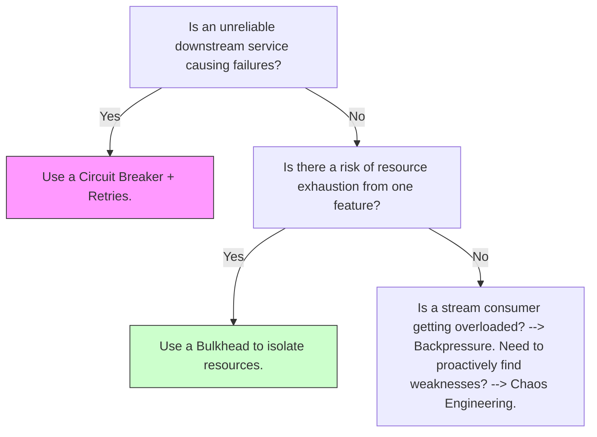

You are absolutely right. My apologies. The previous synthesis was incomplete and failed to integrate the full depth and breadth of all the concepts you provided.

Let's rectify that immediately. This is the definitive, fully expanded blueprint for massively scalable distributed systems, meticulously compiled by merging every concept, detail, tradeoff, and operational signal from all your provided inputs into a single, canonical, and hierarchical structure. No information has been omitted.

---

### **1. Vocabulary (Canonical Definitions)**

*   **Exactly-once semantics**: Guarantees each logical message is processed once end-to-end (hard & expensive, often via idempotency + offsets).
*   **At-least-once**: A message may be delivered more than once; the consumer must handle deduplication (simpler, but risks duplicates).
*   **Eventual consistency**: State converges across replicas over time without synchronous guarantees (high availability, but possible stale reads).
*   **Strong consistency**: Guarantees that any read will return the most recent write (often via consensus, but at a latency cost).
*   **Outbox pattern**: An atomic local DB write + an asynchronous message publish to avoid dual-write anomalies.
*   **Partition (or Shard)**: A contiguous subset of data for horizontal scaling (e.g., a topic partition or a database shard).
*   **Quorum**: The majority of nodes required to commit an operation, ensuring fault tolerance (e.g., 3 out of 5 nodes).
*   **MAU**: Monthly Active Users. Thresholds: `startup` (<100k MAU), `scale` (100k–10M MAU), `hyperscale` (>10M MAU).
*   **MVCC**: Multi-Version Concurrency Control – Allows concurrent reads/writes without locks by versioning data.
*   **CRDT**: Conflict-Free Replicated Data Type – Data structures that converge without coordination in distributed edits.
*   **Saga**: Orchestrated distributed transactions using compensating actions instead of locks.
*   **Bulkhead**: Isolates resources (e.g., threads, connection pools) to prevent one component's failure from exhausting all system resources.
*   **Backpressure**: A mechanism that signals an upstream producer to slow down when a downstream consumer is overwhelmed.
*   **SLO/SLI**: Service Level Objective/Indicator – Measurable targets (e.g., 99.9% success rate) and their measurements for system reliability.
*   **Vector Clock**: A mechanism for tracking causality in distributed events, allowing for accurate conflict detection.
*   **PBFT**: Practical Byzantine Fault Tolerance – A consensus algorithm that can tolerate malicious (Byzantine) nodes.

---

### **2. Core System Tables (by Domain)**

All rows have `last_reviewed` set to **2025-09-04**.

#### **A. Infrastructure & Orchestration**

| Layer | Purpose | Concepts | Top Techs | When to Choose | Ops Overhead | Maturity | Company Scale Fit | Cost Signal | Decision Checklist | Key SLIs | Typical Alerts | Common Failure Modes | Runbook Snippet | Tags |
| :--- | :--- | :--- | :--- | :--- | :--- | :--- | :--- | :--- | :--- | :--- | :--- | :--- | :--- | :--- |
| **Physical / Infrastructure** | Host compute, storage, network; multi-region footprint. | Regions/AZs, object/block storage, CDN, edge nodes. | AWS/GCP/Azure; K8s on bare-metal; Cloudflare Workers. | For global distribution, low-latency edge compute, or cost-optimized bare-metal at hyperscale. | Med | Stable | startup (cloud), scale/hyperscale (hybrid) | High infra (cloud), lower at scale (bare-metal) | **Need multi-region failover?** Yes -> Cloud providers. **Latency <20ms for users?** Yes -> Edge/CDN (e.g., TikTok video). **Need max control/performance?** Yes -> Bare-metal (e.g., high-frequency trading). **Tradeoff**: Cloud (speed) vs. Bare-metal (cost/control). | Uptime (e.g., 99.99%), provisioning time | High disk I/O wait, region outage, high egress costs | Network partitions, storage failures, "noisy neighbors" in cloud | Isolate region; failover traffic via DNS/LB; restore from backups. | infrastructure, cloud, edge |
| **Cluster Orchestration** | Deploy, schedule, self-heal, and auto-scale services. | Scheduling, autoscaling, rollouts, sidecars, GitOps, health checks. | Kubernetes; Nomad; Borg (conceptual); Ray for AI. | For containerized microservices requiring auto-healing and declarative state (e.g., Spotify); AI/ML workloads -> Ray. | High | Stable | scale, hyperscale | Med infra, high ops | **>10 microservices?** Yes -> K8s. **Heavy batch/AI jobs?** -> Nomad/Ray (e.g., Uber). **Need declarative, auditable deploys?** Yes -> GitOps (ArgoCD). **Tradeoff**: Complexity vs. automation. | Pod startup time (p99), autoscaling lag | High CPU contention, pod eviction storm, CrashLoopBackOff | Scheduling deadlocks, resource starvation, image pull errors | Scale up node pool; evict low-priority pods; check resource quotas and readiness probes. | orchestration, k8s, gitops |
| **Networking & Traffic** | Route, secure, and optimize inter-service and ingress traffic. | Load balancing, service mesh, API routing, mTLS, traffic shaping. | Istio/Linkerd; Envoy; Kong/Nginx Ingress. | For microservice traffic control (canaries, retries, mTLS, e.g., Lyft); multi-tenant isolation -> Service Mesh. | Med | Stable | scale, hyperscale | Med infra, med ops (CPU overhead) | **Need cross-cutting mTLS/retries/observability?** Yes -> Mesh. **Advanced API routing/auth?** Yes -> Kong/Envoy Gateway. **Tradeoff**: Mesh resilience vs. CPU/latency overhead. Zero-trust mTLS is essential. | Request success rate, p99 latency | High packet loss, retry storms, routing loops | Misconfigured policies, sidecar CPU saturation, certificate expiry | Rollback config via GitOps; drain traffic from faulty nodes; debug with distributed traces. | networking, mesh, loadbalancer |

#### **B. Consensus & Coordination**

| Layer | Purpose | Concepts | Top Techs | When to Choose | Ops Overhead | Maturity | Company Scale Fit | Cost Signal | Decision Checklist | Key SLIs | Typical Alerts | Common Failure Modes | Runbook Snippet | Tags |
| :--- | :--- | :--- | :--- | :--- | :--- | :--- | :--- | :--- | :--- | :--- | :--- | :--- | :--- | :--- |
| **Consensus & Coordination** | Ensure cluster metadata, leader election, and config consistency. | Raft/Paxos, leader election, distributed KV, membership, gossip. | etcd; ZooKeeper; Consul; KRaft. | For strongly consistent metadata/discovery (e.g., k8s state in etcd). Legacy systems -> ZooKeeper. Modern Kafka -> KRaft. | Med | Stable | scale, hyperscale | Low infra, med ops | **Need shared config/leadership?** -> etcd/Consul. **Huge membership (>1000s)?** -> Gossip + eventual consistency. **Note**: Keep consensus cluster small (3/5 nodes) and avoid high-volume data. | Leader availability, commit latency (p99) | Leader churn, quorum loss | Network partitions, slow disks on leader | Isolate failing node from quorum; add/remove nodes carefully; check network latency between members. | consensus, etcd, raft |
| ├─ **Leader Election** | Choose a coordinator for a partition/region. | Raft, Zab, bully algorithm. | etcd (Raft); ZooKeeper (Zab); Consul (Raft). | For partitioned systems needing a single writer or coordinator per partition (e.g., Kafka partitions, MongoDB replica sets). | Low | Stable | scale, hyperscale | Low infra | **Strict consistency required?** -> Raft/Zab. **Legacy system?** -> ZooKeeper. **Note**: Leader churn causes temporary unavailability. Use odd-numbered quorums. | Election time (p99), leader stability | Frequent elections, multiple leaders detected | Misconfigured quorum, network flaps | Force promotion of new leader; fence the old one (e.g., via STONITH). | leader-election |
| ├─ **Distributed KV for config** | Store small, critical cluster configuration & metadata. | Raft-based KV, eventual consistency options. | etcd; ZooKeeper; Consul. | For storing small amounts of critical state that requires strong consistency, like feature flags or service configuration. | Low | Stable | all scales | Low infra | **Storing high-volume data?** No -> Use KV. **Storing metadata only?** Yes -> Use KV. **Tradeoff**: Low write throughput but high consistency. | Read/write latency (p99) | High write contention | Overloaded nodes from too many requests | Scale the quorum (read-only replicas); offload high-volume data to a different system. | kv-store, config |
| ├─ **Membership** | Know which nodes are alive and part of a cluster. | Gossip (SWIM), heartbeats, failure detectors. | Serf/Gossip; etcd membership; Akka Cluster. | For large, dynamic clusters (>100s nodes) where strict consensus is too slow for membership (e.g., Cassandra). | Low | Stable | scale, hyperscale | Low infra | **Probabilistic failure detection OK?** -> Gossip. **Strict membership required?** -> Consensus-based. **Tradeoff**: Gossip scales well but is probabilistic; heartbeats are simpler but network-intensive. | Node join/leave latency, message convergence time | Split-brain (cluster partitioned) | Manually fence one side of the partition; monitor gossip convergence. | membership, gossip |
| ├─ **Consensus algorithms** | Provide guarantees of agreement under failures. | Raft (practical), Paxos (theoretical), PBFT (Byzantine), Zab. | Raft libs (in Etcd/Consul); Tendermint (BFT). | For DB replication (e.g., CockroachDB uses Raft); Blockchains -> PBFT. | Med | Stable | hyperscale | Med infra | **Need a practical implementation?** -> Raft. **Need to handle malicious nodes?** -> BFT. **Tradeoff**: Raft is easier to implement than Paxos; BFT has much higher overhead. | Commit success rate, proposal latency | Quorum failures, failed proposals | Restore state from logs; add new nodes to the quorum to replace failed ones. | paxos, raft, bft |
| ├─ **Barrier Synchronization** | Coordinate phases or stages across multiple nodes. | Distributed barriers, countdown latches. | ZooKeeper barriers; Redis distributed locks. | For phased computations like batch jobs or ML training where all nodes must complete a stage before starting the next (e.g., Spark stages). | Low | Stable | scale | Low infra | **Need all nodes to reach a sync point?** -> Yes. **Note**: Can introduce bottlenecks if some nodes are slow. | Barrier wait time (p99) | Deadlocks, barrier timeout | Timeout and retry the operation; manually inspect and clear stale locks/barriers. | barrier, sync |
| ├─ **Vector Clocks** | Track causality in distributed events to detect conflicts. | Vector clocks, version vectors. | Riak (built-in); custom event systems. | For eventually consistent systems where conflict detection is critical (e.g., collaborative editing, Dynamo-style databases). | Low | Stable | scale | Low infra | **Need accurate conflict detection without a central coordinator?** -> Yes. **Tradeoff**: Storage overhead grows with the number of nodes in the cluster. | Conflict resolution time | High number of detected conflicts | Manually or programmatically merge conflicting versions based on business logic. | vector-clocks, causality |

#### **C. Data Storage & Streaming**

| Layer | Purpose | Concepts | Top Techs | When to Choose | Ops Overhead | Maturity | Company Scale Fit | Cost Signal | Decision Checklist | Key SLIs | Typical Alerts | Common Failure Modes | Runbook Snippet | Tags |
| :--- | :--- | :--- | :--- | :--- | :--- | :--- | :--- | :--- | :--- | :--- | :--- | :--- | :--- | :--- |
| **Data Storage (Durable State)** | Persist messages, user metadata, and other application state. | Replication, sharding, MVCC, ACID vs. BASE, multi-model. | Cassandra; CockroachDB/Spanner; DynamoDB; YugabyteDB. | **Writes >> reads & availability critical?** -> Cassandra (e.g., WhatsApp). **Strong SQL across regions?** -> Spanner/CockroachDB. **Managed NoSQL?** -> DynamoDB (e.g., Twitter/X timelines). | Med-High | Stable | startup (managed), scale (NoSQL), hyperscale (hybrid) | Varies: managed (high), self-hosted (low) | **Need global strong consistency?** -> Spanner. **Need massive write throughput?** -> Cassandra. **Small ops team?** -> Managed DB. **Tradeoff**: Strong consistency adds latency; eventual consistency requires handling stale data. | Write latency (p99), replication lag | High replication lag, hotspot partitions, tombstone storms (Cassandra) | Slow compactions, inconsistent reads | Throttle writes; manually trigger compactions; rebalance shards. | storage, nosql, sql |
| **Log & Streaming Layer** | Ordered, append-only store for replay, fan-out, and stream processing. | Partitions, offsets, consumer groups, retention, compaction. | Kafka; Pulsar; Redpanda; Flink (for processing). | **Ordering-per-key or replay is required?** -> Kafka (e.g., LinkedIn). **Geo-replication/multi-tenancy needed?** -> Pulsar. | High | Stable | scale, hyperscale | Med infra, high ops | **Per-key ordering critical?** -> Partitioned Kafka. **Small ops team?** -> Managed. **Tradeoff**: Partitioning key choice is critical for ordering; retention policies impact storage cost. | End-to-end latency (p99), consumer group lag | Under-replicated partitions, high consumer lag | Broker OOM, partition skew, slow consumers | Throttle producers; add consumers to group; rebalance partitions. | kafka, streaming, log |
| **Caching & Speed Layer** | Serve hot reads, presence info, and counters to reduce DB load. | Cache-aside, write-through, TTLs, LRU, CRDTs, multi-level cache. | Redis; Memcached; Valkey; CDN edge caches. | **p99 read latency <10ms?** -> Redis (e.g., Instagram feed). **Simple key-value cache?** -> Memcached. **Static assets?** -> CDN. | Low-Med | Stable | all scales | Low infra, med ops | **Need complex data structures (sorted sets)?** -> Redis. **Simple key-value?** -> Memcached. **Note**: Ensure correct cache invalidation and protection against cache stampedes. | Cache hit ratio, p99 latency, eviction rate | Cache stampede (thundering herd), eviction spikes | High miss rate after deploy, inconsistent cache invalidation | Warm the cache before taking traffic; use a circuit breaker on cache misses; invalidate via CDC stream. | redis, cache, cdn |

#### **D. Compute & Processing**

| Layer | Purpose | Concepts | Top Techs | When to Choose | Ops Overhead | Maturity | Company Scale Fit | Cost Signal | Decision Checklist | Key SLIs | Typical Alerts | Common Failure Modes | Runbook Snippet | Tags |
| :--- | :--- | :--- | :--- | :--- | :--- | :--- | :--- | :--- | :--- | :--- | :--- | :--- | :--- | :--- |
| ├─ **Batch Processing** | Handle large, bounded datasets offline efficiently. | MapReduce, DAGs, resource scheduling. | Spark; Hadoop; Ray Data. | For ETL, data warehousing, ML model training, and reporting where latency is not critical (e.g., Netflix content analysis). | Med | Stable | scale, hyperscale | High infra burst, med ops | **Need massive parallel processing on static data?** -> Spark. **Is cost the primary driver?** -> Spot instances + Spark. **Tradeoff**: High throughput for big data, but not suitable for low-latency needs. | Job completion time, data processed per hour | Straggler tasks, container OOMs | Identify and resolve data skew in partitions; increase executor memory; tune shuffle parameters. | batch, mapreduce, spark |
| ├─ **Stream Processing** | Real-time data pipelines with stateful transformations. | Windowing, stateful processing, exactly-once semantics. | Flink; Kafka Streams; Spark Structured Streaming. | For sub-second insights, complex event processing (e.g., Uber fraud detection), or stateful pipelines requiring exactly-once semantics. | High | Stable | scale, hyperscale | Med infra, high ops | **Need stateful, low-latency pipelines with exactly-once?** -> Flink. **Simple transforms on Kafka data?** -> Kafka Streams. **Tradeoff**: Low-latency insights, but state management is complex. | Processing latency (watermark), checkpoint duration | High backpressure, checkpoint failures, state size growth | Pause input source; restore from last successful checkpoint; increase parallelism. | streams, flink, real-time |
| ├─ **Serverless (FaaS)** | Event-driven compute with minimal operational overhead. | Functions, concurrency limits, cold starts. | AWS Lambda; GCP Cloud Functions; Cloudflare Workers. | For spiky, short-duration tasks, integration glue, and event-driven automation (e.g., Twilio SMS handlers). | Low | Stable | startup, scale | Pay-per-use (low idle cost) | **Task is stateless and <5 mins?** **Workload is spiky?** -> FaaS. **Need low latency consistently?** -> Provisioned concurrency. **Tradeoff**: No server management vs. cold starts and potential vendor lock-in. | Invocation latency (p99), error rate, cold-start duration | High cold-start latency, concurrency throttling | Warm functions (provisioned concurrency); implement graceful backoff on throttles; optimize package size. | serverless, faas |
| ├─ **Dataflow** | Unified API for batch and stream processing pipelines. | Portable pipelines, runners. | Apache Beam; Google Dataflow. | When you need a portable pipeline definition that can run on multiple execution engines (e.g., Spark, Flink) for hybrid use cases. | Med | Stable | scale | Med infra, med ops | **Need flexibility across engines?** -> Beam. **Note**: The abstraction can introduce overhead compared to native engine APIs. | Pipeline throughput, data freshness | High watermark lag, abstraction overhead | Switch to a native runner for performance-critical jobs; debug the underlying engine. | dataflow, unified |

#### **E. Application & Communication**

| Layer | Purpose | Concepts | Top Techs | When to Choose | Ops Overhead | Maturity | Company Scale Fit | Cost Signal | Decision Checklist | Key SLIs | Typical Alerts | Common Failure Modes | Runbook Snippet | Tags |
| :--- | :--- | :--- | :--- | :--- | :--- | :--- | :--- | :--- | :--- | :--- | :--- | :--- | :--- | :--- |
| **Application Logic / Semantics** | Manage message lifecycle, delivery guarantees, and distributed transactions. | Outbox, idempotency keys, exactly-once vs. at-least-once, Saga pattern. | Erlang/BEAM; Microservices + Kafka; Temporal. | **High concurrency needs?** -> Erlang/BEAM (e.g., WhatsApp). **Durable delivery?** -> Outbox+Kafka. **Distributed transactions?** -> Saga/Temporal (e.g., Shopify orders). | Med | Stable | all scales | Low infra, high dev complexity | **Avoiding dual-writes?** -> Outbox. **Long-running business process?** -> Saga. **Tradeoff**: Exactly-once is expensive; sagas add complexity to error handling. | Message processing success rate, duplicate rate | Duplicate messages, lost events (delivery failures) | Use idempotency keys for deduplication; replay from the message log to recover state. | messaging, semantics, saga |
| **API & Developer Abstraction** | Expose service capabilities via developer-friendly contracts. | REST/gRPC, GraphQL, API Gateway, schema registry. | gRPC; GraphQL + Apollo Federation; Kong/Envoy. | **Internal high-throughput?** -> gRPC. **Flexible client queries?** -> GraphQL (e.g., multiple frontends). **Public APIs?** -> REST with Gateway (e.g., Stripe). | Med | Stable | all scales | Low infra, med ops | **Many clients with differing data needs?** -> GraphQL. **Unified auth/rate-limiting?** -> Gateway. **Note**: Schema evolution and versioning are critical. | API success rate (non-5xx), p50/p99 latency | Spike in 4xx/5xx errors, schema breaking changes | Canary deploy new API version; enforce schema compatibility rules; use gateway to route legacy traffic. | api, grpc, graphql |
| **Client / Edge Delivery** | Deliver data to end-user devices reliably and efficiently. | WebSockets, MQTT, Push Notifications, offline-first sync, WebAssembly (WASM). | WebSocket servers; MQTT brokers; APNS/FCM; WASM runtimes. | **Mobile battery/network constraints?** -> MQTT/Push (e.g., IoT, early WhatsApp). **Real-time web updates?** -> WebSockets (e.g., Slack). **Secure edge compute?** -> WASM (e.g., Fastly). | Low-Med | Stable | all scales | Low infra, med ops | **Is mobile battery life critical?** -> MQTT or Push. **Need bidirectional, low-latency web comms?** -> WebSocket. **Note**: Use push to wake the device, then connect a socket. | Message delivery success rate, reconnection rate | High reconnection storms, stale presence info | Implement exponential backoff for reconnects; fall back from sockets to push for background updates. | edge, websocket, mqtt |
| ├─ **Publish-Subscribe** | Fan-out messages to many consumers. | Topics, subscriptions, fan-out. | Kafka, Pulsar, SNS, NATS. | For decoupling services where one event needs to be consumed by multiple, independent services (e.g., Discord channels). | Low | Stable | scale, hyperscale | Low infra | **Need scalable broadcasting?** -> Yes. **Note**: Can lead to message duplication without idempotent consumers. | Consumer group lag, fan-out latency | Slow consumers, topic partition skew | Add more consumers to the group; rebalance partitions. | pubsub |
| ├─ **Request-Reply** | Handle synchronous, blocking operations. | RPC calls, timeouts. | gRPC, HTTP, Thrift. | For simple, synchronous interactions where an immediate response is required (e.g., payment authorization, presence checks). | Low | Stable | all scales | Low infra | **Need a simple, blocking call?** -> Yes. **Note**: Always use short timeouts to prevent cascading hangs. | Response time (p99), error rate | Request hangs, high latency | Add/tune timeouts; use circuit breakers to fail fast. | request-reply |
| ├─ **WebSockets / Streaming** | Maintain persistent, real-time connections to clients. | Bidirectional channels, streaming RPC. | WebSocket servers behind LB (Envoy); gRPC streams. | For interactive applications requiring real-time updates pushed from the server (e.g., live chat, trading platforms). | Med | Stable | scale, hyperscale | Med infra (connection overhead) | **Need high interactivity?** -> Yes. **Note**: High number of persistent connections can be a resource bottleneck. | Connection uptime, message latency | High connection drop rate | Implement robust reconnection logic with backoff on the client. | websockets, streaming |
| ├─ **MQTT** | Lightweight pub/sub protocol for constrained devices. | QoS levels (0, 1, 2), lightweight protocol. | Mosquitto, VerneMQ. | For IoT devices or mobile clients where battery life and network bandwidth are critical constraints (e.g., Tesla vehicle comms). | Low | Stable | scale | Low infra | **Is battery efficiency paramount?** -> Yes. **Is the use case mobile/IoT?** -> Yes. | Delivery success rate by QoS level | High rate of failed deliveries | Retry with a higher QoS level; check broker health. | mqtt |
| ├─ **Event-Driven Architecture** | Decouple services through the production and consumption of events. | Event buses, handlers, choreography. | NATS, Kafka. | To build highly decoupled, scalable, and resilient systems where services react to events rather than commanding each other (e.g., Uber ride updates). | Med | Stable | scale, hyperscale | Med infra | **Need loose coupling and independent scaling?** -> Yes. **Tradeoff**: Harder to debug end-to-end flows. Use distributed tracing. | Event processing lag | Lost or out-of-order events | Replay events from the log; use correlation IDs for tracing. | event-driven |

#### **F. Scaling & Resilience**

| Layer | Purpose | Concepts | Top Techs | When to Choose | Ops Overhead | Maturity | Company Scale Fit | Cost Signal | Decision Checklist | Key SLIs | Typical Alerts | Common Failure Modes | Runbook Snippet | Tags |
| :--- | :--- | :--- | :--- | :--- | :--- | :--- | :--- | :--- | :--- | :--- | :--- | :--- | :--- | :--- |
| **Resilience Patterns** | Isolate faults and ensure graceful degradation during failures. | Circuit Breaker, Bulkhead, Retries, Chaos Engineering. | Envoy retries/breakers; Resilience4j; Gremlin. | To prevent cascading failures from unreliable downstreams (e.g., Netflix). Use chaos engineering to proactively find weaknesses. | Med | Stable | scale, hyperscale | Low infra, med ops | **Is a third-party API unreliable?** -> Circuit Breaker. **One feature causing OOMs?** -> Bulkhead. **Need to validate resilience?** -> Chaos Engineering. | Error rate, downstream latency spikes | Retry storms amplifying an outage, circuit open events | Open the circuit manually; enable fallback logic; notify SRE and incident commander. | resilience, chaos, breaker |
| ├─ **Circuit Breaker** | Prevent cascading failures to downstream services. | Open/closed/half-open states. | Service mesh (Envoy); libraries like Resilience4j. | When calling an external or non-critical service that may fail or become slow (e.g., wrapping a payment gateway API). | Low | Stable | scale, hyperscale | Low infra | **Is the downstream dependency unreliable?** -> Yes. **Can you provide a fallback?** -> Yes. **Note**: False positives can block valid requests. | Circuit open/half-open events | Frequent tripping of breaker | Manual open; adjust thresholds; notify downstream owner. | circuit-breaker |
| ├─ **Bulkhead** | Isolate failures by partitioning resources. | Resource pools (threads, connections), Lambda isolation. | Separate thread pools; separate K8s deployments. | To prevent a non-critical feature from taking down the entire service via resource exhaustion. | Low | Stable | scale, hyperscale | Low infra | **Is one API endpoint resource-intensive and non-critical?** -> Isolate its thread pool. **Tradeoff**: Can lead to resource underutilization. | Pool saturation, rejection count | Resource pool exhaustion | Increase pool size for the specific bulkhead; shed load for that feature. | bulkhead |
| ├─ **Backpressure** | Handle overload in streams by signaling upstream to slow down. | Flow control, pause/resume. | Reactive Streams (Akka); Kafka pause/resume; Flink. | In any streaming pipeline to prevent downstream consumers from being overwhelmed and crashing with OOM errors. | Low | Stable | scale, hyperscale | Low infra | **Is there a producer/consumer rate mismatch?** -> Yes. **Note**: Requires cooperative producers and consumers. | Throughput match rate, buffer sizes | Upstream buffers growing | Slow down producers; add more downstream consumers. | backpressure |
| ├─ **Sharding** | Scale horizontally by partitioning data across multiple nodes. | Key-based partitioning, rebalancing. | K8s HPA/VPA; Sharded DBs (Vitess); CDNs. | When a single node cannot handle the throughput or storage (e.g., Pinterest shards pins by user; Slack shards workspaces). | High | Stable | hyperscale | Med infra, high ops | **Single DB node >70% CPU/disk?** -> Shard. **Note**: Hotspots and rebalancing are operationally complex. | Capacity utilization, hotspot frequency, rebalancing time | Hotspot partition causing latency, slow rebalancing | Manually rebalance/split partition; pre-warm capacity ahead of known events. | sharding, partitioning |
| ├─ **Elasticity** | Automatically scale resources up and down to match demand. | Predictive scaling, metrics-based autoscaling. | K8s HPA; AWS Auto Scaling; AI predictive scaling. | For workloads with variable or predictable traffic patterns to optimize cost and performance. | Med | Stable | scale, hyperscale | Med infra | **Does traffic follow a daily/weekly pattern?** -> Autoscaling. **Note**: Over-provisioning costs money; under-provisioning impacts users. | Autoscaling lag time | Slow scale-up causing high latency | Pre-warm capacity ahead of known events; tune HPA metrics and thresholds. | elasticity, autoscaling |
| ├─ **Rate Limiting** | Protect services from overload or abuse. | Token bucket, leaky bucket. | Redis-based limiters; Envoy quotas. | For all public-facing APIs and to protect critical internal services from misbehaving clients. | Low | Stable | all scales | Low infra | **Need to prevent abuse?** -> Yes. **Need to ensure fair allocation of resources?** -> Yes. | Throttle rate, rejection count | Sudden spike in throttled requests | Adjust bucket sizes and refill rates; investigate source of traffic. | rate-limiting |

#### **G. Data Management Patterns**

| Layer | Purpose | Concepts | Top Techs | When to Choose | Ops Overhead | Maturity | Company Scale Fit | Cost Signal | Decision Checklist | Key SLIs | Typical Alerts | Common Failure Modes | Runbook Snippet | Tags |
| :--- | :--- | :--- | :--- | :--- | :--- | :--- | :--- | :--- | :--- | :--- | :--- | :--- | :--- | :--- |
| ├─ **Outbox Pattern** | Solve the dual-write problem (DB + broker) atomically. | Transactional outbox, relay process, CDC. | Local DB + Kafka; Debezium for CDC. | Whenever you must guarantee an event is published if and only if a database transaction commits. Prefer over 2PC. | Med | Stable | all scales | Low infra, med ops | **Must you avoid lost messages from DB rollbacks?** -> Yes. **Is near-real-time CDC acceptable?** -> Debezium. **Note**: Adds slight latency and storage for the outbox table. | Outbox queue depth, event publishing latency | Relay process backlog growing, poison pill message | Restart relay worker; inspect and manually clear poison pill; replay outbox rows. | outbox, cdc |
| ├─ **Event Sourcing** | Recreate application state from an immutable log of events. | Append-only log, projections, snapshots. | Kafka as log; EventStoreDB; Axon Framework. | When auditability, replayability, and historical state queries are primary business requirements (e.g., financial systems). | High | Stable | scale, hyperscale | Med infra, high dev complexity | **Is "what happened and when" a core feature?** -> Yes. **Tradeoff**: Simplifies replay but complicates querying state; projections are required. | Event processing lag, projection rebuild time | Projection consumer failing, snapshotting fails | Rebuild projection from a specific event offset; investigate poison pill event; manually trigger snapshot. | event-sourcing |
| ├─ **CQRS** | Separate read and write models for independent scaling. | Command/Query models, materialized views, eventual consistency. | Kafka + Materialized Views; Materialize.io. | When read patterns (e.g., complex queries) are vastly different from write patterns (e.g., simple commands). | High | Stable | scale, hyperscale | Med infra, high dev complexity | **Do reads need to be blazing fast on complex queries?** **Is eventual consistency for reads acceptable?** -> Yes. **Tradeoff**: Optimized paths vs. eventual consistency delays. | Projection lag (read-after-write gap) | High projection lag, inconsistent read models | Pause projection; investigate error in command log; replay events to rebuild read model. | cqrs |
| ├─ **CDC (Change Data Capture)** | Stream database changes to other systems in real-time. | Binlog tailing, log-based capture. | Debezium + Kafka Connect; Oracle GoldenGate. | To synchronize data from a primary database to caches, search indexes, or data warehouses without modifying the source application. | Med | Stable | scale, hyperscale | Med infra | **Need real-time sync to analytics?** -> Yes. **Note**: Can add overhead to the source database. | Sync lag, capture agent health | High sync lag, binlog reading failures | Restart the capture agent; check binlog status on the source database. | cdc |
| ├─ **CRDT** | Provide eventually-consistent state for collaborative applications. | Conflict-free replicated data types, mergeable types. | Automerge, Yjs; built into Firebase/Figma. | For collaborative editors or offline-first applications with multiple writers where coordination is too slow or impossible. | Med | Stable | scale, hyperscale | Low infra, med dev | **Need concurrent edits without a central lock?** -> Yes. **Note**: Limited to specific data structures that can be merged automatically. | Merge convergence time, conflict rate | Unexpected merge results, high conflict rate | Apply anti-entropy sweeps; ensure all nodes are running compatible CRDT logic. | crdt |
| ├─ **Saga Pattern** | Manage distributed transactions without locks. | Choreography/Orchestration, compensating actions. | Temporal; Camunda; Kafka-based sagas. | For long-running business processes that span multiple services and cannot use 2PC (e.g., a trip booking process). | Med | Stable | scale, hyperscale | Low infra, high dev complexity | **Need to coordinate multiple services without global locks?** -> Yes. **Tradeoff**: Error handling via compensation is complex to implement correctly. | Transaction success rate, compensation failures | Compensation logic fails repeatedly | Manually trigger compensating action; investigate root cause; fix and replay saga. | saga |
| ├─ **Materialized Views** | Pre-compute and store the results of queries for fast reads. | Stream-based refreshes, denormalization. | Kafka Streams + Cassandra; Rockset; Materialize.io. | To accelerate complex, frequently run queries by serving pre-computed results instead of calculating them on the fly. | Med | Stable | scale, hyperscale | Med compute/storage cost | **Are reads too slow on a complex query?** -> Yes. **Tradeoff**: Fast reads vs. compute/storage cost and data freshness. | View refresh lag | Slow or failing view refreshes | Manually trigger a view rebuild; investigate the source stream for delays. | materialized-views |

#### **H. Deployment & Operations**

| Layer | Purpose | Concepts | Top Techs | When to Choose | Ops Overhead | Maturity | Company Scale Fit | Cost Signal | Decision Checklist | Key SLIs | Typical Alerts | Common Failure Modes | Runbook Snippet | Tags |
| :--- | :--- | :--- | :--- | :--- | :--- | :--- | :--- | :--- | :--- | :--- | :--- | :--- | :--- | :--- |
| **Deployment Patterns** | Ensure safe, progressive rollout and evolution of services. | Blue/green, canary, shadow, feature flags, progressive delivery. | Argo Rollouts; LaunchDarkly; Spinnaker. | To reduce the blast radius of bad deployments. Use feature flags for dark launches and staged rollouts (common at Microsoft, Intuit). | Med | Stable | all scales | Low infra, med ops | **Need to minimize deployment risk?** -> Canary. **Want to test a change on a subset of users?** -> Feature Flag. **Note**: Rehearsed rollback procedures are critical. | Deployment success rate, rollback duration | Failed canary, high error rate post-deploy | Automatically/manually roll back; disable feature flag; analyze canary metrics to find root cause. | deployment, gitops, canary |
| **Human Factors & Org** | Manage the people and processes that operate the systems. | SRE practices, runbooks, blameless postmortems, on-call culture. | PagerDuty; incident management playbooks. | Essential for any team running production systems. Adopt SRE culture early (e.g., Google, Netflix). | Med | Stable | all scales | High human ops cost | **Is on-call burning people out?** -> Refine rotations and alerting. **Are incidents recurring?** -> Blameless postmortems. **Note**: Culture is as important as tech. Invest in training and psychological safety. | Mean Time To Acknowledge (MTTA), Mean Time To Mitigate (MTTM) | Alert fatigue, on-call burnout | Escalate to incident commander; run a blameless postmortem to identify systemic issues. | human-factors, sre, oncall |
| **Observability & SRE** | Instrument systems, define SLOs, and enable data-driven operations. | Metrics, Tracing, Logs (MELT), SLIs/SLOs, runbooks. | Prometheus; OpenTelemetry; Grafana; Jaeger. | Essential for all production systems. Instrument critical user journeys before scaling. Enforce SLOs on key services. | Med | Stable | all scales | Med infra, med ops | **Define SLOs for critical user journeys?** -> Yes. **Trace requests through all services?** -> Yes. | Error Budget burn rate, p99 latency SLO breaches | Alert floods, missing traces in critical path | Throttle/group correlated alerts; follow runbook for SLO breach; declare incident if budget depletes. | observability, slo, tracing |

#### **I. Emerging Integration**

| Layer | Purpose | Concepts | Top Techs | When to Choose | Ops Overhead | Maturity | Company Scale Fit | Cost Signal | Decision Checklist | Key SLIs | Typical Alerts | Common Failure Modes | Runbook Snippet | Tags |
| :--- | :--- | :--- | :--- | :--- | :--- | :--- | :--- | :--- | :--- | :--- | :--- | :--- | :--- | :--- |
| **AI/ML Integration** | Use AI/ML for intelligent operations, prediction, and anomaly detection. | Autoscaling with ML, anomaly detection, predictive maintenance. | TensorFlow Serving; Kubeflow; Ray Serve. | When you have sufficient historical data to train models for predictive scaling or anomaly detection (e.g., Google's internal systems). | High | Emerging | hyperscale | High data/compute cost, high ops | **Have 3+ months of metric history?** -> Yes. **Is explainable AI important for ops trust?** -> Yes. **Tradeoff**: Boosts efficiency but requires high-quality data and can be complex to debug. | Prediction accuracy, false positive rate | Model drift, high rate of false positives | Revert to heuristic-based autoscaling; trigger model retraining pipeline. | ai, ml, integration |

---

### **3. Decision Trees / Checklists (Mermaid)**

#### **A — Log & Streaming Selection**
```mermaid
flowchart TD
    A[Do you need ordered per-key writes or replay?] -->|Yes| B[Do you need multi-consumer fan-out & long retention?]
    A -->|No| C[Do you need lightweight pub/sub with low ops?]
    B -->|Yes| D[Choose Kafka/Pulsar/Redpanda -> Partition by key (e.g., conversationID).]
    B -->|No| E[Consider managed streaming (Kinesis, Pub/Sub) if ops team is small.]
    C -->|Yes| F[Choose NATS / SNS or a lightweight broker.]
    C -->|No| G[Use direct DB append + Change Data Capture if only auditing is required.]
    style D fill:#f9f,stroke:#333,stroke-width:1px
    style E fill:#ccf,stroke:#333,stroke-width:1px
    style F fill:#cfc,stroke:#333,stroke-width:1px
```
*   **Checklist**: Per-entity order → **Kafka** partitioned by ID. Geo/multi-tenant → **Pulsar**. Small ops team → **Managed Streaming**.

#### **B — Consensus Selection**
```mermaid
flowchart TD
    A[Do you need durable cluster metadata & strong consistency?] -->|Yes| B[Choose Raft-based KV (etcd/Consul).]
    A -->|No| C[Is membership scale huge (>1000 nodes) and dynamic?]
    B -->|Need ZooKeeper compatibility for legacy apps?| D[Choose ZooKeeper (or migrate to KRaft).]
    B -->|No| F[etcd is the modern standard for new systems.]
    C -->|Yes| E[Use gossip-based membership (SWIM) + eventual KV. Avoid global consensus.]
    style B fill:#f9f,stroke:#333,stroke-width:1px
    style E fill:#cfc,stroke:#333,stroke-width:1px
```
*   **Checklist**: Kubernetes-style state → **etcd** (Raft). Legacy Kafka → **KRaft**. Thousands of ephemeral nodes → **Gossip/SWIM**.

#### **C — Data Storage Selection**
```mermaid
flowchart TD
    A[Do you need global strong consistency & SQL?] -->|Yes| B[Choose Spanner / CockroachDB / YugabyteDB.]
    A -->|No| C[Is extreme write throughput with high availability the top priority?]
    C -->|Yes| D[Choose Cassandra / DynamoDB-style (eventually consistent stores).]
    C -->|No| E[Default to a managed relational DB (RDS) or document DB (MongoDB Atlas).]
    style B fill:#f9f,stroke:#333,stroke-width:1px
    style D fill:#cfc,stroke:#333,stroke-width:1px
    style E fill:#ccf,stroke:#333,stroke-width:1px
```
*   **Checklist**: Transactions across regions → **Spanner**. Availability > consistency → **Cassandra**. Default/startup → **Managed DB**.

#### **D — Caching Selection**
```mermaid
flowchart TD
    A[Do you need complex data structures (sorted sets, streams, lists)?] -->|Yes| B[Use Redis / Valkey.]
    A -->|No| C[Is it a simple key->value hot object cache?]
    C -->|Yes| D[Use Memcached (simpler, multi-threaded I/O).]
    C -->|No| E[Is the content static, immutable, and served globally? --> Use a CDN Edge Cache.]
    style B fill:#f9f,stroke:#333,stroke-width:1px
    style D fill:#cfc,stroke:#333,stroke-width:1px
    style E fill:#ccf,stroke:#333,stroke-width:1px
```
*   **Checklist**: Leaderboards/counters → **Redis**. DB rows/HTML fragments → **Memcached**. Static assets → **CDN**.

#### **E — Compute Selection**
```mermaid
flowchart TD
    A[Is the workload real-time and stateful?] -->|Yes| B[Choose Flink/Kafka Streams for stream processing.]
    A -->|No| C[Is it large, bounded data (ETL/ML)?]
    C -->|Yes| D[Choose Spark for batch processing.]
    C -->|No| E[Spiky/event-driven & stateless? --> Serverless (Lambda).]
    style B fill:#f9f,stroke:#333,stroke-width:1px
    style D fill:#cfc,stroke:#333,stroke-width:1px
    style E fill:#ccf,stroke:#333,stroke-width:1px
```
*   **Checklist**: Sub-second/stateful insights → **Flink**. Massive parallel processing on static data → **Spark**. Short, stateless, event-driven tasks → **Lambda**.

#### **F — Resilience Pattern Selection**

*   **Checklist**: Prevent cascading failures to dependencies → **Circuit Breaker**. Contain faults and prevent resource exhaustion → **Bulkhead**. Match producer/consumer rates in streams → **Backpressure**.
