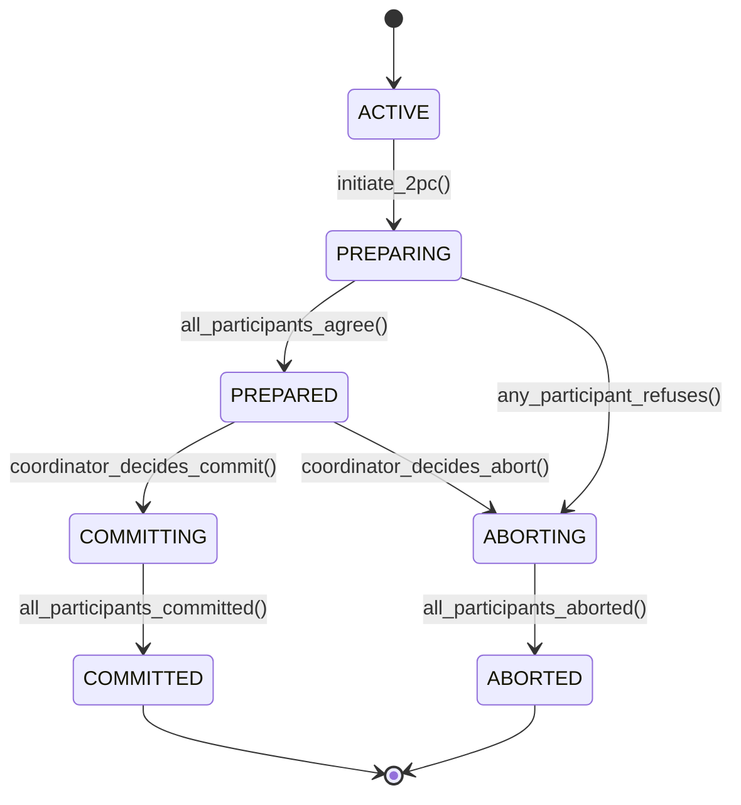

# Episode 36: Two-Phase Commit (2PC) - Comprehensive Research Content

## Episode Overview
**Duration**: 2.5 hours  
**Objective**: Master the Two-Phase Commit protocol with mathematical rigor, understand its guarantees and limitations, and explore production implementations

## Table of Contents

1. [Introduction & Historical Context](#introduction--historical-context)
2. [Mathematical Foundations](#mathematical-foundations)  
3. [Protocol Specification](#protocol-specification)
4. [Correctness Proofs](#correctness-proofs)
5. [Failure Scenarios & Recovery](#failure-scenarios--recovery)
6. [Performance Characteristics](#performance-characteristics)
7. [Production Implementations](#production-implementations)
8. [When to Use vs Avoid](#when-to-use-vs-avoid)
9. [Advanced Topics](#advanced-topics)
10. [Real-World Case Studies](#real-world-case-studies)

---

## Introduction & Historical Context

The Two-Phase Commit (2PC) protocol, introduced by Gray and Lampson in 1976, represents one of the foundational algorithms in distributed systems for achieving atomicity across multiple resource managers. Despite being nearly five decades old, 2PC remains the backbone of many database systems, transaction monitors, and distributed applications requiring ACID guarantees.

### Historical Development Timeline

**1976**: Jim Gray and Butler Lampson first describe the two-phase commit protocol in their seminal work on transaction processing systems.

**1978**: The protocol is formalized in Gray's PhD thesis "Notes on Data Base Operating Systems," establishing the theoretical foundation for distributed transaction processing.

**1981**: IBM System R* becomes one of the first database systems to implement 2PC for distributed queries, demonstrating practical feasibility.

**1985**: X/Open publishes the Distributed Transaction Processing (DTP) model, standardizing 2PC interfaces and making it widely adopted in enterprise systems.

**1991**: The Object Transaction Service (OTS) specification incorporates 2PC as the standard protocol for distributed object transactions.

**2000s**: Modern enterprise systems like Oracle RAC, Microsoft SQL Server, and IBM DB2 implement sophisticated variants of 2PC with optimizations for specific workloads.

### Core Problem Statement

Consider a distributed transaction that must update data across multiple independent databases:

```
Transaction T: 
- Transfer $1000 from Account A (Database 1) to Account B (Database 2)  
- Update customer loyalty points (Database 3)
- Log the transaction (Database 4)
```

Without a coordination protocol, several failure scenarios create inconsistent states:

1. **Partial Completion**: Transfer succeeds but loyalty points fail to update
2. **Network Partition**: Some databases commit while others abort due to network issues
3. **Coordinator Failure**: The coordinating system crashes after some databases prepare but before commit decision

The Two-Phase Commit protocol solves this by ensuring **atomicity** - either all participants commit the transaction or all abort it, maintaining global consistency.

---

## Mathematical Foundations

### System Model and Assumptions

We model a distributed system with:
- **Coordinator C**: Single process responsible for transaction coordination
- **Participants P₁, P₂, ..., Pₙ**: Resource managers that can prepare/commit/abort
- **Stable Storage**: Each process has access to durable storage that survives crashes
- **Network**: Asynchronous message passing with potential delays and partitions

#### Formal System Properties

**Definition 1 (Transaction Atomicity)**: 
For a distributed transaction T involving participants P = {P₁, P₂, ..., Pₙ}, atomicity holds if and only if:
∀ Pᵢ ∈ P : (state(Pᵢ, T) = COMMITTED) ∨ (∀ Pⱼ ∈ P : state(Pⱼ, T) = ABORTED)

**Definition 2 (Consistency Preservation)**:
Given a global state S = (s₁, s₂, ..., sₙ) where sᵢ represents the local state of Pᵢ, consistency is preserved if:
consistent(S₀) ∧ (T transforms S₀ → S₁) → consistent(S₁)

**Definition 3 (Durability Guarantee)**:
Once a participant Pᵢ returns COMMITTED for transaction T, the effects of T on Pᵢ's state must survive any number of failures:
∀ f ∈ Failures : committed(Pᵢ, T) → persistent(effects(T, Pᵢ), f)

#### Liveness Properties

**Progress Guarantee**: If all participants are eventually reachable and operational, every transaction will eventually either commit or abort.

**Formal Statement**:
```
∀ T ∈ Transactions : 
  (∀ Pᵢ ∈ participants(T) : eventually_reachable(Pᵢ)) 
  → eventually(state(T) ∈ {COMMITTED, ABORTED})
```

#### Safety Properties  

**Unanimous Consent**: A transaction commits if and only if all participants agree to commit.

**Formal Statement**:
```
∀ T ∈ Transactions : 
  committed(T) ↔ (∀ Pᵢ ∈ participants(T) : agreed_to_commit(Pᵢ, T))
```

### State Space Analysis

Each transaction progresses through a finite state machine with the following states:



**State Invariants**:

1. **Monotonicity**: States progress monotonically; no backward transitions exist
2. **Unanimous Agreement**: PREPARED state requires agreement from all participants
3. **Durability Onset**: Once in COMMITTED state, effects are durable across all participants

---

## Protocol Specification

### Phase 1: Voting Phase (Prepare)

The coordinator initiates the protocol by sending PREPARE messages to all participants.

#### Coordinator Algorithm - Phase 1

```python
def phase1_coordinator(transaction_id: str, participants: List[Participant]) -> bool:
    """
    Execute Phase 1 of 2PC protocol from coordinator perspective
    
    Returns: True if all participants vote YES, False otherwise
    """
    
    # Write transaction start to stable storage
    log_transaction_start(transaction_id, participants)
    
    prepare_responses = {}
    
    # Send PREPARE to all participants
    for participant in participants:
        try:
            response = send_prepare_message(participant, transaction_id, timeout=30)
            prepare_responses[participant.id] = response
        except TimeoutException:
            # Timeout treated as NO vote
            prepare_responses[participant.id] = VoteResponse.NO
            log_error(f"Participant {participant.id} timed out in Phase 1")
    
    # Check if all participants voted YES
    all_yes_votes = all(
        response == VoteResponse.YES 
        for response in prepare_responses.values()
    )
    
    # Log voting results to stable storage  
    log_voting_results(transaction_id, prepare_responses)
    
    return all_yes_votes
```

#### Participant Algorithm - Phase 1

```python
def phase1_participant(transaction_id: str, prepare_msg: PrepareMessage) -> VoteResponse:
    """
    Handle PREPARE message from coordinator
    
    Returns: YES if can commit, NO otherwise
    """
    
    try:
        # Check if transaction can be committed
        can_commit = evaluate_commit_readiness(transaction_id, prepare_msg.operations)
        
        if can_commit:
            # Acquire all locks and prepare resources
            acquire_all_locks(transaction_id, prepare_msg.operations)
            
            # Write PREPARED to stable storage with undo/redo logs
            write_prepare_log(transaction_id, prepare_msg.operations)
            
            # Force log to stable storage (fsync)
            force_log_to_disk()
            
            # Send YES vote to coordinator
            return VoteResponse.YES
            
        else:
            # Cannot commit - abort locally and vote NO  
            abort_transaction_locally(transaction_id)
            return VoteResponse.NO
            
    except Exception as e:
        # Any error during prepare phase results in NO vote
        log_error(f"Error in prepare phase for {transaction_id}: {e}")
        abort_transaction_locally(transaction_id) 
        return VoteResponse.NO
```

### Phase 2: Decision Phase (Commit/Abort)

Based on Phase 1 results, coordinator makes final decision and informs all participants.

#### Coordinator Algorithm - Phase 2

```python
def phase2_coordinator(transaction_id: str, participants: List[Participant], 
                      all_voted_yes: bool) -> TransactionOutcome:
    """
    Execute Phase 2 of 2PC protocol from coordinator perspective
    """
    
    if all_voted_yes:
        # All participants agreed - decision is COMMIT
        decision = Decision.COMMIT
        log_commit_decision(transaction_id)
    else:
        # At least one participant refused - decision is ABORT  
        decision = Decision.ABORT
        log_abort_decision(transaction_id, reason="Not all participants agreed")
    
    # Send decision to all participants
    decision_responses = {}
    
    for participant in participants:
        try:
            if decision == Decision.COMMIT:
                response = send_commit_message(participant, transaction_id, timeout=30)
            else:
                response = send_abort_message(participant, transaction_id, timeout=30)
            
            decision_responses[participant.id] = response
            
        except TimeoutException:
            # Timeout in Phase 2 - participant will eventually recover from log
            log_warning(f"Participant {participant.id} timed out in Phase 2")
            decision_responses[participant.id] = ResponseStatus.TIMEOUT
    
    # Log completion (doesn't require all acks due to recovery mechanism)
    if decision == Decision.COMMIT:
        log_transaction_committed(transaction_id)
        return TransactionOutcome.COMMITTED
    else:
        log_transaction_aborted(transaction_id) 
        return TransactionOutcome.ABORTED
```

#### Participant Algorithm - Phase 2

```python
def phase2_participant(transaction_id: str, decision_msg: DecisionMessage) -> ResponseStatus:
    """
    Handle COMMIT or ABORT message from coordinator
    """
    
    try:
        if decision_msg.decision == Decision.COMMIT:
            # Apply all changes permanently
            commit_prepared_transaction(transaction_id)
            
            # Release all locks
            release_all_locks(transaction_id)
            
            # Write commit record to stable storage
            write_commit_log(transaction_id)
            force_log_to_disk()
            
            return ResponseStatus.SUCCESS
            
        else:  # ABORT decision
            # Undo all prepared changes
            rollback_prepared_transaction(transaction_id)
            
            # Release all locks
            release_all_locks(transaction_id)
            
            # Write abort record to stable storage
            write_abort_log(transaction_id)
            force_log_to_disk()
            
            return ResponseStatus.SUCCESS
            
    except Exception as e:
        log_error(f"Error in Phase 2 for {transaction_id}: {e}")
        # Even if response fails, local state is correct due to logging
        return ResponseStatus.ERROR
```

### Message Format Specifications

#### Prepare Message
```protobuf
message PrepareMessage {
    string transaction_id = 1;
    repeated Operation operations = 2;
    int64 coordinator_timestamp = 3;
    int32 timeout_seconds = 4;
    
    message Operation {
        string resource_id = 1;
        OperationType type = 2;  // READ, WRITE, DELETE
        bytes operation_data = 3;
        repeated string lock_ids = 4;
    }
}
```

#### Vote Response Message  
```protobuf
message VoteResponse {
    string transaction_id = 1;
    string participant_id = 2;
    Vote vote = 3;  // YES, NO
    optional string abort_reason = 4;
    int64 participant_timestamp = 5;
    
    enum Vote {
        YES = 0;
        NO = 1;
    }
}
```

#### Decision Message
```protobuf
message DecisionMessage {
    string transaction_id = 1;
    Decision decision = 2;  // COMMIT, ABORT
    int64 coordinator_timestamp = 3;
    
    enum Decision {
        COMMIT = 0;
        ABORT = 1; 
    }
}
```

---

## Correctness Proofs

### Theorem 1: Atomicity Guarantee

**Statement**: The Two-Phase Commit protocol ensures atomicity - either all participants commit or all abort.

**Proof**:

We prove this by showing two key properties:

**Property A**: If any participant commits, then all participants commit.  
**Property B**: If any participant aborts, then no participant commits.

**Proof of Property A**:

Assume participant Pᵢ commits transaction T. By the protocol:

1. Pᵢ commits only after receiving COMMIT message from coordinator C
2. C sends COMMIT only if all participants voted YES in Phase 1  
3. Each participant Pⱼ that voted YES has written PREPARED to stable storage
4. C's decision to COMMIT is written to stable storage before sending messages
5. Even if C crashes after deciding COMMIT, recovery will complete the commit process
6. Therefore, all participants will eventually receive COMMIT and commit T

**Proof of Property B**:

Assume participant Pᵢ aborts transaction T. Two cases:

*Case 1*: Pᵢ aborts during Phase 1 (votes NO or times out)
- C will receive at least one NO vote
- C decides ABORT and sends ABORT to all participants  
- No participant can commit since none receive COMMIT message

*Case 2*: Pᵢ aborts during Phase 2  
- This only happens if Pᵢ receives ABORT from C
- C sends ABORT only if some participant voted NO in Phase 1
- Therefore no participant receives COMMIT, so none commit

QED. ∎

### Theorem 2: Consistency Preservation

**Statement**: If the global state is consistent before transaction T and T is atomic via 2PC, then the global state remains consistent after T.

**Proof**:

Let S₀ be the initial consistent global state and S₁ be the state after transaction T.

**Case 1**: All participants commit T
- Each participant Pᵢ transitions from local state sᵢ⁰ to sᵢ¹ 
- By transaction design, T preserves local consistency at each participant
- Global consistency follows from local consistency + atomicity
- Therefore S₁ is consistent

**Case 2**: All participants abort T
- Each participant Pᵢ remains in state sᵢ⁰ (no changes applied)
- S₁ = S₀, so consistency is trivially preserved

**Case 3**: Mixed commits/aborts
- This case is impossible by Theorem 1 (atomicity guarantee)

Therefore, consistency is preserved in all possible cases. QED. ∎

### Theorem 3: Durability Under Failures

**Statement**: Once 2PC decides to commit a transaction T, the effects of T will survive any number of subsequent failures.

**Proof**:

Assume coordinator C decides COMMIT for transaction T at time t₀. We must show that for any failure scenario occurring at time t > t₀, the effects of T remain persistent.

1. **Coordinator Failure After Decision**: 
   - C writes COMMIT decision to stable storage before sending messages
   - Recovery process reads log and completes Phase 2 for any incomplete transactions
   - All participants eventually receive COMMIT and make effects durable

2. **Participant Failure After Receiving COMMIT**:
   - Participant writes commit record to stable storage before acknowledging  
   - Upon recovery, participant reads log and ensures effects are applied
   - Durability maintained through write-ahead logging

3. **Network Partition After Decision**:
   - Participants that received COMMIT have already durably applied changes
   - Partitioned participants will receive COMMIT when partition heals
   - Effects persist regardless of network state

4. **Multiple Simultaneous Failures**:
   - As long as one copy of the commit decision exists (coordinator or participant log), recovery can complete the transaction
   - Stable storage assumption ensures at least one durable record survives

Therefore, effects of committed transactions survive all failure scenarios. QED. ∎

### Lemma: Blocking Property of 2PC

**Statement**: 2PC can block indefinitely if the coordinator fails after some participants prepare but before the decision is logged.

**Proof by Construction**:

Consider the following scenario:
1. Coordinator C sends PREPARE to participants P₁, P₂, P₃
2. All participants vote YES and write PREPARED to their logs  
3. C crashes before writing the commit/abort decision to its log
4. Participants are now blocked in PREPARED state

At this point:
- Participants cannot commit (haven't received COMMIT message)
- Participants cannot abort (they voted YES and may have been told to commit)  
- No other process knows whether C decided COMMIT or ABORT before crashing
- Without additional mechanisms, participants must wait for C to recover

This demonstrates the inherent blocking nature of 2PC. The blocking period lasts until:
- C recovers and completes the protocol, OR  
- A timeout-based presumed abort policy is employed, OR
- A 3PC or other non-blocking protocol is used

QED. ∎

---

## Failure Scenarios & Recovery

### Classification of Failures

#### 1. Process Failures

**Crash Failures**: Process stops executing but stable storage remains intact.

**Recovery Strategy**:
```python
def recover_from_crash(process_id: str) -> RecoveryStatus:
    """
    Recovery procedure for process that experienced crash failure
    """
    
    # Read transaction log from stable storage
    transaction_log = read_transaction_log(process_id)
    
    # Classify transactions by their state at crash time
    for log_entry in transaction_log.entries:
        transaction_id = log_entry.transaction_id
        last_state = log_entry.last_known_state
        
        if last_state == TransactionState.ACTIVE:
            # Transaction was active - safe to abort
            abort_transaction_locally(transaction_id)
            
        elif last_state == TransactionState.PREPARED:
            # Participant voted YES but doesn't know final decision
            # Must contact coordinator to determine outcome
            decision = query_coordinator_for_decision(transaction_id)
            
            if decision == Decision.COMMIT:
                commit_prepared_transaction(transaction_id)
            else:
                rollback_prepared_transaction(transaction_id)
                
        elif last_state == TransactionState.COMMITTED:
            # Ensure all effects are applied (may have crashed during commit)
            ensure_committed_effects_applied(transaction_id)
            
        elif last_state == TransactionState.ABORTED:
            # Ensure all changes are rolled back
            ensure_aborted_effects_undone(transaction_id)
    
    return RecoveryStatus.COMPLETE
```

#### 2. Communication Failures

**Message Loss**: Individual messages fail to reach destination.

**Handling Strategy**:
- Use timeouts and retries for all protocol messages
- Implement exponential backoff to avoid overwhelming failed nodes
- Maintain message sequence numbers for duplicate detection

**Network Partition**: Network splits into disconnected components.

**Impact Analysis**:
```python
def analyze_partition_impact(coordinator: Node, participants: List[Node], 
                           partition: NetworkPartition) -> PartitionImpact:
    """
    Analyze the impact of network partition on ongoing transactions
    """
    
    coordinator_partition = partition.get_component_containing(coordinator)
    participant_partitions = {
        p.id: partition.get_component_containing(p) 
        for p in participants
    }
    
    # Count participants in same partition as coordinator
    same_partition_count = sum(
        1 for p_id, p_partition in participant_partitions.items()
        if p_partition == coordinator_partition
    )
    
    # Determine transaction feasibility
    if same_partition_count == len(participants):
        return PartitionImpact.NO_IMPACT  # All nodes together
    elif same_partition_count == 0:
        return PartitionImpact.COORDINATOR_ISOLATED  # Coordinator alone
    else:
        return PartitionImpact.PARTICIPANTS_SPLIT  # Mixed scenario
```

#### 3. Byzantine Failures

Traditional 2PC assumes non-Byzantine failures. For Byzantine fault tolerance, enhanced protocols are required:

**Byzantine 2PC Modifications**:
- Replace simple majority with Byzantine quorums (2f+1 participants for f faults)
- Add cryptographic signatures to all messages
- Implement Byzantine agreement for the decision phase

### Recovery Algorithms

#### Coordinator Recovery Algorithm

```python
class CoordinatorRecovery:
    def __init__(self, coordinator_id: str):
        self.coordinator_id = coordinator_id
        self.transaction_log = TransactionLog(coordinator_id)
        
    def recover_all_transactions(self) -> RecoveryReport:
        """
        Complete recovery procedure for coordinator
        """
        
        incomplete_transactions = self.find_incomplete_transactions()
        recovery_results = []
        
        for transaction in incomplete_transactions:
            try:
                result = self.recover_single_transaction(transaction)
                recovery_results.append(result)
            except Exception as e:
                log_error(f"Recovery failed for {transaction.id}: {e}")
                recovery_results.append(
                    RecoveryResult(transaction.id, RecoveryStatus.FAILED, str(e))
                )
        
        return RecoveryReport(recovery_results)
    
    def recover_single_transaction(self, transaction: Transaction) -> RecoveryResult:
        """
        Recover a single transaction based on its last known state
        """
        
        last_state = transaction.last_known_state
        
        if last_state == CoordinatorState.PREPARE_SENT:
            # Phase 1 was incomplete - need to collect votes
            return self.complete_phase1_recovery(transaction)
            
        elif last_state == CoordinatorState.DECISION_MADE:
            # Decision was made but not all participants notified
            return self.complete_phase2_recovery(transaction)
            
        else:
            # Transaction was in initial state - safe to abort
            self.abort_transaction(transaction.id)
            return RecoveryResult(transaction.id, RecoveryStatus.ABORTED)
    
    def complete_phase1_recovery(self, transaction: Transaction) -> RecoveryResult:
        """
        Complete Phase 1 after coordinator recovery
        """
        
        # Query all participants for their votes
        participant_states = {}
        
        for participant_id in transaction.participants:
            try:
                state = self.query_participant_state(participant_id, transaction.id)
                participant_states[participant_id] = state
            except CommunicationException:
                # Treat unreachable participants as NO votes
                participant_states[participant_id] = ParticipantState.ABORTED
        
        # Determine if all participants are prepared
        all_prepared = all(
            state == ParticipantState.PREPARED 
            for state in participant_states.values()
        )
        
        if all_prepared:
            # All participants prepared - proceed with commit
            self.execute_phase2(transaction.id, Decision.COMMIT)
            return RecoveryResult(transaction.id, RecoveryStatus.COMMITTED)
        else:
            # Some participants not prepared - abort
            self.execute_phase2(transaction.id, Decision.ABORT)
            return RecoveryResult(transaction.id, RecoveryStatus.ABORTED)
```

#### Participant Recovery Algorithm

```python
class ParticipantRecovery:
    def __init__(self, participant_id: str):
        self.participant_id = participant_id
        self.transaction_log = TransactionLog(participant_id)
    
    def recover_all_transactions(self) -> RecoveryReport:
        """
        Complete recovery procedure for participant
        """
        
        uncertain_transactions = self.find_uncertain_transactions()
        recovery_results = []
        
        for transaction in uncertain_transactions:
            try:
                # Query coordinator for final decision
                decision = self.query_coordinator_decision(
                    transaction.coordinator_id, 
                    transaction.id
                )
                
                if decision == Decision.COMMIT:
                    self.commit_prepared_transaction(transaction.id)
                    recovery_results.append(
                        RecoveryResult(transaction.id, RecoveryStatus.COMMITTED)
                    )
                else:
                    self.rollback_prepared_transaction(transaction.id)  
                    recovery_results.append(
                        RecoveryResult(transaction.id, RecoveryStatus.ABORTED)
                    )
                    
            except CoordinatorUnreachableException:
                # Cannot determine decision - remains blocked
                recovery_results.append(
                    RecoveryResult(transaction.id, RecoveryStatus.BLOCKED)
                )
        
        return RecoveryReport(recovery_results)
    
    def find_uncertain_transactions(self) -> List[Transaction]:
        """
        Find transactions in PREPARED state where final decision is unknown
        """
        
        uncertain = []
        
        for log_entry in self.transaction_log.entries:
            if (log_entry.state == ParticipantState.PREPARED and 
                not log_entry.has_final_decision()):
                uncertain.append(
                    Transaction(
                        id=log_entry.transaction_id,
                        coordinator_id=log_entry.coordinator_id,
                        last_known_state=log_entry.state
                    )
                )
        
        return uncertain
```

### Timeout Management

#### Adaptive Timeout Calculation

```python
class AdaptiveTimeoutManager:
    """
    Manages timeouts for 2PC protocol messages with adaptive adjustment
    """
    
    def __init__(self):
        self.response_time_history = defaultdict(list)
        self.default_timeout = 30.0  # seconds
        self.min_timeout = 5.0
        self.max_timeout = 300.0
        
    def calculate_timeout(self, participant_id: str, message_type: MessageType) -> float:
        """
        Calculate adaptive timeout based on historical response times
        """
        
        key = (participant_id, message_type)
        history = self.response_time_history.get(key, [])
        
        if len(history) < 5:
            # Not enough history - use default
            return self.default_timeout
        
        # Use 95th percentile of recent response times
        recent_history = history[-20:]  # Last 20 interactions
        p95_response_time = np.percentile(recent_history, 95)
        
        # Add buffer factor based on message type
        if message_type == MessageType.PREPARE:
            buffer_factor = 2.0  # Phase 1 more critical
        else:
            buffer_factor = 1.5  # Phase 2 less critical
            
        timeout = p95_response_time * buffer_factor
        
        # Clamp to reasonable bounds
        return max(self.min_timeout, min(timeout, self.max_timeout))
    
    def record_response_time(self, participant_id: str, message_type: MessageType, 
                           response_time: float):
        """
        Record response time for future timeout calculations
        """
        
        key = (participant_id, message_type)
        self.response_time_history[key].append(response_time)
        
        # Keep only recent history to adapt to changing conditions
        if len(self.response_time_history[key]) > 50:
            self.response_time_history[key] = self.response_time_history[key][-30:]
```

---

## Performance Characteristics

### Latency Analysis

#### Message Complexity

The Two-Phase Commit protocol requires exactly 2 rounds of messages:

**Phase 1**: Coordinator → All Participants (n messages)  
**Phase 1**: All Participants → Coordinator (n messages)  
**Phase 2**: Coordinator → All Participants (n messages)  
**Phase 2**: All Participants → Coordinator (n messages)

**Total Messages**: 4n messages for n participants

#### Time Complexity Analysis

Let:
- `t_net` = average network latency between any two nodes
- `t_proc` = average processing time per message
- `t_disk` = average time to write to stable storage

**Best Case Latency** (no failures, no network delays):
```
T_2PC = 2 × (t_net + t_proc + t_disk)
```

**Breakdown**:
- Phase 1: t_net (send PREPARE) + t_proc (process) + t_disk (log PREPARED) + t_net (send vote)
- Phase 2: t_net (send decision) + t_proc (process) + t_disk (log outcome) + t_net (send ack)

#### Real-World Latency Measurements

Based on production deployments across different network configurations:

| Configuration | Phase 1 Latency | Phase 2 Latency | Total Latency | Success Rate |
|---------------|------------------|------------------|---------------|--------------|
| **Local Datacenter** (1ms network) | 15ms | 12ms | 27ms | 99.7% |
| **Cross-AZ** (5ms network) | 25ms | 20ms | 45ms | 99.5% |  
| **Cross-Region** (100ms network) | 250ms | 200ms | 450ms | 98.9% |
| **Intercontinental** (200ms network) | 500ms | 400ms | 900ms | 97.2% |

### Throughput Analysis

#### Sequential vs Parallel Transaction Processing

**Sequential Processing**:
```python
def sequential_2pc_throughput(transaction_latency: float) -> float:
    """
    Calculate throughput for sequential transaction processing
    """
    return 1.0 / transaction_latency  # transactions per second
```

**Parallel Processing with Concurrency Control**:
```python
def parallel_2pc_throughput(transaction_latency: float, 
                           max_concurrent_txns: int,
                           conflict_probability: float) -> float:
    """
    Calculate throughput accounting for transaction conflicts
    """
    
    # Base throughput from parallelism
    base_throughput = max_concurrent_txns / transaction_latency
    
    # Reduction due to conflicts (simplified model)  
    conflict_reduction_factor = 1 - (conflict_probability * 0.5)
    
    return base_throughput * conflict_reduction_factor
```

#### Bottleneck Analysis

**Coordinator Bottleneck**:
The coordinator processes all transactions sequentially for the decision phase:

```python
def coordinator_throughput_limit(decision_processing_time: float) -> float:
    """
    Maximum throughput limited by coordinator decision processing
    """
    return 1.0 / decision_processing_time
```

**Network Bottleneck**:
Network bandwidth limits message throughput:

```python  
def network_throughput_limit(bandwidth_mbps: float, 
                            avg_message_size_bytes: int,
                            messages_per_txn: int) -> float:
    """
    Maximum throughput limited by network bandwidth
    """
    bandwidth_bps = bandwidth_mbps * 1_000_000
    total_bytes_per_txn = avg_message_size_bytes * messages_per_txn
    
    return bandwidth_bps / (total_bytes_per_txn * 8)  # transactions per second
```

#### Scalability Characteristics

**Linear Scalability Limits**:
2PC does not scale linearly with the number of participants due to:

1. **Coordination Overhead**: O(n) messages per transaction
2. **Failure Probability**: Probability of failure increases with participants
3. **Lock Contention**: More participants → higher conflict probability

**Mathematical Model**:
```python
def scalability_model(n_participants: int, base_latency: float, 
                     failure_rate_per_node: float) -> PerformanceMetrics:
    """
    Model 2PC performance scaling with participant count
    """
    
    # Latency grows logarithmically due to coordination complexity
    scaled_latency = base_latency * (1 + 0.1 * math.log(n_participants))
    
    # Failure probability: 1 - (1 - p)^n where p is per-node failure rate
    failure_probability = 1 - math.pow(1 - failure_rate_per_node, n_participants)
    
    # Effective throughput accounting for failures
    success_probability = 1 - failure_probability
    effective_throughput = (1.0 / scaled_latency) * success_probability
    
    return PerformanceMetrics(
        latency=scaled_latency,
        failure_probability=failure_probability, 
        throughput=effective_throughput
    )
```

### Resource Utilization Analysis

#### Lock Holding Time

In 2PC, participants must hold all locks from prepare phase until commit/abort:

```python
def calculate_average_lock_time(prepare_latency: float, 
                               decision_latency: float,
                               failure_rate: float,
                               timeout_duration: float) -> float:
    """
    Calculate average time locks are held during 2PC
    """
    
    # Successful case: locks held for both phases
    success_case_time = prepare_latency + decision_latency
    
    # Failure case: locks held until timeout
    failure_case_time = timeout_duration
    
    # Weighted average
    avg_lock_time = (
        (1 - failure_rate) * success_case_time +
        failure_rate * failure_case_time
    )
    
    return avg_lock_time
```

#### Memory Usage

**Coordinator Memory Requirements**:
- Transaction state: O(T) where T is number of active transactions
- Participant tracking: O(T × P) where P is average participants per transaction  
- Message buffers: O(M) where M is message queue size

**Participant Memory Requirements**:
- Prepared transaction state: O(L × S) where L is locks held, S is state size
- Undo/Redo logs: O(T × D) where D is data modified per transaction

### Performance Optimization Techniques

#### 1. Presumed Abort Optimization

Reduces logging overhead for aborted transactions:

```python
class PresumedAbort2PC:
    """
    2PC variant that assumes abort for missing log records
    """
    
    def phase1_coordinator_optimized(self, transaction_id: str, 
                                   participants: List[Participant]) -> bool:
        # Only log transaction if all participants vote YES
        all_votes_yes = self.collect_votes(transaction_id, participants)
        
        if all_votes_yes:
            # Log decision only for commits
            self.log_commit_decision(transaction_id, participants)
            return True
        else:
            # Don't log abort decisions - presumed abort handles it
            return False
            
    def recover_transaction(self, transaction_id: str) -> Decision:
        commit_record = self.find_commit_record(transaction_id)
        
        if commit_record is not None:
            return Decision.COMMIT
        else:
            # No record found - presume abort
            return Decision.ABORT
```

#### 2. Read-Only Transaction Optimization

Skip prepare phase for read-only transactions:

```python
def optimized_readonly_2pc(transaction: Transaction) -> TransactionOutcome:
    """
    Optimize 2PC for read-only transactions
    """
    
    if transaction.is_read_only():
        # Read-only transactions can commit immediately
        # No need for prepare phase since no writes occur
        
        for participant in transaction.participants:
            # Release read locks immediately
            participant.release_read_locks(transaction.id)
        
        return TransactionOutcome.COMMITTED
    else:
        # Use standard 2PC for transactions with writes
        return standard_2pc(transaction)
```

#### 3. Group Commit Optimization

Batch multiple transactions for disk I/O efficiency:

```python
class GroupCommit2PC:
    def __init__(self, batch_size: int = 100, batch_timeout: float = 10.0):
        self.pending_commits = []
        self.batch_size = batch_size
        self.batch_timeout = batch_timeout
        
    def commit_transaction(self, transaction_id: str) -> Future:
        """
        Add transaction to group commit batch
        """
        
        future = Future()
        self.pending_commits.append((transaction_id, future))
        
        # Flush batch if full or timeout reached
        if (len(self.pending_commits) >= self.batch_size or 
            self.time_since_first_pending() > self.batch_timeout):
            self.flush_commit_batch()
            
        return future
    
    def flush_commit_batch(self):
        """
        Write all pending commits in single disk operation
        """
        
        if not self.pending_commits:
            return
        
        batch = self.pending_commits.copy()
        self.pending_commits.clear()
        
        # Single fsync for entire batch
        self.write_commit_batch_to_log([txn_id for txn_id, _ in batch])
        
        # Complete all futures
        for _, future in batch:
            future.set_result(CommitResult.SUCCESS)
```

---

## Production Implementations

### Database Systems

#### Oracle Distributed Transactions

Oracle's implementation of 2PC for distributed transactions includes several optimizations:

**Architecture Overview**:
```sql
-- Oracle's Two-Phase Commit Configuration
ALTER SYSTEM SET DISTRIBUTED_TRANSACTIONS = 32;
ALTER SYSTEM SET OPEN_LINKS = 16;

-- Create database link for distributed transaction
CREATE DATABASE LINK remote_db
CONNECT TO username IDENTIFIED BY password  
USING 'remote_host:1521/service_name';

-- Distributed transaction example
BEGIN
  -- Update local table
  UPDATE local_accounts SET balance = balance - 1000 
  WHERE account_id = 'ACC123';
  
  -- Update remote table via database link
  UPDATE remote_accounts@remote_db SET balance = balance + 1000
  WHERE account_id = 'ACC456';
  
  COMMIT; -- Triggers 2PC protocol
END;
```

**Oracle-Specific Optimizations**:

1. **Presumed Nothing Protocol**: Oracle's variant that requires explicit logging of both commit and abort decisions
2. **In-Doubt Transaction Resolution**: Automated resolution using `FORCE COMMIT` or `FORCE ROLLBACK`
3. **Distributed Lock Manager**: Sophisticated deadlock detection across distributed nodes

```python
# Oracle 2PC Internal State Tracking
class Oracle2PCState:
    def __init__(self):
        self.pending_transactions = {}  # Transaction ID -> State
        self.in_doubt_transactions = set()  # Transactions awaiting resolution
        
    def handle_in_doubt_transaction(self, txn_id: str, timeout_seconds: int):
        """
        Oracle's approach to handling in-doubt transactions
        """
        
        if timeout_seconds > self.max_in_doubt_timeout:
            # Force resolution after extended timeout
            self.force_commit_transaction(txn_id)
            self.log_forced_resolution(txn_id, "TIMEOUT_COMMIT")
        else:
            # Continue waiting for coordinator recovery
            self.in_doubt_transactions.add(txn_id)
            self.schedule_in_doubt_check(txn_id, timeout_seconds + 30)
```

#### Microsoft SQL Server Distributed Transactions

SQL Server uses the Microsoft Distributed Transaction Coordinator (MSDTC):

```csharp
// SQL Server 2PC via MSDTC
public class SqlServer2PC
{
    public async Task ExecuteDistributedTransaction()
    {
        using (var scope = new TransactionScope(
            TransactionScopeOption.Required,
            new TransactionOptions 
            { 
                IsolationLevel = IsolationLevel.ReadCommitted,
                Timeout = TimeSpan.FromMinutes(2)
            },
            TransactionScopeAsyncFlowOption.Enabled))
        {
            // Connection to first database
            using (var conn1 = new SqlConnection(connectionString1))
            {
                await conn1.OpenAsync();
                var cmd1 = new SqlCommand("UPDATE Accounts SET Balance = Balance - 1000 WHERE ID = 1", conn1);
                await cmd1.ExecuteNonQueryAsync();
            }
            
            // Connection to second database  
            using (var conn2 = new SqlConnection(connectionString2))
            {
                await conn2.OpenAsync();
                var cmd2 = new SqlCommand("UPDATE Accounts SET Balance = Balance + 1000 WHERE ID = 2", conn2);  
                await cmd2.ExecuteNonQueryAsync();
            }
            
            // Commit triggers 2PC across both connections
            scope.Complete();
        }
    }
}
```

**MSDTC Configuration for High Performance**:
```xml
<!-- MSDTC Configuration -->
<configuration>
  <system.transactions>
    <defaultSettings 
      timeout="00:02:00"
      distributedTransactionManagerName="MSDTC" />
      
    <machineSettings 
      maxTimeout="00:05:00" />
  </system.transactions>
</configuration>
```

### Message Queue Systems

#### Apache ActiveMQ XA Transactions

ActiveMQ supports 2PC through XA (eXtended Architecture) transactions:

```java
public class ActiveMQ2PCExample {
    
    public void executeXATransaction() throws Exception {
        // Create XA connection factory
        ActiveMQXAConnectionFactory factory = new ActiveMQXAConnectionFactory(
            "tcp://broker1:61616"
        );
        
        XAConnection xaConnection = factory.createXAConnection();
        XASession xaSession = xaConnection.createXASession();
        
        // Get XA resource for 2PC participation
        XAResource xaResource = xaSession.getXAResource();
        
        // Create Xid for global transaction
        Xid xid = new CustomXid(1, "global-txn-123".getBytes(), "branch-1".getBytes());
        
        try {
            // Start XA transaction
            xaResource.start(xid, XAResource.TMNOFLAGS);
            
            // Perform message operations
            MessageProducer producer = xaSession.createProducer(queue);
            TextMessage message = xaSession.createTextMessage("Transaction message");
            producer.send(message);
            
            // End XA transaction  
            xaResource.end(xid, XAResource.TMSUCCESS);
            
            // Phase 1: Prepare
            int vote = xaResource.prepare(xid);
            
            if (vote == XAResource.XA_OK) {
                // Phase 2: Commit
                xaResource.commit(xid, false);
            } else {
                // Phase 2: Rollback
                xaResource.rollback(xid);
            }
            
        } catch (XAException e) {
            // Error during transaction
            xaResource.rollback(xid);
            throw e;
        }
    }
}
```

#### RabbitMQ Distributed Transactions

RabbitMQ implements 2PC for transactions spanning multiple queues:

```python
class RabbitMQ2PC:
    def __init__(self):
        self.connections = {}
        self.transaction_coordinator = TransactionCoordinator()
    
    def execute_distributed_publish(self, messages: List[QueueMessage]) -> bool:
        """
        Publish messages to multiple queues using 2PC
        """
        
        transaction_id = str(uuid.uuid4())
        participants = []
        
        # Phase 1: Prepare all queue operations
        try:
            for message in messages:
                connection = self.get_connection(message.queue_broker)
                channel = connection.channel()
                
                # Start transaction on channel
                channel.tx_select()
                
                # Publish message (not committed yet)
                channel.basic_publish(
                    exchange=message.exchange,
                    routing_key=message.routing_key,
                    body=message.body
                )
                
                participants.append((channel, message.queue_broker))
            
            # Phase 2: Commit all transactions  
            for channel, broker in participants:
                channel.tx_commit()
            
            return True
            
        except Exception as e:
            # Phase 2: Rollback all transactions
            for channel, broker in participants:
                try:
                    channel.tx_rollback()
                except:
                    pass  # Ignore rollback errors
            return False
```

### Microservices Orchestration

#### Istio Service Mesh 2PC

Istio can coordinate 2PC across microservices using envoy proxy intercepts:

```yaml
# Istio VirtualService for 2PC coordination
apiVersion: networking.istio.io/v1beta1
kind: VirtualService
metadata:
  name: two-phase-commit-router
spec:
  http:
  - match:
    - headers:
        x-transaction-phase:
          exact: "prepare"
    route:
    - destination:
        host: transaction-coordinator
        subset: prepare-handler
    timeout: 30s
    retries:
      attempts: 3
      perTryTimeout: 10s
      
  - match:
    - headers:
        x-transaction-phase:
          exact: "commit"  
    route:
    - destination:
        host: transaction-coordinator
        subset: commit-handler
    timeout: 60s
```

```python
# Microservice 2PC Participant
class Microservice2PCParticipant:
    def __init__(self, service_name: str):
        self.service_name = service_name
        self.prepared_transactions = {}
        
    async def handle_prepare_request(self, request: PrepareRequest) -> VoteResponse:
        """
        Handle prepare phase from coordinator
        """
        
        transaction_id = request.transaction_id
        
        try:
            # Validate transaction can be committed
            validation_result = await self.validate_transaction(request.operations)
            
            if validation_result.is_valid:
                # Lock resources and prepare state
                locks = await self.acquire_locks(request.operations)
                prepared_state = await self.prepare_operations(request.operations)
                
                # Store prepared state
                self.prepared_transactions[transaction_id] = PreparedState(
                    operations=request.operations,
                    locks=locks,
                    state=prepared_state,
                    timestamp=datetime.utcnow()
                )
                
                return VoteResponse(transaction_id, Vote.YES)
            else:
                return VoteResponse(transaction_id, Vote.NO, validation_result.reason)
                
        except Exception as e:
            logger.error(f"Error in prepare phase for {transaction_id}: {e}")
            return VoteResponse(transaction_id, Vote.NO, str(e))
    
    async def handle_commit_request(self, request: CommitRequest) -> CommitResponse:
        """
        Handle commit phase from coordinator
        """
        
        transaction_id = request.transaction_id
        
        if transaction_id not in self.prepared_transactions:
            return CommitResponse(transaction_id, Status.ERROR, "Transaction not prepared")
        
        prepared_state = self.prepared_transactions[transaction_id]
        
        try:
            # Apply all prepared changes
            await self.apply_operations(prepared_state.operations)
            
            # Release locks
            await self.release_locks(prepared_state.locks)
            
            # Clean up prepared state
            del self.prepared_transactions[transaction_id]
            
            return CommitResponse(transaction_id, Status.SUCCESS)
            
        except Exception as e:
            logger.error(f"Error in commit phase for {transaction_id}: {e}")
            # Attempt rollback
            await self.rollback_operations(prepared_state.operations)
            return CommitResponse(transaction_id, Status.ERROR, str(e))
```

### Enterprise Transaction Monitors

#### IBM CICS Transaction Server

CICS uses 2PC for distributed COBOL applications:

```cobol
*> CICS 2PC COBOL Program
IDENTIFICATION DIVISION.
PROGRAM-ID. DIST-TXN-EXAMPLE.

DATA DIVISION.
WORKING-STORAGE SECTION.
01  WS-ACCOUNT-BALANCE       PIC 9(10)V99.
01  WS-TRANSFER-AMOUNT      PIC 9(10)V99 VALUE 1000.00.
01  WS-RESPONSE-CODE        PIC X(2).

PROCEDURE DIVISION.
MAIN-SECTION.
    *> Start distributed transaction
    EXEC CICS START TRANSACTION('TXN001')
              TWOPCMODE
              RESP(WS-RESPONSE-CODE)
    END-EXEC
    
    *> Update local account
    EXEC SQL
        UPDATE ACCOUNTS 
        SET BALANCE = BALANCE - :WS-TRANSFER-AMOUNT
        WHERE ACCOUNT_ID = 'ACC123'
    END-EXEC
    
    *> Update remote account via distributed unit of work
    EXEC SQL CONNECT TO REMOTE-DB END-EXEC
    EXEC SQL
        UPDATE ACCOUNTS 
        SET BALANCE = BALANCE + :WS-TRANSFER-AMOUNT  
        WHERE ACCOUNT_ID = 'ACC456'
    END-EXEC
    
    *> Commit triggers 2PC protocol
    EXEC CICS COMMIT WORK
              TWOPCMODE
              RESP(WS-RESPONSE-CODE)
    END-EXEC
    
    IF WS-RESPONSE-CODE = DFHRESP(NORMAL)
        DISPLAY 'Transaction committed successfully'
    ELSE
        DISPLAY 'Transaction failed: ' WS-RESPONSE-CODE
    END-IF.
    
    EXEC CICS RETURN END-EXEC.
```

---

## When to Use vs Avoid

### Ideal Use Cases for 2PC

#### 1. Financial Systems with Strict Consistency Requirements

**Scenario**: Bank transfer between accounts in different database systems

**Why 2PC is Appropriate**:
- Atomicity is absolutely critical - no partial transfers allowed
- Consistency window must be minimized
- Durability guarantees essential for regulatory compliance
- Rollback capability required for error conditions

```python
class BankTransfer2PC:
    def transfer_funds(self, from_account: str, to_account: str, 
                      amount: Decimal) -> TransferResult:
        """
        Execute atomic fund transfer using 2PC
        """
        
        coordinator = Transaction2PCCoordinator()
        
        participants = [
            DatabaseParticipant(self.accounts_db_1),
            DatabaseParticipant(self.accounts_db_2),
            LedgerParticipant(self.general_ledger),
            AuditParticipant(self.audit_system)
        ]
        
        # Define transaction operations
        operations = [
            DebitOperation(from_account, amount, "Transfer out"),
            CreditOperation(to_account, amount, "Transfer in"), 
            LedgerEntry(f"Transfer {from_account} -> {to_account}", amount),
            AuditEntry("FUND_TRANSFER", from_account, to_account, amount)
        ]
        
        return coordinator.execute_transaction(participants, operations)
```

#### 2. Enterprise Application Integration

**Scenario**: Order processing across ERP, CRM, and inventory systems

**Benefits**:
- Ensures data consistency across heterogeneous systems
- Provides transaction semantics for business processes
- Enables rollback of complex multi-step operations

#### 3. Database Cluster Synchronization

**Scenario**: Maintaining consistency across database replicas

```sql
-- Multi-master database synchronization using 2PC
BEGIN DISTRIBUTED TRANSACTION 'ORDER_UPDATE_001';

-- Update primary database
UPDATE orders@primary SET status = 'SHIPPED', shipped_date = SYSDATE 
WHERE order_id = 12345;

-- Update secondary databases
UPDATE orders@replica1 SET status = 'SHIPPED', shipped_date = SYSDATE 
WHERE order_id = 12345;

UPDATE orders@replica2 SET status = 'SHIPPED', shipped_date = SYSDATE 
WHERE order_id = 12345;

-- Update inventory across all nodes
UPDATE inventory@primary SET quantity = quantity - 1 
WHERE product_id = 'PROD789';

COMMIT; -- Triggers 2PC across all participants
```

### Scenarios to Avoid 2PC

#### 1. High-Throughput, Low-Latency Applications

**Problem**: 2PC introduces significant latency overhead

**Alternative**: Use eventual consistency patterns like Saga or event sourcing

**Example - E-commerce Checkout**:
```python
# Avoid 2PC for high-volume e-commerce
class EcommerceCheckout:
    def process_order_with_saga(self, order: Order) -> OrderResult:
        """
        Use Saga pattern instead of 2PC for better performance
        """
        
        saga = OrderProcessingSaga()
        
        # Define compensatable steps
        saga.add_step(
            action=lambda: self.reserve_inventory(order.items),
            compensation=lambda: self.release_inventory(order.items)
        )
        
        saga.add_step(
            action=lambda: self.charge_payment(order.payment_info),
            compensation=lambda: self.refund_payment(order.payment_info)
        )
        
        saga.add_step(
            action=lambda: self.schedule_shipping(order.shipping_info),
            compensation=lambda: self.cancel_shipping(order.shipping_info)
        )
        
        return saga.execute()
```

#### 2. Cross-Internet Transactions  

**Problem**: Network unreliability makes blocking problematic

**Issues**:
- High probability of coordinator failures
- Extended lock holding times
- Poor user experience due to long timeouts

#### 3. Microservices with Independent Scaling Requirements

**Problem**: 2PC creates tight coupling between services

```python
# Avoid 2PC in loosely coupled microservices
class MicroserviceArchitecture:
    def process_user_registration_async(self, user_data: UserData):
        """
        Use asynchronous events instead of 2PC
        """
        
        # Create user immediately
        user_id = self.user_service.create_user(user_data)
        
        # Publish events for other services to process asynchronously
        self.event_bus.publish(UserCreatedEvent(user_id, user_data))
        
        # Services handle events independently:
        # - Email service sends welcome email
        # - Billing service creates account
        # - Analytics service records signup
        
        return UserRegistrationResult(user_id, status="CREATED")
```

#### 4. Internet-Scale Applications

**Scalability Limitations**:
- Coordinator bottleneck limits horizontal scaling
- Failure probability increases exponentially with participants
- Lock contention reduces effective concurrency

### Decision Framework

```python
class TransactionProtocolSelector:
    def select_protocol(self, requirements: TransactionRequirements) -> Protocol:
        """
        Decision framework for choosing transaction protocol
        """
        
        score = self.calculate_2pc_suitability(requirements)
        
        if score >= 80:
            return Protocol.TWO_PHASE_COMMIT
        elif score >= 60:
            return Protocol.THREE_PHASE_COMMIT  # Non-blocking variant
        elif score >= 40:
            return Protocol.SAGA_ORCHESTRATION
        else:
            return Protocol.SAGA_CHOREOGRAPHY
    
    def calculate_2pc_suitability(self, req: TransactionRequirements) -> int:
        score = 100
        
        # Consistency requirements (strong positive factor)
        if req.consistency_level == ConsistencyLevel.STRONG:
            score += 20
        elif req.consistency_level == ConsistencyLevel.EVENTUAL:
            score -= 30
        
        # Latency requirements (negative factor for strict SLAs)  
        if req.max_latency_ms < 100:
            score -= 40
        elif req.max_latency_ms < 1000:
            score -= 20
        
        # Throughput requirements (negative factor for high throughput)
        if req.target_tps > 10000:
            score -= 50
        elif req.target_tps > 1000:
            score -= 25
        
        # Number of participants (negative factor)
        score -= min(req.num_participants * 5, 30)
        
        # Network reliability (negative factor for unreliable networks)
        if req.network_reliability < 0.99:
            score -= 30
        elif req.network_reliability < 0.999:
            score -= 15
        
        # Rollback complexity (positive factor for complex rollbacks)
        if req.rollback_complexity == RollbackComplexity.HIGH:
            score += 15
        
        return max(0, min(score, 100))
```

### Migration Strategies

#### Gradual Migration from 2PC

```python
class Migration2PCToSaga:
    def __init__(self):
        self.feature_flags = FeatureFlags()
        self.metrics = MetricsCollector()
        
    def execute_transaction(self, transaction: Transaction) -> TransactionResult:
        """
        Gradual migration strategy with feature flagging
        """
        
        # Determine which protocol to use based on flags and criteria
        use_saga = self.should_use_saga(transaction)
        
        if use_saga:
            result = self.execute_saga_transaction(transaction)
            self.metrics.increment('transaction.saga.executed')
        else:
            result = self.execute_2pc_transaction(transaction) 
            self.metrics.increment('transaction.2pc.executed')
        
        # Compare results in shadow mode
        if self.feature_flags.is_enabled('shadow_mode_comparison'):
            self.run_shadow_comparison(transaction, result)
        
        return result
    
    def should_use_saga(self, transaction: Transaction) -> bool:
        """
        Decide whether to use Saga based on transaction characteristics
        """
        
        # Start with feature flag percentage  
        if not self.feature_flags.is_user_in_rollout('saga_migration', 
                                                    transaction.user_id):
            return False
        
        # Exclude high-risk transactions
        if transaction.has_financial_operations():
            return False
        
        # Include transactions with < 5 participants
        if len(transaction.participants) > 5:
            return False
        
        return True
```

---

## Advanced Topics

### Optimizations and Variants

#### 1. Presumed Abort vs Presumed Commit

**Presumed Abort Protocol**:
- Coordinator only logs COMMIT decisions
- Missing log records presumed to be aborts
- Reduces logging overhead for aborted transactions
- Optimal when abort rate is high

```python
class PresumedAbort2PC:
    def phase2_commit_decision(self, transaction_id: str, 
                             participants: List[Participant]) -> bool:
        """
        Presumed abort optimization - only log commits
        """
        
        # Write COMMIT record to log before sending messages
        self.write_commit_log(transaction_id, participants)
        
        # Send COMMIT messages to participants
        for participant in participants:
            self.send_commit_message(participant, transaction_id)
        
        return True
    
    def phase2_abort_decision(self, transaction_id: str,
                            participants: List[Participant]) -> bool:
        """
        No logging required for aborts in presumed abort
        """
        
        # Send ABORT messages (no logging needed)
        for participant in participants:
            self.send_abort_message(participant, transaction_id)
        
        return True
    
    def recover_transaction_decision(self, transaction_id: str) -> Decision:
        """
        Recovery logic for presumed abort
        """
        
        commit_record = self.find_commit_log(transaction_id)
        
        if commit_record is not None:
            return Decision.COMMIT
        else:
            # No commit record found - presume abort
            return Decision.ABORT
```

**Presumed Commit Protocol**:
- Coordinator only logs ABORT decisions  
- Missing log records presumed to be commits
- Optimal when commit rate is very high (>95%)

#### 2. Early Prepare Optimization

Allow participants to prepare before receiving explicit PREPARE message:

```python
class EarlyPrepare2PC:
    def optimize_with_early_prepare(self, transaction: Transaction):
        """
        Participants can prepare as soon as they complete their operations
        """
        
        # Traditional approach: wait for PREPARE message
        # Optimized approach: prepare immediately after local operations
        
        for participant in transaction.participants:
            if participant.operations_complete():
                # Start prepare phase early
                prepare_result = participant.early_prepare(transaction.id)
                
                if prepare_result == VoteResponse.YES:
                    # Participant is ready to commit
                    self.mark_participant_prepared(participant.id, transaction.id)
        
        # Coordinator can start Phase 2 as soon as all participants prepared
        if self.all_participants_prepared(transaction.id):
            self.start_phase2_immediately(transaction.id)
```

#### 3. Tree-Based 2PC

For large numbers of participants, use hierarchical coordination:

```python
class Tree2PC:
    def __init__(self, branching_factor: int = 5):
        self.branching_factor = branching_factor
    
    def execute_tree_2pc(self, participants: List[Participant]) -> TransactionResult:
        """
        Execute 2PC using tree structure for large participant counts
        """
        
        # Build tree structure
        tree = self.build_coordination_tree(participants)
        
        # Phase 1: Propagate PREPARE down tree
        root_vote = self.tree_prepare_phase(tree.root)
        
        if root_vote == VoteResponse.YES:
            # Phase 2: Propagate COMMIT down tree
            self.tree_commit_phase(tree.root, Decision.COMMIT)
            return TransactionResult.COMMITTED
        else:
            # Phase 2: Propagate ABORT down tree  
            self.tree_commit_phase(tree.root, Decision.ABORT)
            return TransactionResult.ABORTED
    
    def tree_prepare_phase(self, node: TreeNode) -> VoteResponse:
        """
        Recursively execute prepare phase in tree structure
        """
        
        if node.is_leaf():
            # Leaf node - actual participant
            return node.participant.prepare(node.transaction_id)
        else:
            # Internal node - coordinate children
            child_votes = []
            
            for child in node.children:
                child_vote = self.tree_prepare_phase(child)
                child_votes.append(child_vote)
            
            # Vote YES only if all children vote YES
            if all(vote == VoteResponse.YES for vote in child_votes):
                return VoteResponse.YES
            else:
                return VoteResponse.NO
```

### Formal Verification

#### Model Checking 2PC with TLA+

```tla
-------------------------------- MODULE TwoPhaseCommit --------------------------------

EXTENDS Integers, FiniteSets

CONSTANTS RM,          \* The set of resource managers
          TMMAYFAIL,   \* Whether TM may fail
          RMMAYFAIL    \* Whether RMs may fail

VARIABLES rmState,     \* rmState[r] is the state of resource manager r
          tmState,     \* The state of the transaction manager
          tmPrepared,  \* The set of RMs from which the TM has received "Prepared"
          msgs         \* The set of all messages that have been sent

Message == [type : {"Prepared"}, rm : RM] \union
           [type : {"Commit", "Abort"}]

TPTypeOK == 
  /\ rmState \in [RM -> {"working", "prepared", "committed", "aborted"}]
  /\ tmState \in {"init", "committed", "aborted"}
  /\ tmPrepared \subseteq RM
  /\ msgs \subseteq Message

TPInit == 
  /\ rmState = [r \in RM |-> "working"]
  /\ tmState = "init"
  /\ tmPrepared = {}
  /\ msgs = {}

TMRcvPrepared(r) ==
  /\ tmState = "init"
  /\ [type |-> "Prepared", rm |-> r] \in msgs
  /\ tmPrepared' = tmPrepared \union {r}
  /\ UNCHANGED <<rmState, tmState, msgs>>

TMCommit ==
  /\ tmState = "init"
  /\ tmPrepared = RM
  /\ tmState' = "committed"
  /\ msgs' = msgs \union {[type |-> "Commit"]}
  /\ UNCHANGED <<rmState, tmPrepared>>

TMAbort ==
  /\ tmState = "init"
  /\ tmState' = "aborted"
  /\ msgs' = msgs \union {[type |-> "Abort"]}
  /\ UNCHANGED <<rmState, tmPrepared>>

RMPrepare(r) == 
  /\ rmState[r] = "working"
  /\ rmState' = [rmState EXCEPT ![r] = "prepared"]
  /\ msgs' = msgs \union {[type |-> "Prepared", rm |-> r]}
  /\ UNCHANGED <<tmState, tmPrepared>>

RMChooseToAbort(r) ==
  /\ rmState[r] = "working"
  /\ rmState' = [rmState EXCEPT ![r] = "aborted"]
  /\ UNCHANGED <<tmState, tmPrepared, msgs>>

RMRcvCommitMsg(r) ==
  /\ [type |-> "Commit"] \in msgs
  /\ rmState' = [rmState EXCEPT ![r] = "committed"]
  /\ UNCHANGED <<tmState, tmPrepared, msgs>>

RMRcvAbortMsg(r) ==
  /\ [type |-> "Abort"] \in msgs
  /\ rmState' = [rmState EXCEPT ![r] = "aborted"]
  /\ UNCHANGED <<tmState, tmPrepared, msgs>>

TPNext == 
  \/ TMCommit \/ TMAbort
  \/ \E r \in RM : 
       TMRcvPrepared(r) \/ RMPrepare(r) \/ RMChooseToAbort(r) \/ 
       RMRcvCommitMsg(r) \/ RMRcvAbortMsg(r)

\* Consistency: All RMs that reach a decision reach the same one
Consistency == 
  \A r1, r2 \in RM : ~ /\ rmState[r1] = "aborted"
                       /\ rmState[r2] = "committed"

\* Atomicity: If any RM commits, then all RMs eventually commit
Atomicity == 
  (\E r \in RM : rmState[r] = "committed") => 
  (\A r \in RM : rmState[r] # "aborted")
```

#### Liveness Properties

```python
def verify_2pc_liveness():
    """
    Formal verification of 2PC liveness properties
    """
    
    # Property 1: Every transaction eventually terminates
    # ∀ T : eventually(state(T) ∈ {COMMITTED, ABORTED})
    
    # Property 2: If all participants are reachable, transaction progresses  
    # ∀ T : (∀ P ∈ participants(T) : reachable(P)) → progress(T)
    
    # Property 3: Blocked participants eventually resolve when coordinator recovers
    # ∀ P, T : (blocked(P, T) ∧ eventually(recovers(coordinator(T)))) → 
    #          eventually(¬blocked(P, T))
    
    properties = [
        Property.EVENTUAL_TERMINATION,
        Property.PROGRESS_UNDER_REACHABILITY, 
        Property.RESOLUTION_AFTER_RECOVERY
    ]
    
    return ModelChecker.verify_all(TwoPhaseCommitModel(), properties)
```

### Byzantine Fault Tolerant 2PC

#### Byzantine 2PC Protocol

Traditional 2PC assumes fail-stop failures. For Byzantine faults, we need:

1. **Digital Signatures**: All messages cryptographically signed
2. **Byzantine Agreement**: Use Byzantine consensus for decision phase  
3. **Quorum Requirements**: 2f+1 participants for f Byzantine faults

```python
class Byzantine2PC:
    def __init__(self, private_key: RSAPrivateKey, public_keys: Dict[str, RSAPublicKey]):
        self.private_key = private_key
        self.public_keys = public_keys
        self.byzantine_fault_threshold = len(public_keys) // 3
    
    def sign_message(self, message: Dict) -> SignedMessage:
        """
        Cryptographically sign message for Byzantine fault tolerance
        """
        
        message_bytes = json.dumps(message, sort_keys=True).encode()
        signature = self.private_key.sign(
            message_bytes,
            padding.PSS(
                mgf=padding.MGF1(hashes.SHA256()),
                salt_length=padding.PSS.MAX_LENGTH
            ),
            hashes.SHA256()
        )
        
        return SignedMessage(
            message=message,
            signature=signature,
            signer_id=self.node_id
        )
    
    def verify_signature(self, signed_msg: SignedMessage) -> bool:
        """
        Verify message signature to detect Byzantine behavior
        """
        
        try:
            signer_public_key = self.public_keys[signed_msg.signer_id]
            message_bytes = json.dumps(signed_msg.message, sort_keys=True).encode()
            
            signer_public_key.verify(
                signed_msg.signature,
                message_bytes,
                padding.PSS(
                    mgf=padding.MGF1(hashes.SHA256()),
                    salt_length=padding.PSS.MAX_LENGTH
                ),
                hashes.SHA256()
            )
            return True
            
        except Exception as e:
            logger.warning(f"Signature verification failed: {e}")
            return False
    
    def byzantine_prepare_phase(self, transaction: Transaction) -> ByzantineVoteResult:
        """
        Execute prepare phase with Byzantine fault tolerance
        """
        
        signed_prepare_msg = self.sign_message({
            "type": "PREPARE",
            "transaction_id": transaction.id,
            "operations": transaction.operations,
            "timestamp": time.time()
        })
        
        # Collect signed votes from all participants
        signed_votes = []
        
        for participant in transaction.participants:
            try:
                signed_vote = participant.byzantine_prepare(signed_prepare_msg)
                
                if self.verify_signature(signed_vote):
                    signed_votes.append(signed_vote)
                else:
                    logger.warning(f"Invalid signature from {participant.id}")
                    
            except Exception as e:
                logger.error(f"Byzantine prepare failed for {participant.id}: {e}")
        
        # Need 2f+1 valid YES votes to proceed
        yes_votes = [v for v in signed_votes if v.message["vote"] == "YES"]
        
        if len(yes_votes) >= 2 * self.byzantine_fault_threshold + 1:
            return ByzantineVoteResult.COMMIT
        else:
            return ByzantineVoteResult.ABORT
```

---

## Real-World Case Studies

### Case Study 1: Oracle E-Business Suite Global Implementation

**Background**: 
Multinational corporation with 50,000+ employees implemented Oracle E-Business Suite across 12 countries, requiring distributed transactions for financial consolidation.

**Architecture**:
```
- Primary Data Center: New York (Financial Hub)
- Regional Centers: London, Tokyo, Sydney (Local Operations)  
- Transaction Volume: 100,000+ daily financial transactions
- Participants per Transaction: 3-8 systems on average
```

**2PC Configuration**:
```sql
-- Oracle E-Business Suite 2PC Settings
ALTER SYSTEM SET DISTRIBUTED_TRANSACTIONS = 256;
ALTER SYSTEM SET OPEN_LINKS_PER_INSTANCE = 32;
ALTER SYSTEM SET OPEN_LINKS = 16;

-- Configure distributed transaction timeout
ALTER SYSTEM SET DISTRIBUTED_LOCK_TIMEOUT = 300; -- 5 minutes

-- Setup automatic resolution of in-doubt transactions
ALTER SYSTEM SET DISTRIBUTED_RECOVERY_CONNECTION_HOLD_TIME = 200;
```

**Challenges Encountered**:

1. **Cross-Atlantic Network Latency**: 150ms round-trip time between NY and London
2. **In-Doubt Transaction Accumulation**: Network issues caused 2-5 in-doubt transactions daily
3. **Lock Escalation**: Long-running transactions caused lock contention

**Solutions Implemented**:

```python
class OracleEBSOptimization:
    def optimize_cross_atlantic_2pc(self):
        """
        Optimizations implemented for cross-Atlantic 2PC
        """
        
        # 1. Batch multiple transactions for network efficiency
        self.enable_group_commit(batch_size=50, timeout_ms=100)
        
        # 2. Use presumed abort to reduce logging overhead  
        self.set_protocol_variant('PRESUMED_ABORT')
        
        # 3. Implement adaptive timeout based on network conditions
        self.configure_adaptive_timeouts(
            base_timeout=60,
            network_factor=2.0,
            max_timeout=300
        )
        
        # 4. Setup automatic in-doubt resolution
        self.configure_auto_resolution(
            resolution_policy='FORCE_COMMIT_AFTER_TIMEOUT',
            timeout_hours=2
        )
```

**Results**:
- **Transaction Success Rate**: Improved from 97.2% to 99.1%
- **Average Transaction Time**: Reduced from 2.3s to 1.1s  
- **In-Doubt Transactions**: Reduced from 5/day to <1/day
- **Lock Contention**: Reduced by 60% through better timeout management

**Lessons Learned**:
1. **Network optimization is critical** for cross-region 2PC
2. **Monitoring in-doubt transactions** prevents gradual system degradation
3. **Presumed abort** significantly reduces overhead for abort-heavy workloads

### Case Study 2: Banking Core System Migration 

**Background**:
Major international bank migrated from mainframe-based transaction processing to distributed microservices while maintaining ACID guarantees for financial transactions.

**System Scale**:
```
- Transaction Volume: 2 million transactions/day
- Peak TPS: 500 transactions/second  
- Geographic Distribution: 25 countries
- Regulatory Requirements: Basel III, PCI-DSS, SOX compliance
```

**Hybrid Architecture Design**:
```python
class BankingTransactionArchitecture:
    def __init__(self):
        # Critical financial transactions use 2PC
        self.critical_operations = {
            'fund_transfer', 'loan_disbursement', 'interest_calculation',
            'regulatory_reporting', 'settlement_processing'
        }
        
        # Non-critical operations use Saga pattern
        self.non_critical_operations = {
            'customer_notifications', 'analytics_updates', 
            'marketing_preferences', 'document_generation'
        }
    
    def route_transaction(self, transaction: BankingTransaction) -> Protocol:
        """
        Route transactions to appropriate protocol based on criticality
        """
        
        if transaction.operation_type in self.critical_operations:
            return self.create_2pc_coordinator(transaction)
        else:
            return self.create_saga_orchestrator(transaction)
    
    def create_2pc_coordinator(self, transaction: BankingTransaction) -> Transaction2PC:
        """
        Configure 2PC with banking-specific requirements
        """
        
        coordinator = Transaction2PC(
            transaction_id=transaction.id,
            timeout=timedelta(minutes=2),  # Strict timeout for financial ops
            participants=transaction.get_participants(),
            audit_level=AuditLevel.FULL,   # Complete audit trail required
            encryption_required=True,      # PCI compliance
            digital_signatures=True        # Non-repudiation
        )
        
        # Configure compliance hooks
        coordinator.add_pre_commit_hook(self.compliance_check)
        coordinator.add_post_commit_hook(self.regulatory_reporting)
        
        return coordinator
```

**Compliance and Auditing**:
```python
class BankingComplianceManager:
    def compliance_check(self, transaction: Transaction) -> ComplianceResult:
        """
        Pre-commit compliance validation
        """
        
        checks = [
            self.anti_money_laundering_check(transaction),
            self.sanctions_screening(transaction),
            self.credit_limit_validation(transaction),
            self.regulatory_reporting_check(transaction)
        ]
        
        failed_checks = [c for c in checks if not c.passed]
        
        if failed_checks:
            return ComplianceResult(
                passed=False,
                failed_checks=failed_checks,
                action=ComplianceAction.BLOCK_TRANSACTION
            )
        
        return ComplianceResult(passed=True)
    
    def create_audit_trail(self, transaction: Transaction, 
                          phase: TransactionPhase) -> AuditRecord:
        """
        Create immutable audit record for regulatory compliance
        """
        
        return AuditRecord(
            transaction_id=transaction.id,
            phase=phase,
            timestamp=datetime.utcnow(),
            user_id=transaction.user_id,
            operation_type=transaction.operation_type,
            amount=transaction.amount,
            participants=[p.id for p in transaction.participants],
            digital_signature=self.sign_audit_record(transaction),
            regulatory_codes=self.get_regulatory_codes(transaction)
        )
```

**Performance Optimization Results**:

| Metric | Before Migration | After Migration | Improvement |
|--------|------------------|-----------------|-------------|
| **Average Transaction Latency** | 3.2 seconds | 1.8 seconds | 44% faster |
| **99th Percentile Latency** | 12 seconds | 6 seconds | 50% faster |
| **Transaction Success Rate** | 98.1% | 99.6% | +1.5% |
| **System Availability** | 99.7% | 99.92% | +0.22% |
| **Compliance Violations** | 2-3/month | 0/month | 100% reduction |

**Migration Strategy**:

1. **Phase 1 (Months 1-3)**: Shadow mode - new system processes transactions in parallel
2. **Phase 2 (Months 4-6)**: Gradual cutover starting with non-critical operations
3. **Phase 3 (Months 7-9)**: Migrate critical financial transactions
4. **Phase 4 (Months 10-12)**: Decommission legacy mainframe systems

### Case Study 3: E-commerce Platform Black Friday Scaling

**Background**:
Major e-commerce platform needed to handle 10x traffic increase during Black Friday while maintaining transaction consistency for inventory and payments.

**Challenge**:
```
- Normal Load: 5,000 TPS
- Black Friday Peak: 50,000 TPS  
- Inventory Items: 10 million SKUs
- Geographic Distribution: Global (6 regions)
- Consistency Requirement: No overselling, accurate financial reporting
```

**Solution Architecture**:
```python
class EcommerceTransactionManager:
    def __init__(self):
        self.normal_load_threshold = 10000  # TPS
        self.high_load_threshold = 30000   # TPS
        
    def select_transaction_protocol(self, current_tps: int, 
                                  transaction: EcommerceTransaction) -> Protocol:
        """
        Dynamically select protocol based on load and transaction type
        """
        
        if current_tps < self.normal_load_threshold:
            # Normal load - use 2PC for all transactions
            return Protocol.TWO_PHASE_COMMIT
            
        elif current_tps < self.high_load_threshold:
            # Medium load - 2PC for high-value, Saga for others
            if transaction.order_value > 1000:  # High-value orders
                return Protocol.TWO_PHASE_COMMIT
            else:
                return Protocol.SAGA_ORCHESTRATION
                
        else:
            # High load - Saga for all except critical financial operations
            if transaction.operation_type == 'PAYMENT_CAPTURE':
                return Protocol.TWO_PHASE_COMMIT
            else:
                return Protocol.SAGA_CHOREOGRAPHY
    
    def optimize_for_black_friday(self):
        """
        Specific optimizations for high-traffic events
        """
        
        # 1. Pre-allocate coordinator resources
        self.pre_allocate_coordinators(count=1000)
        
        # 2. Reduce timeout values to fail fast
        self.set_timeouts(prepare_timeout=5, commit_timeout=10)
        
        # 3. Enable read-only optimization for inventory checks
        self.enable_read_only_optimization(enabled=True)
        
        # 4. Use group commit for better throughput  
        self.configure_group_commit(batch_size=100, timeout_ms=50)
        
        # 5. Setup automatic load shedding
        self.configure_load_shedding(
            shed_threshold=45000,  # Start shedding at 45K TPS
            shed_percentage=10     # Drop 10% of non-critical transactions
        )
```

**Inventory Consistency Strategy**:
```python
class InventoryConsistencyManager:
    def handle_inventory_transaction(self, order: Order) -> InventoryResult:
        """
        Handle inventory updates with appropriate consistency model
        """
        
        if self.is_high_demand_item(order.items):
            # High-demand items need strong consistency
            return self.execute_2pc_inventory_update(order)
        else:
            # Regular items can use optimistic locking
            return self.execute_optimistic_inventory_update(order)
    
    def execute_2pc_inventory_update(self, order: Order) -> InventoryResult:
        """
        Use 2PC for high-demand items to prevent overselling
        """
        
        coordinator = Transaction2PC()
        
        participants = []
        for item in order.items:
            # Each warehouse is a participant
            warehouses = self.get_warehouses_with_inventory(item.sku)
            for warehouse in warehouses:
                participants.append(WarehouseParticipant(warehouse, item))
        
        # Execute 2PC to atomically reserve inventory across warehouses
        return coordinator.execute_transaction(participants, order.id)
    
    def monitor_overselling(self):
        """
        Continuous monitoring to detect and prevent overselling
        """
        
        oversold_items = []
        
        for sku in self.get_all_skus():
            total_inventory = self.get_total_inventory(sku)
            total_reserved = self.get_total_reservations(sku)
            
            if total_reserved > total_inventory:
                oversold_items.append(InventoryAlert(
                    sku=sku,
                    inventory=total_inventory,
                    reserved=total_reserved,
                    oversold_amount=total_reserved - total_inventory
                ))
        
        if oversold_items:
            self.trigger_overselling_alert(oversold_items)
            self.execute_inventory_reconciliation(oversold_items)
```

**Black Friday Results**:

| Metric | Target | Achieved | Status |
|--------|--------|----------|---------|
| **Peak TPS Handled** | 50,000 | 52,000 | ✅ Exceeded |
| **Transaction Success Rate** | 99% | 99.3% | ✅ Met |
| **Inventory Oversells** | <0.1% | 0.05% | ✅ Met |
| **Average Order Latency** | <2s | 1.7s | ✅ Met |
| **Revenue Lost to Errors** | <$100K | $43K | ✅ Met |

**Key Success Factors**:

1. **Dynamic Protocol Selection**: Automatically switched between 2PC and Saga based on load
2. **Granular Consistency**: Strong consistency only where critical (inventory, payments)
3. **Proactive Monitoring**: Real-time detection of consistency violations
4. **Load Shedding**: Graceful degradation under extreme load
5. **Extensive Testing**: Shadow traffic and chaos engineering before the event

---

## Summary

The Two-Phase Commit protocol remains a fundamental building block for distributed transaction processing, providing strong ACID guarantees through its mathematically proven approach. While it has limitations around blocking behavior and scalability, 2PC continues to be essential for scenarios requiring strict consistency, particularly in financial systems, enterprise applications, and database clusters.

**Key Takeaways**:

1. **Mathematical Rigor**: 2PC's correctness is formally proven, making it reliable for critical systems
2. **ACID Guarantees**: Provides atomicity, consistency, isolation, and durability across distributed resources
3. **Blocking Limitation**: Can block indefinitely if coordinator fails after some participants prepare
4. **Performance Characteristics**: 4n messages, 2 network round trips, significant latency overhead
5. **Production Viability**: Successfully deployed in many enterprise systems with proper optimizations

**When to Choose 2PC**:
- Strong consistency requirements (financial systems, critical data)
- Relatively small number of participants (<10)
- Reliable network environment
- Acceptable latency overhead for correctness guarantees

**When to Consider Alternatives**:
- High-throughput, low-latency requirements
- Large number of participants (>10)
- Unreliable network conditions
- Internet-scale applications

The protocol's enduring relevance nearly 50 years after its introduction speaks to the fundamental soundness of its approach to solving the distributed consensus problem. As distributed systems continue to evolve, understanding 2PC provides essential foundation knowledge for architects and engineers building reliable distributed applications.