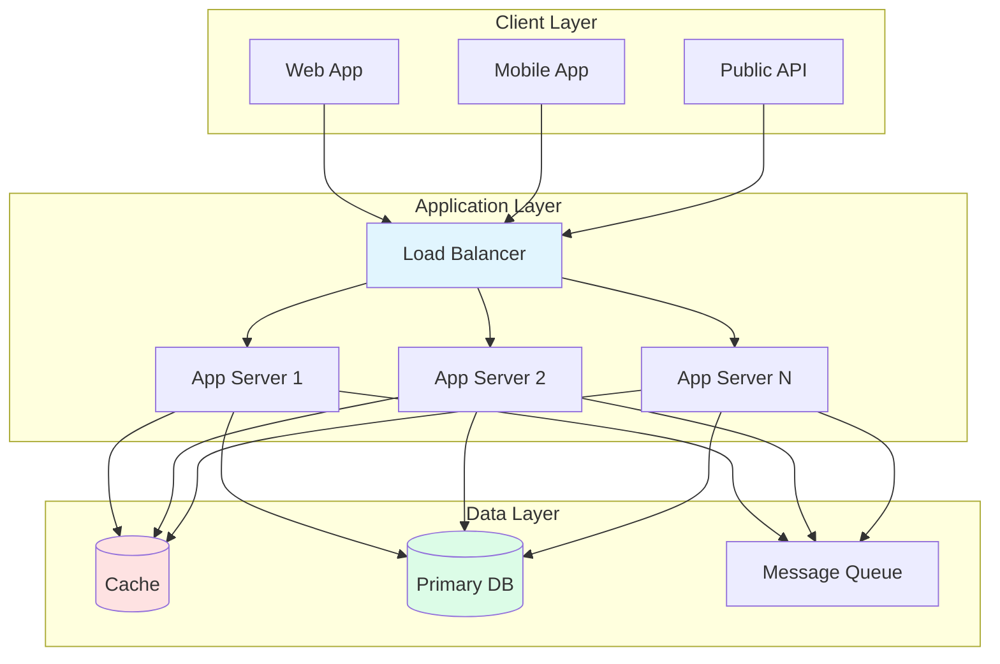
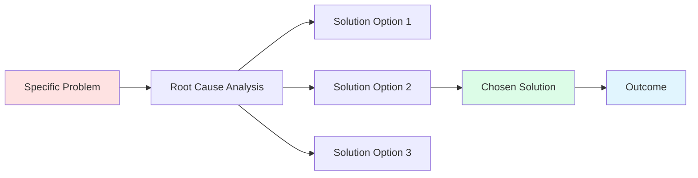

# [System Name] Case Study

<div class="decision-box">
<h3>🎯 Design Challenge</h3>
<p>[One paragraph problem statement describing what we're building and why]</p>
<ul>
<li><strong>Scale:</strong> [Users/requests/data volume]</li>
<li><strong>Constraints:</strong> [Key limitations - budget/time/team]</li>
<li><strong>Goals:</strong> [Success metrics - SLA/performance]</li>
</ul>
</div>

## Requirements

### Functional Requirements
1. **[Feature 1]**: [Description and acceptance criteria]
2. **[Feature 2]**: [Description and acceptance criteria]
3. **[Feature 3]**: [Description and acceptance criteria]
4. **[Feature 4]**: [Description and acceptance criteria]
5. **[Feature 5]**: [Description and acceptance criteria]

### Non-Functional Requirements

| Requirement | Target | Measurement |
|-------------|--------|-------------|
| **Availability** | [99.9%] | [Uptime over 30 days] |
| **Latency** | [p50: Xms, p99: Yms] | [End-to-end response time] |
| **Throughput** | [X QPS] | [Peak sustained load] |
| **Data Durability** | [11 9s] | [No data loss guarantee] |
| **Consistency** | [Model] | [Strong/Eventual/Causal] |
| **Cost** | [$X/month] | [Infrastructure + operations] |

## High-Level Design

### Architecture Overview



### Component Responsibilities

| Component | Purpose | Technology Choice | Scaling Strategy |
|-----------|---------|-------------------|------------------|
| [Component 1] | [What it does] | [Tech stack] | [How it scales] |
| [Component 2] | [What it does] | [Tech stack] | [How it scales] |
| [Component 3] | [What it does] | [Tech stack] | [How it scales] |

## Detailed Design

### Data Model

```sql
-- Example schema (adjust based on system)
CREATE TABLE users (
    user_id BIGINT PRIMARY KEY,
    email VARCHAR(255) UNIQUE NOT NULL,
    created_at TIMESTAMP DEFAULT NOW()
);

CREATE TABLE [entity] (
    id BIGINT PRIMARY KEY,
    user_id BIGINT REFERENCES users(user_id),
    data JSONB,
    version INT DEFAULT 1,
    updated_at TIMESTAMP DEFAULT NOW()
);

-- Indexes for query patterns
CREATE INDEX idx_user_lookup ON [entity](user_id, updated_at DESC);
```

### API Design

```yaml
# Key API endpoints
POST /api/v1/[resource]
  Request: { field1: value1, field2: value2 }
  Response: { id: 123, status: "created" }
  
GET /api/v1/[resource]/{id}
  Response: { id: 123, field1: value1, field2: value2 }
  
PUT /api/v1/[resource]/{id}
  Request: { field1: newValue1 }
  Response: { id: 123, status: "updated", version: 2 }
```

### Core Algorithms

#### [Algorithm Name]
```python
def core_algorithm(input_data):
    """
    Explain the key algorithm that makes this system work.
    Keep it conceptual, not production code.
    """
    # Step 1: [What happens]
    # Step 2: [What happens]
    # Step 3: [What happens]
    return result
```

## Deep Dive: [Interesting Technical Challenge]

### The Challenge
[2-3 paragraphs explaining a particularly interesting technical challenge in this system. Why was it hard? What constraints made it challenging?]

### Solution Approach
[Explain how the challenge was solved, including trade-offs made]



### Results
- **Performance Impact**: [Metrics before/after]
- **Complexity Trade-off**: [What got simpler/harder]
- **Operational Impact**: [How it affected ops]

## Applying the 7 Laws

### Law-to-Design Mapping

| Law | How It Applies | Design Decision |
|-----|----------------|-----------------|
| [Law 1: Correlated Failure](/part1-axioms/law1-failure/) | [Specific risk] | [Mitigation strategy] |
| [Law 2: Asynchronous Reality](/part1-axioms/law2-asynchrony/) | [Timing challenge] | [Async pattern used] |
| [Law 3: Emergent Chaos](/part1-axioms/law3-emergence/) | [Complexity source] | [Simplification approach] |
| [Law 4: Trade-offs](/part1-axioms/law4-tradeoffs/) | [Key trade-off] | [Decision made] |
| [Law 5: Knowledge](/part1-axioms/law5-epistemology/) | [Information challenge] | [Consensus approach] |
| [Law 6: Human API](/part1-axioms/law6-human-api/) | [Cognitive limit] | [UX simplification] |
| [Law 7: Economics](/part1-axioms/law7-economics/) | [Cost constraint] | [Optimization made] |

### Pattern Applications

<div class="truth-box">
<h3>💡 Key Patterns Used</h3>
<ul>
<li><strong>[Pattern 1]</strong>: Applied for [specific purpose]</li>
<li><strong>[Pattern 2]</strong>: Solved [specific problem]</li>
<li><strong>[Pattern 3]</strong>: Enabled [specific capability]</li>
</ul>
</div>

## Operational Considerations

### Deployment Strategy
- **Blue-Green Deployment**: [How it works for this system]
- **Rollback Plan**: [Steps to revert safely]
- **Feature Flags**: [Key toggles and their purpose]

### Monitoring & Alerting

| Metric | Normal Range | Alert Threshold | Response |
|--------|--------------|-----------------|----------|
| Request Rate | 1K-5K QPS | >8K QPS | Auto-scale |
| Error Rate | <0.1% | >1% | Page on-call |
| p99 Latency | <200ms | >500ms | Investigate |
| Cache Hit Rate | >95% | <90% | Warm cache |

### Disaster Recovery
1. **Data Backup**: [Frequency and strategy]
2. **Failover Process**: [Automatic vs manual]
3. **Recovery Time**: [RTO and RPO targets]
4. **Testing**: [Chaos engineering practices]

## Lessons Learned

<div class="failure-vignette">
<h3>🔥 What Went Wrong</h3>
<ol>
<li><strong>[Mistake 1]</strong>: [What happened and why]</li>
<li><strong>[Mistake 2]</strong>: [What happened and why]</li>
<li><strong>[Mistake 3]</strong>: [What happened and why]</li>
</ol>
</div>

### Key Insights
1. **[Insight 1]**: [Explanation and impact]
2. **[Insight 2]**: [Explanation and impact]
3. **[Insight 3]**: [Explanation and impact]
4. **[Insight 4]**: [Explanation and impact]
5. **[Insight 5]**: [Explanation and impact]

### What We'd Do Differently
- **Architecture**: [Specific changes]
- **Technology**: [Different choices]
- **Process**: [Improved practices]

## References & Further Reading

1. **Original System Paper**: [Link to academic paper or blog post]
2. **Production Post-Mortem**: [Link to incident analysis]
3. **Similar Systems**: [Links to comparable architectures]
4. **Open Source Implementation**: [GitHub repository if available]

---

**Related Case Studies**: [Similar System 1](/case-studies/system1) • [Similar System 2](/case-studies/system2)

**Patterns Demonstrated**: [Pattern 1](/patterns/pattern1) • [Pattern 2](/patterns/pattern2) • [Pattern 3](/patterns/pattern3)