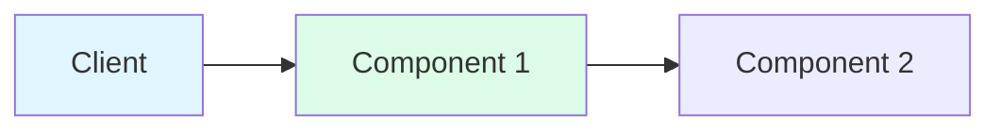

# [Pattern Name] Pattern

<div class="axiom-box">
<h3>⚡ Quick Reference</h3>
<ul>
<li><strong>Problem:</strong> [One sentence problem statement]</li>
<li><strong>Solution:</strong> [One sentence solution summary]</li>
<li><strong>Trade-offs:</strong> [Key compromise in 5-7 words]</li>
<li><strong>Use when:</strong> [Primary use case in 5-7 words]</li>
</ul>
</div>

## The Problem

[2-3 paragraphs explaining the distributed systems challenge this pattern addresses. Start with a concrete scenario, then generalize to the broader problem. Include why naive solutions fail.]

### Why This Problem Is Hard

[Explain which fundamental laws make this challenging - reference at least one law from Part 1]

## The Solution

### Core Concept

[1-2 paragraphs explaining the key insight that makes this pattern work]



### How It Works

1. **Step 1**: [Action and purpose]
2. **Step 2**: [Action and purpose]
3. **Step 3**: [Action and purpose]
4. **Step 4**: [Action and purpose]

### Key Properties

| Property | Description | Guarantee |
|----------|-------------|-----------|
| [Property 1] | [What it means] | [Strong/Weak/None] |
| [Property 2] | [What it means] | [Strong/Weak/None] |
| [Property 3] | [What it means] | [Strong/Weak/None] |

## Implementation

### Basic Implementation

```python
# Choose appropriate language for the pattern
class PatternName:
    def __init__(self, config):
        """Initialize with configuration."""
        self.threshold = config.get('threshold', 5)
        self.timeout = config.get('timeout', 60)
    
    def handle_request(self, request):
        """Core pattern logic - keep it conceptual."""
        # Focus on demonstrating the concept
        # Not production-ready code
        pass
```

### Configuration Options

| Parameter | Default | Range | Impact |
|-----------|---------|-------|---------|
| `threshold` | 5 | 1-100 | Higher = more tolerance |
| `timeout` | 60s | 1-300s | Higher = slower recovery |
| `[param]` | [default] | [range] | [impact description] |

## Trade-offs

| Aspect | Benefit | Cost |
|--------|---------|------|
| **Performance** | [Specific improvement] | [Specific overhead] |
| **Complexity** | [What becomes simpler] | [What becomes complex] |
| **Reliability** | [Failure handling improvement] | [New failure modes] |
| **Scalability** | [How it helps scale] | [Scaling limitations] |
| **Operational** | [Ops improvement] | [Ops overhead] |

## Real-World Examples

### Example 1: [Company/System]
- **Scale**: [Users/QPS/Data volume]
- **Implementation**: [Key details]
- **Results**: [Specific improvements]
- **Lessons**: [What they learned]

### Example 2: [Company/System]
- **Scale**: [Users/QPS/Data volume]
- **Implementation**: [Key details]
- **Results**: [Specific improvements]
- **Lessons**: [What they learned]

## When to Use

<div class="decision-box">
<h3>✅ Use This Pattern When:</h3>
<ul>
<li>[Specific condition 1]</li>
<li>[Specific condition 2]</li>
<li>[Specific condition 3]</li>
</ul>
</div>

<div class="failure-vignette">
<h3>❌ Don't Use When:</h3>
<ul>
<li>[Anti-pattern scenario 1]</li>
<li>[Anti-pattern scenario 2]</li>
<li>[Anti-pattern scenario 3]</li>
</ul>
</div>

## Common Pitfalls

1. **[Pitfall Name]**: [Description and how to avoid]
2. **[Pitfall Name]**: [Description and how to avoid]
3. **[Pitfall Name]**: [Description and how to avoid]

## Monitoring & Debugging

### Key Metrics

| Metric | What It Tells You | Alert Threshold |
|--------|-------------------|-----------------|
| [Metric 1] | [Interpretation] | [Value] |
| [Metric 2] | [Interpretation] | [Value] |
| [Metric 3] | [Interpretation] | [Value] |

### Debug Checklist

- [ ] Check [specific thing 1]
- [ ] Verify [specific thing 2]
- [ ] Examine [specific thing 3]
- [ ] Review [specific thing 4]

## Related Patterns

- **[Pattern 1]**: [How they work together - 1 sentence]
- **[Pattern 2]**: [When to use instead - 1 sentence]
- **[Pattern 3]**: [Complementary usage - 1 sentence]

## References

1. [Author, Year. "Paper Title"](URL) - Academic foundation
2. [Company Engineering Blog: "Title"](URL) - Production usage
3. [Book or Article Title](URL) - Further reading

---

**Laws Applied**: [Law 1: Correlated Failure](/part1-axioms/law1-failure/) • [Law 2: Asynchronous Reality](/part1-axioms/law2-asynchrony/)

**Pillars**: [State Distribution](/part2-pillars/state/) • [Truth Distribution](/part2-pillars/truth/)

**Next**: [Related Pattern Name](/patterns/related-pattern) | **Previous**: [Previous Pattern](/patterns/previous-pattern)