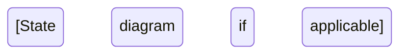
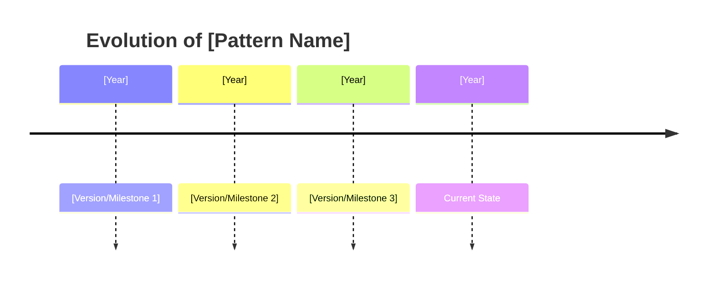

# [Pattern Name]

<div class="navigation-breadcrumb">
<a href="/">Home</a> > <a href="/patterns/">Patterns</a> > [Pattern Name]
</div>

> "[Memorable quote about this pattern or its philosophy]"
> — [Attribution]

## The Essential Question

[Frame the core problem this pattern solves in one compelling question that resonates with practitioners]

---

## Level 1: Intuition (5 minutes)

### The Story

[Tell a relatable story or analogy that explains the pattern concept without technical jargon]

### Visual Metaphor

```
[ASCII art or simple diagram showing the concept]
```

### In One Sentence

**[Pattern Name]**: [Complete definition in one clear sentence]

### Real-World Parallel

[Everyday example that everyone can understand]

---

## Level 2: Foundation (10 minutes)

### The Problem Space

<div class="failure-vignette">
<h4>🔥 When [Pattern] Isn't Used</h4>
[Real failure story showing what happens without this pattern]
</div>

### Core Concept

[Explain the fundamental mechanism in 2-3 paragraphs]

### Basic Architecture

```mermaid
graph TD
    [Basic architecture diagram]
```

### Key Benefits

1. **[Benefit 1]**: [Explanation]
2. **[Benefit 2]**: [Explanation]
3. **[Benefit 3]**: [Explanation]

### Trade-offs

| Aspect | Gain | Cost |
|--------|------|------|
| [Aspect 1] | [What you gain] | [What you pay] |
| [Aspect 2] | [What you gain] | [What you pay] |
| [Aspect 3] | [What you gain] | [What you pay] |

---

## Level 3: Deep Dive (20 minutes)

### Detailed Architecture

```mermaid
graph TB
    [Comprehensive architecture diagram with components and flow]
```

### Implementation Patterns

#### Basic Implementation

```python
# Example implementation in Python
[Code example with comments explaining key concepts]
```

#### Production-Ready Implementation

```python
# More sophisticated implementation
[Code with error handling, monitoring, configuration]
```

### State Management

[Explain how state is managed in this pattern]



### Common Variations

1. **[Variation 1]**
   - Use case: [When to use]
   - Trade-off: [What changes]

2. **[Variation 2]**
   - Use case: [When to use]
   - Trade-off: [What changes]

### Integration Points

- **With [Pattern X]**: [How they work together]
- **With [Pattern Y]**: [Synergies and conflicts]

---

## Level 4: Expert Practitioner (30 minutes)

### Advanced Techniques

#### [Technique 1]

[Detailed explanation with code]

```python
# Advanced implementation
[Sophisticated code example]
```

#### [Technique 2]

[Detailed explanation with code]

### Performance Optimization

<div class="decision-box">
<h4>🎯 Performance Tuning Checklist</h4>

- [ ] [Optimization 1]
- [ ] [Optimization 2]
- [ ] [Optimization 3]
- [ ] [Optimization 4]
</div>

### Monitoring & Observability

Key metrics to track:

```yaml
metrics:
  - name: [metric_1]
    description: [What it measures]
    alert_threshold: [Value]
  - name: [metric_2]
    description: [What it measures]
    alert_threshold: [Value]
```

### Common Pitfalls

<div class="failure-vignette">
<h4>⚠️ Pitfall: [Common Mistake]</h4>
[Description of the mistake and its consequences]

**Solution**: [How to avoid or fix it]
</div>

### Production Checklist

- [ ] [Requirement 1]
- [ ] [Requirement 2]
- [ ] [Requirement 3]
- [ ] [Requirement 4]
- [ ] [Requirement 5]

---

## Level 5: Mastery (45 minutes)

### Case Study: [Company] Implementation

<div class="truth-box">
<h4>🏢 Real-World Implementation</h4>

**Company**: [Company Name]  
**Scale**: [Metrics - requests/sec, data volume, etc.]  
**Challenge**: [What problem they solved]

[Detailed case study with architecture diagrams and lessons learned]
</div>

### Economic Analysis

#### Cost Model

```python
def calculate_pattern_roi(
    request_volume: int,
    failure_rate: float,
    implementation_cost: float
) -> dict:
    """Calculate ROI for implementing this pattern"""
    [ROI calculation code]
```

#### When It Pays Off

- **Break-even point**: [Conditions]
- **High ROI scenarios**: [List scenarios]
- **Low ROI scenarios**: [List scenarios]

### Pattern Evolution



### Law Connections

<div class="axiom-box">
<h4>🔗 Fundamental Laws</h4>

This pattern directly addresses:

1. **[Law Name]**: [How it relates]
2. **[Law Name]**: [How it relates]
3. **[Law Name]**: [How it relates]
</div>

### Future Directions

[Emerging trends and how this pattern might evolve]

---

## Quick Reference

### Decision Matrix

```mermaid
graph TD
    Start[Need Pattern?] --> Q1{[Question 1]}
    Q1 -->|Yes| Q2{[Question 2]}
    Q1 -->|No| NotNeeded[Use Alternative]
    Q2 -->|Yes| UsePattern[Implement Pattern]
    Q2 -->|No| Q3{[Question 3]}
    Q3 -->|Yes| UseVariant[Use Variant X]
    Q3 -->|No| NotNeeded
```

### Command Cheat Sheet

```bash
# Common operations
[command 1]  # Description
[command 2]  # Description
[command 3]  # Description
```

### Configuration Template

```yaml
# Production configuration template
pattern_name:
  [setting_1]: [recommended_value]
  [setting_2]: [recommended_value]
  [setting_3]: [recommended_value]
```

---

## Related Resources

### Patterns
- [Related Pattern 1](/patterns/[pattern-1]/) - [How they work together]
- [Related Pattern 2](/patterns/[pattern-2]/) - [Complementary aspects]

### Axioms
- [Axiom 1](/part1-axioms/[axiom]/) - [Connection]
- [Axiom 2](/part1-axioms/[axiom]/) - [Connection]

### Further Reading
- [Paper/Article 1] - [Why it's relevant]
- [Paper/Article 2] - [Key insights]
- [Implementation Guide] - [Practical details]

### Tools & Libraries
- **[Language]**: [Library] - [Purpose]
- **[Language]**: [Library] - [Purpose]
- **Monitoring**: [Tool] - [What it provides]

---

<div class="navigation-links">
<div class="prev-link">
<a href="/patterns/[previous-pattern]/">← Previous: [Pattern Name]</a>
</div>
<div class="next-link">
<a href="/patterns/[next-pattern]/">Next: [Pattern Name] →</a>
</div>
</div>