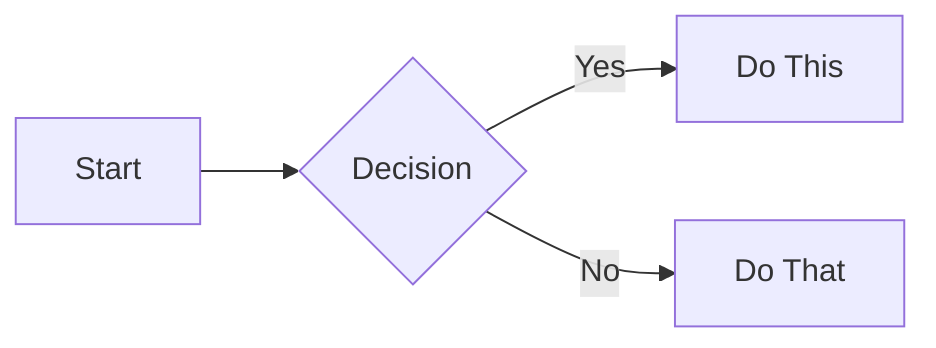

# Documentation Style Guide

This guide ensures consistent formatting and presentation across all documentation in the Compendium.

## Document Structure

### File Organization
```
docs/
├── introduction/          # Introductory content
├── part1-axioms/         # Fundamental laws
├── part2-pillars/        # Core pillars
├── patterns/             # Design patterns
├── case-studies/         # Real-world examples
├── quantitative/         # Mathematical content
├── human-factors/        # Operational topics
├── tools/               # Interactive tools
└── reference/           # Reference materials
```

## Formatting Standards

### Headers

#### Hierarchy
- `#` - Document title (one per file)
- `##` - Major sections
- `###` - Subsections
- `####` - Sub-subsections (use sparingly)

#### Emoji Usage
Use emoji consistently for specific section types:

**For Pattern Documents:**
- `## 🎯 Pattern Overview` - Problem/solution overview
- `## 🏗️ Architecture & Implementation` - Technical details
- `## 📊 Analysis & Trade-offs` - Analysis section
- `## 🔧 Practical Considerations` - Configuration/operations
- `## 🚀 Real-World Examples` - Case studies
- `## 🎓 Key Takeaways` - Summary

**For Exercise Documents:**
- `## 🧪 Hands-On Labs` - Practical experiments
- `## 💻 Implementation Challenges` - Coding exercises
- `## 🧮 Calculation Problems` - Mathematical problems
- `## 🤔 Thought Experiments` - Conceptual exercises
- `## 🔬 Research Projects` - Extended projects

**For Other Sections:**
- Use emoji sparingly and only where they add clarity
- Prefer descriptive text over decorative emoji

### Visual Components

Use these CSS classes consistently:

```markdown
::: axiom-box
**Axiom**: Fundamental truth or principle
:::

::: decision-box
**Decision Framework**: How to choose between options
:::

::: failure-vignette
**Failure Story**: Real-world disaster and lessons learned
:::

::: truth-box
**Key Insight**: Important realization or understanding
:::
```

### Tables

#### Decision Tables
```markdown
| ✅ Use When | ❌ Don't Use When |
|-------------|-------------------|
| Condition 1 | Condition A |
| Condition 2 | Condition B |
```

#### Comparison Tables
```markdown
| Aspect | Option A | Option B | Option C |
|--------|----------|----------|----------|
| Performance | High | Medium | Low |
| Complexity | Low | Medium | High |
| Cost | $$$ | $$ | $ |
```

#### Metric Tables
```markdown
| Metric | Description | Target | Alert Threshold |
|--------|-------------|--------|-----------------|
| Latency | p99 response time | <100ms | >200ms |
| Error Rate | Failed requests | <0.1% | >1% |
```

### Code Blocks

#### Language Specification
Always specify the language:
```python
def example():
    """Python example"""
    pass
```

```yaml
# YAML configuration
key: value
```

```bash
# Shell commands
echo "Hello, World!"
```

#### Inline Code
Use backticks for:
- Commands: `kubectl get pods`
- File names: `config.yaml`
- Function names: `processRequest()`
- Variables: `MAX_RETRIES`

### Diagrams

Use Mermaid for all diagrams:



Never use ASCII art diagrams.

### Lists

#### Ordered Lists
Use when sequence matters:
1. First step
2. Second step
3. Third step

#### Unordered Lists
Use for non-sequential items:
- Feature A
- Feature B
- Feature C

#### Nested Lists
- Main point
  - Sub-point 1
  - Sub-point 2
    - Detail A
    - Detail B

### Links

#### Internal Links
Use relative paths:
```markdown
See [Latency Axiom](/part1-axioms/axiom1-latency/)
```

#### External Links
Include descriptive text:
```markdown
Read [Google's SRE Book](https://sre.google/books/) for more details
```

### Emphasis

- **Bold** for important terms and concepts
- *Italics* for emphasis and quotes
- `Code` for technical terms
- ***Bold italics*** sparingly for critical warnings

### Document Footer

Each document type should end consistently:

#### Axioms and Pillars
End with an italicized quote:
```markdown
---

*"Memorable quote that captures the essence of the topic"*
```

#### Patterns
End with key takeaway and quote:
```markdown
## 🎓 Key Takeaways

1. **Core Insight**: Main learning
2. **When It Shines**: Best use cases
3. **What to Watch**: Common pitfalls
4. **Remember**: Most important point

---

*"Pattern-specific wisdom quote"*
```

#### Exercises
End with encouragement:
```markdown
---

**Next Steps**: [What to do after completing exercises]

*Remember: The goal is not perfection, but understanding through practice.*
```

#### Other Documents
End appropriately for content type.

## Writing Style

### Voice and Tone
- **Clear and Direct**: Avoid jargon, explain technical terms
- **Practical**: Focus on real-world application
- **Engaging**: Use stories and examples
- **Humble**: Acknowledge trade-offs and limitations

### Technical Writing Best Practices
1. **Define terms** on first use
2. **Use active voice** when possible
3. **Short paragraphs** (3-4 sentences)
4. **One idea** per paragraph
5. **Examples** for complex concepts

### Common Patterns

#### Problem-Solution Format
```markdown
**Problem**: Systems fail in unpredictable ways

**Solution**: Implement circuit breakers to fail fast

**Trade-off**: Reduced availability for better stability
```

#### Given-When-Then
```markdown
**Given**: A distributed system with 100 nodes
**When**: Network partition occurs
**Then**: System continues operating with degraded functionality
```

## Consistency Checklist

Before committing documentation:

- [ ] Headers follow hierarchy rules
- [ ] Emoji used consistently per document type
- [ ] Tables formatted uniformly
- [ ] Code blocks have language specified
- [ ] All diagrams use Mermaid
- [ ] Internal links are relative
- [ ] Document has appropriate footer
- [ ] No ASCII art remains
- [ ] Visual components use standard classes
- [ ] Examples provided for complex concepts

## Migration Guide

### For Existing Documents

1. **Pattern Files**: Update to new template structure
   - Add emoji headers
   - Reorganize into standard sections
   - Add missing sections
   - Update footer

2. **Exercise Files**: Enhance minimal exercises
   - Add time estimates
   - Include difficulty ratings
   - Provide solutions in `<details>` tags
   - Add variety of exercise types

3. **Case Studies**: Ensure consistency
   - Convert any remaining ASCII to Mermaid
   - Add axiom analysis if missing
   - Include timeline/evolution context

## Version Control

When making style updates:
```markdown
<!-- 
Style Update: 2024-01-15
Changes: Updated to new pattern template structure
-->
```

## Questions?

If unsure about formatting:
1. Check this guide
2. Look at recently updated files
3. Ask in project discussions
4. When in doubt, prioritize clarity

---

*"Consistency in small things leads to excellence in distributed systems."*